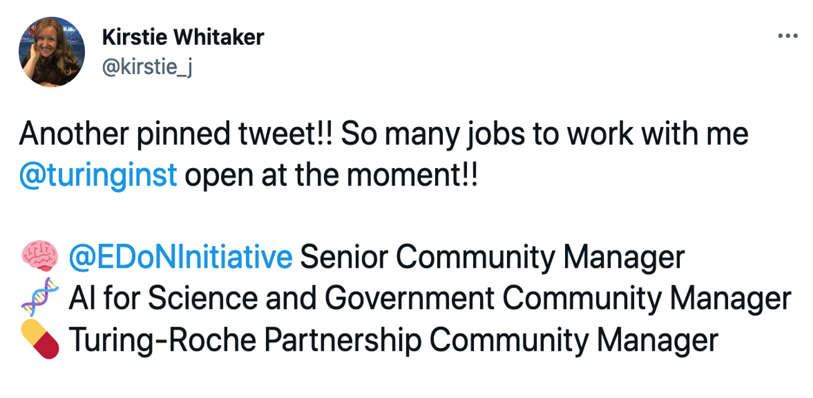
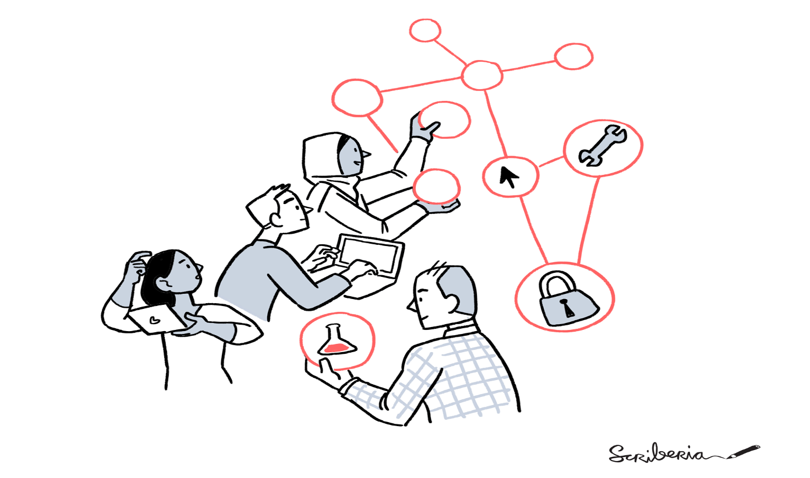
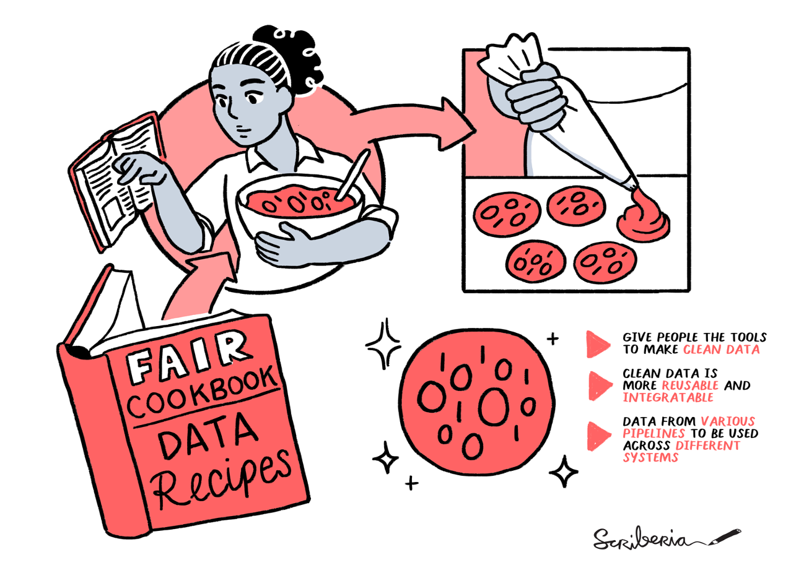
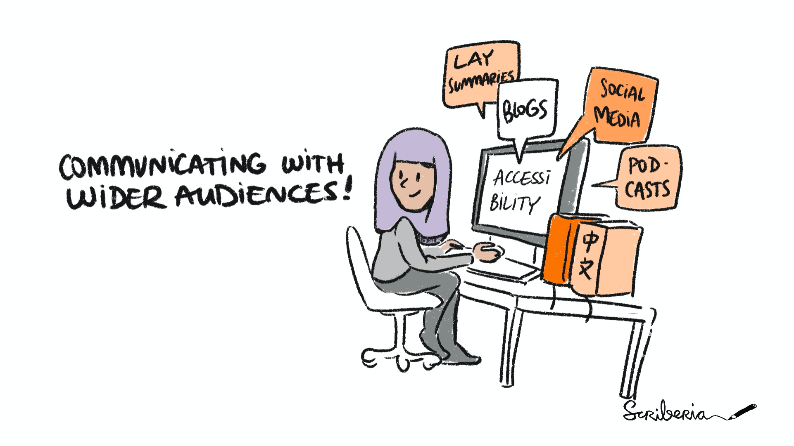
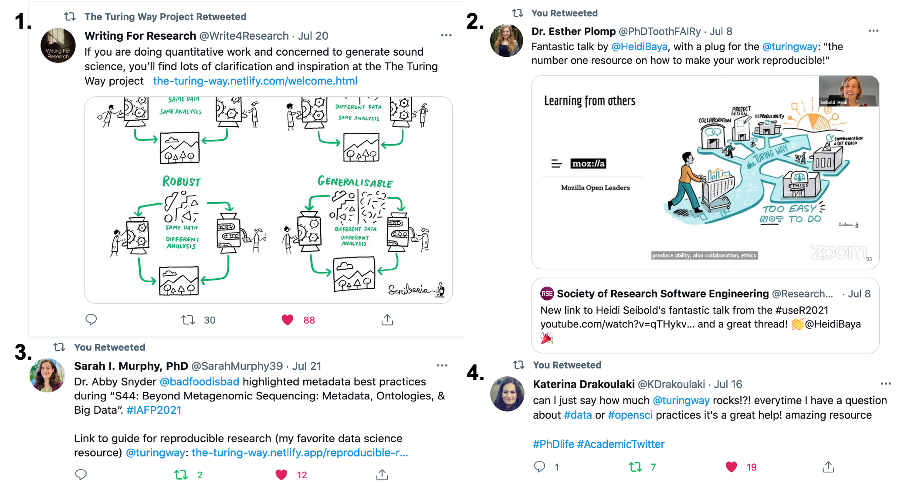

The Turing Way Newsletter: 30 July 2021

# New Job Opportunities, Community Call Plans, Chapters and Other Updates

Hello Turing Way friends!

Thank you for opening this page - we hope you are keeping well! 🌷

This month’s newsletter is filled with many ‘asks’ and requests for actions from you.

- 🌈 Help us in planning our Community Calls - respond to this [form](https://tinyurl.com/ttw-community-call).
- 📣 Apply for the Community Manager positions at The Alan Turing Institute - work closely with _The Turing Way_ team.
- 🛠 Our wonderful community members have published more new chapters and refreshed our landing pages -  [have a look](https://github.com/alan-turing-institute/the-turing-way/blob/master/README.md).

Find out about specific GitHub issues that are awaiting your comments and interesting resources from the community.

Read on for more details on these topics and other updates from _The Turing Way_ below 👇

## Community Meetings

*Building a healthy community. _The Turing Way_ project illustration by Scriberia. Used under a CC-BY 4.0 licence. DOI: 10.5281/zenodo.3332807.*

### Collaboration Cafes 

Collaboration Cafes will take place on 04 August and 18 August 2021 from 15:00 - 17:00 London time ([see in your timezone](http://time.unitarium.com/utc/14)). 
In addition to the 'Pomodoro' co-working sessions, we will use this month’s Collaboration Cafe to review how these meetings have been for you over the last year.
We will also invite volunteers to host future calls and propose new ideas to make such events more sustainable and beneficial for you going forward.

Sign up and find more details in this shared HackMD: [https://hackmd.io/@turingway/collaboration-cafe](https://hackmd.io/@turingway/collaboration-cafe).

### Coworking Calls

Monthly coworking calls in August will take place every Monday from 11:00 - 12:00 London time ([see in your timezone](http://time.unitarium.com/utc/10)).
These calls have been a wonderful way for us to kick off our weeks by working with many of you on _The Turing Way_.
You are welcome to join if you would like to test, try and apply open, reproducible and collaborative aspects to any project of your choice.

Sign up and find more details in this shared HackMD: [https://hackmd.io/@turingway/coworking-call](https://hackmd.io/@turingway/coworking-call).

### Onboarding Calls 

Over the last three months, we have scheduled and hosted onboarding calls.
Unfortunately, they have not been effective at reaching members who are interested in using or contributing to _The Turing Way_ but don’t know where to start.
Therefore, we will not host onboarding calls from August onwards but plan a series of calls with a more suitable format  (discussed next).
You can always reach out to Malvika (email: msharan@turing.ac.uk) to set a 1:1 call or join one of the other events.

### Themed Community Calls - Help in Planning!

We are planning a series of Themed Community Calls from September 2021.
After discussing this with several members, we agreed that these calls will be a useful way to feature and celebrate the work carried out by our community members working on open and reproducible projects in and beyond _The Turing Way_.

Please volunteer to hosts a call, present something you are working on, or nominate someone you would like to invite at one of these calls using this form: [https://tinyurl.com/ttw-community-call](https://forms.gle/6CeGcqFJdQZ49uxR8).
It will take 3-5 minutes to complete this form - the deadline is **06 September 2021**.
We hope to share more details in the next newsletter, and cross-post them on Twitter and Slack workplace.

---

## News from the Community

### Kirstie Whitaker becomes the Turing’s Programme Director for Tools, Practices and Systems

We’re delighted to announce that [Kirstie Whitaker](https://www.turing.ac.uk/people/researchers/kirstie-whitaker) has moved from her role as Programme Lead to Programme Director of [Tools, practices and systems](https://www.turing.ac.uk/research/research-programmes/tools-practices-and-systems).
Kirstie is the project lead of _The Turing Way_.
Last year, she became the Institute’s first Programme Lead for Tools, practices and systems with the intention of building the programme – her new title acknowledges the growth of the programme and her role alongside it. 
Our heartiest congratulations to Kirstie on this new role.
In her words:

> "I've so enjoyed getting to know even more people around the Turing! 
> From talks on differential privacy in our monthly meet ups, Thursday coffee chats [at the institute] getting to meet new postdocs and learning about their projects, Collaboration Cafes with _The Turing Way_, and even having folks come to my office hours! 
> I hope I'll get to meet even more folks and promote collaborative and inclusive data science across the Institute.... and beyond!"

---

*Tweet by Kirstie Whitaker sharing details about three community manager jobs at Turing in her [Twitter Thread](https://twitter.com/kirstie_j/status/1415797069046894594)*

### Jobs at the Turing

Two community manager positions are open for application at The Alan Turing Institute.
The position-holders will work on the following teams while collaborating closely with _The Turing Way_:

- A community manager will work with the AI for Science and Government (ASG) teams to consolidate their diverse ongoing research projects across all themes and cross-theme projects in a series of influential white papers (and other outputs).
The deadline to apply for this job is on **1 August 2021**.
Find more details on the [application portal](https://cezanneondemand.intervieweb.it/turing/jobs/community_manager__ai_for_science_and_government_15292/en/)
- Early Detection of Neurodegenerative diseases (EDoN) Initiative's Senior Community Manager will support EDoN team members to identify, share and promote research skills they need to effectively work together and facilitate new connections between the EDoN hubs.
The deadline to apply for this job is on **8 August 2021**.
Find more details on the [application portal](https://cezanneondemand.intervieweb.it/turing/jobs/senior_community_manager__early_detection_of_neurodegenerative_diseases_edon_15293/en/).

---

### Landing Pages Got New Looks!

*Screenshot from the current welcome page showing the ‘top-tip’*

Over the last 2.5 years, _The Turing Way_ as a project and a handbook have grown rapidly.
It is simply not possible to read all its content and therefore we recommend reading a chapter on a tool or practice that you are interested in or want to use in your work.

Thanks to the thoughtful contribution of Batool Almarzouq and Danny Garside who gave the [README](https://github.com/alan-turing-institute/the-turing-way) and the [welcome](book.the-turing-way.org) pages stunning new looks!
They harmonise how we provide information in these two locations and worked with Malvika to add images, top tips, and relevant information from the project.

---

### New Chapters and Updates from the Handbook

- **Overview of Project Design**: Don't know where to start your reproducible project journey from? 
Check out the [Overview chapter in the Guide to Project Design’]( https://book.the-turing-way.org/project-design/pd-overview.html).
Thanks to the massive curation and co-authoring work by Mariana Vivas that you can now find the most important references for designing and starting your research project in one single location.
Thanks also go to Nina di Cara for reviewing this chapter to ensure that information is provided in a structured manner.
There are five subchapters, each discussing different aspects such as collaboration, communication, version control, licensing, tool selection, documentation and publication.
 
- **Linking Research Objects**: Esther Plomp, among several other chapters in the book, has co-authored a chapter on [Making Research Objects Citable](https://book.the-turing-way.org/communication/citable).
She recently merged a new chapter, [Linking Research Objects](https://book.the-turing-way.org/communication/citable/citable-linking.html) that described how linking your data, code and article can ensure that your readers can find all research objects easily.
Approaches described in this chapter can help increase the visibility of your research outputs, while you receive credit for them.

- **Shared Ownership in Open Source**: Open source projects benefit from volunteer contributions and hence should share the "project ownership" with all stakeholders.
To further make a case for this argument, as well as provide ways to make that happen, Malvika wrote a chapter on [Shared Ownership](https://book.the-turing-way.org/collaboration/shared-ownership.html).
This is an extended version of a blog that she co-authored with Andrew Brown, Warrick Ball and Ben Krikler, that you can read on the [Software Sustainability institute’s blog]( https://www.software.ac.uk/blog/2021-06-09-nudging-towards-better-default-open-source-project-ownership).

---

### Inviting Your Contributions!

We are sharing the following interesting issues in the project that we hope you can help us with:

*There are many ways you can learn, share and contribute to a project – find the right starting point for you. _The Turing Way_ project illustration by Scriberia. Used under a CC-BY 4.0 licence. DOI: 10.5281/zenodo.3332807.*

- **Create an image gallery with illustrations**: Over the last five Book Dash events, we have generated re-usable illustrations that are available on [Zenodo](https://zenodo.org/record/3332807).
They also exist in our [GitHub repository]( https://github.com/alan-turing-institute/the-turing-way/tree/master/book/website/figures) so that they can be easily linked to different chapters.
However, browsing them is not easy either on Zenodo or GitHub, which makes it hard for many people to find suitable illustrations that they can use or refer to in their work. 
If you know how we can visualise these illustrations in our online book, please comment under [issue #2046](https://github.com/alan-turing-institute/the-turing-way/issues/2046). 

- **Digital accessibility**: We recommend our contributors provide [alt text]( https://supercooldesign.co.uk/blog/how-to-write-good-alt-text) to describe their images.
However, we have also learned that not all image descriptions are effective for screen readers. 
We would like to invite you to review and update our existing alt text and help document tips to improve description as well as common mistakes to avoid.
Please see more details in [issue #2043](https://github.com/alan-turing-institute/the-turing-way/issues/2043).

- **UX/UI and design wishes**: With the growing number of chapters, we need to make sure that these resources are presented in a logical and meaningful way.
To address this, we will be working with the Turing Research Software Engineering team members to enhance the user experience aspect of _The Turing Way_.
For example, people with a different question might want to have a different starting point in the book, or they should be able to navigate curated sets of chapters based on user personas.
If you have similar, or even better ideas or any UX/UI wishes in _The Turing Way_, please comment under [issue #2034](https://github.com/alan-turing-institute/the-turing-way/issues/2034).

- **Translated versions of README files**: Since the English version of the README file has been updated, the translated versions in 8 languages (Korean, Dutch, French, Indonesian, German, Italian, Portuguese and Spanish) need to be updated too. 
We would really appreciate any help with getting the new additions to the README file translate. 
Please find more details in [issue #2051](https://github.com/alan-turing-institute/the-turing-way/issues/2051).

Don’t find these issues interesting? Please browse more than 300 open issues on our GitHub repository.
You are welcome to [get in touch with Malvika](mailto:msharan@turing.ac.uk) if you have an idea and you don’t see them being discussed.
 
---
 
## Acknowledgements and Celebrations

### Contributor in Focus: FAIR Cookbook Project Team

[FAIR Cookbook]( https://github.com/FAIRplus/the-fair-cookbook) is an online resource that helps researchers and data professionals make their data Findable, Accessible, Interoperable and Reusable (FAIR).
The FAIR Cookbook goes beyond the ‘aspirational’ aspect of FAIR and practically guides researchers and data stewards in their FAIRification journey, and provide policymakers and trainers with practical examples to recommend in their guidance and training.
The FAIR Cookbook editorial board members, **Susanna-Assunta Sansone and Philippe Rocca-Serra** have collaborated with _The Turing Way_ members from the start to ensure interoperability between the two resources and exchange experiences as open source project developers.

*FAIR Cookbook’s data recipes. _The Turing Way_ project illustration by Scriberia. Used under a CC-BY 4.0 licence. DOI: 10.5281/zenodo.3332807.*
 
FAIR Cookbook features relevant chapters from _The Turing Way_. 
Similarly, The Turing Way features the project and provides an impact story titled From FAIR Co-Author to FAIR Doer by Susanna-Assunta Sansone (a co-lead of the FAIR Cookbook project). 
To promote a culture of cooperation over competition among other open source projects, they wrote a chapter Leveraging the Turing Way Book sharing how a “collaborative meeting” at _The Turing Way_ Book Dash Bootstrapped the FAIR Cookbook project.
We encourage you to check out their [handbook](fairplus.github.io/the-fair-cookbook) and contribute FAIR examples from your work.

- **Highlight your resources on _The Turing Way_**: _The Turing Way_ is a domain-independent handbook to data science and research practices.
We actively support and collaborate with projects, teams and organisations that are building upon The Turing Way and provide specific guidance in their fields. 
These projects are listed as [collaborating organisations and projects](https://book.the-turing-way.org/afterword/contributors-record.html#collaborating-organisations-and-projects) and are actively highlighted in the community, such as the FAIR Cookbook.
Does your project use, reference and/or build upon _The Turing Way_? 
Please get in touch with us to discuss how we can highlight your project.
You can also comment under GitHub [issue #2017]( https://github.com/alan-turing-institute/the-turing-way/issues/2017).

--

### Shortlisted for the OpenUK Awards

[OpenUK Awards, Second Edition 2021]( https://openuk.uk/openuk-awards-second-edition-2021/) is hosted by [OpenUK]( https://openuk.uk/) to recognising UK leadership in open technology.
We are happy to share that _The Turing Way_ is shortlisted under the ‘Sustainability’ category.
You can read the nomination submission on [Zenodo](https://zenodo.org/record/5094892).
We extend our congratulations to Paul Owoicho and Sam van Stroud for being shortlisted under the ‘Young Person’ category for their exemplary work in _The Turing Way_ and Turing Data Stories respectively.

---

### Blogs and Articles

*Communicating with a wider audience. _The Turing Way_ project illustration by Scriberia. Used under a CC-BY 4.0 licence. DOI: 10.5281/zenodo.3332807.*

- Making your research outputs accessible to wider audiences. (2021, July 07). Retrieved from https://www.software.ac.uk/blog/2021-07-07-making-your-research-outputs-accessible-wider-audiences
- Annual Report 2020-21. (2021, July 28). Retrieved from https://www.turing.ac.uk/sites/default/files/2021-07/turing_annual-report-2021_final_0.pdf (page 59)
- Why we discuss "ally skills" in open science. (2021, July 05). Retrieved from https://www.software.ac.uk/blog/2021-07-05-why-we-discuss-ally-skills-open-science
- PhD tips – How to ask a question after a seminar - Elisa Granato. (2021, July 14). Retrieved from http://elisagranato.com/phd-tips-asking-a-question-after-a-seminar 

### Talks and Workshops
 
- On 5 July 2021, Vanessa Pope, Sophia Batchelor, Mishka Nemes and Sarah Gibson delivered a workshop at the Summer conference organised by the Energy and Environment Institute, University of Hull. 
You can find a short talk by Vanessa and Introductory GitHub Training material on Zenodo: [https://zenodo.org/record/5070361](https://zenodo.org/record/5083747)
- On 12 July 2021, Malvika Sharan delivered a plenary talk “The Turing Way Guide to Reproducible, Ethical and Collaborative Research” at the inaugural conference of SORTEE (Society of Open, Reliable, and Transparent Ecology and Evolutionary Biology) (slides on [Zenodo](https://zenodo.org/record/5083747)). 
You can watch her talk, along with five other plenary talks on the [YouTube playlist](https://www.youtube.com/playlist?list=PLqTOVbRSdsARz1idHT3KkG1Z5xJeIoULk).
- Martina Vilas, Malvika Sharan and Sambit Panda co-chaired a mini-symposium on “Biology and Neuroscience” at the SciPy 2021.
On 15 July, as a part of this mini-symposium, Martina moderated an inspiring roundtable discussion "Current challenges in open source software development in biology and neuroscience", with Adina Wagner, Caleb Kibet, Hao Ting, and Sambit (on behalf of Joshua Vogelstein).
We hope to share the video recording from this session when that is available.

---
 
### Tweets and Mentions

***1** Tweet by [Writing For Research](https://twitter.com/Write4Research/status/1417508660281061383?s=20) Twitter account sharing the illustration showing ‘reproducible’, ‘replicable’, ‘robust’ and ‘generalisable’.
**2** Tweet by [Esther Plomp](https://twitter.com/PhDToothFAIRy/status/1413181332147015683?s=20) sharing a slide from Heidi Siebold’s UseR keynote that you can watch on [YouTube](youtu.be/rI8CW16a6M4).
**3** Tweet by [Sarah I. Murphy](https://twitter.com/SarahMurphy39/status/1417882443978313731?s=20) linking to the Guide for Reproducible Research. 
**4** Tweet by [Katherina Drakoulaki](https://twitter.com/KDrakoulaki/status/1415988513212964868?s=20) indicating that she uses _The Turing Way_ for data and open science-related practices in her PhD.*
 
 
## Connect with us!

- [About the project](https://www.turing.ac.uk/research/research-projects/turing-way-handbook-reproducible-data-science)
- [_The Turing Way_ book](https://book.the-turing-way.org)
- [GitHub repository](https://github.com/alan-turing-institute/the-turing-way)
- [Slack Workspace](https://join.slack.com/t/theturingway/shared_invite/zt-fn608gvb-h_ZSpoA29cCdUwR~TIqpBw)
- [YouTube Videos](https://www.youtube.com/channel/UCPDxZv5BMzAw0mPobCbMNuA)
- [Twitter Channel](https://twitter.com/turingway)

You are welcome to contribute content for the next newsletter by
emailing [Malvika Sharan](mailto:msharan@turing.ac.uk).

*Did you miss the last newsletters?*
*Check them out [here](https://tinyletter.com/TuringWay/archive).*
