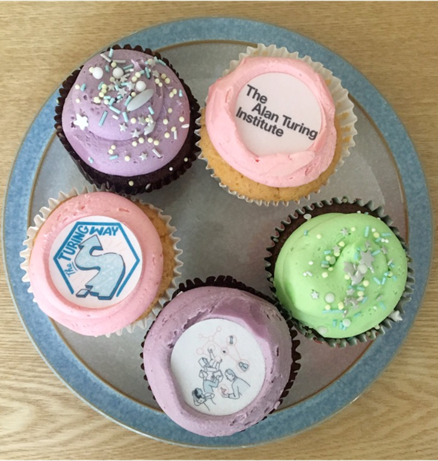
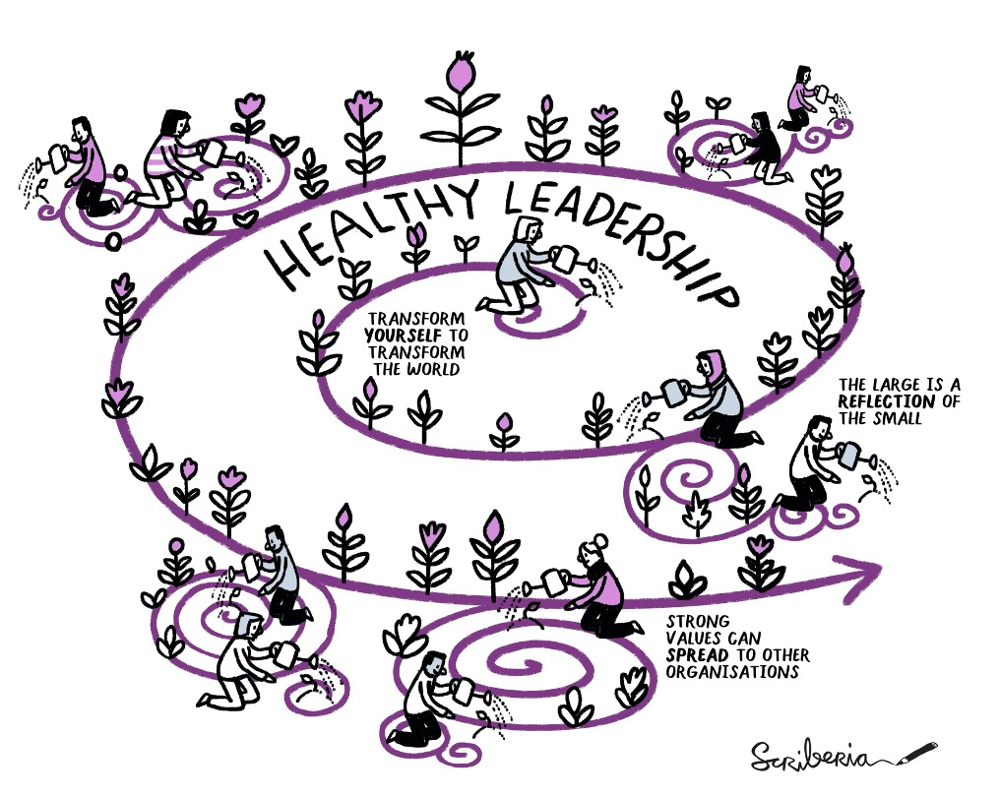
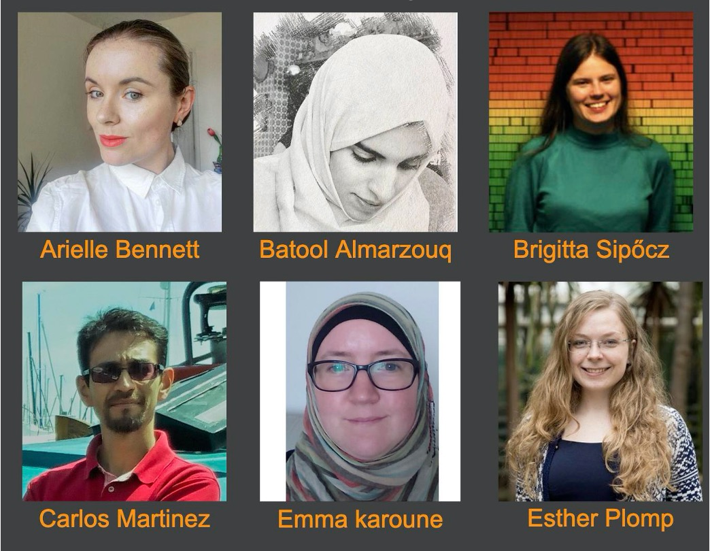
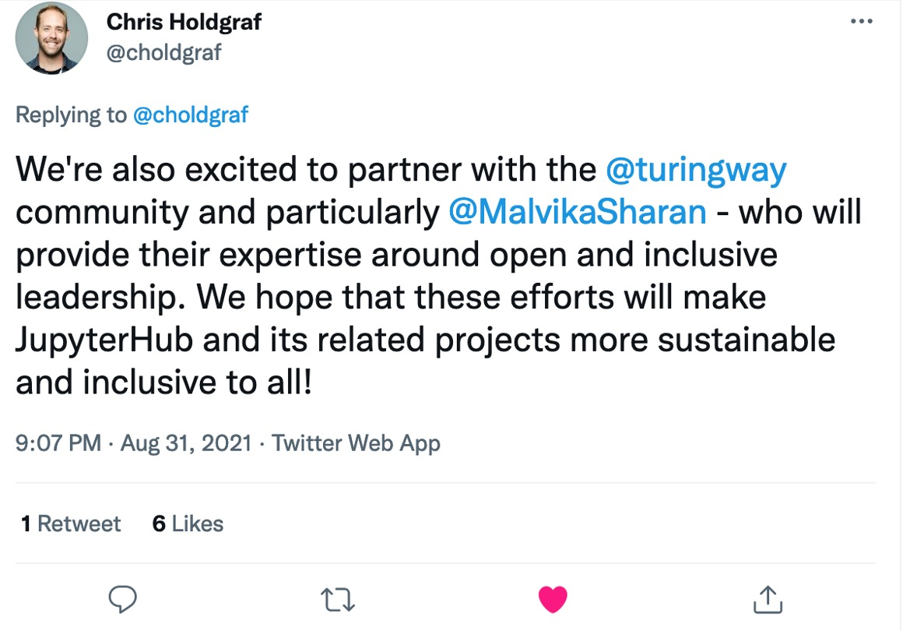
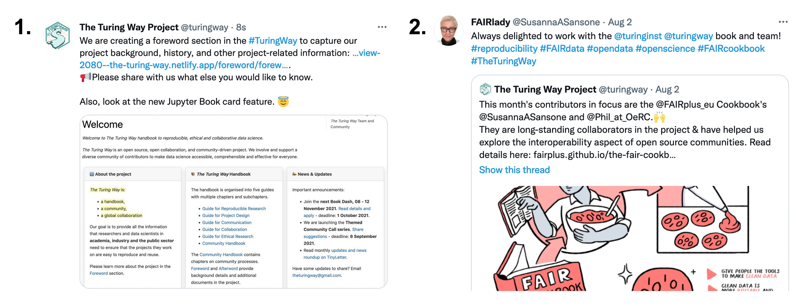

The Turing Way Newsletter: 01 September 2021

# Monthly Round-ups, Upcoming Events, JupyterHub Community Strategy Partnership and More Updates

Hello Turing Way friends!

We are bringing more opportunities for you to connect and collaborate with The Turing Way community, a few of which we highlight here.

- 📚 Book Dash xall for applications is open, the deadline is 1 October 2021 - [apply](https://forms.gle/817Nj3fypRDK1q1v7).
- 🗣 Share your suggestions to help shape the community call series - [details](https://tinyurl.com/ttw-community-call).
- 📢 Join the Tools, Practices and Systems Programme's leadership team - [information](https://www.turing.ac.uk/work-turing/tools-practices-and-systems-open-leadership-team-call-volunteering).

Congrats to the JupyterHub team for receiving a Chan Zuckerberg Initiative grant to develop their community strategy in partnership with The Turing Way! 🎊

Find more details on these topics below these beautiful Turing Way themed cupcakes. 👇

*The Turing Way Themed Cupcakes.*

## Community meetings

### Apply to Attend the Book Dash, Deadline - 01 October 2021
The next Book Dash collaboration event will take place from 08 to 12 November 2021 - [please apply via this Google form](https://forms.gle/817Nj3fypRDK1q1v7).
Following the success of the previous Book Dash, we will host 13 coworking slots that you can flexibly choose from based on your time zone and availability (each 2.5 hours long).
There will be networking opportunities, and accessibility funding will be available for each participant.
Read the [details online](https://book.the-turing-way.org/community-handbook/bookdash.html#who-should-apply-to-join-the-book-dash).

### Collaboration Café and Coworking Calls
**Collaboration Cafés** this month are being hosted on 1 September (Today!) and 15 September 2021.
These calls are places for co-working, discussion, onboarding and collaboration.
As usual, these calls will take place from 15:00 - 17:00 London time ([see in your time zone](https://arewemeetingyet.com/London/2021-09-01/15:00)) and you can sign up on this shared HackMD: [hackmd.io/@turingway/collaboration-cafe](https://hackmd.io/@turingway/collaboration-cafe).

**Weekly coworking calls** will be hosted every Monday, 6, 13, 20 and 27 September 2021, from 11:00 - 12:00 London time ([see the first slot in your time zone](https://arewemeetingyet.com/London/2021-09-06/11:00)).
These calls are accountable space for coworking on your contributions or discuss your idea for _The Turing Way_.
Find the joining link on this shared HackMD: [hackmd.io/@turingway/coworking-calls](https://hackmd.io/@turingway/coworking-calls).

Especially for this month, we invite Book Dash applicants to come along to one of these calls to ask questions, share their ideas and receive support in completing their applications.
Subscribe to [The Turing Way calendar](https://calendar.google.com/calendar?cid=dGhldHVyaW5nd2F5QGdtYWlsLmNvbQ) for future updates.

## News from the Community and Calls for Applications

### Themed Community Calls - Share Your Response!

*The Turing Way* Themed Community Calls will help us involve members and communities beyond contribution via GitHub. 
The first community call will be hosted in October.
Among other ideas, we welcome suggestions and input on cross-community calls to highlight other value and mission-aligned projects.
Please respond to the application form by **6 September 2021**: [https://tinyurl.com/ttw-community-call](https://tinyurl.com/ttw-community-call).

*The Turing Way Illustrations on Leadership by Scriberia. Used under a CC-BY 4.0 licence. DOI: 10.5281/zenodo.3332807*

### Join Tools, Practices and Systems (TPS) Leadership

*The Turing Way* and [TPS research programme ](https://www.turing.ac.uk/research/research-programmes/tools-practices-and-systems)lead Kirstie Whitaker is inviting applications to join the leadership team (volunteer-based roles).
This is an opportunity to help shape the future of open infrastructure in data science, building on the success of programme projects such as *The Turing Way*. 
Please [read more details here and apply](https://www.turing.ac.uk/work-turing/tools-practices-and-systems-open-leadership-team-call-volunteering) before the **deadline, 12 September 2021**. 
Please contact [Arielle Bennett](mailto:abennett@turing.ac.uk) for further questions.

### Suggest a Panellist for the SeptembRSE Diversity and Inclusion Panel

Malvika will be hosting a [SeptembRSE](https://septembrse.github.io/#/event/L1001) panel on **Missing narratives in discussions around diversity and inclusion in research**. 
The panel will take place on 28 September 2021 and outputs from the events will be shared openly in *The Turing Way*.
Thanks to Rowland Mosbergen for joining the organising team and adding really valuable elements to this panel proposal, and Jeremy Cohen for supporting the logistics. 
Please suggest a panellist by responding to this form before **8 September 2021**: [online Google form](https://forms.gle/A5u3wNx9JzcPfDsv8).

### Share Creative Ideas

In [last month's newsletter](https://tinyletter.com/TuringWay/letters/new-job-opportunities-community-call-plans-chapters-and-other-updates), we invited contributions to several open issues on *The Turing Way* repository, several of which are still looking for creative solutions.
Help us create an [image gallery](https://github.com/alan-turing-institute/the-turing-way/issues/2046) in Jupyter Book, document short [guidance on Alt Text](https://github.com/alan-turing-institute/the-turing-way/issues/2043), share your [user experience and wishes](https://github.com/alan-turing-institute/the-turing-way/issues/2034) and help us [update the translated versions of the README page](https://github.com/alan-turing-institute/the-turing-way/issues/2051).

## Acknowledgements and Celebrations

### Contributors in focus: Meet the Book Dash Planning Committee!

We are excited to put a spotlight on [*The Turing Way* Book Dash](https://book.the-turing-way.org/community-handbook/bookdash.html) planning committee members: Arielle Bennett, Batool Almarzouq, Brigitta Sipőcz, Carlos Martinez, Emma Karoune and Esther Plomp.
They joined the planning committee early this year and successfully delivered their first Book Dash in May that featured 15 contributors, 13 online working sessions, four discussions and social events and two community share-outs.

Learn more about them:
- Arielle is the Research Project Manager for the Tools, Practices & Systems Programme at the Alan Turing Institute. 
In _The Turing Way_, she has worked on writing, facilitating discussion and mentored contributions in the Guide for Ethical Research ((details)[https://book.the-turing-way.org/afterword/contributors-record.html#arielle-bennett]).
Read [more about her](https://book.the-turing-way.org/afterword/contributors-record.html#arielle-bennett).
- Batool is a postdoctoral researcher at King Abdullah International Medical Research Center, and the founder of Open Science Network and R-Ladies in Saudi Arabia.
Batool is an infrastructure maintainer in _The Turing Way_ and brings her rich experience in computation as a mentor, content creator, translator and core contributor in the project ([details](https://book.the-turing-way.org/afterword/contributors-record.html#batool-almarzouq)).
- Brigitta is an astronomer and [discoverer of minor planets](https://en.wikipedia.org/wiki/Brigitta_Sip%C5%91cz).
She is involved in several open source communities as a developer and maintainer of open source astronomy software.
In _The Turing Way_, she has contributed to infrastructure support and crucial discussions on community channels ([details](https://bsipocz.github.io/)).
- Carlos is a Community Manager at eScience Center Netherlands.
As an engineer and advocate of improving software quality, he facilitates the collaboration of the eScience center with _The Turing Way_ in providing guidelines and helping build better research software ([details](https://book.the-turing-way.org/afterword/contributors-record.html#netherlands-escience-center)).
- Emma is a Research Associate and Community Manager of DECOVID at The Alan Turing Institute, and an Environmental Archaeology and Palaeoecology researcher.
She has led several collaborations and discussions on chapters within the Guides for Collaboration and Communication ([details](https://book.the-turing-way.org/afterword/contributors-record.html#emma-karoune)).
- Esther is a Data Steward at the Delft University of Technology, Netherlands.
She has been a core contributor to the project developing, guiding and collaborating on chapters related to data management and reproducibility ((details)[https://book.the-turing-way.org/afterword/contributors-record.html#delft-university-of-technology-faculty-of-applied-sciences]).

We want to express our gratitude for their thoughtful engagement in the project and for helping build an inclusive and safe place in the Book Dash.
It is only with their help, we are able to host the next event in November taking careful consideration for our participants.

### JupyterHub Community and *The Turing Way* Collaboration

Chris Holdgraf received Essential Open Source Software (EOSS) for Science funding from the Chan Zuckerberg Initiative (CZI) to establish a JupyterHub Community Lead Strategic position, which will be taken by Sarah Gibson.
The team will partner with *The Turing Way* to help build a community strategy to provide onboarding and mentorship for historically underrepresented groups in the JupyterHub community.
Congratulations to Chris, Sarah and the entire JupyterHub community.
You can read more about the project on the [CZI EOSS page](https://chanzuckerberg.com/eoss/proposals/jupyterhub-community-strategic-lead/).

*[Chris Holdgraf](https://twitter.com/choldgraf/status/1432797304914731012?s=20) Tweet about the CZI EOSS announcement.*

### Relevant Jobs and Events

- **Job at Turing**: The Research Engineering Group at The Alan Turing Institute is recruiting three new members. 
Read more about the group and these new positions [on their webpage](https://www.turing.ac.uk/research-engineering).
Applications close on **10 September 2021**.

- **[HiddenREF award ceremony](https://hidden-ref.org/)** is on 02 September 2021 at 16:00 -16:45 London time ([see in your time zone](https://arewemeetingyet.com/London/2021-09-02/16:00).
The Award Ceremony will be [live-streamed to YouTube](https://hidden-ref.org/hidden-ref-award-ceremony/)).
Join the organising committee and participants to celebrate the contribution of everyone who took part in the competition

- **[SeptembRSE 2021](https://septembrse.society-rse.org/)** is taking place from 6 to 30 September 2021.
Among many sessions, attend the following sessions led by *The Turing Way* members: [project talk](https://septembrse.github.io/#/event/T1030) on 9 September, [Turing Data Stories](https://septembrse.github.io/#/event/S1007) workshop on 14 September, [Coding Confessions](https://septembrse.github.io/#/event/L1004) on 17 September and [Missing Narratives in Research Panel](https://septembrse.github.io/#/event/L1001) on 28 September (don’t forget to [nominate a panellist](https://forms.gle/A5u3wNx9JzcPfDsv8)).

- **[Open Science FAIR 2021](https://www.opensciencefair.eu/)** is taking place online from 20 to 23 September 2021.
This year’s conference theme is Fostering local and global open science communities, which will feature four keynote speakers and multiple sessions (talks, workshops and demos).
You can [register for free](https://www.opensciencefair.eu/register).

## Relevant resources

- Levitis, E., van Praag, C. D. G., Gau, R., Heunis, S., DuPre, E., Kiar, G., ...Maumet, C. (2021). [Centering inclusivity in the design of online conferences—An OHBM–Open Science perspective](https://academic.oup.com/gigascience/article/10/8/giab051/6355274). GigaScience, 10(8). DOI: 10.1093/gigascience/giab051. **Article**.
- Mangham, S., Clarke, A., Barrass, I., McCann, P., D’Alessandro, A., Harrington, B., (2021, August 31). [How do you help build intermediate software engineering skills and help people go beyond the basics?](https://www.software.ac.uk/blog/2021-08-09-how-do-you-help-build-intermediate-software-engineering-skills-and-help-people-go). **SSI Blog post**.
- Engelhardt C., et al. (2021, July 26). [Community review for teaching and training handbook on the FAIR principles now open](https://www.fairsfair.eu/news/community-review-teaching-and-training-handbook-fair-principles-now-open). **Request for comments**.
- Gatera, G. (2021, August 31). [Conversations on mental health: from lived experience to local innovation](https://wellcome.org/news/conversations-mental-health-lived-experience-local-innovation),  **News - Wellcome**.
- UKRI. (2021, August 31). [UKRI announces new Open Access Policy](https://www.ukri.org/news/ukri-announces-new-open-access-policy). **Policy**.
- Hodges, T., Alves, R., Fouilloux, A., Nenadic, A., Stevens, S., (2021, August 03). [Building Websites With Jekyll and GitHub](https://carpentries-incubator.github.io/jekyll-pages-novice/index.html). **The Carpentries Training Material**.

### Twitter Mentions!

***1.** [The Turing Way](https://twitter.com/turingway/status/1432821729613787136?s=20) team is developing a foreword section of the handbook. Share with them what information is currently missing that you would like to learn about.
**2.** [Susanna Asunta Sansone](https://twitter.com/SusannaASansone/status/1422239038170357762?s=20) quote Tweeting The Turing Way, where we feature [FAIR Cookbook](https://fairplus.github.io/the-fair-cookbook/content/home.html) team as contributors in focus last month.*

## Connect with us!

- [About the project](https://www.turing.ac.uk/research/research-projects/turing-way-handbook-reproducible-data-science)
- [_The Turing Way_ book](https://book.the-turing-way.org)
- [GitHub repository](https://github.com/alan-turing-institute/the-turing-way)
- [Slack Workspace](https://join.slack.com/t/theturingway/shared_invite/zt-fn608gvb-h_ZSpoA29cCdUwR~TIqpBw)
- [YouTube Videos](https://www.youtube.com/channel/UCPDxZv5BMzAw0mPobCbMNuA)
- [Twitter Channel](https://twitter.com/turingway)

You are welcome to contribute content for the next newsletter by
emailing [Malvika Sharan](mailto:msharan@turing.ac.uk).

*Did you miss the last newsletters?*
*Check them out [here](https://tinyletter.com/TuringWay/archive).*
