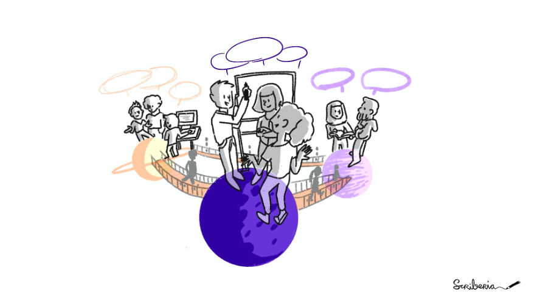
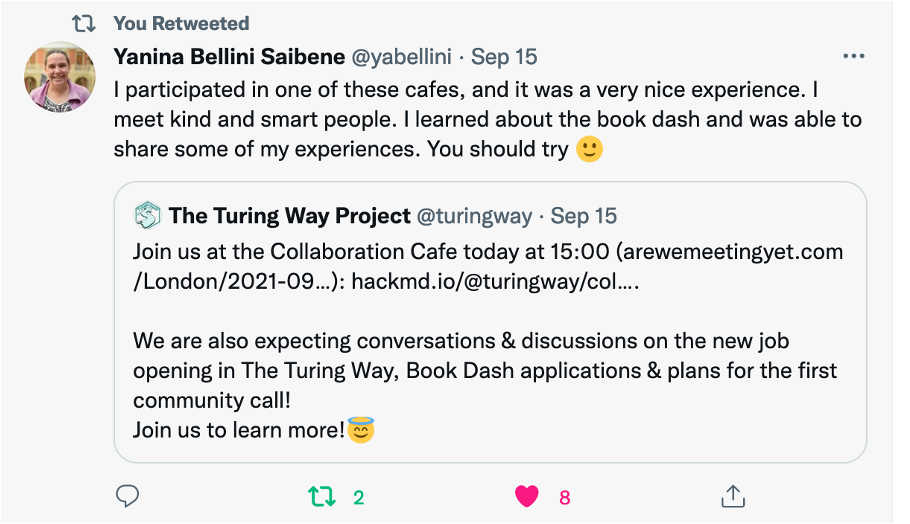
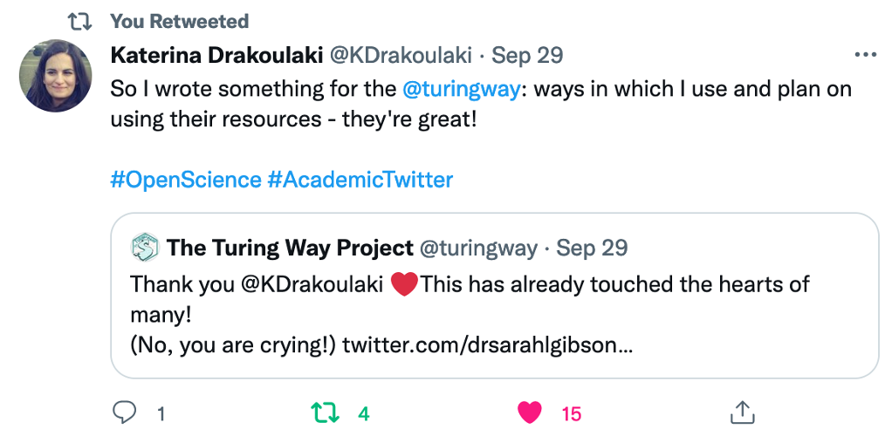
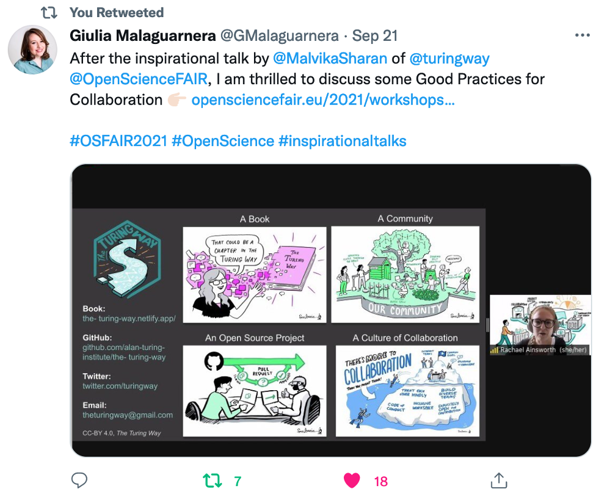
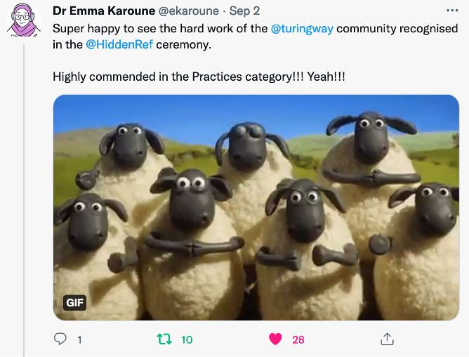
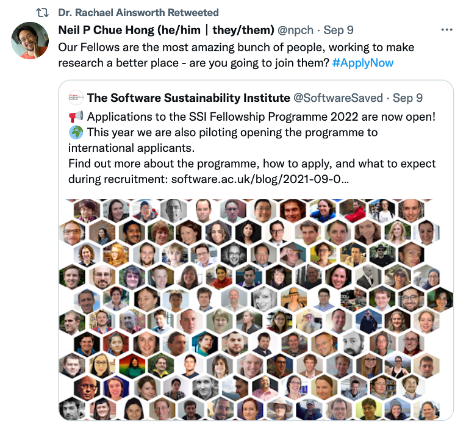
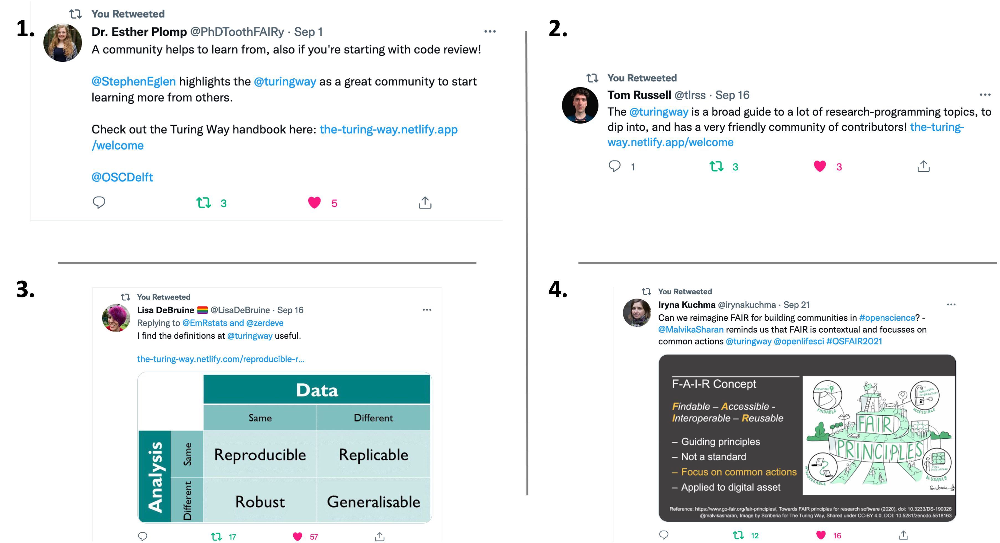

The Turing Way Newsletter: 05 October 2021

# We are Hiring; Meet us at the Fireside Chat; Community Share-out and Contributor Celebration Dates!

Hello Turing Way friends!  

This newsletter is packed with exciting updates from last month and noteworthy announcements for the upcoming weeks.  

Some highlights are:

-   📢 We are **hiring a Community Manager** \- [send your application](https://cezanneondemand.intervieweb.it/turing/jobs/community_manager_the_turing_way_16817/en/) (deadline: 24 October).
-   ⛺ Join the first **Turing Way Fireside Chat** on 22 October - [register](https://www.eventbrite.co.uk/e/the-turing-way-fireside-chat-tickets-185011543507).  
-   📚 Attend the  **Community Share-out and Contributor Celebration** on 12 November - [find details](https://www.eventbrite.co.uk/e/the-turing-way-community-share-out-and-contributor-celebration-tickets-184957170877).

_The next newsletter will arrive in your mailbox in November_. Meanwhile, meet us at the Fireside Chat, Community Share Out events, biweekly Collaboration Cafés, weekly Coworking Calls and the community Slack ([details](https://hackmd.io/@turingway/demo-intro)). 👋  

Find more details on these topics below 👇

## We are hiring a community manager! 

See the [detailed job description online](https://cezanneondemand.intervieweb.it/turing/jobs/community_manager_the_turing_way_16817/en/) and **apply before 24 October.**  

_The Turing Way_ project and community has been growing and so is the team. We are recruiting a Community Manager who will work to build and support an international community of researchers and data scientists in The Turing Way. Please help us share this job announcement in your networks.
The community manager will work closely with Malvika and Kirstie to support and sustain the Turing Way community as we enter the next stage of the project. 
They will support our community to share and promote the skills that they already have, understand the experiences of people from a range of diverse backgrounds, and identify what they need to effectively work together. 
We encourage interested candidates to get in touch if additional information will be useful.

*he Turing Way Illustrations Used under a CC-BY 4.0 licence. DOI: 10.5281/zenodo.3332807*

## Community Events

### Join the First Fireside Chat on 22 October

On 22 October, 14:00 - 15:00 London time ([see in your time zone](https://arewemeetingyet.com/London/2021-10-22/14:00)), we will kick-off The Turing Way Fireside Chat series. 
At this very first call, The Turing Way lead Kirstie Whitaker and researcher Malvika Sharan will be joined by a core member from our community to discuss research reproducibility, accessible resources in data science and the role of The Turing Way in this landscape.
We are particularly excited to bring existing and new members together who can ask questions such as "what exactly is The Turing Way?", "how did it start?", "what challenges are we trying to address in data science and research?" and "what can we expect next?". 
Please [register via the Eventbrite page](https://www.eventbrite.co.uk/e/the-turing-way-fireside-chat-tickets-185011543507).

**_The Turing Way_ Fireside Chat Series**

We are launching **_The Turing Way_ Fireside Chat Series** to facilitate cross-community engagement, knowledge exchange and open discussions with the participants.
Every month, this event will feature 2-3 international community leaders and champions who will discuss reproducibility, research ethics, collaboration and everything in between in an informal setting.

### Book Dash - Community Share outs, Register soon!

On **12 November**, we will hold two public Community Share Outs at 11:00 and 17:00 London time to demonstrate what we have been working on in _The Turing Way_ and all the projects that the attendees will drive during the Book Dash week from 08 to 11 November 2021. 
We are inviting the friends of _The Turing Way_ and those who would like to learn more about the project. Learn [more about the event and register here](https://www.eventbrite.co.uk/e/the-turing-way-community-share-out-and-contributor-celebration-tickets-184957170877).
  
Book Dash Update: _Currently, the members of the [Book Dash planning Committee](https://twitter.com/turingway/status/1434814172135673866?s=20) are reviewing the Book Dash application to select and invite participants to collaborate on The Turing Way._

### Collaboration Cafe and Coworking Call

This month’s Collaboration Cafes are taking place on 6 and 20 October (first and third Wednesdays) from 15:00 - 17:00 London time ([see in your time zone](https://arewemeetingyet.com/London/2021-10-06/15:00)).
This week’s call will be hosted by Emma Karoune.
**Please sign up here:** https://hackmd.io/@turingway/collaboration-cafe.

Weekly coworking calls are taking place each Monday from 11:00 - 12:00 London time.
Find more details and sign up here: https://hackmd.io/@turingway/coworking-call.

*[Yanina Bellini Saibene](https://twitter.com/yabellini/status/1438105982798868485?s=20) Tweeting about her experience participating at the Collaboration Café.*

## Acknowledgements and Celebrations

### Contributor in Focus: Katerina Drakoulaki

Today’s contributor, Katerina Drakoulaki, did something truly unique - she created a GitHub issue not to raise errors or suggest new topics, but to share appreciation.
Under [issue #2100](https://github.com/alan-turing-institute/the-turing-way/issues/2100), she shares her experience as a researcher, learner and *The Turing Way* user.
Her post demonstrates that our contributors are not only those who write new chapters but also those who use them to advance their research and teach data science skills to others.

**About Katerina**: SHe is a PhD student at the National and Kapodistrian University of Athens, where she investigates the relationship between linguistic, cognitive and music skills of Greek-speaking preschoolers. 
She is a speech and language therapist and I have clinical experience working with paediatric populations.
She is also the [Frictionless Data for Reproducible Research Fellow](https://fellows.frictionlessdata.io/).
As part of her fellowship, she read and used several chapters from *The Turing Way* in her work.

In her post, she writes:
> As the Frictionless Data Fellow for reproducible research helped me understand, and by extension, the Turing Way project, that many of the issues I was facing were not because of my lack of abilities and knowledge. 
> They were shortcomings of the way postgraduate education (and research) works: you are expected to magically know how to handle your data, clean it, save it safely, analyse it and communicate your results. 
> Especially when your background is not data-focused these things can feel intimidating, both in terms of your understanding but also in terms of your mentality toward tackling data issues.
> So, of course when I came across the resources I tried to follow what was possible, and made my life easier in the process!

*[Katerina Drakoulaki’s quote tweeting](https://twitter.com/KDrakoulaki/status/1443309885677084682?s=20) about her post on The Turing Way GitHub*

### Talks and Workshops

- This month, Martina G. Vilas gave a talk - **_The Turing Way_ and approaches to reproducible and generalizable research**.
Building on her previous talks, she added more context on how to investigate the generalisability of research claims.
Find her slides [on Zenodo](https://zenodo.org/record/5497717).
- Kirstie Whitaker and Malvika Sharan delivered a workshop to the new graduate students at The Alan Turing Institute on 08 September.
Under the theme, **Effective Collaboration in a Distributed (Research) World**, they discussed what challenges early career researchers to face and how they can prepare in advance for collaboration.
Find the workshop materials [on Zenodo](https://zenodo.org/record/5484384).
- On 21 September, Malvika gave a keynote at Open Science Fair 2021 under the title **Can we reimagine FAIR for building communities in Open Science**.
You can watch the recording [on YouTube](https://youtu.be/f960OXPzQO4?t=297), and find her slides on [Zenodo](https://zenodo.org/record/5518163).
- Rachael Ainsworth, Emma Karoune and Esther Plomp delivered the [Open Science Fair 2021](https://www.opensciencefair.eu/) workshop: **Good Practices for Collaboration**.
They demonstrated _The Turing Way_ Guide for Collaboration and facilitated discussions and contributions from the participants around common mistakes and good practices in research reproducibility.
Recording from the session is available [on YouTube](https://www.youtube.com/watch?v=h3GQiw7JGAM) and workshop materials are [on Zenodo](https://zenodo.org/record/5511878).

(https://www.youtube.com/watch?v=h3GQiw7JGAM).

*[Giulia Malaguarnera’s Tweet](https://twitter.com/GMalaguarnera/status/1440333215785361415?s=20) from her participation at The Turing Way workshop at Open Science 2021.*

- At SeptembRSE 2021, Malvika gave a talk - **_The Turing Way_ Guide to Reproducible, Ethical and Collaborative Research**. 
Providing an overview of different guides, she discussed how researchers working on computational projects can plan their work while collaborating with others.
Find her slides [on Zenodo](https://zenodo.org/record/5497457).
- Moderated by Rowland Mosbergen and co-organised by Jeremy Cohen, Malvika chaired the SeptembRSE panel **Missing narratives around diversity and inclusion in Research Software Engineering (RSE)** on 28 September.
This event featured panellists from different technical expertise and lived experiences in research who discussed accessibility, participation, disability and representation of developing countries.
You can watch the recording [on YouTube](https://youtu.be/tpxCWCTSZUc?t=2016) and [read notes on this Etherpad](https://pad.sfconservancy.org/p/missing-narrative-rse-panel-2021).

## HiddenRef Awardees Announced

The hidden REF is a competition that recognises all research outputs and every role that makes research possible. 
The Award Ceremony was moderated by Patricia Herterich on 2 September 2021 and the winners were announced by the committee for the five categories: Communicative Outputs, Applications of Research, Practices, Contexts and Hidden Role.
Thanks to Emma Karoune, our core contributor and member of the Book Dash Planning Committee, for leading *The Turing Way* submission and representing the project at the award ceremony.
We are very delighted to hear that _The Turing Way_ was commended under the ‘practices’ category.

*[Emma Karoune’s Tweet](https://twitter.com/ekaroune/status/1433456269667586054?s=20) from the HiddenRef ceremony.*

## ELIXIR-UK FAIR Data Stewardship Training Fellow

We congratulate Emma Karoune for being named the ELIXIR-UK FAIR data stewardship training Fellow 2021.
ELIXIR-UK has partnered with the Software Sustainability Institute to build this Fellowship Programme to support and fund Data Stewards to train researchers in how to manage and share data in the life sciences.
Emma is particularly interested in how researchers can work with sensitive data to make it FAIR and also how we can build inclusive research communities to bring about more sustainable data sharing.
You can [read about her and the other fellows online](https://elixiruknode.org/fellows/).

## Announcements and Resources

### HDR UK Applied Analytics Seminar

As part of [Applied Analytics scientific theme](https://www.hdruk.ac.uk/science/research-priorities/actionable-nhs-analytics/), Heidi Seibold will give a seminar on _The Turing Way_ – a community and handbook for reproducible, ethical and collaborative data science on 28 October from 14:00 – 15:00 London time.
[Register to attend the event](https://zoom.us/meeting/register/tJIof--vpzIoEtdBKWtHtc46I5KBQHr60L4Q).

### Open Science Skills Workshop (AEA)

The Association of Environmental Archaeology is hosting an Open Science Skills workshop, delivered by Emma Karoune.
It is a full-day online workshop run in two different time zones on 19 and 20 November 2021.
Find more [details here](https://envarch.net/news).

### Software Sustainability Institute Fellowship Programme 2022

Apply to become a Software Sustainability Institute (SSI) Fellow.
This round will also be a pilot for opening up the programme to international applicants. 
The deadline to apply is 31 October 2021. 
Find out more about the programme, how to apply, and what to expect during recruitment in [this post](https://www.software.ac.uk/blog/2021-09-09-applications-ssi-fellowship-programme-2022-now-open).
The Fellowship Programme provides funding for individuals who want to improve how research software is done in their domains and/or area of work. 
Being a Fellow also helps individuals develop skills and knowledge in their area of software sustainability, empowers them to speak about software sustainability issues, and network with like-minded individuals from a wide variety of research areas. 

*[Neil P. Chue Hong retweeting](https://twitter.com/npch/status/1435912078158712836?s=20) the SSI’s announcement about the fellowship call.*

### Resources Citing *The Turing Way*

- Galán, J. G. N., Krol, L. R., Combrisson, E., Dubarry, A.-S., Elliott, M. A., François, C., ...Chaumon, M. (2021). [Good Scientific Practice in MEEG Research: Progress and Perspectives](https://osf.io/n2ryp/). OSF Preprints. doi: 10.31219/osf.io/n2ryp. **Preprint**.
- Kruper, J., Yeatman, J. D., Richie-Halford, A., Bloom, D., Grotheer, M., Caffarra, S., ...Rokem, A. (2021). [Evaluating the reliability of human brain white matter tractometry](https://doi.org/10.1101/2021.02.24.432740). bioRxiv, 2021.02.24.432740. **Preprint**.
- [GenR and Co-Producing Guides for Open Science Communities](https://genr.eu/wp/guide-needed) | GenR. (2021, September 13). **Blog**.
- [Turing welcomes the next generation of data enthusiasts from academic institutions across the UK](https://www.turing.ac.uk/news/turing-welcomes-next-generation-data-enthusiasts-academic-institutions-across-uk). (2021, October 04). **Post**.
- di Torino, U. d. S. (2021, October 04). [LABORATORIO: INTRODUZIONE ALL'OPEN SCIENCE](https://www.didattica-cps.unito.it/do/corsi.pl/Show?_id=4tsi). Dipartimento di Culture, Politica e Società. **Course curriculum** "Sociology of knowledge and networks". 

### Twitter Mention

***1** [Esther Plomp's Tweet](https://twitter.com/PhDToothFAIRy/status/1432986429135671301?s=20) about Stephen Eglen's talk from a community call hosted at the Open Science Community at TU Delft. 
**2** [Tom Russell](https://twitter.com/tlrss/status/1438502009351512077?s=20) sharing The Turing Way as one of his go-to resources on research-programming topics.
**3**Lisa De Bruine](https://twitter.com/LisaDeBruine/status/1438397960279269378?s=20) sharing the definition of reproducibility as described in The Turing Way.
**4**[Iryna Kuchma’s Tweet](https://twitter.com/irynakuchma/status/1440291162544218114?s=20) from the Open Science Fair 2021 mentioning FAIR for the community as discussed in Malvika's talk.*

## Connect with us!

- [About the project](https://www.turing.ac.uk/research/research-projects/turing-way-handbook-reproducible-data-science)
- [_The Turing Way_ book](https://book.the-turing-way.org)
- [GitHub repository](https://github.com/alan-turing-institute/the-turing-way)
- [Slack Workspace](https://join.slack.com/t/theturingway/shared_invite/zt-fn608gvb-h_ZSpoA29cCdUwR~TIqpBw)
- [YouTube Videos](https://www.youtube.com/channel/UCPDxZv5BMzAw0mPobCbMNuA)
- [Twitter Channel](https://twitter.com/turingway)

You are welcome to contribute content for the next newsletter by
emailing [Malvika Sharan](mailto:msharan@turing.ac.uk).

*Did you miss the last newsletters?*
*Check them out [here](https://tinyletter.com/TuringWay/archive).*
