The Turing Way Newsletter: 08 December 2021

# Three years of The Turing Way project, highlights from our community and holiday wishes!

Hello Turing Way friends!

Thank you for opening this newsletter today! 🌻

We have been a little bit busy.
In the last two months, we recruited and onboarded new project members, launched a new Fireside Chat series, ran the sixth edition of Book Dash and planned some strategic directions for *The Turing Way* for the next year. 🎊

Hopefully, that explains why newsletters from the last two months did not make it to your mailbox (and a particularly long one this time). 😅

Like every year, in this last newsletter of 2021, we want to take time to review the year and express our gratitude to you for being an integral part of *The Turing Way*, especially amidst the pandemic this year. 

Find our ‘thank you’ notes and updates from the community in the newsletter below. 👇

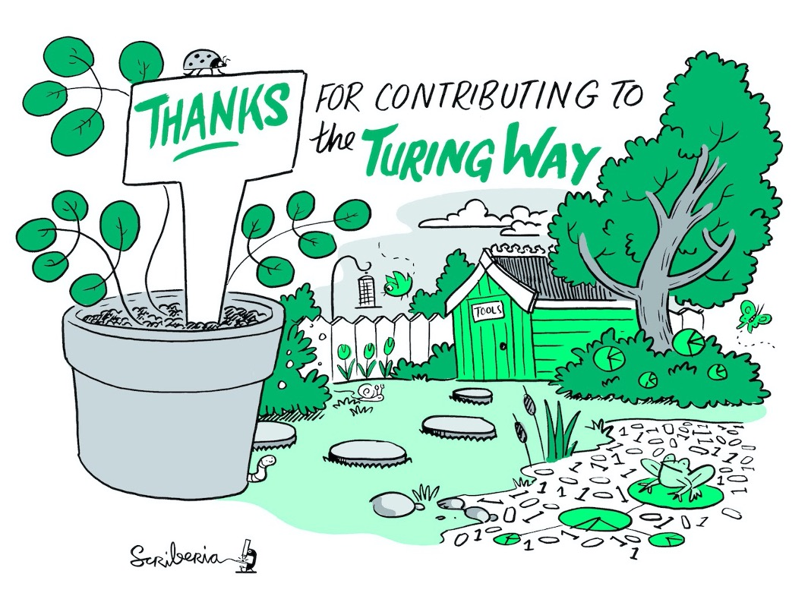

*The Turing Way Community, & Scriberia. (2021). Illustrations from the Turing Way book dashes. Zenodo. https://doi.org/10.5281/zenodo.3332807*

**Thanks goes to Emma Karoune for reviewing this month's newsletter.** 🌸

## Community Meetings

### Fireside Chat: Shared Concerns in Open Research Communities

On 10 December 2021, 17:00 - 18:00 UTC, the next fireside chat will take place on the topic "Shared Concerns in Open Research Communities". 
We have allocated 30 minutes after the session (18:00 - 18:30 UTC) to have open discussions with attendees and hear their reflections on the topic.
[Register to join the conversation](https://www.eventbrite.co.uk/e/fireside-chat-shared-concerns-in-open-research-communities-tickets-217634158627?keep_tld=1).

The session will feature Emmy Tsang, Kate Hertweck, Tiago Lubiana, Humberto Julio Debat and Melissa Mendonça.
They will bring their combined perspectives as community builders, educators, trainers, mentors, researchers, industry professionals and facilitators of open and reproducible practices at both local and global scales.

We invite you to host and lead future fireside chats in your network.
[Connect with us](https://github.com/alan-turing-institute/the-turing-way/blob/main/CONTRIBUTING.md#get-in-touch) to discuss more.

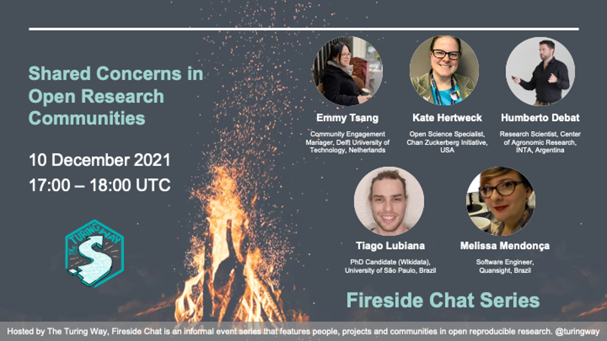

### Collaboration Cafes & Coworking Calls

The last Collaboration Cafe of the year is taking place on **15 December 2021 from 15:00 - 17:00 UTC**.
Join our project members and core contributors to introduce yourself, your interests in research and how we can work together.
If you haven’t yet managed to connect with *The Turing Way* community, this would be a good opportunity.
We will return next year with another season of Collaboration Cafes on **19 January 2022**.
Find more details about the event and sign up here: [hackmd.io/@turingway/collaboration-cafe](https://hackmd.io/@turingway/collaboration-cafe).

The last Coworking Call of this year is on 13 December from 11:00 - 12:00 UTC.
Find details here: [hackmd.io/@turingway/coworking-call](https://hackmd.io/@turingway/coworking-call).
Next year, we will resume hosting co-working calls weekly on Mondays starting 10 January 2022.

### Take Visible Roles in the Community

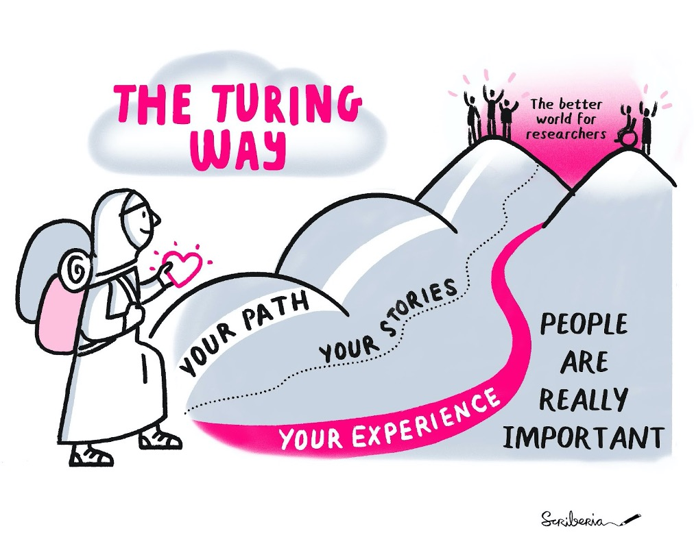

*The Turing Way Community, & Scriberia. (2021). Illustrations from the Turing Way book dashes. Zenodo. https://doi.org/10.5281/zenodo.3332807*

As we finish three years of *The Turing Way*, we are reflecting on our growth as a project, a community and breadth of research interests people represent.
We have started working on our next [governance model](https://github.com/alan-turing-institute/the-turing-way/pull/2036) to ensure that the voices and ideas we represent as a community are presented in the impactful roles and decision-making processes as well.

Many of our community members deliver talks and workshops regularly ([see details](https://zenodo.org/communities/the-turing-way/)), but representation within the community spaces is still limited to a few members.
We want to learn how we can support more people in such visible roles.
This may include joining the Book Dash Committee, hosting Collaboration Cafes or Coworking Calls, leading fireside chats, documenting case studies that reflect their domains, delivering 'just in time' workshops, offering mentorship and more.

Would you like to take one of these roles or do you have different ideas to enhance our community member’s visibility? 
Please contact us via one or multiple channels (see [contribution guidelines](https://github.com/alan-turing-institute/the-turing-way/blob/main/CONTRIBUTING.md)) or comment under [issue #2030](https://github.com/alan-turing-institute/the-turing-way/issues/2230).

## Contributors in Focus: Book Dash November 2021 Attendees

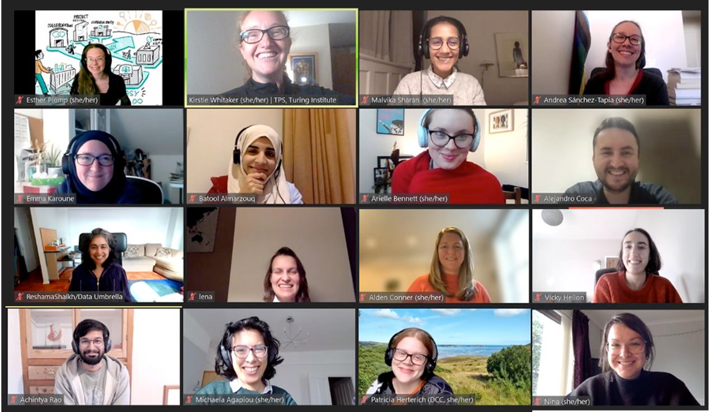

We are delighted to share that the sixth Book Dash was hosted successfully from 8 to 13 November 2021 with 24 participants, including the Planning Committee members. 
Participants include (in the group picture above - left to right and top to bottom): Esther Plomp, Kirstie Whitaker, Malvika Sharan, Andrea Sanchez Tapia, Emma Karoune, Batool Almarzouq, Arielle Bennett, Alejandro Coca, Reshama Shaikh, Lena Karvovskaya, Alden Conner, Vicky Hellon, Achintya Rao, Nina di Cara.
Following members not in the group picture: Carlos Martnez, Brigitta Scipoz, Ali Seyhun Saral, Maria Eriksson, Jessica Scheick, Marta Mangiarulo, Emmanuelle Rodrigues Nunes, Margaret Wanjiku, Melissa Steda and Ankur Kumar.

Aida Mehonic, Jez Cope, Martin O’Reilly, Martina Vilas, Patricia Herterich and Michaela Agaopiou, were among several community members who joined us at the Community Share outs. 

## Book Dash November 2021 Report

Discussion and collaboration among the attendees at this Book Dash covered a wide range of topics including the following:
* **data sharing** such as sensitive data and metadata (Emma, Maria and Margaret)
* **data ethics** (Nina and Ali)
* **research infrastructure** (Arielle, Esther and Lena)
* **research publication** (Lena, Achintya and Vicky)
* **impact assessment in research** (Jessica and Reshama)
* **translation process in different languages** (Alejandro, Batool and Andrea)
* **data visualisation and analysis pipelines** (Marta, Ankur and Emmanuelle)
* **code citation** (the eScience centre team members coordinated by Carlos Martinez include Abel Siqueira and Faruk Diblen), and
* **remote collaboration** (Melissa).

In addition to coworking on research ideas, we also hosted three informal discussion sessions, a “show and tell” meal and two Community Share-out events.
A complete report is shared on [this HackMD](https://hackmd.io/@turingway/bookdash-nov2021) along with links to recordings from the Share-outs.

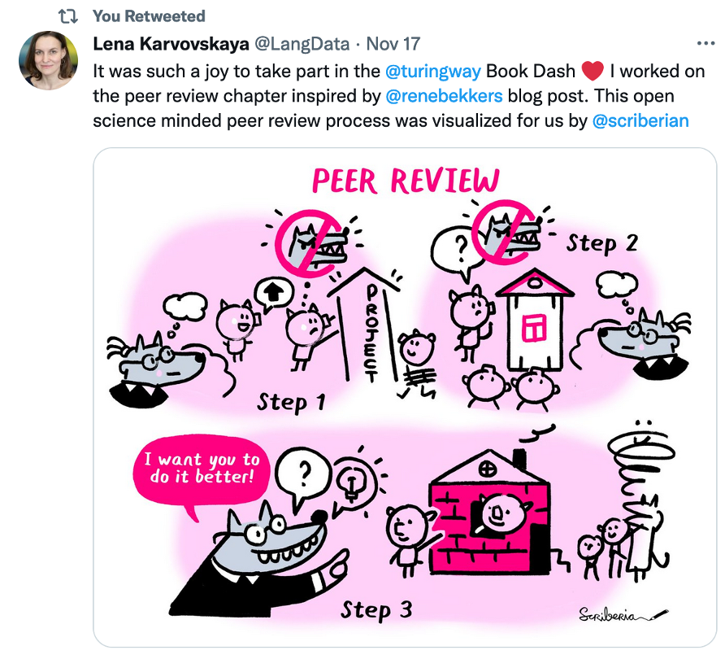

*[Lena Karvovskaya’s Tweet](https://twitter.com/LangData/status/1460906192834813954?s=20) with the Illustrations from the Turing Way book dashes. The Turing Way Community, & Scriberia. (2021). Zenodo. https://doi.org/10.5281/zenodo.3332807*

### New Releases and Release Workflow

We have made the latest release of *The Turing Way* on Zenodo.
Please cite this release as “The Turing Way Community. (2021). The Turing Way: A handbook for reproducible, ethical and collaborative research (1.0.1). Zenodo. https://doi.org/10.5281/zenodo.5671094”.

During the Book Dash, Malvika with contributions from Carlos and Achintya documented the [release workflow](https://github.com/alan-turing-institute/the-turing-way/blob/main/release-workflow.md) to facilitate regular releases by our project members.
To keep it manageable with the growing number of contributors to the project, we have attributed this release without individual author names, which are separately maintained in the [Record of Contributions in the Afterword](https://book.the-turing-way.org/afterword/contributors-record.html) of the book.

### Capture Your Contributions

*The Turing Way* community members collaborate with each other, represent local interests, exchange examples from their work, mentor contributions via GitHub, build and maintain the book, share about the project and support each other.
Many of their work stay hidden.
Therefore, we ask our contributors to capture contributions in [contributors.md](https://github.com/alan-turing-institute/the-turing-way/blob/main/contributors.md) in a way that is meaningful for them.

If your name, personal highlights and specific contributions are not yet recorded, please make a Pull Request on the [contributors.md](https://github.com/alan-turing-institute/the-turing-way/blob/main/contributors.md) document of the repository, or [contact us](https://github.com/alan-turing-institute/the-turing-way/blob/main/CONTRIBUTING.md#get-in-touch) so we can help capture your contributions meaningfully (also see our [Acknowledgement Process](https://book.the-turing-way.org/community-handbook/acknowledgement.html)).

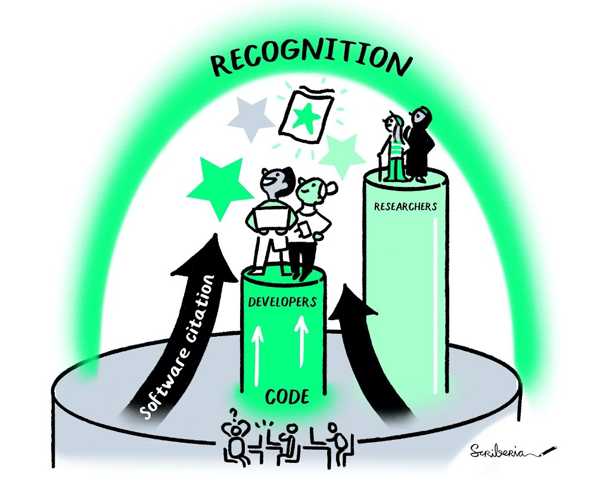

*The Turing Way Community, & Scriberia. (2021). Illustrations from the Turing Way book dashes. Zenodo. https://doi.org/10.5281/zenodo.3332807*

#### Not a Contributor but Use The Turing Way? Tell us About it!

If you're not already involved in the community as a contributor but you use, share or build upon the project, book or community in any way - We would love to hear from you too!
For example, many people reuse our online repository structure in their projects, develop a reproducibility plan using our chapters, reuse the Code of Conduct for their projects, cite *The Turing Way* in their manuscripts or grant proposals, and promote our community practices.
You can see responses to [Kirstie's Tweet](https://twitter.com/kirstie_j/status/1326126705270984710?s=20) from the last year and share your response with us under [issue #1659](https://github.com/alan-turing-institute/the-turing-way/issues/1659).

If you have not yet explored the project, we highly encourage you to do so.
There are many ways to get involved in the project, but you can already start by reading, using and sharing [*The Turing Way* guides](https://book.the-turing-way.org).
We are here to support you in whatever path you want to take to start your journey in *The Turing Way*.

### New Set of Illustrations

As always, our Book Dash participants had an opportunity to work with Scriberia Artists on their chapter and research ideas they were collaborating on.
Katya Balakina and Matt Kemp were available for three days working with us on day-to-day concepts such as documentation, authorship, public engagement, recognition and collaboration, as well as complex topics such as community management, data stewardship, research infrastructure, code publication, peer review and translation workflow.

We also managed to scribe Turing Way specific illustrations such as the history, vision and the Fireside chat event.
Do check them out and share them in your work and cite them as *The Turing Way Community, & Scriberia. (2021). Illustrations from the Turing Way book dashes. Zenodo. https://doi.org/10.5281/zenodo.3332807* (like we are doing in this newsletter! 😇).

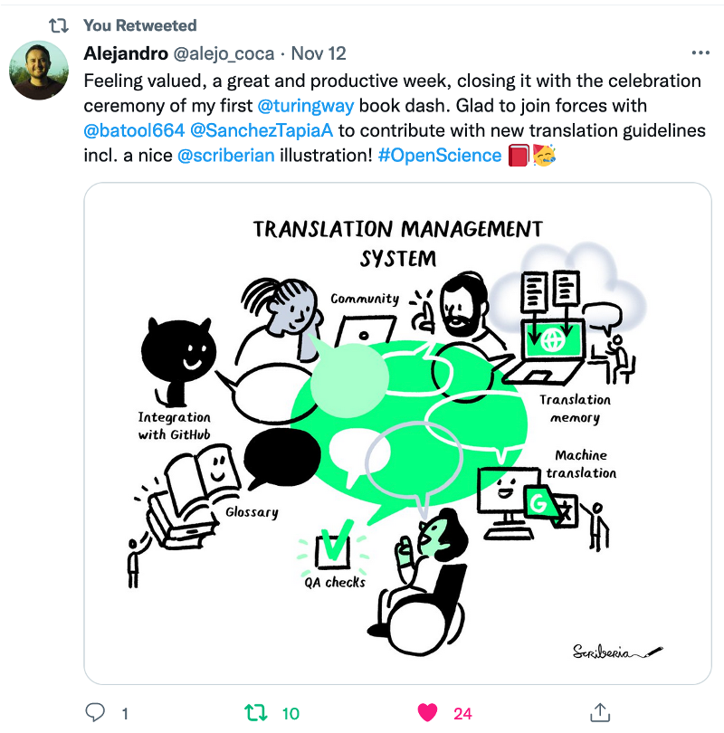

*[Alejandro Coca’s Tweet](https://twitter.com/alejo_coca/status/1459253596533497860?s=20) with the Illustrations from the Turing Way book dashes. The Turing Way Community, & Scriberia. (2021). Zenodo. https://doi.org/10.5281/zenodo.3332807*

## News from the Community

### New Project Members and Ways of Working

Over the last months, we have been working with the teams of Community Managers and Research Application Managers at The Alan Turing Institute, under the [Tools, Practices and Systems research programme](https://www.turing.ac.uk/research/research-programmes/tools-practices-and-systems) led by Kirstie Whitaker.
These members will be formally dedicating a part of their position to sustain the development and support work in *The Turing Way*.
With their onboarding, we have updated the list of project members in the [ways of working](https://github.com/alan-turing-institute/the-turing-way/blob/main/ways_of_working.md) document.

We are thrilled to have Emma Karoune, Aaron Lacey, Achintya Rao, Vicky Hellon, Aida Mehonic, Arielle Bennett, Alden Conner and Jennifer Ding joining the project in a paid capacity.
We are also grateful for the continued in-kind support of Carlos Martinez (Netherlands eScience Center), Esther Plomp (Faculty of Applied Sciences at the Delft University of Technology) and Sarah Gibson (2i2c and JupyterHub).

### UX/UI Enhancement of The Turing Way
 
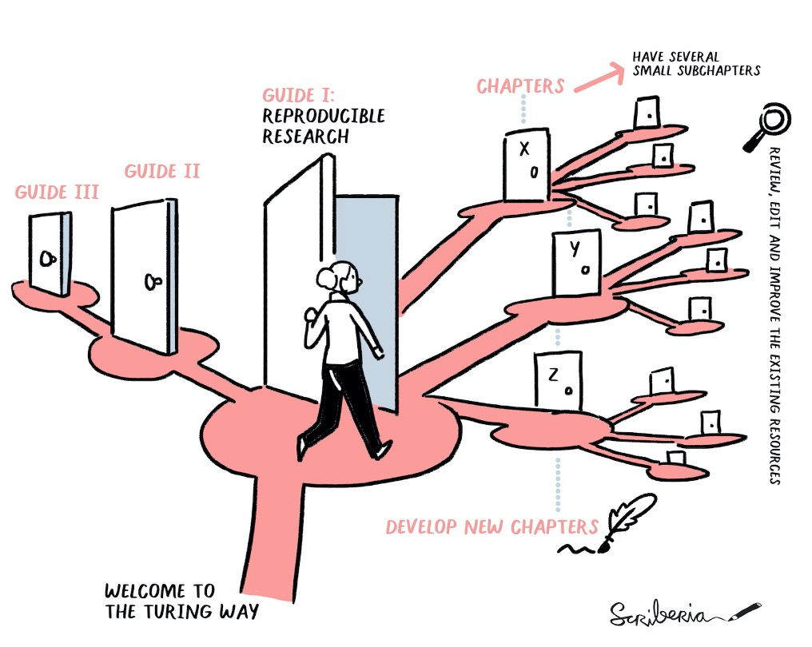

*The Turing Way Community, & Scriberia. (2021). Illustrations from the Turing Way book dashes. Zenodo. https://doi.org/10.5281/zenodo.3332807*

Since the launch in 2019, over 300 contributors have co-authored more than 250 pages in *The Turing Way*  book describing data science practices on reproducible research, communication, collaboration, project design and research ethics.
The project is used by thousands of users each month and cited across different projects within and outside the Turing.
Since the chapters continue to increase, it became essential for us to offer appropriate ways for our users to discover relevant and desired content in the book based on their topics of interest and skill levels to ensure we maximise the accessibility, reusability, and therefore impact, of the resources created by data scientists and researchers.

To enable this work, we received additional funding to work with the members of the Research Engineering Group at The Alan Turing Institute (see [full proposal](https://github.com/alan-turing-institute/the-turing-way/pull/2231)).
We are exploring different prototypes that are carefully developed and tested by the project members May Yong, Lydia France and Iain Stanson.
You can follow the updates and join the discussion under [issue #2071](https://github.com/alan-turing-institute/the-turing-way/issues/2071).

### Three Award Nominations for *The Turing Way*

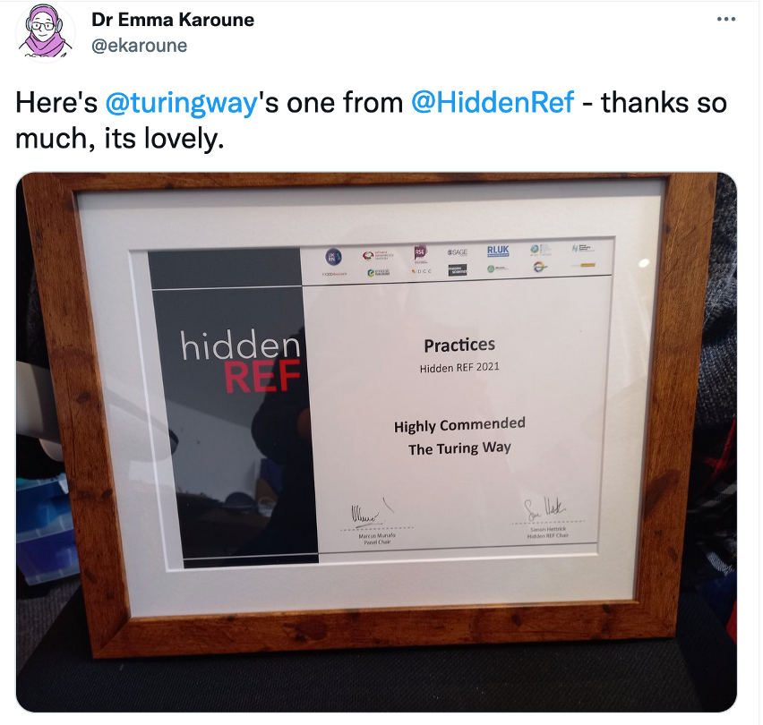

*[Emma Karoune’s Tweet](https://twitter.com/ekaroune/status/1446148291658452996?s=20) with the HiddenRef certificate for a ‘Highly Commended’ project.*

*The Turing Way* was nominated for the HiddenRef award and was awarded a ‘highly commended’ project under the ‘Practices’ category.
See the list of incredible winners for [each category on their website](https://hidden-ref.org/hidden-ref-award-ceremony/).
The project was also shortlisted for the OpenUK Award under the ‘Sustainability’ category. 
Additionally, under the ‘young person’ category, Paul Owoicho was shortlisted for his work with *The Turing Way* and Sam van Stroud was awarded in recognition for his work in the Turing Data Stories. 
See details [online](https://openuk.uk/openuk-awards-second-edition-2021/).

Finally, the third nomination of the year for *The Turing Way* is for the Open Publishing Award under the ‘Open Publishing Models’ category.
Winners will be revealed soon, as per [their website](https://openpublishingawards.org/index.html). 

### The Call for Open Life Science’s Next Cohort (OLS-5) has Launched!

[Open Life Science](https://openlifesci.org/) is a 16-week mentoring and training program that upskills individuals in open and reproducible research and empowers them to become open science ambassadors in their communities. 
After successfully concluding four cohorts, 113 projects and 180 project leads, we have opened a call for applications for the next cohort, OLS-5, which will take place from February to June 2022. 
The **Application deadline is 15 January 2022**.

Please join the **webinar on 14 December** to learn about the program and the application process. 
Visit [https://openlifesci.org](https://openlifesci.org/) for details and use the [promotional material](https://docs.google.com/document/u/1/d/e/2PACX-1vTkl_oNZco3hNrhQeNyCg8EXKyq3Ogs-zVik0eB05iXaPPJodnbRQEDog1ji4VrCwOTMJ3wYUch3WI5/pub) to share in your network.

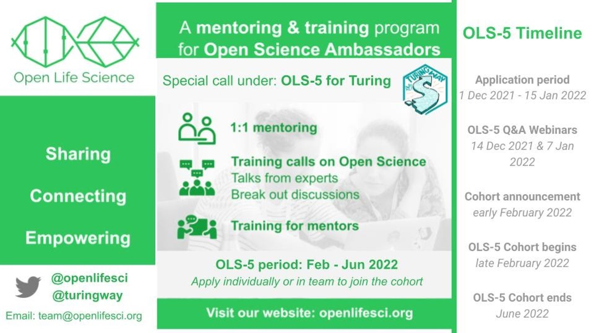

## Talks and Workshops

* **Martina Vilas** gave a keynote talk in Spanish at the 50th edition of JAIIO  on 26 October titled 'The Turing Way: una guía online para una ciencia de datos reproducible y abierta', discussing *The Turing Way* and her work in open science and reproducibility. See her slides: [DOI: 10.5281/zenodo.5601504](https://zenodo.org/record/5601504).
* **Heidi Siebold** led an Applied Analytics Seminar titled ‘*The Turing Way* - a community and handbook for reproducible, ethical and collaborative data science’ on 28 October. See [announcement](https://www.hdruk.ac.uk/events/the-turing-way-a-community-and-handbook-for-reproducible-ethical-and-collaborative-data-science/).
* **Batool Almarzouq** gave a talk introducing Open Science and *The Turing Way* in the Danish Diabetes Academy (DDA) Winter School on 11 November in Malaga, Spain. Slides: [DOI: 10.5281/zenodo.5674321](https://zenodo.org/record/5674321).
* **Esther Plomp** gave the following talks:
  * an invited talk at the Reprohack Hub Launch on 18 November titled ‘*The Turing Way* Community: your guide to reproducible research'. Slides [DOI: 10.5281/zenodo.5675926](https://zenodo.org/record/5675926). 
  * a community talk at FORCE2021 Conference on 8 December titled ‘Sustainable and inclusive solution to sharing best practices'. Slides: [DOI: 10.5281/zenodo.5718179](https://zenodo.org/record/5718179)
* **Rachael Ainsworth, Emma Karoune and Esther Plomp** delivered a workshop about good practice in collaboration as part of [Open Publishing Fest](https://openpublishingfest.org) on 15 November. Slides: [DOI: 10.5281/zenodo.5702689](https://zenodo.org/record/5702689)
* **Kirstie Whitaker** gave an introduction talk on 8 November for the Book Dash attendees discussing *The Turing Project*, our community and contribution pathways. Slides: [DOI: 10.5281/zenodo.5654766](https://zenodo.org/record/5654766). 
* **Malvika Sharan** gave the following talks, panels and workshops:
  * At the Open Science Symposium hosted by Bioinformatics Hub of Kenya on 14 October, she discussed how scientific errors have real-world effects and introduced *The Turing Way*. Slide: [DOI: 10.5281/zenodo.5568007](http://zenodo.org/record/5568007).
  * An invited talk titled ‘FAIR for building communities in open science’ at the Critical Knowledge Forum on 25 October hosted by the Adelphi Library, New York. Slides: [DOI: 10.5281/zenodo.5518163](https://zenodo.org/record/5518163). 
  * She joined a panel hosted by the KQ-Labs on 26 October for their Accelerator Programme's current cohort members. She gave a talk titled ‘The Alan Turing Institute: Highlighting Projects, Teams & Resources for Reproducible and Ethical research’ ([Slides](https://zenodo.org/record/5603209)).
  * She ran the Reproducibility, Distributed Collaboration and Open Science Workshop on 13 November as an additional module for The Carpentries workshop organised for the [UbiMotif Marie Curie PhD network](https://normandavey.github.io/2021-11-11-ubimotif/#setup/)
  * With **Georgia Aitkenhead**, she presented a workshop at the ‘Facilitation Responsible Participation’ at the Turing Institute titled ‘Contextualising Research Projects and Collaboration’ on 24 November. Slides: [DOI: 10.5281/zenodo.5724333](https://zenodo.org/record/5724333).
  *  On 2 December she joined a panel hosted at the Validate AI conference on diversity and inclusion for building trusted AI (no slides).

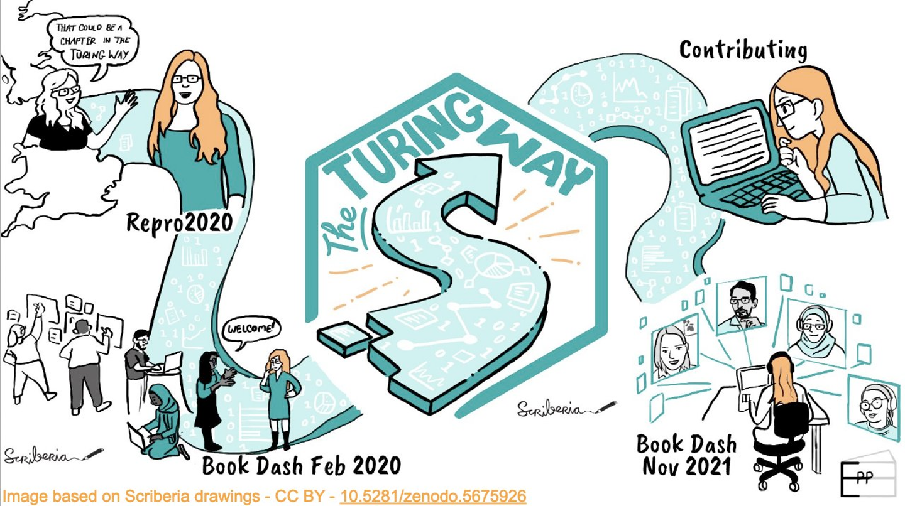

*Esther sketched her Turing Way journey to share in her talk at the ReproHack Hub launch. Cite as ‘Esther Plomp. (2021, November 18). The Turing Way Community: your guide to reproducible research. Zenodo. https://doi.org/10.5281/zenodo.5675926’*

## 2021: Year in Review!

As we complete the third year of *The Turing Way*, we review the year 2021 month-by-month to highlight some of the important milestones we have achieved in the project together with our community members.

- **January**: We started the year reflecting on what additional support we can offer to our community of contributors to take on leadership roles through sub-projects within *The Turing Way*. See [January’s newsletter](https://tinyletter.com/TuringWay/letters/new-year-wishes-from-the-turing-way-and-plans-for-2021).
- **February**: We launched a series of onboarding calls to engage with new members, have 1:1 interaction with them and demonstrate our resources. See [February’s newsletter](https://tinyletter.com/TuringWay/letters/next-book-dash-event-weekly-onboarding-calls-preparation-for-a-new-release-on-zenodo).
- **March**: In addition to assessing our project impact through new chapters released across different guides, we reported four community projects building on *The Turing Way* models. See [March’s newsletter](https://tinyletter.com/TuringWay/letters/call-for-application-for-the-upcoming-book-dash-gsoc-2021-proposal-and-new-community-resources).
- **April**: We formed our very first Book Dash Planning Committee by inviting previous participants and sustained contributors of *The Turing Way*. By April, more than 15 talks and workshops were already delivered by several of our community members. See [April’s newsletter](https://tinyletter.com/TuringWay/letters/join-the-community-share-out-event-meet-the-book-dash-planning-committee-and-find-more-updates).
- **May**: We hosted the fifth edition of Book Dash virtually, released a new set of illustrations and worked with 15 new participants in drafting, revising and releasing more than 10 chapters with the mentorship of our planning committee members. See [May’s newsletter](https://tinyletter.com/TuringWay/letters/book-dash-report-job-announcements-new-illustrations-and-community-updates).
- **June**: We published 8 chapters (with 20 subchapters) across guides for communication, collaboration and ethical research following the Book Dash in the previous month. Collaboration with the Open Life Science continued to offer mentorship and training to *The Turing Way* community members. See [June’s newsletter](https://tinyletter.com/TuringWay/letters/success-stories-from-book-dash-collaborations-videos-from-past-events-more-community-updates).
- **July**: Multiple positions at The Alan Turing Institute were announced with allocated time to work on *The Turing Way*. Due to low demand, we stopped hosting onboarding calls and invited feedback on the kinds of community calls we could host to engage with members who would like to stay involved but haven’t found a suitable pathway to engage yet. See [July’s newsletter](https://tinyletter.com/TuringWay/letters/new-job-opportunities-community-call-plans-chapters-and-other-updates).
- **August**: The JupyterHub team members partnered with *The Turing Way* to support the Community Lead Strategic position funded under the Essential Open Source Software (EOSS) for Science funding from the Chan Zuckerberg Initiative (CZI). See [August’s newsletter](https://tinyletter.com/TuringWay/letters/monthly-round-ups-upcoming-events-jupyterhub-community-strategy-partnership-and-more-updates).
- **September**: Alongside Kirstie, Malvika was promoted to co-lead for *The Turing Way* as the Tools, Practices and Systems Senior Researcher, and a position was announced for the recruitment of a new community manager. See [September’s newsletter](https://tinyletter.com/TuringWay/letters/we-are-hiring-meet-us-at-the-fireside-chat-community-share-out-and-contributor-celebration-date).
- **October**: The Fireside Chat series was kicked off with the first event on the topic “what exactly is *The Turing Way*” to discuss the project’s origin story and a vision for *The Turing Way*. Watch the [video featuring Cassandra Gould van Praag, Kirstie and Malvika](https://www.youtube.com/watch?v=nuNA3Qa8A-k).
- **November**: The sixth edition of *The Turing Way* Book Dash was hosted (as reported in this newsletter), new releases of the book with the entire repository was made and new Project Members were onboarded in the project. See the [ways of working](https://github.com/alan-turing-institute/the-turing-way/blob/main/ways_of_working.md) document.
- **December**: We are ending the year with nearly 308 GitHub contributors, 570 newsletter subscribers and nearly 2500 Twitter followers. We have together released 270 pages with chapters including modular subchapters, templates and several supporting resources across our five guides and a community handbook.

## Thank you & End of the Year Wishes!

Reflecting on how *The Turing Way* started as a funding proposal at a coffee shop, we are so proud and humbled by the global collaboration it now represents.
The value *The Turing Way* brings to the broader space of open science, research and data science practice is possible only because of the diverse perspectives each of you has brought into the project.

We thank you for your participation, support and contributions to *The Turing Way*. 

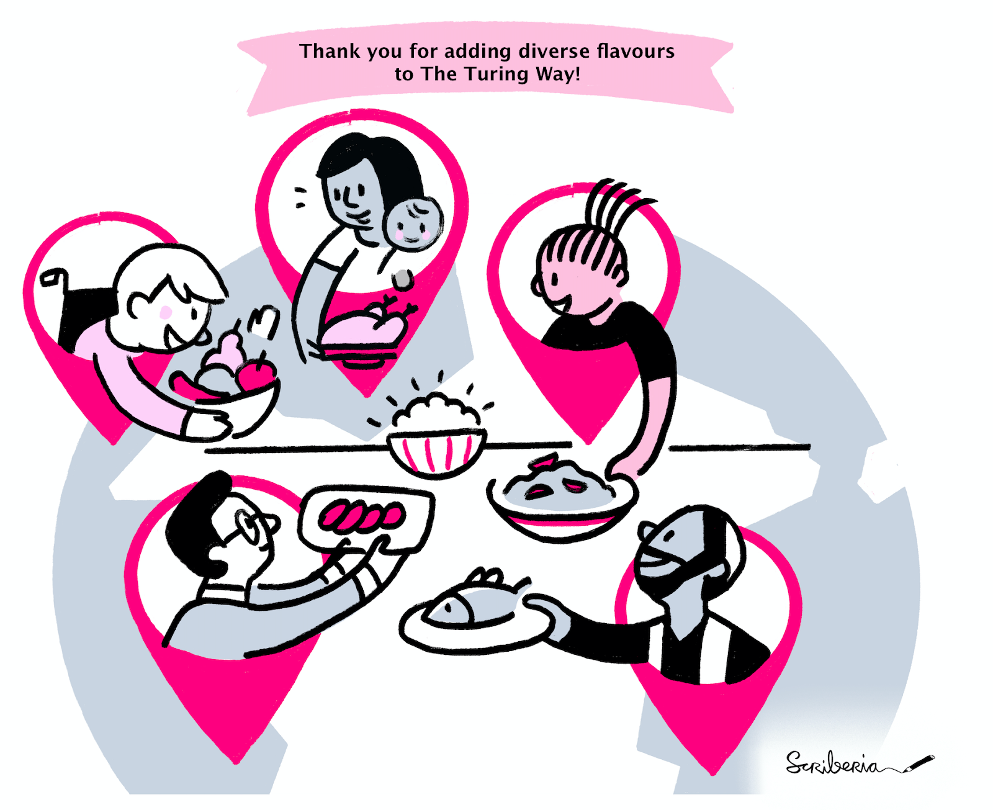

*The Turing Way Community, & Scriberia. (2021). Illustrations from the Turing Way book dashes. Zenodo. https://doi.org/10.5281/zenodo.3332807*

We hope you can enjoy some break at the end of the year. See you in 2022!

Malvika and Kirstie on behalf of *The Turing Way* Project Members. 💜

## Connect with us!

- [About the project](https://www.turing.ac.uk/research/research-projects/turing-way-handbook-reproducible-data-science)
- [_The Turing Way_ book](https://book.the-turing-way.org)
- [GitHub repository](https://github.com/alan-turing-institute/the-turing-way)
- [Slack Workspace](https://join.slack.com/t/theturingway/shared_invite/zt-fn608gvb-h_ZSpoA29cCdUwR~TIqpBw)
- [YouTube Videos](https://www.youtube.com/channel/UCPDxZv5BMzAw0mPobCbMNuA)
- [Twitter Channel](https://twitter.com/turingway)

You are welcome to contribute content for the next newsletter by
emailing [Malvika Sharan](mailto:msharan@turing.ac.uk).

*Did you miss the last newsletters?*
*Check them out [here](https://tinyletter.com/TuringWay/archive).*
