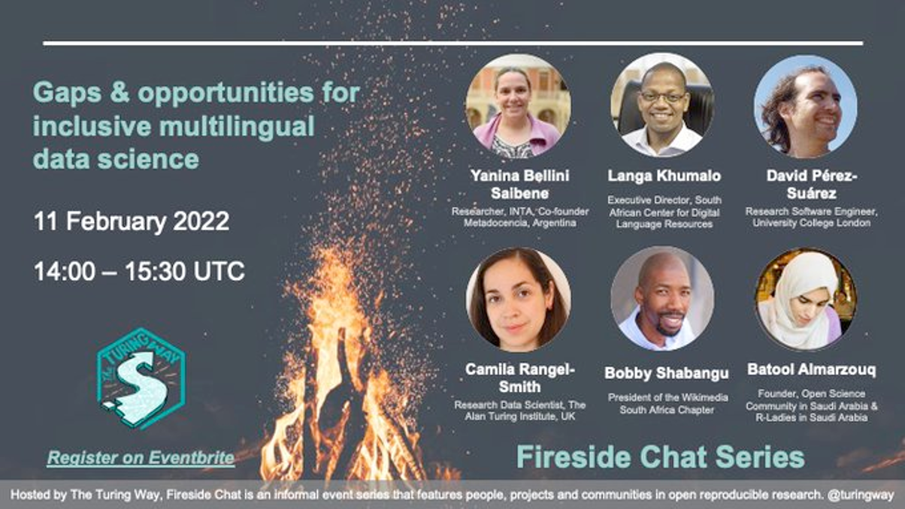
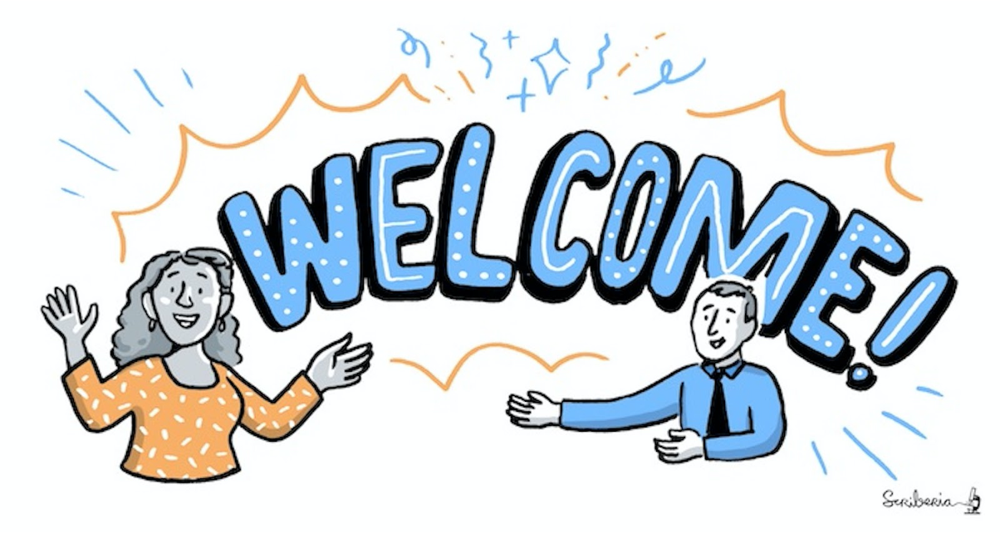
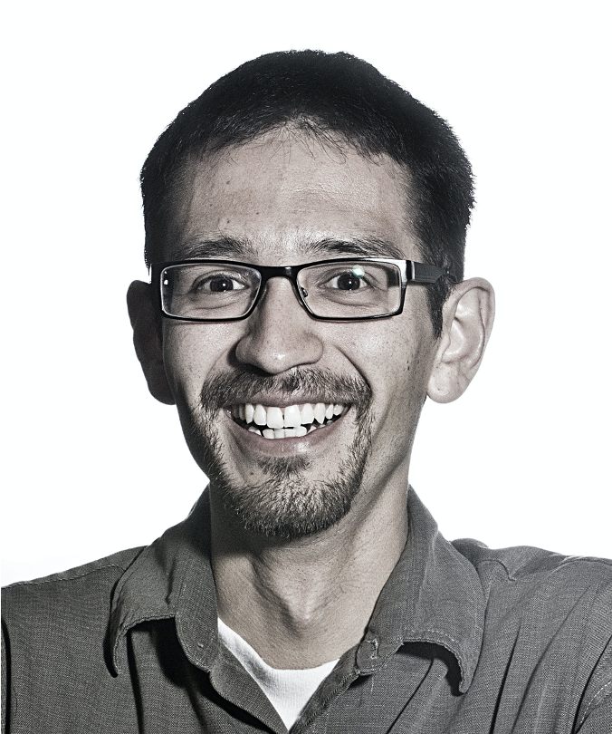
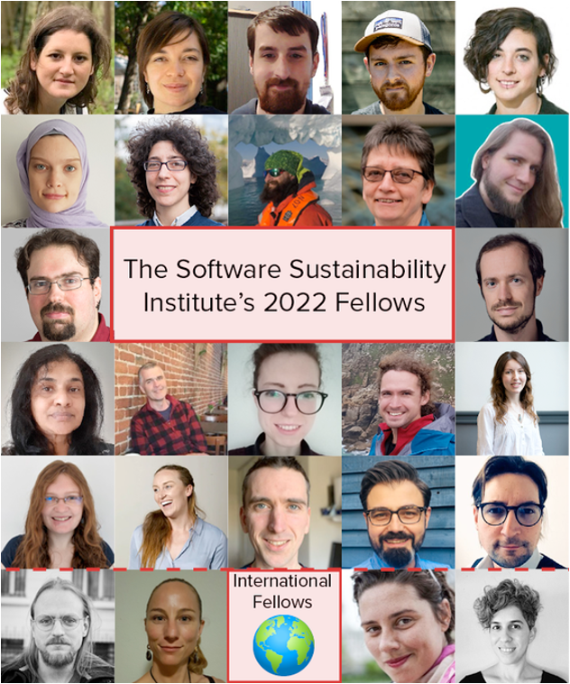
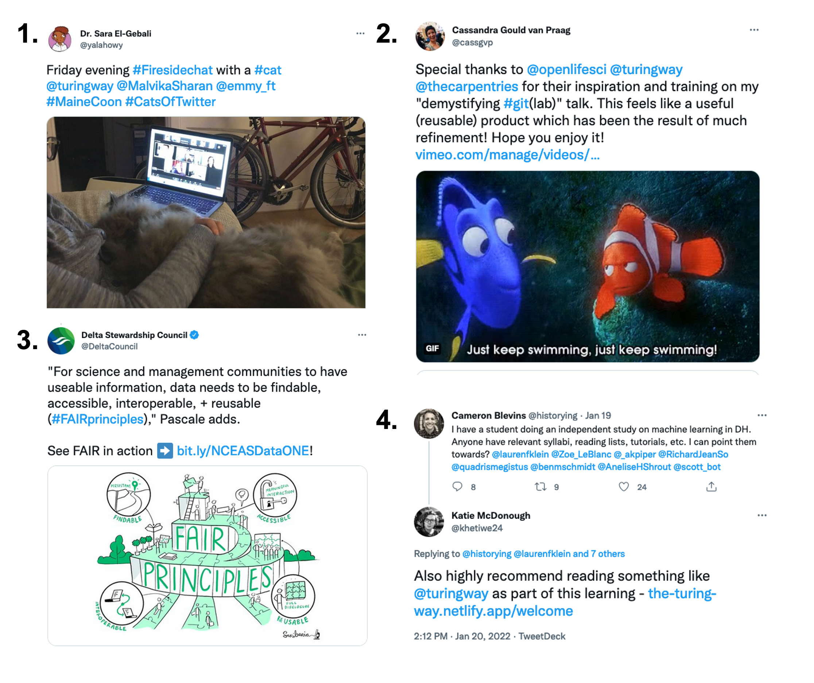

The Turing Way Newsletter: 31 January 2022

# January Round-Up, next Fireside Chat and other updates from The Turing Way

Hello Turing Way friends!

We hope you had a good start to the year 2022! ⭐️

It has been lovely to see many of you at our Collaboration Cafés and Coworking Calls. 
We hope to connect with more of our community members in the coming weeks.
Here are a few opportunities to engage with *The Turing Way* community:
* 🔥 Attend the Fireside Chat on *Gaps and Opportunities for Inclusive Multilingual Data Science* - 11 February, 14:00 - 15:30 UTC ([register](https://www.eventbrite.co.uk/e/fireside-chat-gaps-opportunities-for-inclusive-multilingual-data-science-tickets-255972068347)).
* 💼 Apply for the Community Manager positions at The Alan Turing Institute to work closely with *The Turing Way*.
* 👋 Sign  up to attend a short workshop on Facilitating Inclusive Events online on 14 and 18 February. 

Read on for details, updates on new chapters and other news from the project! 👇

_Thanks to Achintya Rao for reviewing an earlier draft of this newsletter! 🌻_

## Community Events

### Fireside Chat on 11 February 2022

*The Fireside Chat series features experts, champions and their projects from across different international communities in reproducibility, open research, ethics, collaboration and everything in between.*

On 11 February 2022, 14:00 - 15:30 UTC ([in your timezone](https://arewemeetingyet.com/london/2022-02-11/14:00/ttw-fireside-chat)), the next fireside chat will take place on the topic: **Gaps & Opportunities for Inclusive, Multilingual Data Science**. 
Chaired by Anelda van der Walt and Malvika Sharan, this panel will feature insights from **Batool Almarzouq, Bobby Shabangu, Camila Rangel-Smith, David Pérez-Suárez, Langa Khumalo and Yanina Bellini Saibene**. 
These researchers represent different communities with expertise and insights from working in multilingual research and data science projects. 
We will also facilitate open discussions with attendees to learn about their perspectives on the topic via a shared document.
Read more details and register via [the Eventbrite page](https://www.eventbrite.co.uk/e/fireside-chat-gaps-opportunities-for-inclusive-multilingual-data-science-tickets-255972068347).

### Collaboration Cafés

We had a chance to catch up with several of you at the *The Turing Way* Collaboration Cafés in the last weeks. 
Taking place **every month on the first and third Wednesday from 15:00 to 17:00 UTC** ([see in your timezone](https://arewemeetingyet.com/london/2022-02-16/15:00/)), Collaboration Cafés are collaborative spaces for you to connect with *The Turing Way* team, share your ideas and exchange feedback.
These are also opportunities for us to onboard new members and share what we are working on.
Save the dates for the next calls on 16 February and 2 March.
Sign up on this shared HackMD: [hackmd.io/@turingway/collaboration-cafe](https://hackmd.io/@turingway/collaboration-cafe).

### Weekly Coworking Calls

We host weekly Coworking Calls **every week on Monday from 11:00 to 12:00** London time.
These meetings are often attended by folks working on *The Turing Way* issues or Pull Requests, leading on subprojects in collaboration with us or other projects where they use *The Turing Way* resources.
Find details about these calls in this shared HackMD and join us: [hackmd.io/@turingway/coworking-call](https://hackmd.io/@turingway/coworking-call).

### Workshop: Facilitating Collaborative Sessions

Many of you expressed interest to host Collaboration Cafés or Coworking Calls but also indicated that you would like to attend a guided session on facilitating such events online.
Therefore, Malvika will be hosting two short **workshops on Facilitating Collaborative Sessions** such as those organised in *The Turing Way* community.
Please sign up by selecting one of the two sessions:
* [Register for the Workshop-1](https://turing-uk.zoom.us/meeting/register/tJMscuqsrj4jEtboVuSPRv1OYlfdWt4zOXKa): **14 February, 17:00 to 18:00 UTC** ([see in your timezone](https://arewemeetingyet.com/london/2022-02-14/17:00/))
* [Register for the Workshop-2](https://turing-uk.zoom.us/meeting/register/tJMvdu-hqTwrGdSnAzuBnjztYBi9_mv7bz7Q): **18 February, 10:00 - 11:00 UTC** ([see in your timezone](https://arewemeetingyet.com/london/2022-02-18/10:00/))

## News from the community

*The Turing Way Community, & Scriberia. (2021). Illustrations from the Turing Way book dashes shared under the CC BY 4.0 License. Zenodo. https://doi.org/10.5281/zenodo.3332807*

### Jobs at Turing!

Apply for **Community Manager** within the *AI for Multiple Long Term Conditions Research Support Facility*.
* The Community Manager for *Patient and Public Involvement and Engagement* will work with Theme Lead, Lynsey Cross and researchers to elevate the voices of people living with multiple long term conditions, their family members and carers: [apply here](https://cezanneondemand.intervieweb.it/turing/jobs/community_manager_patient_and_public_involvement_and_engagement_aim_rsf_19281/en/). The **deadline is 6 February 2022**.
* The Open Collaboration Community Manager will work with Theme Lead, Evelina Gabasova and researchers to deliver scientific community building and training: [apply here](https://cezanneondemand.intervieweb.it/turing/jobs/community_manager_open_collaboration_aim_rsf_19278/en/). The **deadline is 13 February 2022**.

Apply for the **Research Application Manager** for the Turing Data Safe Haven project (DSH), a flagship research engineering project at The Alan Turing Institute.
The postholder will work closely with Kirstie Whitaker, Aida Mehonic, Martin O'Reilly and James Robinson, members from the Tools, Practices and Systems research programme and Research Engineering Group at the Institute: [apply here](https://cezanneondemand.intervieweb.it/turing/jobs/research_application_manager_data_safe_haven_19580/en/). The **deadline is 13 February 2022**.

These positions have a central role in laying the groundwork for inclusive co-creation and contribute to *The Turing Way* acting as a bi-directional conduit to implement best practices for data science (share this [Twitter thread](https://twitter.com/turingway/status/1486685227858767874).

### Capturing Impact from Your Work

*[Kirstie’s Tweet](https://twitter.com/kirstie_j/status/1469060341606801410) invites The Turing Way users and contributors to share how this project has helped their work.*

Like last year, Kirstie asked again how you use *The Turing Way*.
Here, we are highlighting a response from Emma Rand:

> [I am] recommending to PGR students and integrated masters students ([online slides](https://3mmarand.github.io/BIO00058M-Data-science-2020/slides/00_intro_to_module.html#17) and basing much of [Cloud-based High-Performance Computing for Specialised Analyses on environmental 'omics](https://cloud-span.york.ac.uk/) practice and [CloudSPAN-handbook](https://cloud-span.github.io/CloudSPAN-handbook/) on *The Turing Way*!

Read more responses in [issue #1659](https://github.com/alan-turing-institute/the-turing-way/issues/1659) and comment to share your experiences with us.

## Acknowledgements and celebrations

### Contributor in focus: Carlos Martinez-Ortiz 

Carlos Martinez is a 'Community Manager - Natural Sciences & Engineering' at the Netherlands eScience Center.
He has worked as an engineer in diverse projects in digital humanities and life sciences, developing expertise in natural language processing, linked open data and software sustainability. 
Carlos obtained his PhD in Computer Science at the University of Exeter and worked on various research projects at the University of Exeter and Plymouth University before moving to the Netherlands. 
He is a certified Software Carpentry instructor and is frequently involved in organising training events.

As a member of *The Turing Way* core team, he supports researchers from eScience Center in sharing internally developed resources and recommended practices for the [Netherlands eScience Center guide](https://guide.esciencecenter.nl/#/) to *The Turing Way*.

In his words:
> We always advocate for software reuse and collaborative development of software. 
> I love that we can do the same for software development guidelines: reuse content from the eScience guide and collaboratively develop with *The Turing Way* community!
> I am a big advocate of improving software quality. 
> I am really glad that the eScience Center is collaborating with *The Turing Way* in providing guidelines and helping build better research software.

Thanks to Carlos’ work at the organisation level.
We are using this example to **encourage documentation of internal practises** from different research teams and cross-reference them to *The Turing Way* **enabling community-led support and sustainability** for their work.

### New Chapters

* Arielle Bennett, Esther Plomp, Emma Karoune, Vicky Hellon and Lena Karvovskaya collaborated to document [Research Infrastructure Roles](https://book.the-turing-way.org/collaboration/research-infrastructure-roles.html) that includes subchapters on Community Managers, Data Stewards and Research Software Engineers.
* Aida Mehonic, Jennifer Ding and Alden Conner, a team of Research Application Managers (RAM) at The Alan Turing Institute also wrote a subchapter describing their role as RAMs](https://book.the-turing-way.org/collaboration/research-infrastructure-roles/ram.html). 🐏
* Nina di Cara published a chapter on [self-reflection guidance for ethical research](https://book.the-turing-way.org/ethical-research/self-reflection.html).
* Faruk D., Abel Siqiera and Carlos Martinez worked on [Software Citation with CITATION.cff](https://book.the-turing-way.org/communication/citable/citable-cff.html) and using [CFFLint](https://book.the-turing-way.org/communication/citable/citable-cffinit.html).
* Margaret Wanjiku added the [documentation and metadata](https://book.the-turing-way.org/reproducible-research/rdm/rdm-metadata.html) subchapter in the Research Data Management chapter.
* Vicky Hellon revised and updated the [Open Access](https://book.the-turing-way.org/reproducible-research/open/open-access.html) publication subchapter.
* Malvika ana Alejandro Coca added checklists for chairing [Collaboration Café](https://book.the-turing-way.org/community-handbook/coworking/coworking-collabcafe.html#chairing-an-online-collaboration-cafe) and [Coworking Calls](https://book.the-turing-way.org/community-handbook/coworking/coworking-weekly.html#chairing-coworking-calls).

*Have an idea for collaborations or a chapter? [Connect with us](https://github.com/alan-turing-institute/the-turing-way/blob/main/CONTRIBUTING.md#get-in-touch). Please explore [issues](https://github.com/alan-turing-institute/the-turing-way/issues) and [Pull Requests](https://github.com/alan-turing-institute/the-turing-way/pulls) to collaborate with others on ongoing work.*

## News and Announcements from Other Projects

### Open Science Conference: 08-10 March

The ninth international [Open Science Conference (OSC)](https://www.open-science-conference.eu/) will take place from 08 to 10 March 2022. 
The OSC 2022 is dedicated to the Open Science movement and provides a forum for researchers, librarians, practitioners, infrastructure providers, policymakers, and other important stakeholders to discuss the latest and future developments in Open Science.
The conference offers insights into both practical and technical innovations, discussions about the relation between Open Science and knowledge equity and opportunities for networking and exchange.
This year’s conference is cooperating with the German Commission for UNESCO.
They will organise a panel discussion and a workshop in the context of the recently adopted UNESCO Recommendation on Open Science.
Register to [attend the conference](https://www.open-science-conference.eu/registration) and the [Barcamp Open Science](https://www.open-science-conference.eu/barcamp/) on 7 March.

### Collaboration Workshop 2022: Register and Submit abstract!

[Collaborations Workshop 2022 (CW22)](https://software.ac.uk/cw22) will take place online from Monday 4 April to Thursday 7 April 2022.
The Software Sustainability Institute’s Collaborations Workshop series brings together researchers, developers, innovators, managers, funders, publishers, policy-makers, leaders and educators to explore best practices and the future of research software. 
The themes of the CW22 keynote presentations, discussion groups, mini-workshops, collaborative ideas and hack day will be around the following areas of research software: Code Review, Ethics, Hybrid Working and Software Sustainability. 
To find out more information including registration, agenda, call for submissions (deadline is 4 February) and how to sponsor the unconference, please visit the CW22 website: [https://software.ac.uk/cw22](https://software.ac.uk/cw22).

### Software Sustainability Institute 2022 Fellows Announced!

22 new Software Sustainability Institute Fellows have joined the fellows' network in 2022.
In addition, for the first time, four International Fellows were selected under the International Fellowship pilot! 
Two of these fellows are **Sophia Batchelor and Bastian Greshake Tzovaras** who are *The Turing Way* contributors and researchers collaborating on the [AutSPACEs](https://github.com/alan-turing-institute/AutSPACEs) and [Open Humans](https://www.openhumans.org/) project. 
Congrats to all the fellows! Read [more about them](https://www.software.ac.uk/news/announcing-2022-software-sustainability-institute-fellows).

### Open Life Science Received Funding for 2022-2023

The [Open Life Science (OLS)](https://openlifesci.org) training and mentoring programme have received two grants from the Wellcome Trust and Chan Zuckerberg Initiative (CZI).
These fundings will enable research and sustainability of the program for the next two years.
Specifically, the Wellcome Trust Open Research Fund will enable the OLS team to conduct a research-based assessment, decolonisation and dissemination of our resources for their adoption and reuse across different open science communities.
CZI grant will provide OLS with a truly valuable opportunity to improve sustainability for the organisation and community by enabling a funded position that will focus on planning for the longer term.
Congratulations to the OLS team! 
Read details in [OLS' blogposts](https://openlifesci.org/posts).

### Next Building Laterally Event on 23 February

The Digital Infrastructure Incubator at Code for Science & Society has been hosting a Building Laterally Event Series.
**Building Laterally: Political Imagination to Support and Sustain Digital Infrastructure** events facilitate discussions on sustainability, governance, and community health in digital public infrastructure to wider political horizons.
The next event in the series is **Coloniality of Digital Infrastructure** which will take place online on 23 February.
Read more details and [register to attend](https://www.eventbrite.com/e/coloniality-of-digital-infrastructure-tickets-250812836947).

### Open Research Calendar

We can't possibly announce all the exciting events our friends and colleagues are organising in open research and data science.
Nevertheless, you can find out about them (or add your events) on Open Research Calendar.
Open Research Calendar was created as a community-powered tool to serve the open research community in collating worldwide open research events into one database.
These events are added to a public Google Calendar that anyone can subscribe to and sync with their personal calendar.
Read more about the project and find links to their resources online at [openresearchcalendar.org](https://openresearchcalendar.org/).

## Twitter

**1** [Sara El-Gebali](https://twitter.com/yalahowy/status/1469362864259579910) tweeted a picture of her cat co-watching December’s fireside chat with her.
**2** Cassandra Gould van Praag recently released a training video introducing version control with GitLab. See [her tweet](https://twitter.com/cassgvp/status/1484606620286038016) for links to her talk along with other training videos.
**3** Data Stewardship Council shares *The Turing Way* illustration on FAIR in a [recent tweet](https://twitter.com/DeltaCouncil/status/1480689241612976131).
**4** Katie McDonough recommended *The Turing Way* in [her tweet](https://twitter.com/khetiwe24/status/1484167069058973703) as part of an independent study on machine learning in Digital Humanities.

## Connect with us!

- [Relevant links from *The turing Way*](https://hackmd.io/@turingway/demo-intro)
- [About the project](https://www.turing.ac.uk/research/research-projects/turing-way-handbook-reproducible-data-science)
- [*The Turing Way* book](https://book.the-turing-way.org)
- [GitHub repository](https://github.com/alan-turing-institute/the-turing-way)
- [Slack Workspace](https://join.slack.com/t/theturingway/shared_invite/zt-fn608gvb-h_ZSpoA29cCdUwR~TIqpBw)
- [YouTube Videos](https://www.youtube.com/channel/UCPDxZv5BMzAw0mPobCbMNuA)
- [Twitter Channel](https://twitter.com/turingway)

You are welcome to contribute content for the next newsletter by
emailing [Malvika Sharan](mailto:msharan@turing.ac.uk).

*Did you miss the last newsletters?*
*Check them out [here](https://tinyletter.com/TuringWay/archive).*
