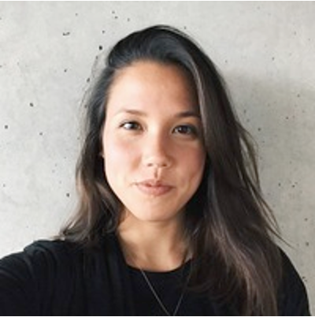
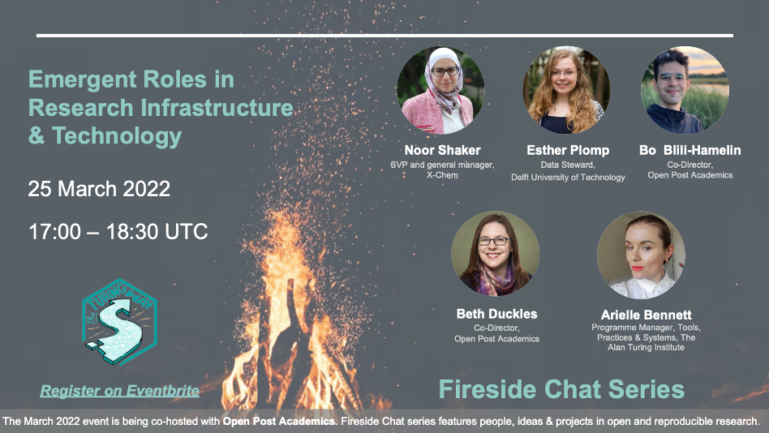
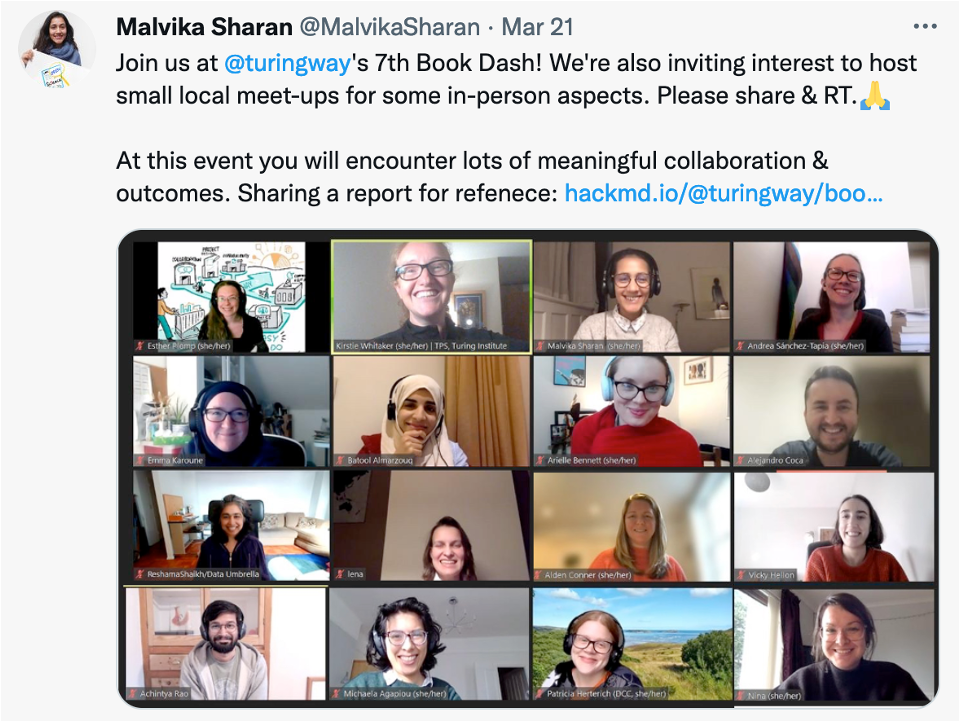
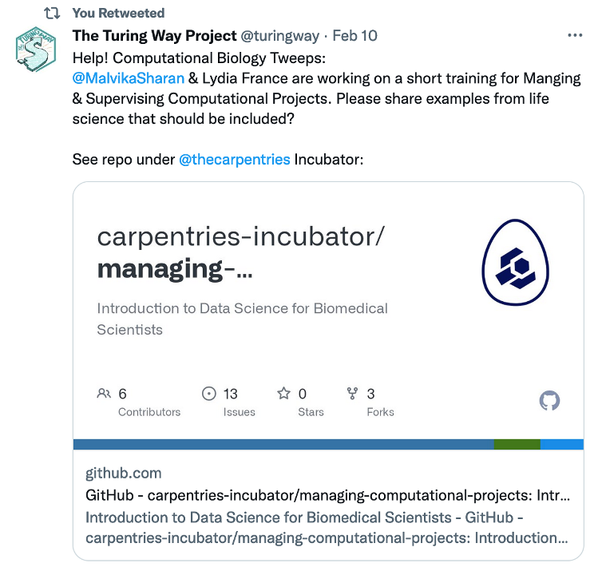
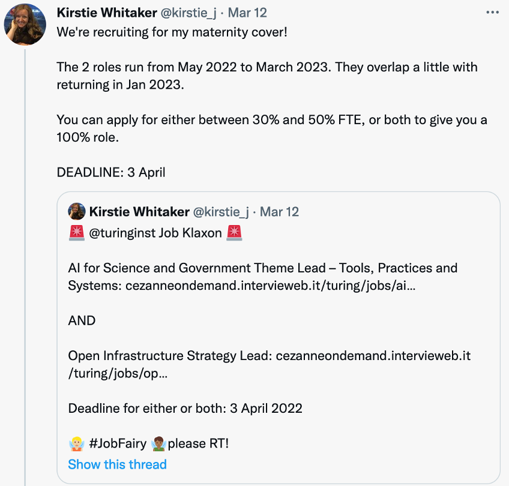
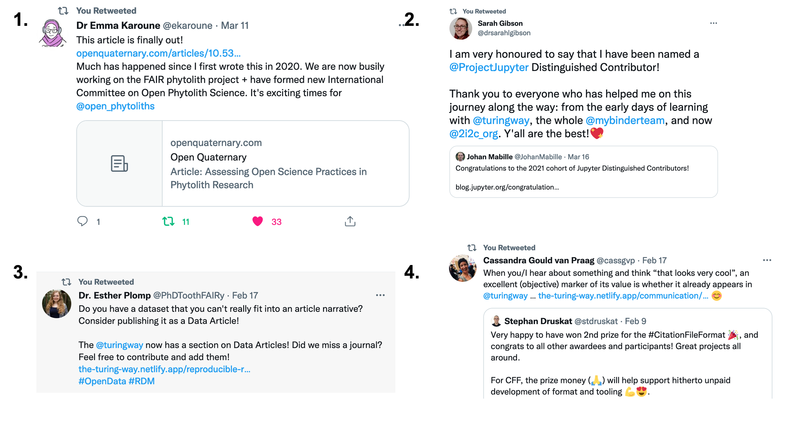
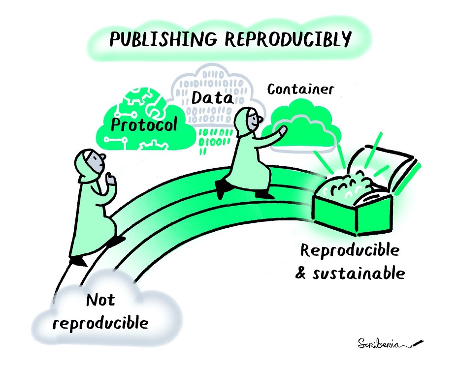

The Turing Way Newsletter: 22 March 2022

# Introducing the next Fireside Chat, Book Dash, Collaborative projects and Our Community Manager!

Hello Turing Way friends!

This post is packed with exciting updates and news from _The Turing Way_ community.

*   📢 Meet **Anne Lee-Steele, _The Turing Way_ Community Manager**. Learn more about her in this newsletter.
*   🔥 Join the **Fireside Chat this Friday, on 25 March 2022**, 17:00 - 18:30 UTC. Under the title: “Emergent Roles in Research Infrastructure and Technology”, this event is co-hosted with Open Post Academics ([register](https://www.eventbrite.co.uk/e/fireside-chat-emergent-roles-in-research-infrastructure-technology-tickets-294499364527)).
*   📚💨 The next **Book Dash is taking place from 16 to 20 May 2022**. [Send your application](https://forms.gle/9hyQQC5KCsRJC3Yv8) to attend virtually, as well as indicate your interest to host local meet-ups.

There are several community events, collaborative projects and job opportunities to work strategically alongside _The Turing Way_, read on for details on these topics below 👇

Thanks to Esther Plomp and Georgia Aitkenhead for reviewing earlier drafts of this newsletter! 🌻

* * *

## Meet Anne Lee Steele, _The Turing Way_ Community Manager

We are delighted to welcome [Anne Lee Steele](http://twitter.com/aleesteele) as the Community Manager of _The Turing Way_. We asked Anne to share a few sentences about herself that you can read below.

> I’m truly excited to join _The Turing Way_ community and to support such an important project in open science and the broader free/open ecosystem. Most relevant for the community, I’m an anthropologist by training… So in the coming weeks and months, I’ll be playing the role of an ethnographer, getting to know you all and _The Turing Way_, listening in, and learning how I can support you and your contributions to the project, whatever that may look like. I’ll be the first to admit that I’ll probably make mistakes along the way, but I’m excited to join you on this new chapter of _The Turing Way_ together.
> 
> I’ll be reaching out to people individually, but you will also see me in the slack channels, GitHub Pull Requests or Twitter. Please don’t hesitate to say hello! I’ve opened my calendar for (digital) coffee calls: [Book a chat with me](https://calendly.com/aleesteele/) or connnect [@aleesteele](http://twitter.com/aleesteele). There’s a lot I have to learn from you all, and I’m looking forward to getting to know you.

* * *

## Community Events

### Join us at the Fireside Chat on 25 March 2022

On 25 March 2022, 17:00 - 18:30 UTC ([in your timezone](https://arewemeetingyet.com/london/2022-03-25/17:00)), the next Fireside Chat's title is "Emergent Roles in Research Infrastructure & Technology". 
Chaired by Beth Duckles and Arielle Bennett, this panel will feature insights from Noor Shaker, Esther Plomp and Borhane (Bo) Blili-Hamelin. [Register on Eventbrite](https://www.eventbrite.co.uk/e/fireside-chat-emergent-roles-in-research-infrastructure-technology-tickets-294499364527).

These individuals represent diverse positions in the research infrastructure and tech industry as community leaders, entrepreneurs, researchers and multi-talented professionals.
Drawing from their experiences, they will discuss what the career landscape currently looks like from their perspectives, why recognition for unconventional roles matters to them, and how we can work towards a culture that provides better opportunities for individuals who take the non-traditional academic route. 
We will also facilitate open discussions with attendees to learn about their perspectives on the topic via a shared document.

* * *

### Call for Application to attend Book Dash: 16-20 May 2022

The 7th Book Dash event is taking place online from **16 to 20 May 2022**. Submit your application via [this Google form](https://forms.gle/uEbu1FJMmdfgGwvW6). The Deadline for submission is 21 April 2022.

We invite applications from members of our community, including both new and existing contributors. 
Our attendees bring some understanding of where they can contribute and collaboratively improve _The Turing Way_ as a whole. If participating in _The Turing Way_ community for the first time, we encourage you to first participate in a Collaboration Café or other community events (see: [bit.ly/turingway](http://bit.ly/turingway)).
This application will likely take 30 minutes to complete. 
You can use this template document with all the questions to prepare your draft in your time: [https://tinyurl.com/tw-bookdash-template](https://tinyurl.com/tw-bookdash-template).

_[Tweet by Malvika](https://twitter.com/MalvikaSharan/status/1505906141921951745?s=20&t=xHT7RiowG8hRJytNqMpPjQ) sharing report from [the 6th Book Dash in 2022](https://hackmd.io/@turingway/bookdash-nov2021)_

Previous Book Dash attendees are welcome to send their application to participate again in the Book Dash. 
They are particularly encouraged to indicate their interest to join the **Book Dash Review and Planning Committee**. 
ook Dash committee members are facilitators and mentors who support other attendees’ contributions in one or multiple of the contribution sessions based on their interest and availability. 
We are also looking to support **small scale local meetups** if multiple members from the same city are participating. 
In the application form, please indicate your interest if you would like to attend or host if a local meet-up in your city will be possible.

* * *

### Collaboration Cafés: First and Third Wednesdays

The next Collaboration Café will be hosted by Arielle Bennett on 6 April 2022. Please find details and sign up here: [hackmd.io/@turingway/collaboration-cafe](https://hackmd.io/@turingway/collaboration-cafe). 
You can also sign up to host one of the future Collaboration Cafés on 20 April, 4 May and 18 May 2022.

#### Weekly Coworking Calls

Can’t make it to a Collaboration Café? Join every Monday for a coworking call with the core team from 11:00 to 12:00 London time (if your time zone permits). 
See details and agenda in this HackMD: [hackmd.io/@turingway/coworking-call](https://hackmd.io/@turingway/coworking-call).

_Have more ways to connect and work with The Turing Way? [Get in touch](https://github.com/alan-turing-institute/the-turing-way/#get-in-touch)._

* * *

### Introduction to Data Science and AI Training : Review and Illustration Sprint

_Lydia France, Federico Nanni and Malvika are developing training materials for data science for biomedical researchers on GitHub (see an [early Tweet inviting case studies and examples](https://twitter.com/turingway/status/1491849730996981770?s=20&t=RENtZhQDQ2WWCclDxxhjlA))_

On 28 and 29 April 2022 (1.5 days), we are organising a review and illustration sprint for the [Introduction to Data Science for Biomedical Scientists: Turing-Crick Partnership](https://github.com/alan-turing-institute/data-training-for-bioscience). 
Please express your interest to attend this event before **21 April 2022** via [this Google form](https://forms.gle/fXPZ9yPzMkqMxrdQ8).

This project has led to the development of **two training modules** on data science and AI practices for senior researchers, group leaders, late PhD/Postdocs, and mid to late-career biomedical scientists. 
Therefore, we encourage anyone with overlapping experience in biomedical research and computational best practices with some project management skills to join us at this event. 
Participants can choose to attend from **five 2-hour long sessions for collaborative review** of these training materials. 
We will also work with a professional scribe from [Scriberia](https://www.scriberia.com/) to help develop accessible illustrations during the event.

#### Pre-Event Webinar

We will host a webinar on 11 April at 17:00 (London Time) to present the project and answer any questions our applicants may have. 
Register in advance for this meeting: [https://turing-uk.zoom.us/meeting/register/tJUrduGsqz0qEty19kV8JdA7e29AWkOgCYrM](https://turing-uk.zoom.us/meeting/register/tJUrduGsqz0qEty19kV8JdA7e29AWkOgCYrM). 
After registering, you will receive a confirmation email containing information about joining the meeting.

* * *

## News from the community

### _The Turing Way_ is Inviting GSoC 2022 Candidates

We are inviting interested [Google Season of Code (GSoC)](https://summerofcode.withgoogle.com/) candidates (student developers and coders) to connect with _The Turing Way_ community and learn about our project. 
Specifically, we are interested in improving and integrating a Python package developed for _The Turing Way_ to enhance the usability of our book. 
We have described our project ideas with details on the [GitHub issue](https://github.com/alan-turing-institute/the-turing-way/issues/2266) and [Neurostars](https://neurostars.org/t/gsoc-2022-project-idea-3-1-the-turing-way-a-how-to-guide-to-data-science-175-350-h/21380). 
If you have a different project idea, please reach out to the project team via Slack or GitHub.

* * *

### Job Opportunities at The Alan Turing Institute

The [Tools, Practices and Systems (TPS)](https://www.turing.ac.uk/research/research-programmes/tools-practices-and-systems) programme at The Alan Turing Institute represents a cross-cutting set of initiatives that seek to build open source infrastructure that is accessible to all and empower a global, decentralised network of people who connect data with domain experts. 
_The Turing Way_ is a flagship project hosted by TPS to learn, exchange and adopt best practices in data science and research with the Turing and beyond.

_See [Kirstie’s Twitter thread](https://twitter.com/kirstie_j/status/1502773236823728130?s=20&t=RENtZhQDQ2WWCclDxxhjlA) sharing job opportunities at the Turing with details on what these positions entail._

TPS is recruiting for the following positions – the deadline for applications is 3 April 2022.

#### AI for Science and Government Theme Lead and Open Infrastructure Strategy Lead (Part-Time Maternity Cover)

Two short-term leadership opportunities in TPS are open for applications.

*   [Apply for the AI for Science and Government Theme Lead](https://cezanneondemand.intervieweb.it/turing/jobs/ai_for_science_and_government_theme_lead__tools_practices_and_systems_21470/en/) to lead the delivery of Theme’s work on research applications and community engagement at the institute.
*   [Apply for Open Infrastructure Strategy Lead](https://cezanneondemand.intervieweb.it/turing/jobs/open_infrastructure_strategy_lead_21481/en/) to lead the responsibility of defining and developing the Turing’s position in Open Infrastructure nationally and internationally.

These roles are maternity covers for Kirstie Whitaker, TPS Programme Director and TPS Theme Lead, who will be available for handover and knowledge transfer conversations until May 2022.

#### TPS Research Project Manager

A Research Project Manager will coordinate and support work across the TPS programme, playing a central role in assisting with the overall delivery process. 
This position will also be working closely with _The Turing Way_ core team members. 
The Project Manager will be supported to share their expertise in project design and collaborative skills by creating new content, reviewing existing chapters, or promoting the project to new audiences. 
See this [Twitter thread by Arielle Bennett](https://twitter.com/biotechchat/status/1500810442217857024?s=20&t=ZhCl7r3zrp8d1NstXaNFHA) for details and [apply online](https://cezanneondemand.intervieweb.it/turing/jobs/research_project_manager_tools_practices_and_systems_21254/en/).

* * *

### Relevant Opportunities

*   **Collaboration Workshop: 4-7 April 2022**: Several members of _The Turing Way_ community are participating in the Collaboration Workshop this year as committee members, speakers, panellists and attendees. [Registration is still open](https://software.ac.uk/cw22). Do get in touch with us if you are attending the conference.
*   **Public Engagement with Data Science and AI**: Applications are now open to graduate students and early-career researchers on the second Turing Commons course taking place from 25 to 29 April. Limited spaces are available – [find details and apply here](https://www.eventsforce.net/turingevents/frontend/reg/thome.csp?pageID=59630&eventID=180&CSPCHD=00000100000027JZDqZf8GP68kaIZ02WSpWhIMI6hhwnfGSy13).
*   **Essential Open Source Software for Science program**: A new cycle of funding call is open for supporting the needs of computational tools broadly used in biomedicine and science. For 2-year grants and a $50-200k budget per year, please submit letters of intent by 19 April 2022. Read more details on the [CZI webpage](https://chanzuckerberg.com/rfa/essential-open-source-software-for-science/).
*   **Open Bioinformatics Foundation Event Fellowship** application is open till 1 April 2022. This fellowship is for candidates who are seeking financial support to attend or host scientific events in 2022. [Read details and apply](https://www.open-bio.org/2022/02/07/obf-event-fellowship-2022-round1/).

* * *

## Acknowledgement & Celebrations!

### Twitter Shout Outs

*   **1.** Congratulations **Emma Karoune** for the publication of her research paper [Assessing Open Science Practices in Phytolith Research](https://www.openquaternary.com/articles/10.5334/oq.88/). See [her Tweet](https://twitter.com/ekaroune/status/1502208208571703298?s=20&t=ZhCl7r3zrp8d1NstXaNFHA) sharing her paper.
*   **2.** Congratulations **Sarah Gibson** for being named a [JupyterHub Distinguished Contributor](https://blog.jupyter.org/congratulations-distinguished-contributors-bc349fa60d68). See [her Tweet](https://twitter.com/drsarahlgibson/status/1504376954325196800?s=20&t=ZhCl7r3zrp8d1NstXaNFHA) with the announcement.
*   **3.** Thanks to **Esther Plomp** for writing a [chapter on Data Article in _The Turing Way_](https://book.the-turing-way.org/reproducible-research/rdm/rdm-article.html), and Achintya Rao and Vicky Hellon for review. See [Esther’s tweet](https://twitter.com/PhDToothFAIRy/status/1494386704517636110?s=20&t=uWN4ovGAHUUk4I5coZhXsg) inviting examples from data articles.
*   **4.** Congratulations to **Stephan Druskat** and the team for winning the [campusSOURCE Award 2022 for the Citation File Format](https://ev.campussource.de/publikationen/csa2022/) project. See [Cassandra Gould van Praag’s Tweet](https://twitter.com/cassgvp/status/1494198893193711626?s=20&t=uWN4ovGAHUUk4I5coZhXsg) sharing a [chapter on CFF File Format](https://book.the-turing-way.org/communication/citable/citable-cffinit.html) in _The Turing Way_.

* * *

### Recent Talks & Workshops

*   On 11 February, a fireside chat took place on the topic **Gaps & Opportunities for Inclusive, Multilingual Data Science**. Chaired by Anelda van der Walt and Malvika Sharan, this panel featured insights from Batool Almarzouq, Bobby Shabangu, Camila Rangel-Smith, David Pérez-Suárez, Langa Khumalo and Yanina Bellini Saibene. The [recording is available on YouTube](https://www.youtube.com/watch?v=Ydogg2tQljA).
*   On March 22, Malvika delivered a workshop for the MRes **Responsible Research and Innovation Cohort 3: RRI Module Week** under the title _The Turing Way_: Workshop for Responsible Research and Innovation: Geospatial Data. Zenodo. [DOI: 10.5281/zenodo.6377969](https://doi.org/10.5281/zenodo.6377969)
*   On 4 and 11 March, Emma Karoune and Malvika delivered a _The Turing Way_ Workshop on **Reproducible, Open and FAIR Research** for AI for the study of Environmental Risks (AI4ER) for the doctoral students at UKRI Centre for Doctoral Training. Zenodo. [DOI: 10.5281/zenodo.6346555](https://doi.org/10.5281/zenodo.6346555).
*   Under the title **Engaging Community in Sharing Open and Reproducible Research Practices**, Malvika gave a talk at the STFC Open Science Cafe webinar. Zenodo. [DOI: 10.5281/zenodo.6114015](https://doi.org/10.5281/zenodo.6114015).
*   Kirstie and Malvika will be delivering a stakeholder engagement workshop at the AI-UK 2022 conference. Presentation for their talk can be seen in Zenodo under the title **Investing in Human Infrastructure for Culture Change**. Zenodo. [DOI: 10.5281/zenodo.6378011](https://doi.org/10.5281/zenodo.6378011).

_The Turing Way Community, & Scriberia. (2021). Illustrations from the Turing Way book dashes. Zenodo. [https://doi.org/10.5281/zenodo.3332807](https://doi.org/10.5281/zenodo.3332807)_

### Recent Articles & Publications

*   Post [Publishing a Data Article](https://openworking.wordpress.com/) by Esther Plomp. Contributions from Vicky Hellon, Achintya Rao, Yanina Bellini Saibene, and Lora Armstrong. See the related [chapter on _The Turing Way_](https://book.the-turing-way.org/reproducible-research/rdm/rdm-article.html).
*   Seminar Announcement for 24 March 2022. Python (or R) for Open and Reproducible Science, with Andrew Mitchell - Department of Psychology. [See details](https://www.su.se/department-of-psychology/calendar/python-or-r-for-open-and-reproducible-science-with-andrew-mitchell-1.604754).
*   Coderefinery. (2022, March 22) [Sharing code and data — Reproducible research documentation](https://coderefinery.org/reproducible-research/sharing).
*   Louise Corti, Professor Felix Ritchie and Martin O’Reilly (2022, March 22). [To share or not to share: code sharing in social science.](https://www.ncrm.ac.uk/news/show.php?article=5705).
*   Flechas, M. A., Attebury, G., Bloom, K., Bockelman, B., Gray, L., Holzman, B., Thiltges, J. (2022, March 22). Collaborative Computing Support for Analysis Facilities Exploiting Software as Infrastructure Techniques. Retrieved from [https://inspirehep.net/literature/2055674](https://inspirehep.net/literature/2055674)
*   Trisovic, A., Lau, M. K., Pasquier, T., & Crosas, M. (2022). [A large-scale study on research code quality and execution](https://www.nature.com/articles/s41597-022-01143-6). Scientific Data, 9(60), 1–16. doi: 10.1038/s41597-022-01143-6
*   Niso, G., Krol, L.R., Combrisson, E., Dubarry, A.S., Elliott, M.A., François, C., Héjja-Brichard, Y., Herbst, S.K., Jerbi, K., Kovic, V., Lehongre, K., Luck, S.J., Mercier, M., Mosher, J.C., Pavlov, Y.G., Puce, A., Schettino, A., Schön, D., Sinnott-Armstrong, W., Somon, B., Šoškić, A., Styles, S.J., Tibon, R., Vilas, M.G., van Vliet, M., Chaumon, M. (2022, March 10). [Good Scientific Practice in MEEG Research: Progress and Perspectives](https://pubmed.ncbi.nlm.nih.gov/35283287/). Neuroimage. doi: 10.1016/j.neuroimage.2022.119056.

* * *

## Connect with us!

*   [About the project](https://www.turing.ac.uk/research/research-projects/turing-way-handbook-reproducible-data-science)
*   [_The Turing Way_ book](https://book.the-turing-way.org)
*   [GitHub repository](https://github.com/alan-turing-institute/the-turing-way)
*   [Slack Workspace](https://join.slack.com/t/theturingway/shared_invite/zt-fn608gvb-h_ZSpoA29cCdUwR~TIqpBw)
*   [YouTube Videos](https://www.youtube.com/channel/UCPDxZv5BMzAw0mPobCbMNuA)
*   [Twitter Channel](https://twitter.com/turingway)

You are welcome to contribute content for the next newsletter by emailing [Malvika Sharan](mailto:msharan@turing.ac.uk).

_Did you miss the last newsletters?_ _Check them out [here](https://tinyletter.com/TuringWay/archive)._
