The Turing Way Newsletter: 21 April 2022

# New chapters, sign up for Book Dash, the upcoming Fireside Chat, and other community updates

Hiya everyone!

Anne, your [new Community Manager](https://twitter.com/aleesteele/status/1503400525110427650), here! It's my first time sending _The Turing Way_ newsletter... and I'm excited to share the many updates, upcoming events, and opportunities we have to share from our community.

📚💨 **The next Book Dash is taking place from 16 to 20 May 2022.** [Apply by TODAY 21 April](https://forms.gle/9hyQQC5KCsRJC3Yv8) to attend virtually, and let us know if you're interested in hosting a local meet-up.
📣 This month we've published new chapters, hosted workshops, and have many opportunities for collaboration to share with you. **Check out 'community news' and 'opportunities' for more!**
🔥 Join us at our upcoming Fireside Chat on **"Making Virtual Conferencing the Global Default" on 29 April 2022 at 16:00 BST (15:00 UTC)**. Sign up on [Eventbrite](https://www.eventbrite.co.uk/e/318719758377/) and share with others.
☕ The next **Collaboration Cafe is happening on 04 May at 16:00 BST (15:00 UTC)**. ([See details](https://https://hackmd.io/@turingway/collaboration-cafe))

_Thank you to Arielle Bennett, Esther Plomp and Malvika Sharan for reviewing drafts of this newsletter!_

---

# Upcoming Events

## Tune into our Fireside Chat 🔥

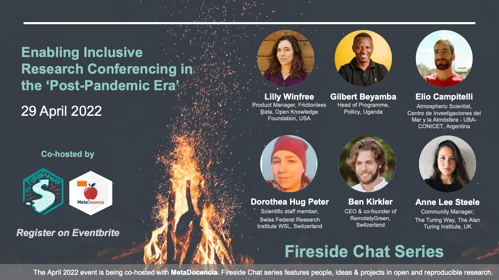

**On 29 April 2022, 15:00-16:30 UTC ([in your timezone](https://arewemeetingyet.com/UTC/2022-04-29/15:00)): the next Fireside Chat will take place on the topic: “Enabling Inclusive Conferencing in the 'Post-Pandemic Era'”.**
Over the past 2 and a half years, the COVID-19 pandemic has brought about a reckoning with how scientific research is done across international borders – and how scientific conferencing is done in turn.
Alongside the shift to “working from home”, conferences also moved online.
But as many events begin to move back to in-person events in the coming months and years, this Fireside Chat brings together diverse voices from different projects and communities to talk more about the role of conferences in scientific collaboration, and the trade-offs involved in this shift back to in-person conferences.

**Chaired by Anne Lee Steele and Lilly Winfree (Frictionless Data), this panel will feature insights from Dorothea Hug Peter (UseR), Elio Campitelli (MetaDocencia), Gilbert Beyamba (Pollicy), and Ben Krikler (RemotelyGreen).**
These individuals represent different communities with expertise and insights from organising and participating in international conferences.  
[Sign up on the Eventbrite](https://www.eventbrite.co.uk/e/fireside-chat-making-virtual-participation-a-global-default-tbc-tickets-318719758377).

## Join us at Collaboration Cafe ☕

**The next Collaboration Café is on 4 May 2022 at 15:00 BST (UTC+1).**
You can find the details and sign up here: [hackmd.io/@turingway/collaboration-cafe](https://hackmd.io/@turingway/collaboration-cafe).
You can also sign up to host one of the future Collaboration Cafés on 18 May and 1 June 2022.
We hope to see you there!

## Applications to attend our Book Dash 📚💨

**The 7th [Book Dash](https://book.the-turing-way.org/community-handbook/bookdash.html) event will take place online from 16 to 20 May 2022.** Submit your application via this [Google form](https://forms.gle/uEbu1FJMmdfgGwvW6).
The deadline for submission is 21 April 2022.

We invite applications from members of our community, including both new and existing contributors. Our attendees bring some understanding of where they can contribute and collaboratively improve _The Turing Way_ as a whole.
If participating in _The Turing Way_ community for the first time, we encourage you to first participate in a Collaboration Café or other community events shared in this newsletter (also see: [bit.ly/turingway](http://bit.ly/turingway)).

This application will take 20-30 minutes to complete.
You can use the [template document](https://tinyurl.com/tw-bookdash-template) to prepare your draft.
**Don't hesitate to reach out (email [asteele@turing.ac.uk](mailto:asteele@turing.ac.uk)) if extra time might be useful to draft your application** – we're here to give you the support you need.

## Join us at Collaboration Cafe ☕

**The next Collaboration Café will happen on 4 May 2022 at 15:00 BST (UTC+1).**

You can find the details and sign up here: [hackmd.io/@turingway/collaboration-cafe](https://hackmd.io/@turingway/collaboration-cafe).
You can also sign up to host one of the future Collaboration Cafés on 18 May and 1 June 2022. We hope to see you there!

## Community Share-Outs on 20 May

On 20 May 2022, the last day of Book Dash, we will host two [Community Share Out and Contributor Celebrations Events](https://book.the-turing-way.org/community-handbook/bookdash/bookdash-events.html#community-share-outs-contributor-celebration)
This is a public event for folks interested in learning more about The Turing Way, seeing what recent updates have been made in the project and celebrating the incredible work of our contributors.
We will also release the new version of _The Turing Way_ book and give an early preview of a new set of illustrations developed during the Book Dash.
You are invited to attend one or both sessions, please sign up on [Eventbrite](https://www.eventbrite.co.uk/e/the-turing-way-community-share-out-and-contributor-celebrations-may-2022-tickets-323373307267).

---

# Community News

## Featured: UK's Goldacre review!

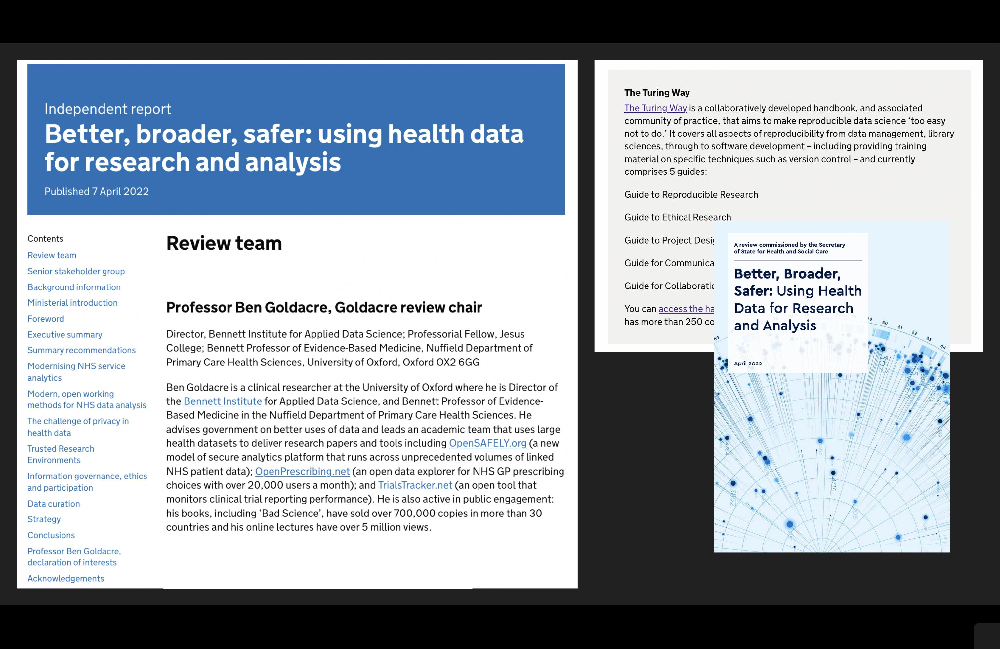
_The Goldacre Review was published on 7 April 2022._

We are thrilled and honoured that [_The Turing Way_ was recently featured in the Goldacre Review](https://www.gov.uk/government/publications/better-broader-safer-using-health-data-for-research-and-analysis/better-broader-safer-using-health-data-for-research-and-analysis).
_The Turing Way_ was highlighted in the context of addressing *a range of specific challenges around open working, the limits of open code, and the strong positive relationship between open working methods and innovative commercial activity in health data science*.
You can read the [full report online](https://www.gov.uk/government/publications/better-broader-safer-using-health-data-for-research-and-analysis/better-broader-safer-using-health-data-for-research-and-analysis).

Led by Dr Ben Goldacre at the University of Oxford, the report explored how health data can be used efficiently and safely by researchers and for patients within the healthcare sector.
The study was commissioned by the Secretary of State for Health and Care in the UK.
[Learn more about the Goldacre Review](https://www.goldacrereview.org/).

## New chapter: Peer Review!

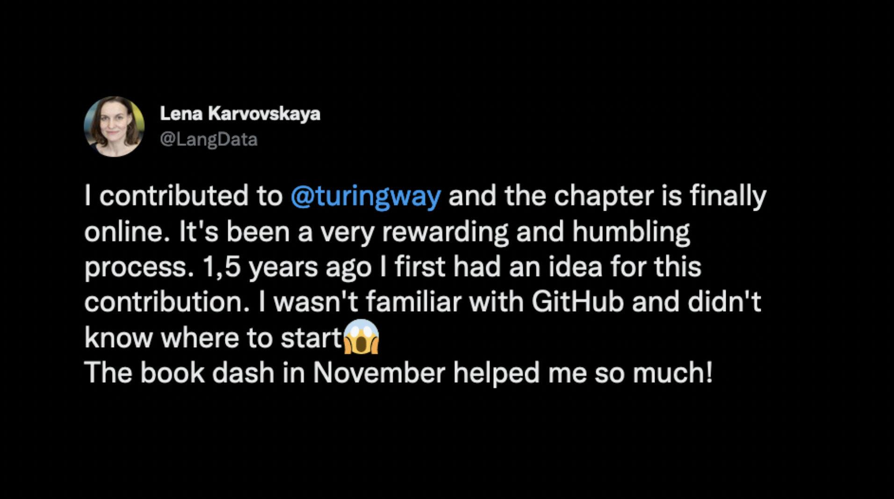
_Lena's tweet about the new chapter!_

Lena Karvovskaya recently published a new chapter in the Turing Way on [Peer Review](https://book.the-turing-way.org/communication/peer-review/peer-review-overview.html)!
You can find [the new chapter in our Guide for Communication]((https://book.the-turing-way.org/communication/)).
This new chapter includes helpful suggestions on what to do before accepting an invitation for peer review, and how to structure writing one.
It also includes tips drawn from work by Rene Bekkers, called ["How to review a paper"](https://renebekkers.wordpress.com/2020/06/24/how-to-review-a-paper/).
Thank you to Lena for writing, and to Vicky Hellon, Emma Karoune, and Achintya Rao for reviews!

If you'd like to get involved with new and ongoing chapters, please get in touch with us: join a co-working hour, Collaboration Cafe, or message one of the team directly.

## Co-leads of _The Turing Way_ Translation and Localisation team!

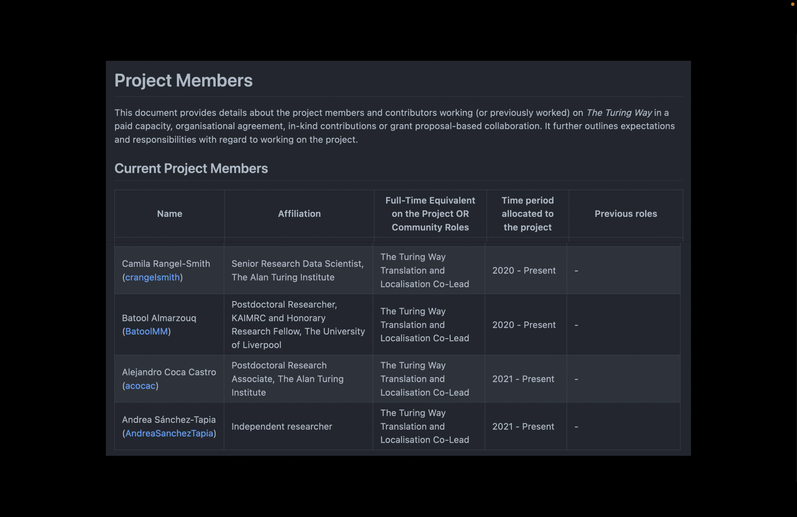
_The Ways of Working Github page provides details about the project members and contributors working (or previously worked) on The Turing Way._

Camila Rangel-Smith, Batool Almarzouq, Alejandro Coca Castro, and Andrea Sánchez-Tapia have been added as joint Co-Leads of the new Translation and Localisation team.
You can see their updated information on our [Ways of Working page](https://github.com/alan-turing-institute/the-turing-way/blob/main/ways_of_working.md) on Github.
We hope that this formalisation will enable greater recognition of the incredible work they are doing within _The Turing Way_ and more widely across the communities they lead.
You can read about the translation and localisation process in [Pull Request #2202](https://github.com/alan-turing-institute/the-turing-way/pull/2202).

## Translating _The Turing Way_

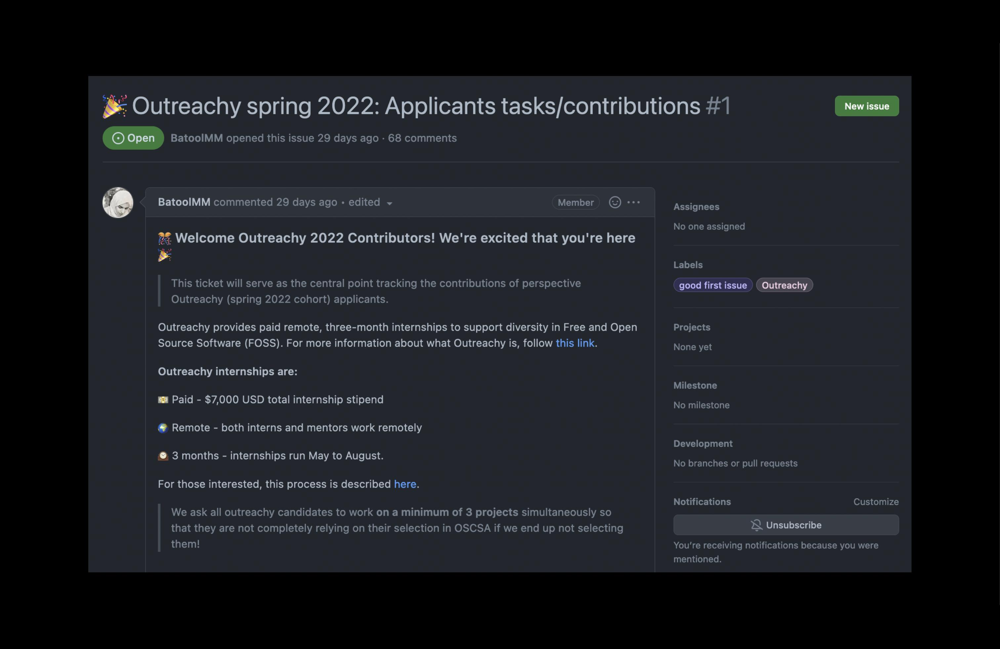
_Batool's welcome message to the 2022 Contributors to the Outreachy program, organised through Open Science Community Saudi Arabia_

Batool Almarzouq has also been working with Outreachy applicants, who will be working to translate chapters of _The Turing Way_ into Arabic.
Outreachy provides paid remote, three-month internships to support diversity in Free and Open Source Software (FOSS).
[Learn more about the Outreachy program here](https://www.outreachy.org/).
Good luck to the applicants, we can't wait to see what you'll accomplish together!

## Talks and Workshops

### AI-UK

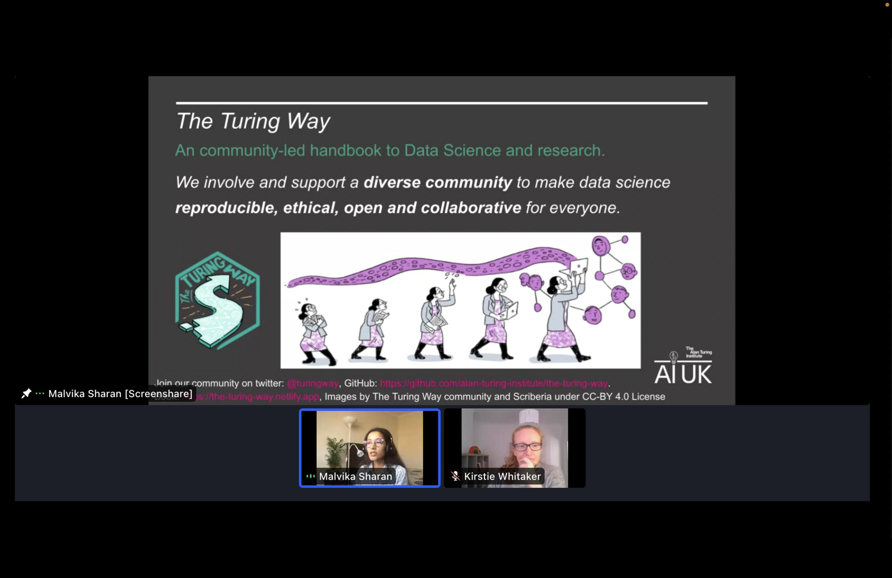
_Discussing the Turing Way, and the benefit of community-led, open research practices at AI-UK._

Kirstie Whitaker and Malvika Sharan, the co-leads of the project, spoke about the impact of _The Turing Way_ and reproducible research at [AI-UK](https://www.turing.ac.uk/ai-uk).
AI-UK is the UK's national showcase of artificial intelligence (AI) and data science research and collaboration that took place on the 22 and 23 of March. While the event wasn't recorded, [you can check out their slides here](https://zenodo.org/record/6378011).

### Collaborations Workshop

Many of our community members were at [Collaborations Workshop](https://software.ac.uk/cw22) this year, which took place from 4 April to 7 April.
Hosted by the [Software Sustainability Institute](https://software.ac.uk/), #CollabW22 brought together an interdisciplinary group of people to explore best practices and the future of research software.

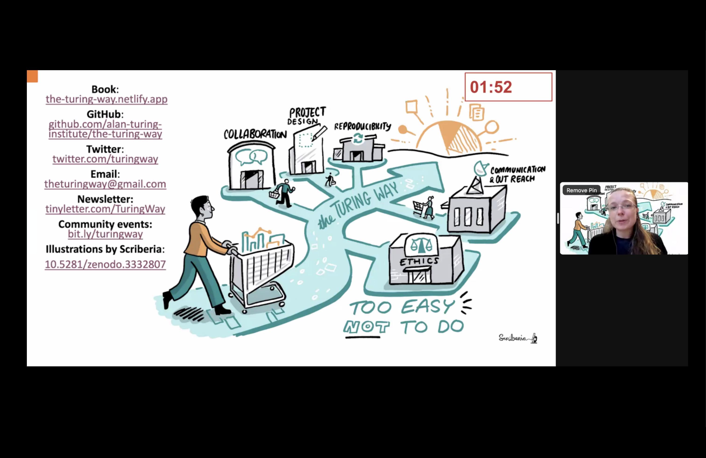
_Thank you for supporting our community, Esther!_

- Esther Plomp gave a lightning talk presentation called "The Turing Way: Reflection on the community-led development since 2019".
You can view [the slide here](https://doi.org/10.6084/m9.figshare.19461026).

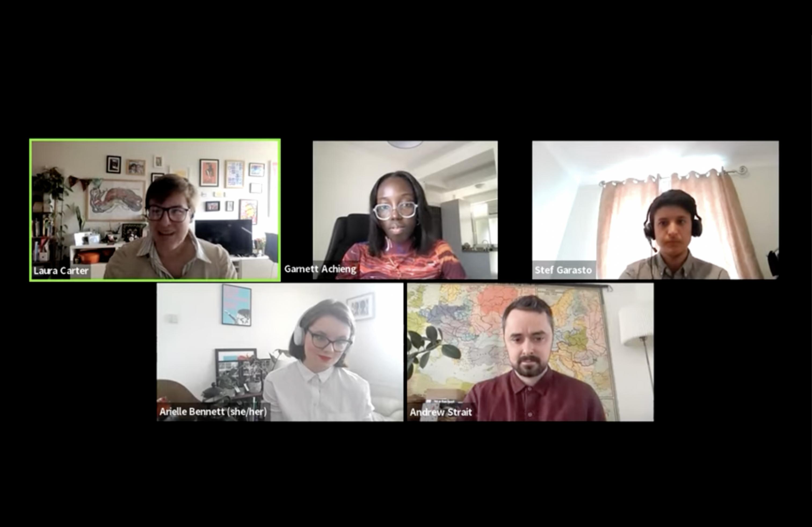
_The panel discussed the implementations of ethics in research and software, and give practical guidance to workshop participants on how ethical considerations can strengthen the work they are doing._

- Arielle Bennett joined a Panel on Ethics, chaired by Laura Carter.
Both are authors and mentors of several chapters in our [Guide for Ethical Research](https://book.the-turing-way.org/ethical-research/ethical-research.html?highlight=ethics).
[Watch the recording here](https://www.youtube.com/watch?v=AfotGso8rDI)!

_Congratulations to the participants and presenters at #CW22!_

- Achintya Rao and his team members developed a [Carpentries-style](https://carpentries.org/) lesson on R's bug tracking process, that was awarded third place during the hack day.
- Malvika Sharan and her team members developed a project idea, "Hi-Brid! Leaving no one behind in hybrid working!" that won second place during the Collaborative Idea session.
- Jez Cope, Stephan Druskat, and Anne Lee Steele were awarded third place for their idea of creating an "Interdisciplinary Glossary of Glossaries".

Many Turing Way core team members also gave talks and workshops about various projects: including Sarah Gibson, Emma Karoune and Vicky Hellon.
[Look at their slides on Figshare here](https://ssi-cw.figshare.com/Collaborations_Workshop_2022_CW22).

Congrats to you all on a great Collaborations Workshop!
Thank you to the organisers, and to Rachael Ainsworth for keeping us on schedule!

### Interview with Malvika

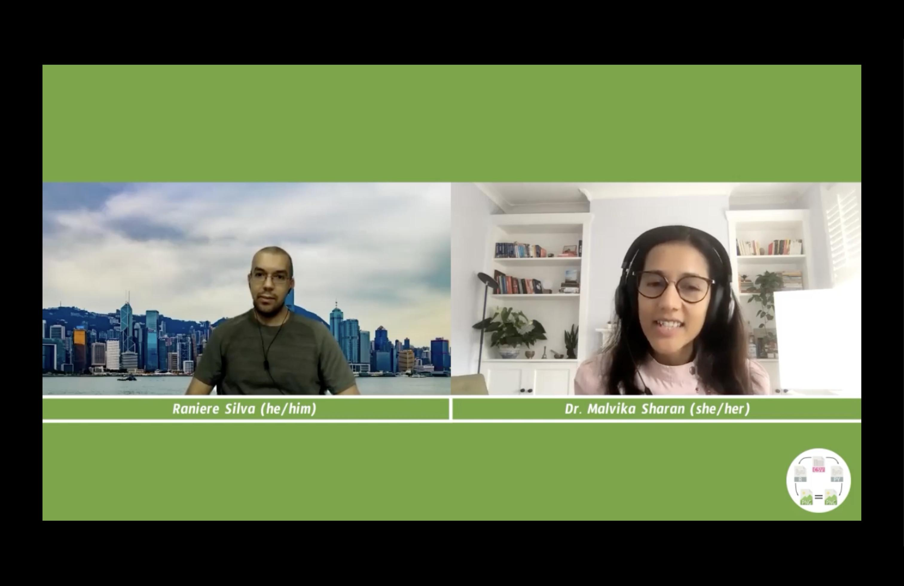
_Discussing the importance of open science and reproducibility in research._

Malvika Sharan was recently interviewed by Raniere Silva for [Reproducible Research Scout](https://gitlab.com/reproducible-research-scout), a group dedicated to computational reproducibility and related topics.
[Watch the recording here](https://www.youtube.com/watch?v=GMwRyAwnlEk)!

## Community Research

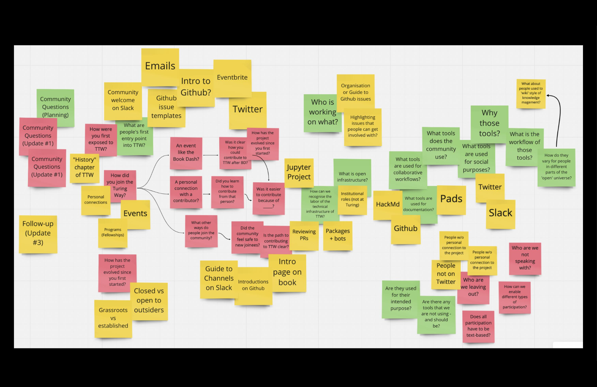
_Brainstorming the role of tools and research infrastructure within The Turing Way_

Over the past few weeks, Anne has been doing community research within _The Turing Way_, learning from contributors to the project at all stages.
She posts [weekly updates on Friday on this Github Issue](https://github.com/alan-turing-institute/the-turing-way/issues/2318).
If you'd like to get involved in the process or talk to her more about it, reach out to her directly on Slack or by [email](mailto:asteele@turing.ac.uk).
Alternatively, you can also [schedule time in her calendly](https://calendly.com/aleesteele/).

## Research on Open Governance Models

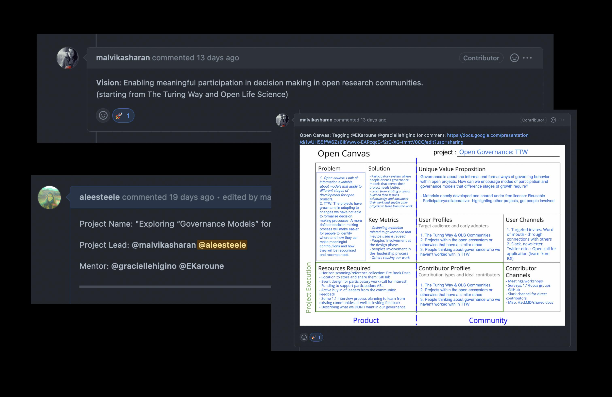
_Check out the Github issue to learn more about the research done so far on open governance models_

Malvika and Anne are also co-leading an investigation into open research governance practices in the fifth cohort of [Open Life Science](https://openlifesci.org/) (OLS-5).
This research will inform the next stage of the mature governance structure in _The Turing Way_.
We would love to involve members of our community in this research, please comment on [Pull Request #31 on OLS-5 Github](https://github.com/open-life-science/ols-5/issues/31) or reach out to us on Slack directly.

## Tweets & mentions

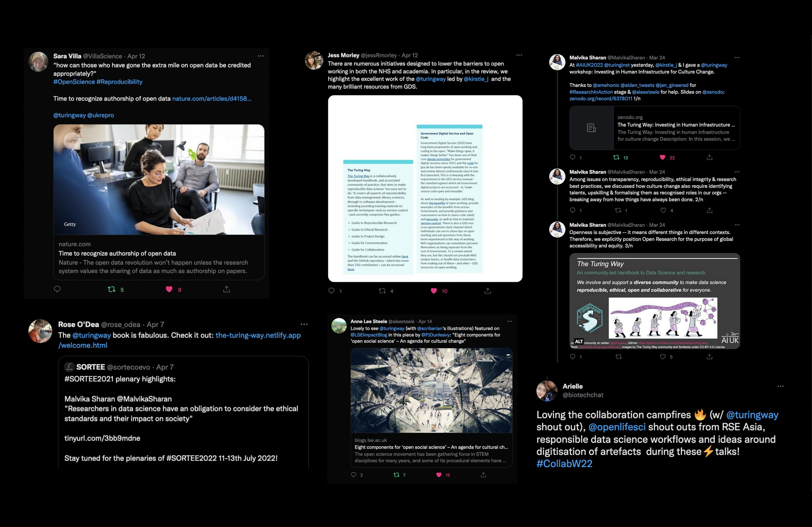
_Thanks for the shout-outs this month, reminding us that open research practices begin with the community of people that contribute to them!_

1. Tweet by Sarah Villa: https://twitter.com/VillaScience/status/1513886661708505102
2. Tweet by Jess Morley https://twitter.com/jessRmorley/status/1513833142448267272
3. Tweet by Malvika Sharan: https://twitter.com/MalvikaSharan/status/1507074809661956096
4. Tweet by Rose O'Dea: https://twitter.com/rose_odea/status/1512014446767525892
5. Tweet by Anne Lee Steele: https://twitter.com/aleesteele/status/1514553042611412992
6. Tweet by Arielle Bennett: https://twitter.com/biotechchat/status/1510942637934751744

---

## Opportunities in the Turing Orbit

### Introduction to Data Science and AI Training: Review and Illustration Sprint

⏰ Express your interest to attend the review sprint before **21 April 2022** via [this Google form](https://forms.gle/fXPZ9yPzMkqMxrdQ8).
🗓️ Program dates: Thursday, 28 and Friday, 29 April 2022 (1.5 days)

Lydia France, Federico Nanni and Malvika are developing training materials for data science for biomedical researchers: [Introduction to Data Science for Biomedical Scientists: Turing-Crick Partnership](https://github.com/alan-turing-institute/data-training-for-bioscience).
These materials cover a range of topics on data science and AI practices for senior researchers, group leaders, late PhD/Postdocs, and mid to late-career biomedical scientists in two training modules.

They are hosting a review and illustration sprint on 28 and 29 April and inviting applications from external members to review, give feedback and improve these materials for their use.
Participants can choose to attend from **five 2-hour long sessions for a collaborative review** of these training materials.
They will also work with a professional scribe from [Scriberia](https://www.scriberia.com/) to help develop accessible illustrations to include in the materials.

### Upcoming event: Tools, Practices & Systems Programme Seminar

⏰ Registration link: https://turing-uk.zoom.us/meeting/register/tJMtc-qtpzsqE9DB9M9x4_kpcnYN_e-bJP3d
🗓️ Wednesday 27 April 2022 | 12:30 - 14:00 BST (UTC+1)

**Join the Turing's Tools, Practices & Systems programme at their monthly seminar. This month, they'll be welcoming James Muldoon (author of Platform Socialism - Social Ownership in the Digital Economy).**

Tech companies have been criticised for their surveillance practices, privacy breaches and monopolistic ambitions.
Instead of inquiring as to how we could ‘fix’ Facebook, this paper explores alternatives that could replace them.
It presents the idea of platform socialism - the organisation of the digital economy through the social ownership of digital assets and democratic control over the infrastructure and systems that govern our digital lives.
This framework facilitates holistic thinking about the systemic nature of the problems we face and the need for genuine alternatives.
To develop the principles and institutional sketch of platform socialism, I draw inspiration from the writings of two early twentieth century writers: the libertarian socialist, G. D. H. Cole and the Austrian philosopher and economist Otto Neurath.
I propose new forms of participatory and decentralised governance through an ecosystem of alternative ownership models of digital platforms.
How would socially-owned and controlled apps operate in transport, food delivery and short-term accommodation? Drawing from historical examples and contemporary prototypes, platform socialism examines a variety of ways communities could reclaim ownership and control over digital platforms.

### Upcoming event: "The Practice of Digital Infrastructure"

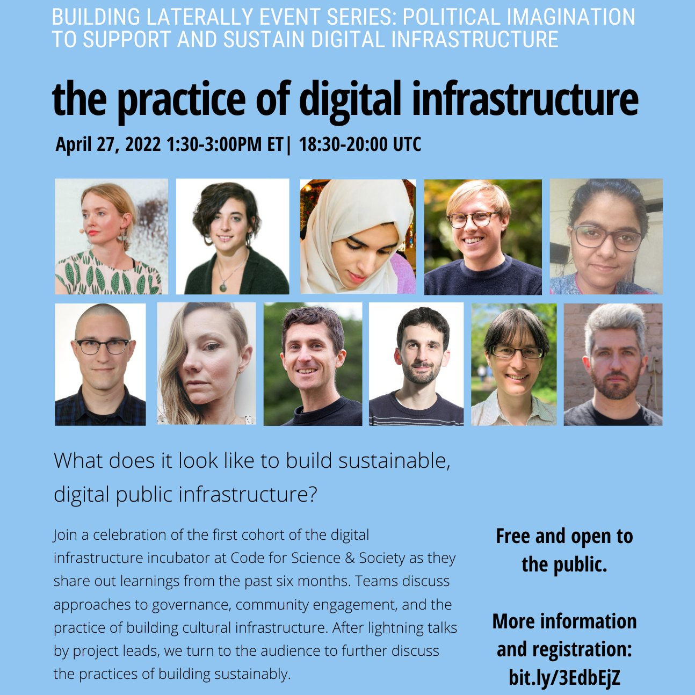

Join a celebration of the first cohort of the digital [infrastructure incubator at Code for Science & Society](https://incubator.codeforscience.org/) as they share out learnings from the past six months.
Teams open their project notebooks to discuss approaches to governance, community engagement, and the practice of building cultural infrastructure.
After lightning talks by project leads, we turn to the audience to further discuss the practices of building sustainably.

🗓️ Wednesday 27 April | 18:30 - 20:00 BST (UTC+1)
📌 Sign up on Eventbrite: https://www.eventbrite.com/e/the-practice-of-digital-infrastructure-tickets-275365083377

### Training series: Reproducibility Bootcamp at NCRM

This training series, provided by the UK Data Service, walks you through how to: make your research ready for open science, apply reproducibility to social science and other “tricky” topics, and collaborate, document and share research in diverse contexts. Each week of activity in this bootcamp will comprise a range of components, some synchronous (e.g. workshop sessions led by the instructors and delivered over Zoom) and some asynchronous (e.g. video-recorded talks, contributing to discussion boards, completing work independently/in small groups, etc).

⏰ Live calls: every Tuesday 09:45 - 12:00 BST (UTC+1)
🗓️ Applications due by Sunday, 24 April 2022

📌 For more information about the program and how to book, visit: [ncrm.ac.uk](https://www.ncrm.ac.uk/training/show.php?article=11856)

### Data Science and AI Educators' Programme

Applications are now open for **The Data Science and AI Educators' Programme** at The Alan Turing Institute. This programme takes a ‘Train the Trainer’ approach to equip educators and domain experts with pedagogical knowledge.
**Note: Applications are open to anyone (both internal and external to the Turing) with an interest in training and teaching at all levels.**

⏰ Applications due by Sunday, 24 April 2022  
🗓️ Programme dates: Monday, 16 May to Friday, 12 August 2022

📌 Full details, including how to apply, can be found on our [application page](https://www.turing.ac.uk/data-science-and-ai-educators-programme).
Please feel free to share with anyone in your network who may be interested or get in touch with the team via skills@turing.ac.uk.

### Research Software Camp: Next steps in coding

Are you thinking of attending a foundational research software course? Have you recently attended one but don’t know where to go from there? Are you an intermediate research software developer and would like to further develop your skills or train others? The Software Sustainability Institute's spring Research Software Camp: Next steps in coding will focus on improving computational and training skills and exploring existing resources out there. The Camp will be held from 16th to 27th May 2022.

🗓️ Programme dates: Monday, 16 May to Friday, 27 May 2022
📌 For more information on how to sign up, visit: https://www.software.ac.uk/RSCamp-next-steps-coding

### TPS Peer-Mentorship & Training Programme

The Turing Skills Team at the Alan Turing Institute is collaborating with the Tools, Practices, and Systems (TPS) Research Programme to launch applications for the **TPS Peer Mentorship & Training Programme** this summer!
The aim is to promote and incorporate the principles of _The Turing Way_ across our community to nurture open research design, collaboration, and community-driven interactions.
**Note: Applicants for this pilot should be affiliated with the Turing.**

⏰ Applications due by Sunday, 22 May 2022  
🗓️ Programme dates: Wednesday, 1 June – Wednesday, 27 July 2022
📌 Pre-Application Webinar and Drop-in session: Thursday, 28 April 2022 @ 12:30 BST (UTC+1), https://turing-uk.zoom.us/j/97248428609?pwd=S1NuOVhQRFg0RU91ODVlckgxZU9PUT09, Meeting ID: 972 4842 8609, Passcode: 789019
For more information about the application process, [please visit the event page](https://www.eventsforce.net/turingevents/frontend/reg/thome.csp?pageID=61990&eventID=188).
Reach out with questions or interest to training@turing.ac.uk

### UNESCO Global Call for Best Practices in Open Science

Further to the adoption of the [UNESCO Recommendation on Open Science](https://en.unesco.org/science-sustainable-future/open-science/recommendation) in November 2021, UNESCO is launching a Global Call for Best Practices in Open Science. They are aiming to collect best practices in open science at individual, institutional, national, regional and international levels with a particular focus on the [seven priority areas of action highlighted in the Recommendation](https://unesdoc.unesco.org/ark:/48223/pf0000379949/PDF/379949eng.pdf.multi#page=20). If you are involved in an open science initiative that you consider to be a good example or best practice in open science, please provide your input to the survey in English, French or Spanish, by 15 July 2022.

⏰ Submissions due in English, French or Spanish by 15 July 2022
📌 For more information about the call, visit: https://www.unesco.org/en/articles/unesco-launches-global-call-best-practices-open-science

-----

## Get involved + Connect with us!

If you are interested in joining our community, or learning more about the project, don't forget that we have our [Community Co-working calls](https://hackmd.io/@turingway/coworking-call) on Mondays, [Collaboration Cafes](https://hackmd.io/@turingway/collaboration-cafe) every first and third Wednesdays and Fireside chats monthly.

*   [About the project](https://www.turing.ac.uk/research/research-projects/turing-way-handbook-reproducible-data-science)
*   [_The Turing Way_ book](https://book.the-turing-way.org)
*   [HackMD Intro Page](https://hackmd.io/@turingway/demo-intro)
*   [GitHub repository](https://github.com/alan-turing-institute/the-turing-way)
*   [Slack Workspace](https://join.slack.com/t/theturingway/shared_invite/zt-fn608gvb-h_ZSpoA29cCdUwR~TIqpBw)
*   [Gitter Conversation](https://gitter.im/alan-turing-institute/the-turing-way)
*   [YouTube Channel](https://www.youtube.com/channel/UCPDxZv5BMzAw0mPobCbMNuA)
*   [Twitter Page](https://twitter.com/turingway)

If you'd like to contribute events or opportunities to the next newsletter, please email me at asteele@turing.ac.uk. Feel free to send me a message on Slack, or [book some time in on my calendly](calendly.com/aleesteele/) to say hello.

We'll also be experimenting with new sections and formats for the newsletter in the coming months... stay tuned for those!

_Did you miss the last newsletters?_ _Check them out [here](https://tinyletter.com/TuringWay/archive)._
