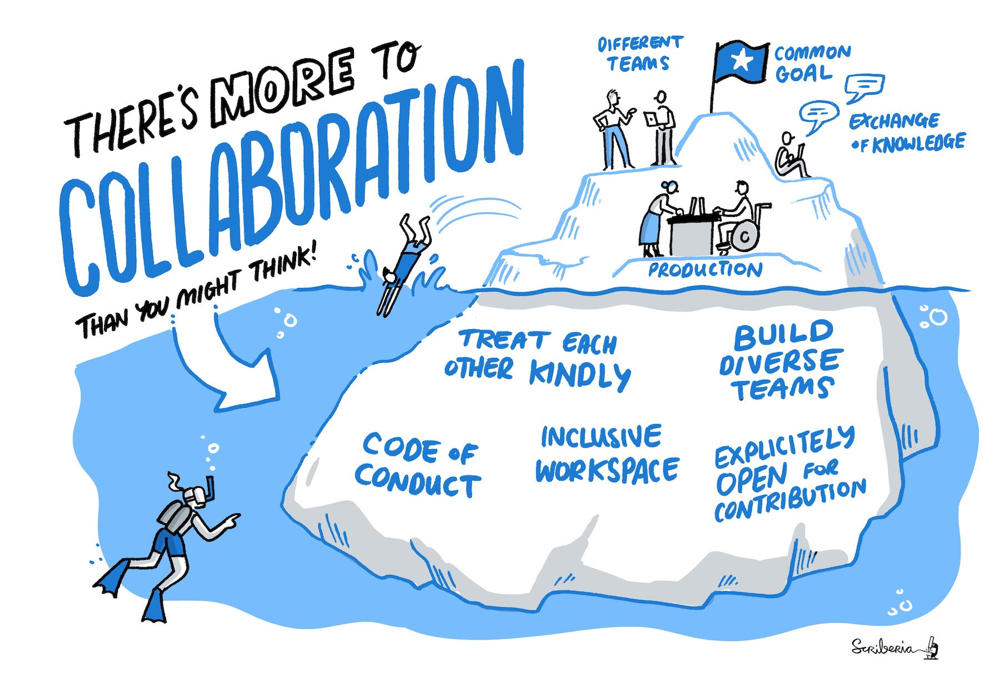
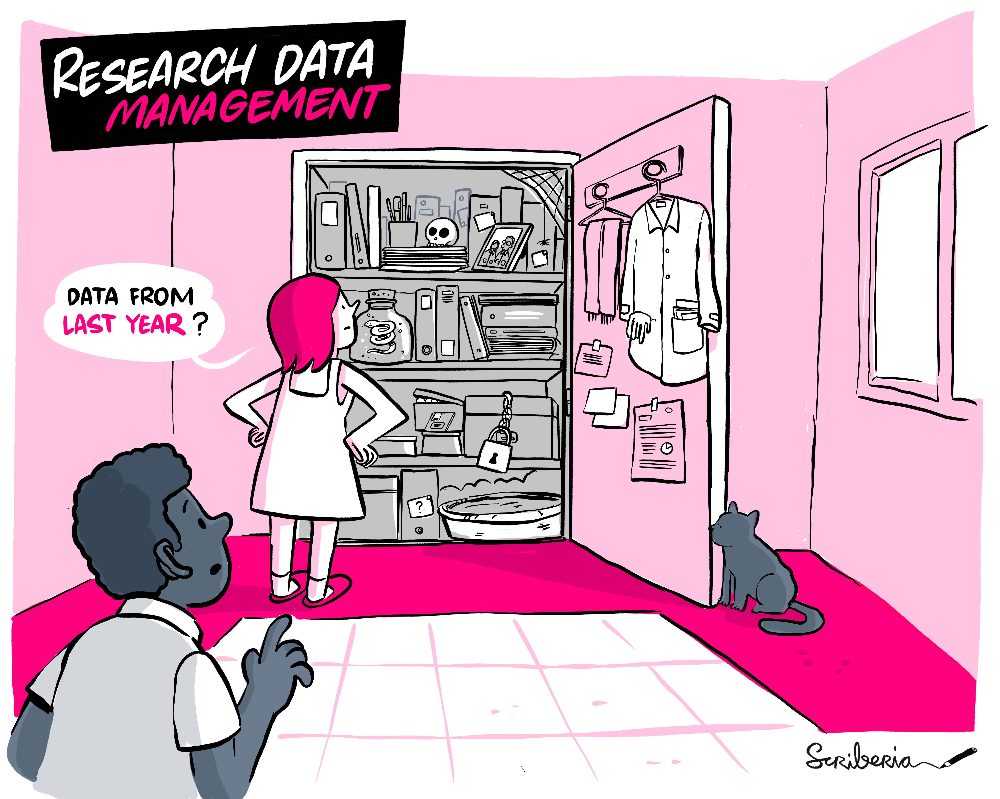
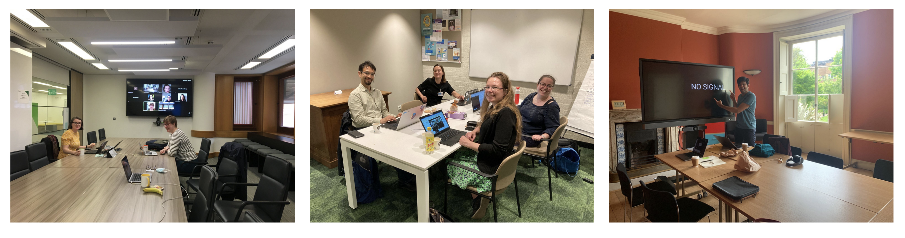
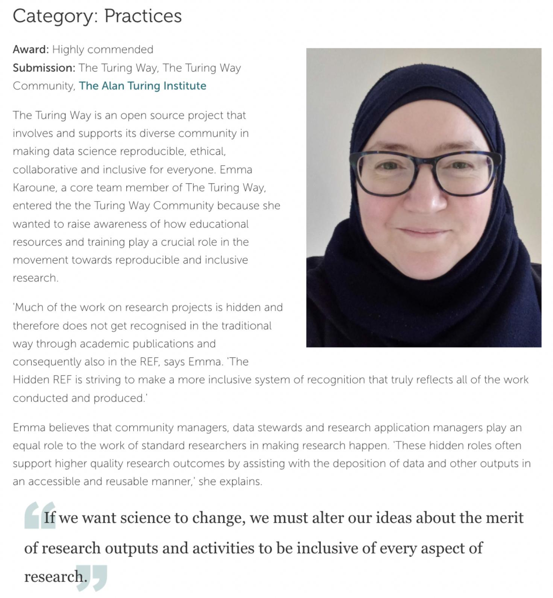
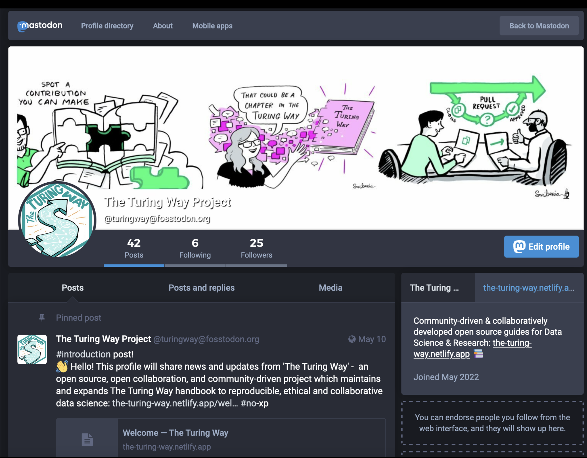
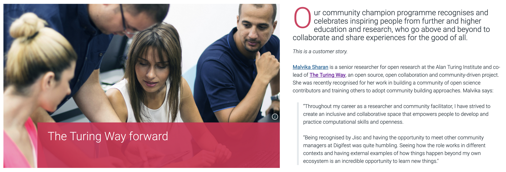
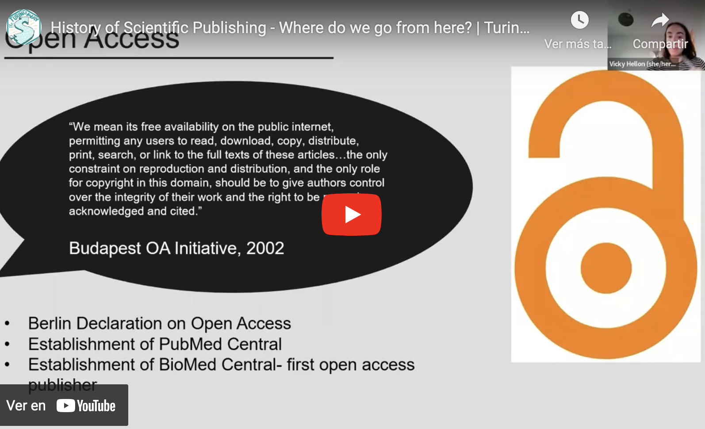
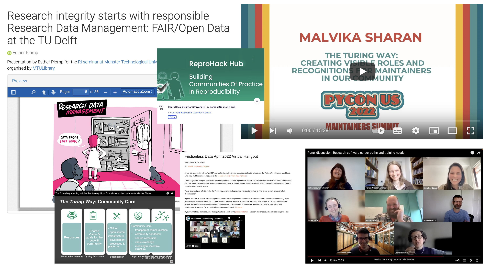
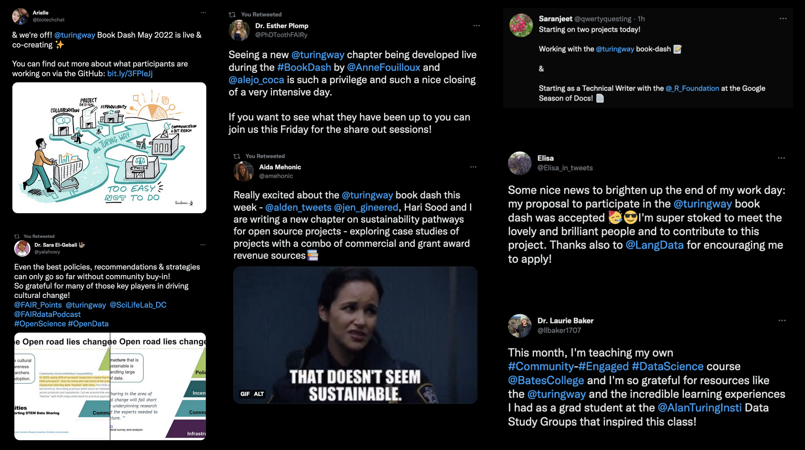

TTW Newsletter, May 2022

# Book dash is happening this week! Sign up for Community Share-out and more!

Hi everyone!

It's been another busy month within *The Turing Way* community, full of new (and ongoing) chapters, community features, and upcoming events.
This newsletter is full of updates about what we've been up to.

📚💨 Book dash is happening this week! Join us on 20 May for a public **Community Share Out and Contributors Celebration**! [Register to attend](https://www.eventbrite.co.uk/e/the-turing-way-community-share-out-and-contributor-celebrations-may-2022-tickets-323373307267)
☕ The next **Collaboration Cafe is happening this week on 1 June at 15:00 London time** (UTC+1). (See [details](https://https://hackmd.io/@turingway/collaboration-cafe)). On 15 June, we will use this space to run a workshop to create a **community response to UNESCO global call**. [See details](https://bit.ly/unesco-open-2022-workshop-ttw).

Check out 'community news' and 'opportunities in *The Turing Way* orbit' to learn more about what our community members are doing and where you can get involved.
Please also share if you have any feedback on this new newsletter format as well!

---

_Illustration by Scriberia. Used under a CC-BY 4.0 licence. DOI: [10.5281/zenodo.3332807](https://zenodo.org/record/5706310#.YoS-RmDMK58)._

# Upcoming Events

## Community Share-Out on 20 May

On 20 May 2022, the last day of Book Dash, we will host two [Community Share-Out and Contributor Celebrations Events](https://book.the-turing-way.org/community-handbook/bookdash/bookdash-events.html#community-share-outs-contributor-celebration).
This is a public event for folks interested in learning more about _The Turing Way_, seeing what recent updates have been made in the project and celebrating the incredible work of our contributors.
At the Community Share-Out, we will also release the new version of _The Turing Way_ book and give an early preview of a new set of illustrations developed during the Book Dash.
Sign up to attend one or both sessions on [Eventbrite](https://www.eventbrite.co.uk/e/the-turing-way-community-share-out-and-contributor-celebrations-may-2022-tickets-323373307267).

## Collaboration Cafes ☕

This month, **Collaboration Cafés** are being hosted on 1 June 2022.
Have a question about The Turing Way?
These calls are places for co-working, discussion, onboarding, and collaboration.
As usual, they take place from 15:00 - 17:00 London time ([see in your time zone](https://arewemeetingyet.com/London/2022-06-01/15:00)) and you can sign up on this shared HackMD: hackmd.io/@turingway/collaboration-cafe.

###  Community response to UNESCO global call for best practices in open science

On 15 June, during the Collaboration Café, we will run a workshop to gather community response to UNESCO global call for best practices in open science.
UNESCO has [launched a call](https://www.unesco.org/en/articles/unesco-launches-global-call-best-practices-open-science ) to collect best practices in open science.
*The Turing Way* invites you to join a workshop to discuss (1) best practices in Promoting innovative approaches for open science at different stages of the scientific process, and (2) romoting international and multi-stakeholder cooperation in the context of open science.
[See details](https://bit.ly/unesco-open-2022-workshop-ttw) and [sign up](https://turing-uk.zoom.us/meeting/register/tJ0uc-iorDwtH9GWcJsssAP1gyb1t6_SURip).

## Coworking Calls

**Weekly coworking calls** are hosted every Monday from 11:00 - 12:00 London time ([in your time zone](https://arewemeetingyet.com/London/2022-05-23/15:00)). These calls are accountable space for coworking on your contributions or discuss your idea for *The Turing Way*. Find the joining link on this shared HackMD: hackmd.io/@turingway/coworking-calls.

## Upcoming Fireside Chat

No Fireside chat is happening this month due to Book Dash! Stay tuned for our June Fireside chat.
Both the March event, ["Emergent Roles in Research & Technology"](https://www.youtube.com/watch?v=i3_GFRS-u-Q&t=757s), and April event, ["Enabling Inclusive Research Conferencing in the 'Post-Pandemic Era'"](https://www.youtube.com/watch?v=ImwJqo1zbMI&t=15s) have been uploaded to YouTube.

## Job Announcement: Project Manager at the Turing

The Alan Turing Institute is recruiting a Research Project Manager to join the Tools, Practices & Systems programme (which hosts *The Turing Way*).
The PM will work to embed collaborative, open, reproducible, and ethical practices across the Turing & beyond.
⏰ Applications due by Monday, 13 June 2022  ([apply here](https://cezanneondemand.intervieweb.it/turing/jobs/research_project_manager_tools_practices_and_systems_23438/en/))
📌 *For questions about the role, please contact Arielle Bennett at abennett@turing.ac.uk.*

---

# Book Dash

_Illustration by Scriberia. Used under a CC-BY 4.0 licence. DOI: [10.5281/zenodo.3332807](https://zenodo.org/record/5706310#.YoS-RmDMK58)._

## Book dash is happening now!

Book dash is happening this week!
It has been so exciting and  and community members are hard at work creating new chapters, revisiting long-held ideas, and collaborating on projects within *The Turing Way*.
Thank you for giving your time to us this week, and for supporting each others' work!
As always, Scriberia has been joining us to work on illustrations (one previewed above!).

### Contributors in Focus: Book Dash Planning Committee and participants

Thank you to the *The Turing Way* Book Dash planning committee members: Arielle Bennett, Brigitta Sipőcz, Carlos Martinez, Emma Karoune, Esther Plomp, Laura Carter, Lena Karvovskaya.
Anne Lee Steele and Malvika Sharan are supporting them in planning *The Turing Way*'s 7th book dash!

This week, we have 24 invited contributors participating in 14 online working sessions, two discussions and social events, and two community share-outs across more than four timezones.
Thank you for joining us: Aida Mehonic, Achintya Rao, Alejandro Coca-Castro, Alden Conner, Anne Fouilloux, Batool Almarzouq, Daliyah Alzeer, Ed Chalstrey, Elisa Rodenburg, Hari Sood, Iman Al Hasani, Jennifer Ding, Jim Madge, Johanna Bayer, Julien Colomb, Lena Kavovskaya, Patricia Herterich, Saranjeet Kaur, Timothy Sum Hon Mun, and Vicky Hellon.
Sign up for the Community Share-out to learn more!

As always, thank you to Scriberia as well for visualising our work, and to Adrien Liard in particular for joining us at this Book Dash!

### Bookdash hubs: Amsterdam, Bristol, and London

_Book Dashers at the London, Amsterdam, and Bristol hubs! Pictured (left to right): Arielle Bennett, Laura Carter, Carlos Martinez, Lena Karvovskaya, Esther Plomp, Elisa Rodenburg, and Achintya Rao._

This book dash, we have been piloting a hub-format in Amsterdam in the Netherlands, and both London and Bristol in the UK.
It has been an experiment in organising hybrid events across timezones, and we are interested in learning more about how we can support hybrid events to ensure enclusive participation in events like Book Dashes for our amazing community.  

The London hub is being hosted at the Alan Turing Institute.
Thank you to Lena Karvovskaya, who is hosting the Amsterdam hub at the Vrije Universiteit and to John Newby for hosting the Bristol hub at the Jean Golding Institute, University of Bristol.

---

_Illustration by Scriberia. Used under a CC-BY 4.0 licence. DOI: [10.5281/zenodo.3332807](https://zenodo.org/record/5706310#.YoS-RmDMK58)._

# Community News

## The Turing Way in HiddenREF

_Emma Karoune, featured in The HiddenREF project representing The Turing Way!_

*The Turing Way* was recently awarded as a 'highly commended' project in The Hidden REF competition, which highlights non-traditional contributions to research.
Emma Karoune, core team member of The Turing Way was invited to give a short interview about the project, and you can [read the feature here](https://www.emeraldgrouppublishing.com/news-and-press-releases/progress-science-depends-a-team?utm_source=twitter&utm_medium=social&utm_campaign=bnd_HiddenRefBlog_existing_20220426).
See the list of incredible winners for each category on the [HiddenREF website](https://hidden-ref.org/).
Thank you for representing our community, Emma!

## *The Turing Way* is in the Fediverse!

_The Fediverse is a common name for federated social networks that run on free/open software on a number of different servers across the world. [Source](https://fediverse.party/en/fediverse/)_

Thank you to Danny Garcide for creating a profile on a Mastodon instance (called Fosstodon - dedicated to Free & Open Source Software) for *The Turing Way*.
Mastodon is similar to Twitter, but is both open source and decentralised.
Learn more about [Mastodon](https://fosstodon.org/@turingway) here, and follow us at: https://fosstodon.org/@turingway.

For now, we've set up our profile to mirror our Twitter activity (with the help of the open source tool: http://moa.party) and we're working out how we want to manage it going forwards.
If you have ideas, let us know!

## *The Turing Way* Forward Featured on JISC

_JISC is one of the UK's expert bodies for digital technology and digital resources in both higher and further education as well as research._

Malvika Sharan, co-lead of *The Turing Way*, was recently named a "Community Champion" by JISC for her work in building a community of open science contributors and training others to adopt community building approaches.
JISC is one of the UK's expert bodies for digital technology and digital resources in both higher and further education as well as research.
They published as article on *The Turing Way* highlighting how open research practices and community building in the project is helping address accessibility and democratisation of knowledge in data science.
[Read the article here](https://www.jisc.ac.uk/membership/stories/the-turing-way-forward).

## Chapter Updates

### Open Access Chapter

_Vicky's talk was first presented at the Turing's "Lunch and Learn" Series on 4 May 2022._

Core contributor Vicky Hellon's talk, titled "History of scientific publishing, and where do we go from here?", was recently added to the [chapter on Open Access](https://book.the-turing-way.org/reproducible-research/open/open-access.html?highlight=open%20access%20vicky), located in the Guide for Reproducible Research.

### Fireside Chat Chapter

_Illustration by Scriberia. Used under a CC-BY 4.0 licence. DOI: [10.5281/zenodo.3332807](https://zenodo.org/record/5706310#.YoS-RmDMK58)._

A new section has been added to the Community Handbook on [Fireside Chats](https://book.the-turing-way.org/community-handbook/fireside-chat.html?highlight=fireside%20chat).
We hope this section will be useful for others planning similar events, and apply lessons we have learned along the way.

In the future, we'd like to add more information about each Fireside chat hosted so far, to ensure that these conversations can live beyond the events themselves. We hope that they can provide ideas for best practices and shared experiences for others interested in similar topics.

If you'd like to get involved in that process, join the [Issue](https://github.com/alan-turing-institute/the-turing-way/issues/2344) on Github.

## Talks and Workshops

_A busy month of presentations, workshops, and conferences within the community!_

- **Emma Karoune** gave a talk about *The Turing Way* and reproducible research at Durham University's Reprohack event on 19 May. [DOI: 10.5281/zenodo.6533251](https://doi.org/10.5281/zenodo.6533251)
- **Malvika Sharan** joined a Roundtable Discussion on "The Participation Paradox In the Politics of AI" hosted by The [Wallenberg AI, Autonomous Systems and Software Program – Humanities and Society](https://wasp-hs.org/events/challenges-and-opportunities-of-regulating-ai/) on 19 May.
- **Esther Plomp** gave a talk on "Research Integrity @ MTU - From Idea to Dissemination" at Munster Technological University on 18 May. Slides: [DOI: 10.5281/zenodo.6558216](https://zenodo.org/record/6558216#.YoVCSGDML9s).
- **Anne Lee Steele** joined the Software Sustainability Institute's "Research Software Camp: Next steps in coding" event as a panelists on 16 May. [Watch the recording here](https://www.youtube.com/watch?v=NDM3qk3laPc).
- **Vicky Hellon** spoke about Open Access publishing at a "Lunch and Learn" Seminar at the Alan Turing Institute on 4 May. Slides: [DOI: 10.5281/zenodo.6516871](https://zenodo.org/record/6516871#.YoYQx2DMJjM)
- **Malvika Sharan** spoke about "Creating visible roles and recognitions for maintainers in our community" at PyCon US on 29 April. [Watch the recording here](https://www.youtube.com/watch?v=_k7rg_3qNq4). Slides: [DOI:  10.5281/zenodo.6475654](https://zenodo.org/record/6475654#.YoYUgGDML9s)
- **Anne Lee Steele** joined the Frictionless Data Community Call to speak about *The Turing Way* and open science principles on 28 April. [Watch the recording here](https://frictionlessdata.io/blog/2022/05/05/april-community-call/) and read the blog [here](https://frictionlessdata.io/blog/2022/05/05/april-community-call/).

## Ongoing projects

### Open Governance Models Project

Malvika and Anne are continuing their investigation into open governance practices, which is being developed through the [Open Life Science program](https://openlifesci.org/).
If you'd like to get involved, please comment on their project [Pull Request on Github](https://github.com/open-life-science/ols-5/issues/31), email them at msharan@turing.ac.uk or asteele@turing.ac.uk, or reach out to them on Slack directly.

### Community Research Updates

Anne's community research within The Turing Way forges on! She posts [weekly updates on Friday on this Github Issue](https://github.com/alan-turing-institute/the-turing-way/issues/2318).
If you'd like to get involved in the process or talk to her more about it, reach out to her directly on Slack or by [email](mailto:asteele@turing.ac.uk).

## Tweets & mentions

1. Arielle Bennett: https://twitter.com/biotechchat/status/1526112952486703104
2. Sara El-Gebali: https://twitter.com/yalahowy/status/1523629646117761024
4. Esther Plomp: https://twitter.com/PhDToothFAIRy/status/1526984416433786880
5. Aida Mehonic: https://twitter.com/amehonic/status/1526322157386665985
6. Saranjeet Kaur: https://twitter.com/qwertyquesting/status/1526126435903340549
7. Elisa Rodenburg: https://twitter.com/Elisa_in_tweets/status/1521877919563497472
8. Laurie Baker: https://twitter.com/llbaker1707/status/1521806855793782787

---

# In the Turing Orbit

## Opportunities
- **eLife: Early-Career Advisory Group**
    - ⏰ Applications due by Friday, 24 May Tuesday 2022 ([apply here](https://crm.elifesciences.org/crm/ECAGcandidate2022))
- **Pollicy: Director of Research**
    - ⏰ Applications due by Tuesday, 31 May 2022 [(apply here)](https://pollicy.org/events/director-of-research/)
    - 📌 _Note: Candidates must be located +3 hours or -3 hours of East African Time zone._
- **Code for Science & Society: Operations Coordinator**
    - ⏰ Applications due by Tuesday, 24 May 2022  
    - 📌 Learn more about the role and how to apply [on the CS&S website](https://codeforscience.org/jobs/operations-coordinator-people/)
- **Quantsight: Open Source Software Developer Advocate**
    - ⏰ Applications due by Tuesday, 24 May 2022  [(apply here)](https://boards.greenhouse.io/quansight/jobs/4001517005?t=6c3175585us)
- **A4AI: Sustainable Access Fellowship**
    - ⏰ Applications due by Tuesday, 31 May 2022  
    - 📌 More information about the application process on the [A4AI website](https://a4ai.org/get-involved/careers/)
    - *Note: Candidates can be located anywhere in the world.*
- **Carpentries: Lesson Maintainer**
    - ⏰ Applications due by Tuesday, 24 May 2022 [(apply here)](https://carpentries.org/blog/2022/05/maintainer-application/)
- **Correlation One: Data Science for All / Women Fellowship**
    - ⏰ Applications due by Tuesday, 31 May 2022 [(apply here)](https://www.correlation-one.com/data-science-for-all-women?utm_source=referral&utm_medium=direct&utm_campaign=ds4a_tena)

## Calls for Submissions
- **Alan Turing Institute: Online Training call**
    - ⏰ Applications due by Thursday, 26 May 2022 [(apply here)](https://www.turing.ac.uk/funding-call-online-learning-courses-responsible-ai)
    - Reach out with questions or interest to training@turing.ac.uk
    - 📌 *Note: Applications are open to any researcher or practitioner affiliated with a UK-based university, organisation or research institution.*
- **UCL: Open Source Software Sustainability Funding Call**
    - ⏰ Applications due by Tuesday, 14 June 2022  [(learn more here)](https://www.ucl.ac.uk/advanced-research-computing/research/funding-calls/open-source-software-sustainability-funding-call)
- **UNESCO: Global Call for Best Practices in Open Science**
    - ⏰ Applications due by Friday, 15 July 2022  [(learn more here)](https://en.unesco.org/feedback/unescos-global-call-best-practices-open-science)
- **CarpentryCon**
    - ⏰ Applications due by Sunday, 22 May 2022  [(learn more here)](https://www.eventsforce.net/turingevents/frontend/reg/thome.csp?pageID=61990&eventID=188)
    - 🗓️ Programme dates: Wednesday, 1 June – Wednesday, 27 July 2022

## Upcoming Events and Workshops
- **Software Sustainability Institute: Empowering communities with open principles workshop**
    - 🗓️ Monday, 23 May 2022 [(tickets on Eventbrite)](https://eventbrite.co.uk/e/empowering-communities-with-open-principles-tickets-328167687387?aff=odeimcmailchimp&mc_cid=1db97e1a1b&mc_eid=6d43989b19)
- **Bristol Data Week**
    - 🗓️ Showcase dates: Monday, 13 - Friday, 17 June 2022 [(book a place here)](http://www.bristol.ac.uk/golding/get-involved/data-week/)

For more events, subscribe to the [Open Research Calendar](https://openresearchcalendar.org/).

-----

## Get involved + Connect with us!

If you are interested in joining our community, or learning more about the project, don't forget that we have our [Community Co-working calls](https://hackmd.io/@turingway/coworking-call) on Mondays, [Collaboration Cafes](https://hackmd.io/@turingway/collaboration-cafe) every first and third Wednesdays and Fireside chats monthly.

*   [About the project](https://www.turing.ac.uk/research/research-projects/turing-way-handbook-reproducible-data-science)
*   [_The Turing Way_ book](https://book.the-turing-way.org)
*   [HackMD Intro Page](https://hackmd.io/@turingway/demo-intro)
*   [GitHub repository](https://github.com/alan-turing-institute/the-turing-way)
*   [Slack Workspace](https://join.slack.com/t/theturingway/shared_invite/zt-fn608gvb-h_ZSpoA29cCdUwR~TIqpBw)
*   [Mastodon profile](https://scholar.social/web/@turingway@fosstodon.org)
*   [Gitter Conversation](https://gitter.im/alan-turing-institute/the-turing-way)
*   [YouTube Channel](https://www.youtube.com/channel/UCPDxZv5BMzAw0mPobCbMNuA)
*   [Twitter Page](https://twitter.com/turingway)

If you'd like to contribute to the next newsletter, please email Anne Lee Steele at asteele@turing.ac.uk! Feel free to send me a message on Slack, or [book some time in on my calendly](calendly.com/aleesteele/) to say hello.

We'll also be experimenting with new sections and formats for the newsletter in the coming months... stay tuned for those!

_Did you miss the last newsletters?_ _Check them out [here](https://tinyletter.com/TuringWay/archive)._
