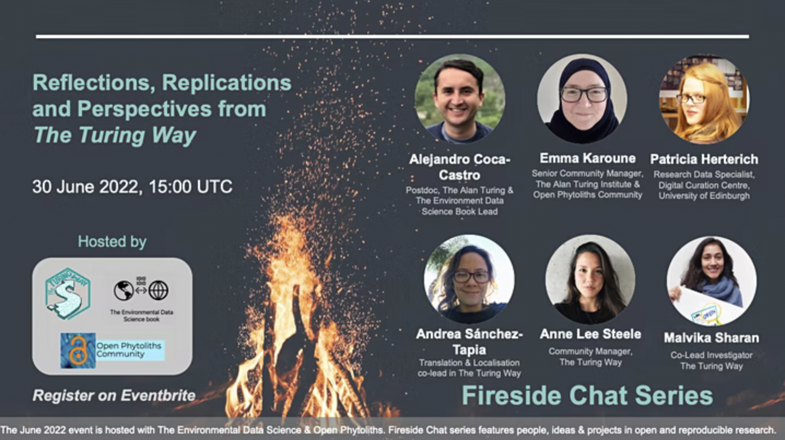
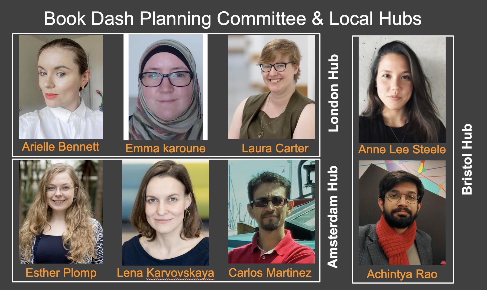
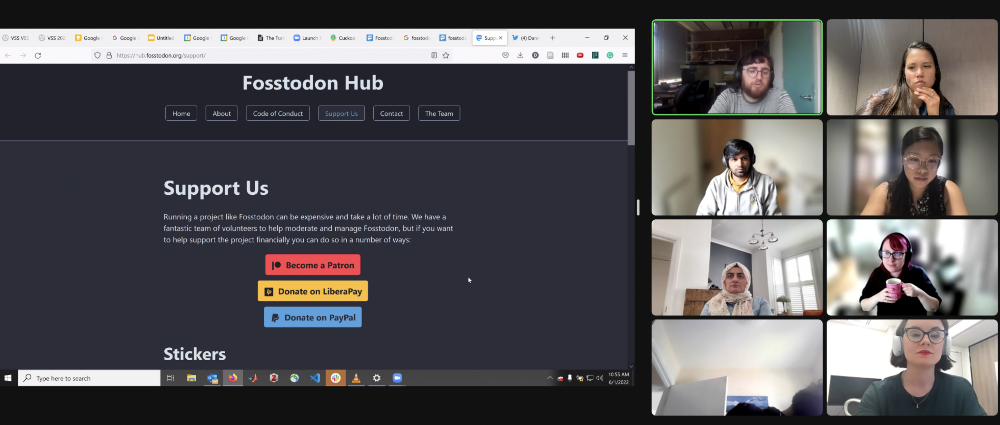
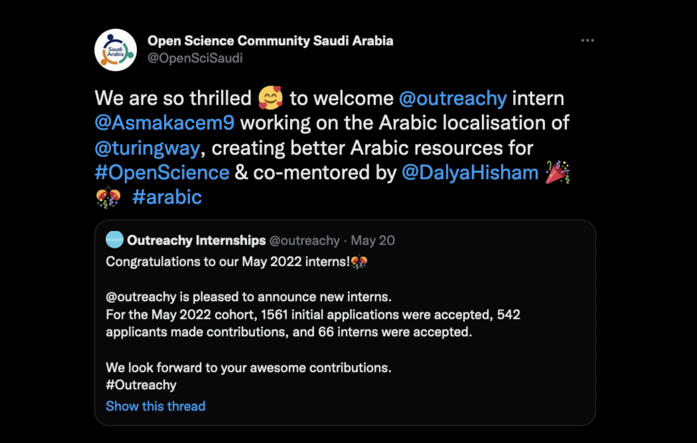
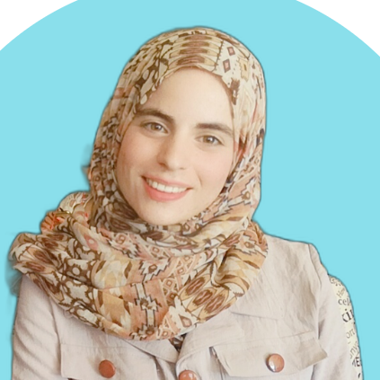
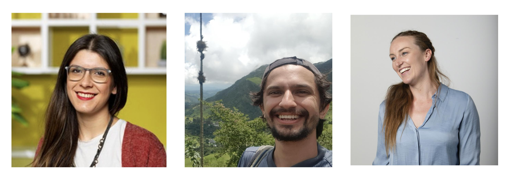
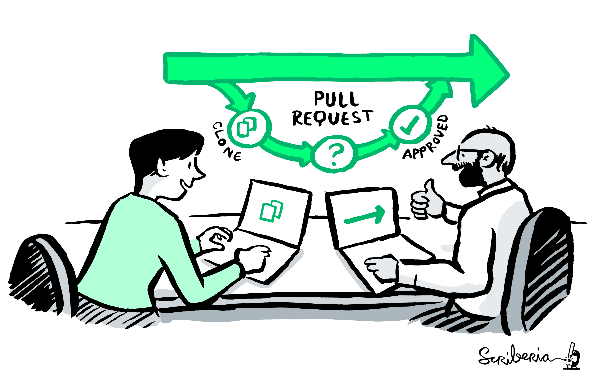

The Turing Way Newsletter: 21 June 2022

# Join our June Fireside Chat, Catch up on Community Share-outs and other updates from *The Turing Way* community

Hi everyone,

☀️ Happy June!☀️ Does anyone else feel like time has sped up?! We're starting a few new efforts within *The Turing Way* this month (which is Summer here in the UK!), and this newsletter is full of all sorts of updates from our community.

* 🔥 Tune in to our upcoming **Fireside Chat on 30 June at 15:00-16:00 UTC** - we will be speaking with four members of our community about their work and how they collaborate on the project.
* ☕ Join our next **Collaboration Cafe on 6 July from 14:00-16:00 UTC**.
* 🌱 Check out the **Community News** section to learn more about what we have been up to this month!
* 💼 **Opportunities in *The Turing Way* Orbit** has roles, events, and calls for submissions that might be of interest.

If you're interested in keeping up with the community in real time, don't forget that you can always join our [Slack workspace](https://tinyurl.com/jointuringwayslack) or follow the project on [Twitter](https://twitter.com/turingway).

---

_Illustration by Scriberia. Used under a CC-BY 4.0 licence. DOI: [10.5281/zenodo.3332807](https://zenodo.org/record/5706310#.YoS-RmDMK58)._

## Upcoming Events

### Upcoming Fireside Chat 🔥

This June, we're hosting our Fireside Chat on **Reflections, Replications and Perspectives from *The Turing Way*" on Thursday 30 June, 15:00-16:00 UTC** ([see in your time zone](https://arewemeetingyet.com/London/2022-06-30/16:00)).
Chaired by Malvika Sharan and Anne Lee Steele, this panel will feature insights from **Patricia Herterich, Emma Karoune, Andrea Sánchez-Tapia and Alejandro Coca-Castro**.
These individuals take on different roles in *The Turing Way* and more broadly in data science communities that promote best practices for open, reproducible and inclusive research.
Join us, and [sign up on Eventbrite here](https://www.eventbrite.co.uk/e/reflections-replications-and-perspectives-from-the-turing-way-tickets-368582268487).

We also have some exciting conversations coming up in July and August - stay on the lookout for details!

### Community Events

As usual, we have several recurring community calls happening this month.
Don't forget: **all are welcome to these calls, no sign-up is needed!**

#### Collaboration Cafes ☕

This month, **Collaboration Cafes** are being hosted on 6 and 20 July 2022.
As always, these calls are places for co-working, discussion, onboarding, and collaboration.
They take place from 14:00 - 16:00 UTC ([see in your time zone](https://arewemeetingyet.com/London/2022-06-15/15:00)).
Learn more in this shared HackMD: hackmd.io/@turingway/collaboration-cafe.

#### Coworking Calls 💻🏡

**Weekly coworking calls** are hosted every Monday from 11:00 - 12:00 London time ([in your time zone](https://arewemeetingyet.com/London/2022-06-23/15:00)).
These calls are accountable spaces for coworking on your contributions or discussing your idea for *The Turing Way*.
Find the joining link on this shared HackMD: hackmd.io/@turingway/coworking-calls.

#### Translation and Localisation Weekly Meetings 💻🏡

The Translation and Localisation team hosts weekly open calls at 16:00 BST ([in your time zone](https://arewemeetingyet.com/London/2022-06-21/16:00)).
These calls are for co-working on translation and localisation efforts across several different languages, and for learning more about the work of the team.
Welcome to Abdulrahman Dallak, Abdulrahman Alswaji, Jafsia Elisee, Melissa, and Pamela for joining the team's translation efforts in Arabic, French, and Spanish!
For more information, join the #translation channel on [Slack](https://tinyurl.com/jointuringwayslack), and this [HackMD](https://hackmd.io/@1PPG0ptkTeW_qYfRy5S42Q/HJjYITE_c/edit).

### Open Life Science Training and Mentoring: Applications Open!

Open Life Science (OLS) is a 16-week mentoring and training program that upskills individuals in open and reproducible research and empowers them to become open science ambassadors in their communities.
Following five successful cohorts, supporting 147 projects and 251 project leads, the sixth cohort, OLS-6, is open for application until July 7, 2022.
Please see the OLS website (https://openlifesci.org) for details.

We collaborate with OLS, under the partnership name [OLS for Turing](https://openlifesci.org/ols-6#collaborators) and provide a unique opportunity for our community members to integrate best practices in new or ongoing projects within and outside *The Turing Way*.
OLS offers microgrants to all participants to ensure that they can equitably participate in the program (see the [promotion pack](https://docs.google.com/document/d/e/2PACX-1vQHmvjgJwKLUu_SLhGBwzK_8y_TNXROOVJgUTM8s9RX9h_sxQQEvIy-faITVmboVVsK8YfG8etwJcne/pub) for details).

---

_Illustration by Scriberia showing community as garden and members as gardeners. Used under a CC-BY 4.0 licence. DOI: [10.5281/zenodo.3332807](https://zenodo.org/record/5706310#.YoS-RmDMK58)._

## Community News

### Book Dash Report

_Thank you to the Book Dash Planning Committee (left to right), Arielle Bennett, Emma Karoune, Laura Carter, Esther Plomp, Lena Karvovskaya, and Carlos Martinez, who also hosted local hubs in London and Amesterdam. Thanks to Anne Lee-Steele and Achintya Rao, who hosted a local hub in Bristol!_

As always, it was a busy and beautiful week for Book Dash attendees!
We had 29 participants across 5 time zones, who collaborated and worked on many new and ongoing projects, details for which are shared in our [Book Dash Report](https://hackmd.io/@turingway/bookdash-may2022).

Book Dashes have become important for creating space for our community to come together to work on chapters, collaborate with others, and connect from across the world.
We know that attending synchronous events across time zones may not always be possible for everyone, and hence, are so grateful for the time and care you put into your contributions.

### Community Share-outs

_Screenshot of Community Share-out 1!_

On 20 May, we hosted two Community Share-out and Contributor Celebrations events.
These sessions were beautiful spaces, full of people sharing their work and accomplishments during Book Dash (our bi-annual [contributor event](https://book.the-turing-way.org/community-handbook/bookdash.html)), and invited others to collaborate.

Thank you to Aida Mehonic, Alejandro Coca-Castro, Andrea Sánchez-Tapia, Anne-Claire Fouilloux, Arielle Bennett, Batool Almarzouq, Emma Karoune, Esther Plomp, Florencia D’Andrea, Georgia Aitkenhead, Hari Sood, Iman Al Hasani, Jennifer Ding, Jim Madge, Johanna Bayer, Laura Carter, Marta Mangiarulo, Patricia Herterich, Saranjeet Kaur Bhogal, Stephanie van de Sandt, and Timothy Sum Hon Mun for attending, for sharing your work, and being a part of our beautiful community. :heart:

For more about what people got up to throughout the week (it was a lot!), check out this [Twitter thread](https://twitter.com/turingway/status/1527603875901063168).
Anne also shared a quick update on community research (slides available here: [DOI:10.5281/zenodo.6620832](https://zenodo.org/record/6620832#.YqhWYJDMKUs)).

_Screenshot of Community Share-out 2!_

### Learning about the Fediverse

_Thank you to Danny Garside for showing us around Mastodon!_

Last month at Collaboration Cafe, Danny created our profile on a Mastodon instance (called Fosstodon - dedicated to Free & Open Source Software).
For more information about our new profile, check out this [Twitter thread](https://twitter.com/turingway/status/1524052987542487042).
Follow us at: https://fosstodon.org/@turingway, and [find other community members on this HackMD](https://hackmd.io/@jezcope/SJPs7q8Hq/edit).
Thanks to Jez Cope for compiling this list!
To stay up to date with upcoming events, join our Slack or subscribe to the program calendar.

## Localisation of *The Turing Way* Through the Outreachy program

_Congratulations to Asma!_

Congratulations to [Asma Kacem](https://asmakacem.me/), who will be joining the Open Science Community in Saudi Arabia to translate chapters of *The Turing Way* into Arabic, and develop a glossary for key terms in open science.
Asma will be co-mentored by Dalya Hisham, with the program coordinated and led by Batool Almarzouq throughout this summer.
You can learn more about the [Outreachy program here](https://www.outreachy.org/).

✨ **Meet Asma Kacem** ✨

> [Asma Kacem](https://asmakacem.me/) is an undergradute student from Tunisia studying Technology in Computer Science and Engineering. You can read about her experience in [her 1st blog post](https://oscsa-en-blog.netlify.app/posts/asmaa-intro/).

Localisation of *The Turing Way* resource in Arabic is an incredible initiative that we are so grateful for, and glad to see Outreachy's support for it.

## Community-Led Response to UNESCO's Call Open Science

*The Turing Way*, Invest in Open Infrastructure (IOI) and Open Life Science are collaborating on a series of workshops to collect best practices in open science in response to UNESCO's [global call](https://www.unesco.org/en/articles/unesco-launches-global-call-best-practices-open-science).  

On 15 June during Collaboration Cafe, Arielle Bennett and Malvika Sharan ran a workshop to gather community responses from *The Turing Way* community. The next call, organised by Open Life Science, will run on 22 June. Please join!

[See details](https://bit.ly/unesco-open-2022-workshop-ttw) and [sign up for the next call on 22 June here](https://bit.ly/unesco-open-2022-workshop-ols). Recommendations are due by 15 July 2022.

## Contributors in Focus: New Organising Team Members!

_Welcome to Eirini, Hari and Sophia!_

Please welcome Hari Sood, Sophia Batchelor, and Eirini Zormpa to the organising team of *The Turing Way*.
They recently joined the Community Management and Research Application Management team within the Tools, Practices and Systems Research Programme at the Alan Turing Institute.
They will join several volunteer and staff members in *The Turing Way* core team (see [Ways of Working](https://github.com/alan-turing-institute/the-turing-way/blob/main/ways_of_working.md) for the full list).
- Hari Sood is a Research Application Manager with the [Data Safe Haven Project](https://www.turing.ac.uk/research/research-projects/data-safe-havens-cloud)
- Sophia Batchelor is a Community Manager for the [AI for multiple long-term conditions: Research Support Facility](https://www.turing.ac.uk/research/research-projects/ai-multiple-long-term-conditions-research-support-facility) project, focused on Patient and Public Involvement and Engagement
- Eirini Zormpa is also a Community Manager within the [AIM-RSF project](https://www.turing.ac.uk/research/research-projects/ai-multiple-long-term-conditions-research-support-facility), focused on Open Collaboration

They will work to embed *The Turing Way* within their respective projects and bring back their learnings to the community.
You can connect with them in our Slack workspace!

## Talks and Workshops

_Thank you for representing The Turing Way community in these public spaces!_

- **Batool Almarzouq**, **Emma Karoune**, and **Malvika Sharan** gave a workshop about contextualisation of open science principles and reproducibility in research more broadly at RightsCon on 6 June. Slides: [DOI: 10.5281/zenodo.6627260](https://zenodo.org/record/6627260)
- **Malvika Sharan** gave a keynote on digital commons and community practices in open science, sharing insights from *The Turing Way* at the Open Science Conference hosted by Concordia University on 27 May. Slides: [DOI:10.5281/zenodo.6587260](https://zenodo.org/record/6587260#.YqnSBJDMLVs).
- Malvika was also invited as a panel speaker at the [NeIC 2022 - Nordic Models for Open Science Collaboration](https://indico.neic.no/event/204/timetable/#20220531.detailed) on 31 May, where she spoke about open science in data management and global collaboration.
- **Vicky Hellon** and **Anne Lee Steele** gave a talk about *The Turing Way* and reproducible practices in science at the King's College Institute for Artificial Intelligence on 31 May. Slides: [DOI: 10.5281/zenodo.6596452](https://zenodo.org/record/6596452#.YqcyC5DMKqU)

## Chapters and Collaborations in Progress

_Join us on Github!_

As always, feel free to explore issues and Pull Requests to collaborate with others on ongoing projects.
There are plenty of ongoing chapters and projects within the project, here are a few:

👉 **Ideas for Discussion:** Join in on the discussion for a new section on Software Management Plans ([Issue #2419](https://github.com/alan-turing-institute/the-turing-way/issues/2419)) or work with others on our emerging chapter on Open Infrastructure ([Issue #2337](https://github.com/alan-turing-institute/the-turing-way/issues/2337))
👉 **Good first issue:** Help us to summarise the fireside chats in the Community Handbook ([Issue #2344](https://github.com/alan-turing-institute/the-turing-way/issues/2344)) fix a broken link on our BinderHub page ([Issue #2296](https://github.com/alan-turing-institute/the-turing-way/issues/2296))
👉 **Ongoing chapters:** Help include qualitative research practices in *The Turing Way* Guide for Reproducible Research ([Issue #2386](https://github.com/alan-turing-institute/the-turing-way/issues/2386))

Have an idea for collaborations or a chapter? Connect with us on [Slack](https://tinyurl.com/jointuringwayslack), at a community call, or comment directly on an issue or PR!

## Ongoing Projects and Invitations to Collaborate

### First Core/Organising Team meeting

We hosted our first organisational team meeting on Friday, 10 June with 20 volunteers and staff members who serve as members of *The Turing Way* Core Team. Governance has been an ongoing topic within the community for a long time.
This meeting was a way for us to communicate and build accountability for the open, decentralised and equitable decision-making processes we would like to establish for the long-term sustainability and respectful co-creation in *The Turing Way*.

Malvika and Anne have been documenting this work through the [Open Life Science](https://openlifesci.org/) program, as documented on this [Pull Request on Github](https://github.com/open-life-science/ols-5/issues/31).

### Mini Working Group: Communications

From June through August, we will be piloting a small working group to gather feedback to improve *The Turing Way* Slack workspace and other communication channels.
This group is open to both new and long-term members of the project.
If you are interested in joining this group, please fill out this [Google Form](https://forms.gle/kTu5rM1jCxhXrckG8).

### Community Research Updates

Anne posts [regular updates on this Github Issue](https://github.com/alan-turing-institute/the-turing-way/issues/2318).
If you'd like to get involved in the process or talk to her more about it, reach out to her directly on Slack or by [email](mailto:asteele@turing.ac.uk).

## Tweets & mentions

*Thank you to all for sharing The Turing Way within your communities, and repurposing these materials for your use. This is exactly what we are all about!*

1. James Thomas, Giulia Occini, Richard Lane, Leo Gorman, Maciek Glo and Rich Pyle shared their work in developing a research handbook at the Jean Golding Institute in Bristol, UK: https://twitter.com/JamesDoesData/status/1537369814041231360
2. Alex Kutschera of Open Hardware Makers shared the Persona Creation Tool in their last community call: https://twitter.com/openHWmakers/status/1537110485295894528
3. Open Research Exeter recommended *The Turing Way* as a resource for their researchers: https://twitter.com/OpenResearchExe/status/1528645414706192386
4. Peter Steinbach shared slides that cited *The Turing Way* as a resource: https://twitter.com/psteinb_/status/1534820452316721154
5. Chris Beeley shared his enthusiasm for *The Turing Way* project in May 2022: https://twitter.com/zachwelshman/status/1528389721835044865
6. Heidi Seibold shared *The Turing Way* in her workshop on reproducible research: https://twitter.com/HeidiBaya/status/1534809209824493569

---

# In *The Turing Way* Orbit

## Opportunities
- **Alan Turing Institute: Internship Network**
    - ⏰ Applications due by 21 June 2022 [(apply here)](https://www.turing.ac.uk/collaborate-turing/internships)
    - 📌 *Note: Students must be a current doctoral student enrolled in a university based in the UK or Ireland*
- **Academic Data Science Alliance: Data Science Community Coordinator**
    - Applications due by 22 June 2022 [(apply here)](https://academicdatascience.org/get-involved/jobs-at-adsa)
    - 📍 Remote, USA
- **TU Delft: Skills4EOSC Training Coordinator**
    - ⏰ Applications due by 26 June 2022 [(apply here)](https://www.tudelft.nl/over-tu-delft/werken-bij-tu-delft/vacatures/details/?nPostingId=2713&nPostingTargetId=7232&id=QEZFK026203F3VBQBLO6G68W9&LG=UK&mask=external)
    - 📍 the Netherlands
- **Mozilla: Trustworthy AI Working Groups**
    - ⏰ Applications due by 30 June 2022
    - 📍 Remote, learn more on the [Mozilla website](https://www.mozillafestival.org/en/working-groups/lead-a-working-group-project/)
- **RSE Asia Association: Regional/National Representatives and Code of Conduct support**
    - ⏰ Applications due by 30 June 2022 [(apply here)](https://forms.gle/UJRkenmUh3r2Kq4A7)
    - 📍 Remote, Asia
- **AstraZeneca: Data Science Trainer**
    - ⏰ Applications due by 7 July 2022 [(apply here)](https://astrazeneca.wd3.myworkdayjobs.com/Careers/job/UK---Cambridge/Data-Science-Traininer---2-year-Fixed-Term-Contract_R-140441-1)
    - 📍 Cambridge, UK
- **TU Delft: Skills4EOSC Community Manager**
    - ⏰ Applications due by 10 July 2022 [(apply here)](https://www.tudelft.nl/over-tu-delft/werken-bij-tu-delft/vacatures/details/?nPostingId=2714&nPostingTargetId=7229&id=QEZFK026203F3VBQBLO6G68W9&LG=UK&mask=external)
    - 📍 the Netherlands
- **Bioinformatics Hub of Kenya: Science Cafe Presentors**
    - ⏰ Applications ongoing [(apply here)](https://docs.google.com/forms/d/e/1FAIpQLSdjCo8mzShGq_NOTK3bZIQFWwAg6bXkTuL0CcA5Wv9oUaZNZA/viewform)
    - 📍 Remote, learn more [here](https://twitter.com/BioinfoHub_KE/status/1529467856064323585)

## Calls for Submissions

- **Code for All Summit**
    - ⏰ Applications due by 30 June 2022  [(learn more here)](https://en.unesco.org/feedback/unescos-global-call-best-practices-open-science)
- **UNESCO: Global Call for Best Practices in Open Science**
    - ⏰ Applications due by 15 July 2022  [(learn more here)](https://en.unesco.org/feedback/unescos-global-call-best-practices-open-science)
- **Big Team Science**
    - ⏰ Applications due by 22 July 2022  [(learn more here)](https://bigteamscienceconference.github.io/ )
- **Write The Docs**
    - ⏰ Applications due by 30 July 2022 [(learn more here)](https://www.writethedocs.org/conf/prague/2022/)

## Upcoming Events and Workshops
- **VU Research  Support and Training Days**
    - 🗓️ 20 June - 24 June 2022 (online, [tickets here](https://smc.mailings.vu.nl/optiext/optiextension.dll?ID=PnkpO1WVb2lSLunjbH3MGJIzt9UV8E5KC1DSbw9hNHFbeec08xKICaEkc9YUueACow8rrwv5oQZ_SGJF0eejNvIoOd%2BPPB))
- **RIOT Science Club: Teaching & Mentoring Open Research**
    - 🗓️ 29 June 2022, 12:00-17:30 BST (online, [tickets here](https://www.eventbrite.com/e/teaching-mentoring-open-research-tickets-347207104797?aff=estw&utm-campaign=social&utm-content=attendeeshare&utm-medium=discovery&utm-source=tw&utm-term=checkoutwidget))
- **SORTEE Conference**
    - 🗓️ 11 - 13 July 2022 (online, [sign up here](https://www.sortee.org/upcoming/))
- **Research Software Engineering Conference 2022**
    - 🗓️ 6 - 8 September (Newcastle, UK, [tickets here](https://rsecon2022.society-rse.org/))
- **Open Work in Academia Summit**
    - 🗓️ 7 - 9 September (Rochester, UK, [register here](https://www.rit.edu/openworksummit/))
- **Open Access Week**
    - 🗓️ 24 - 30 October (Worldwide, [info here](https://www.openaccessweek.org/))

For more events, subscribe to the [Open Research Calendar](https://openresearchcalendar.org/).

-----

## Get involved + Connect with us!

If you are interested in joining our community, or learning more about the project, don't forget that we have our [Community Co-working calls](https://hackmd.io/@turingway/coworking-call) on Mondays, [Collaboration Cafes](https://hackmd.io/@turingway/collaboration-cafe) every first and third Wednesdays and Fireside chats monthly.

*   [About the project](https://www.turing.ac.uk/research/research-projects/turing-way-handbook-reproducible-data-science)
*   [_The Turing Way_ book](https://book.the-turing-way.org)
*   [HackMD Intro Page](https://hackmd.io/@turingway/demo-intro)
*   [GitHub repository](https://github.com/alan-turing-institute/the-turing-way)
*   [Slack Workspace](https://join.slack.com/t/theturingway/shared_invite/zt-fn608gvb-h_ZSpoA29cCdUwR~TIqpBw)
*   [Mastodon profile](https://scholar.social/web/@turingway@fosstodon.org)
*   [Gitter Conversation](https://gitter.im/alan-turing-institute/the-turing-way)
*   [YouTube Channel](https://www.youtube.com/channel/UCPDxZv5BMzAw0mPobCbMNuA)
*   [Twitter Page](https://twitter.com/turingway)

If you'd like to contribute to the next newsletter, please email Anne Lee Steele at asteele@turing.ac.uk! Feel free to send me a message on Slack, or [book some time in on my calendly](calendly.com/aleesteele/) to say hello.

We have been experimenting with new sections and formats for the newsletter... let us know what you think!

_Did you miss the last newsletters?_ _Check them out [here](https://tinyletter.com/TuringWay/archive)._
