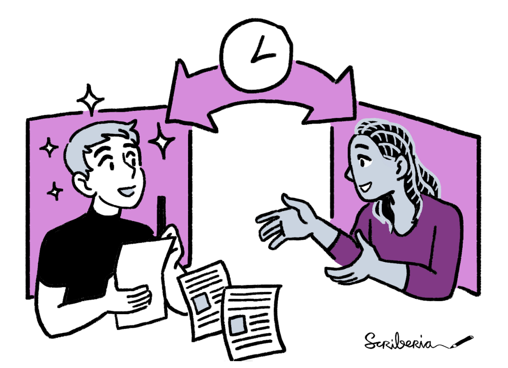
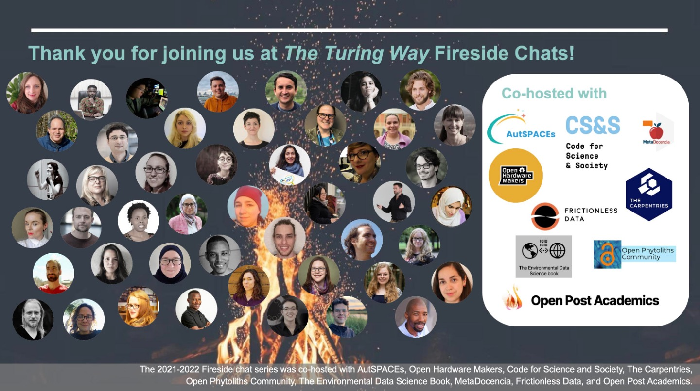
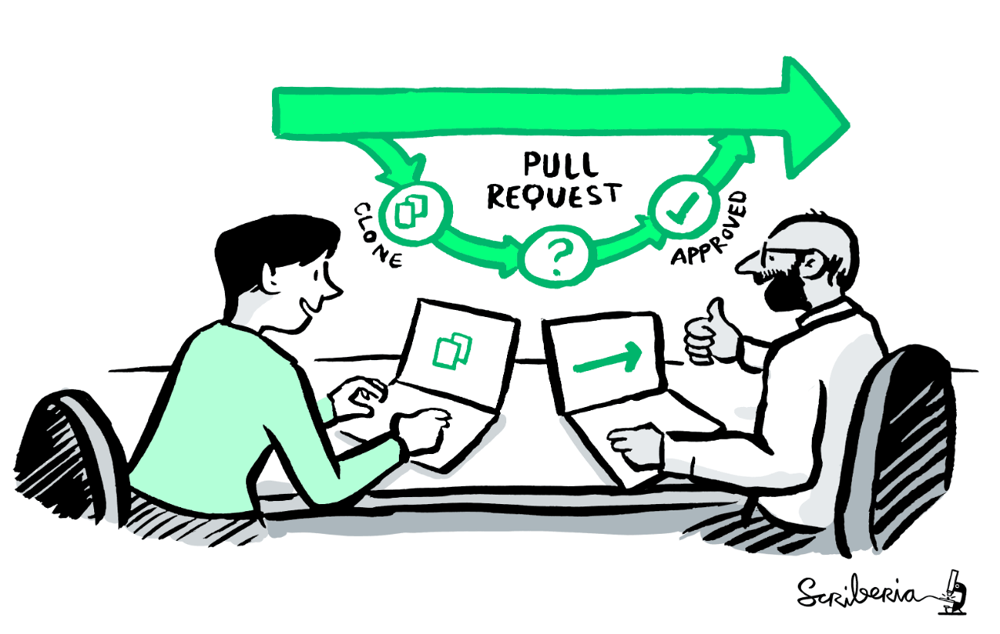
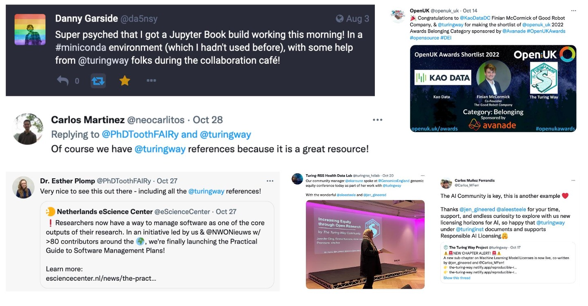

The Turing Way Newsletter: 08 Nov 2022

# Seasonal greetings and updates from _The Turing Way_ Community 

Hello world, how is it already November?!  🍃🍁🌿🍂

This newsletter seems to be getting longer every time I send it out! As usual, this one is packed with updates from _The Turing Way_ community: from information about upcoming events to recent chapter updates to our guides, to recent talks and workshops... and more!

* 📢 We are **hiring a Research Project Manager**, send in your application before 1 December: [Apply](https://cezanneondemand.intervieweb.it/turing/jobs/research-project-manager-the-turing-way-28311/en/)!
* 📚 💨 Our biannual **Book Dash** is happening from 14-18 November. We're excited to welcome new and returning members for a week of collaboration and coworking. **Join the public sessions** on [GitHub training](https://www.eventbrite.co.uk/e/the-turing-way-github-training-session-tickets-460659875087) on 9 November, [Data Conversations](https://vu-nl.libcal.com/calendar/infoworkshops/TTW) co-hosted with VU Amsterdam on 15 November and [Community Share-outs](https://www.eventbrite.co.uk/e/the-turing-way-community-share-out-and-contributor-celebrations-nov-2022-tickets-440188835657) on 18 November!
* 🔥 We've concluded the **Fireside chat series** for the 2021-2022 season. 
Check out our [Youtube playlist](https://youtube.com/playlist?list=PLBxcQEfGu3DmBcSmt9GVfo4wN1KP1y2yl) to watch the recordings. 
Thanks to our co-organisers and speakers, and thank you all for tuning in!

Many new chapters have been added to the guides, on topics related to machine learning model licenses, research infrastructure, sensitive data, and more. 
Check out **Chapters and Collaborations in Progress** to learn more about these updates.

As usual, you can find more updates and opportunities in the 'Community News' and 'Opportunities in _The Turing Way_ orbit' sections below. 
To keep up to date with community events, you can also subscribe to our [shared calendar here](https://calendar.google.com/calendar/u/0/r?cid=theturingway@gmail.com). 📅

If you're interested in keeping up in real-time, don't forget that you can always join our [Slack workspace](https://tinyurl.com/jointuringwayslack), follow the project on [Twitter](https://twitter.com/turingway), or join us on [Fosstodon](https://fosstodon.org/@turingway).

---

## Community Events

Community calls are key for _The Turing Way_ community: they're where folks learn about each others' work, collaborate on ideas, and get inspired.

Image used under a CC-BY 4.0 licence. DOI: [10.5281/zenodo.3332807](https://zenodo.org/record/5706310#.YoS-RmDMK58).

### Book Dash, Community Share-outs, and GitHub Training Session 📚💨

**The 8th annual Book Dash will be happening from 14-18 November.** We're excited to welcome newcomers and returnees for a week of collaboration and coworking! [Book Dashes](https://book.the-turing-way.org/community-handbook/bookdash.html) are an important space where our community comes together to write chapters in _The Turing Way_, work on new projects, do focused work, and learn from each other. 
While most of our working sessions will take place online, we will continue to pilot a hybrid and hub model next week!

*While Book Dash will be attended by invited participants, we will be hosting several public events listed below.*

### GitHub Training Session 

On **9 November** at 17-18 UTC/UK time ([in your timezone](https://arewemeetingyet.com/london/2022-11-09/17:00)), _The Turing Way_ team members will host a training session for members new to GitHub. 
Sign up on [Eventbrite](https://www.eventbrite.co.uk/e/the-turing-way-github-training-session-tickets-460659875087) to attend.

### Data Conversations: Innovation in Research

This month, VU Amsterdam's Research Data Management (RDM) Community Manager and a Book Dash committee member is hosting a Data Conversation during Book Dash week.

On **15 November** at 14-15:30 UTC/UK time, this Data Conversation will feature Leighann Kimble (VU Amsterdam) and Maxine Mackintosh (Genomics England) sharing lessons learned about reproducibility in medical research and data sharing.
Find [details and register](https://vu-nl.libcal.com/calendar/infoworkshops/TTW).

### Community Share-outs 

Join us at our two Community Share-outs, which will be happening on the last day of Book Dash. 
Everyone is invited – to learn more about _The Turing Way_ project, and see what the community got up to during Book Dash!

These Community Share-out events will happen on **Friday 18 November**, 11:00 - 12:30 UTC/UK time ([in your timezone](https://arewemeetingyet.com/london/2022-11-18/11:00)) or 17:00 - 18:30 UTC/UK time ([in your timezone](https://arewemeetingyet.com/london/2022-11-18/17:00)). 

Sign up on the [Eventbrite](https://www.eventbrite.co.uk/e/the-turing-way-community-share-out-and-contributor-celebrations-nov-2022-tickets-440188835657). 

### Recurring Community Calls ☕

**All are welcome to these calls, no sign-up is needed!** ✨

* **Collaboration Cafe**: The next call is on 7 December, 14:00-16:00 UTC ([see in your time zone](https://arewemeetingyet.com/London/2022-12-07/15:00)).
Feel free to drop in to meet the community, do some focused writing, or otherwise -- [see this HackMD for more information](https://hackmd.io/@turingway/collaboration-cafe).
16 November's session is replaced by the Community Shareouts during the Book Dash. 
* **Core Team Coworking Calls**: every Monday, 10:00 UTC ([see in your time zone](https://arewemeetingyet.com/London/2022-10-31/11:00)). 
Currently being trialled as stand-up for the core team (though all are welcome!). Find the joining link on this shared [HackMD](https://hackmd.io/@turingway/coworking-calls).
* **Translation and Localisation Weekly Meetings**: every Tuesday at 16:00 UTC ([in your time zone](https://arewemeetingyet.com/London/2022-11-01/17:00)). 
These calls are for co-working on translation and localisation efforts across several languages, and for learning more about the work of the team. 
Join the #translation channel on [Slack](https://tinyurl.com/jointuringwayslack), and [see this HackMD](https://hackmd.io/@1PPG0ptkTeW_qYfRy5S42Q/HJjYITE_c/edit) for joining details.
* **Office Hours**: Every Friday from 12:00 - 14:00 UTC ([see in your time zone](https://arewemeetingyet.com/London/2022-11-03/12:00)). 
Drop by if you have any questions, want to do some co-working, or if you just want to say hello. 
Signing-up is not required -- [see this HackMD for more information](https://hackmd.io/@turingway/office-hours).
There won't be an office hour during the Book Dash week.

### 2021-2022 Fireside Chats 

*49 diverse members from over 10 communities co-organised the Fireside Chats in 2021-2022.*

**The first round of the Fireside Chat series concluded last month!** This [series was started](https://book.the-turing-way.org/community-handbook/fireside-chat.html) to bring together diverse perspectives and catalyse cross-community collaborations across community-oriented projects in the open science ecosystem.

Beginning with our inaugural Fireside Chat about ["What is _The Turing Way_?"](https://www.youtube.com/watch?v=nuNA3Qa8A-k) featuring co-leads Kirstie Whitaker and Malvika Sharan with Cassandra D. Gould van Praag, these conversations have focused on all sorts of topics related to open science: from open hardware to citizen science, open infrastructure to translation and localisation, to community building and sustainability more broadly. 

Thank you so much for tuning in, co-organising, co-designing, and for being a part of these Fireside Chats with us. 
All recordings are available on this [Youtube playlist](https://youtube.com/playlist?list=PLBxcQEfGu3DmBcSmt9GVfo4wN1KP1y2yl).

Watch a few recent recordings from recent months:
* **October**: Supporting citizen and participatory science communities ([video link](https://www.youtube.com/watch?v=A2ufANMIDxo&list=PLBxcQEfGu3DmBcSmt9GVfo4wN1KP1y2yl&index=9))
* **September**: Connecting open hardware to open science ([video link](https://www.youtube.com/watch?v=DaPydydUcOc&list=PLBxcQEfGu3DmBcSmt9GVfo4wN1KP1y2yl&index=10&t=6s))
* **August**: Defining 'open infrastructure' in different contexts ([video link](https://www.youtube.com/watch?v=ZE2NXe74nSc&list=PLBxcQEfGu3DmBcSmt9GVfo4wN1KP1y2yl&index=8&t=1s))

*Stay tuned for 2023!*

---

# Community News

_Illustration by Scriberia. 
Used under a CC-BY 4.0 licence. DOI: [10.5281/zenodo.3332807](https://zenodo.org/record/5706310#.YoS-RmDMK58)._

There are lots of updates from the community from the past few months: everything from adding new collaborators to new chapters, project updates, to everything in between!

## _The Turing Way_ is hiring a Research Project Manager

This role will join the Tools, Practices and Systems research programme at the Alan Turing institute.
The position holder will work with the programme’s scientific leadership, _The Turing Way_ core team and staff, as well as the wider project community, to reliably coordinate each research project from concept to implementation.
The Project Manager will work with the Programme Manager to coordinate the delivery of strong project governance, and with the HR team, they will manage the recruitment and contract-related responsibilities.
You will need a CV and Cover Letter to submit your application.
See details on [the Turing's job portal](https://cezanneondemand.intervieweb.it/turing/jobs/research-project-manager-the-turing-way-28311/en/).

## Nominated for OpenUK 2022

_The Turing Way_ has been nominated for the Open UK 2022 awards under the category of "Belonging". 
Learn more on the [OpenUK website](https://openuk.uk/openuk-awards-third-edition/). 
Thank you!

## VU Amsterdam: new TTW collaborator!

Vrije Universiteit (VU) Amsterdam has been added as an official collaborator to _The Turing Way_ community. 
Thank you so much to Lena Karvovskaya for stewarding contributions to _The Turing Way_ (she is a co-author of the Peer Review chapter). 
Learn more about VU Amsterdam in the [Record of Contributors](https://book.the-turing-way.org/afterword/contributors-record.html#vrije-universiteit-amsterdam). 

## Chapters and Collaborations in Progress

### New Chapters

A bunch of new chapters have been added to _The Turing Way_ over the past few months, related to a wide variety of ongoing and emergent topics across data science and open research. 
Congratulations to the writers and reviewers that made it happen!

* **[Research Infrastructure Developers Summary](https://book.the-turing-way.org/collaboration/research-infrastructure-roles/research-infrastructure-developer.html)**: Owain Kenway recently added a summary of the Research Infrastructure Developers' role to the Research Infrastructure Roles subchapter. 
Owain leads a team of RIDs at UCL - so far the only institution to host them. 
We're excited to codify this emergent role within _The Turing Way_. 
* **[Machine Learning Model Licences](https://book.the-turing-way.org/reproducible-research/licensing/licensing-ml.html )**: **Jennifer Ding** and **Carlos Muñoz Ferrandis** collaborated to write a sub-chapter on [machine learning model licenses](https://book.the-turing-way.org/reproducible-research/licensing/licensing-ml.html) which includes a case study based on concerns raised through the license selection process during BigScience 
Thank you to Arron Lacey, Sophia Batchelor, and Anne Lee Steele for reviewing. 
* **[Personal Story for RSE Asia](https://book.the-turing-way.org/collaboration/research-infrastructure-roles/rse-personal-story.html)**: Saranjeet Kaur added her personal story as an RSE to the Research Infrastructure Roles sub-chapter. 
Thank you to Kim Martin, Esther Plomp, and Malvika Sharan for reviewing.
* **Sensitive Data**: Over the number of few years, an extensive set of subchapters has emerged around sensitive data. 
There are three sections: [about sensitive data](https://book.the-turing-way.org/project-design/sdp.html), [managing a sensitive data project](https://book.the-turing-way.org/project-design/sdpm.html), and [working on sensitive data projects](https://book.the-turing-way.org/project-design/sdpw.html). 
Congratulations to Emma Karoune, Maria Eriksson and many others for co-authoring a new chapter on project design!
* **[Ethical Considerations when Choosing an Open Source Governance Model](https://book.the-turing-way.org/ethical-research/ethics-open-source-governance.html)**: Arielle Bennett added a speedblog co-written with Yo Yehudi, Gemma Turon, Declan Bays, Sarah Gibson, Stephan Druskat, Yadira Sanchez and Sophia Batchelor at Collaborations Workshop. 
This new sub-chapter is in the Guide for Ethical Research.
* **[Data Papers](https://book.the-turing-way.org/communication/dif-articles/data.html?highlight=data%20papers)**: Emma Karoune and Vicky Hellon co-wrote an article about Data Papers: describing both what they are and how to write them, available under the Publishing Different Article Types subchapter. 
* **[Peer Review](https://book.the-turing-way.org/communication/peer-review.html )**: Lena Karvovskaya added a new chapter related to peer review, making explicit a process that many researchers tend to learn through informal methods. 
You can find it in the Guide for Communication.

### Help needed

If you're just getting started, check out '[good first issue](https://github.com/alan-turing-institute/the-turing-way/labels/good%20first%20issue)' or '[good first PR review'](https://github.com/alan-turing-institute/the-turing-way/labels/good%20first%20PR%20review). 
If you're interested in getting involved with ongoing chapters, there are plenty of ongoing collaborations happening, with a few listed here: 

* Collaborate with Liz Hare to improve the alt-text for graphics and data visualisations (issue [#2630](https://github.com/alan-turing-institute/the-turing-way/issues/2630))
* Work with Julien Colomb to revise a chapter on version control for datasets (pull request [#2356](https://github.com/alan-turing-institute/the-turing-way/pull/2356))
* Help Andrea Sanchez-Tapía to write a new chapter on literate programming (issue [#2549](https://github.com/alan-turing-institute/the-turing-way/issues/2549))
* Help us to summarise the fireside chats in the Community Handbook (issue [#2344](https://github.com/alan-turing-institute/the-turing-way/issues/2344))
* Help Elisa Rodenberg with qualitative research practices in the Guide for Reproducible Research (issue [#2386](https://github.com/alan-turing-institute/the-turing-way/issues/2386))

Have an idea for collaborations or a chapter? Connect with us on [Slack](https://tinyurl.com/jointuringwayslack), at a community call, or comment directly on an issue or PR!

### Infrastructure and Maintenance Updates

Maintaining a massive repository like *The Turing Way* takes a lot of digital caretaking 🤗✨

Danny Garside, a project maintainer, recently updated our version of JupyterBook and has been compiling and working on bugs within the project, as documented in this [issue](https://github.com/alan-turing-institute/the-turing-way/issues/2611). 
Thank you so much for your caretaking and maintenance work of *The Turing Way*, Danny!

Alden Conner, a core team member, recently refreshed and standardised our promotion pack. Together with Sarah Gibson, she has also been working to update the Issue templates. 
Learn more in this [project board](https://github.com/orgs/alan-turing-institute/projects/31). 
Thank you, Alden and Sarah, for making it easier to talk about and contribute to *The Turing Way*!

### Project Governance Updates

The second core team meeting was held on 7 September 2022.
Working Groups were initiated during this time, and are being trialled across the project. 
Ongoing documentation is in this [GitHub Discussion](https://github.com/alan-turing-institute/the-turing-way/discussions/2646) as well as done independently by each group: 
- Reviewers and Editors: The R&E team has been working to address stale issues within the project. 
Learn more in their [GitHub Discussion](https://github.com/alan-turing-institute/the-turing-way/discussions/2633).
- Mentors and Trainers: The M&T team have been working to archive historical talks and workshops within the project. 
Learn more in this [GitHub issue](https://github.com/alan-turing-institute/the-turing-way/issues/2643). 
- Maintainers: An Infrastructure/Maintainers Working Group is beginning  beginning to formalise its efforts, as documented in this [issue](https://github.com/alan-turing-institute/the-turing-way/issues/2690). 

These groups are currently closed to the wider community as we trial what support could look like for them. 
Thank you all for your hard work in supporting and maintaining *The Turing Way* project!

-- 

## Talks and Workshops

_It has been a busy few months of talks by and with community leaders. 
As always, you can find an ongoing record on our [Zenodo Community](https://zenodo.org/communities/the-turing-way/) page._

* **Danny Garside** and **Malvika Sharan** gave a talk about sharing responsibility for reproducibility at Big Team Science. [Zenodo](https://zenodo.org/record/7258956)
* **Arielle Bennett**, **Jennifer Ding**, and **Anne Lee Steele** organised a hackathon on research infrastructure roles at Big Team Science. [Zenodo](https://)
* **Emma Karoune**, **Jennifer Ding**, and **Anne Lee Steele** delivered a workshop on open research and equity at Genomics England's conference on 19 October. [Zenodo](https://zenodo.org/record/7104648)
* **Sophia Batchelor** and **Emma Karoune** gave a workshop to the 2022 cohort of Turing enrichment students on 11 October. [Zenodo](https://zenodo.org/record/7181240)
* **Eirini Zormpa** and **Anne Lee Steele** gave a talk about _The Turing Way_ at King College's DRIVE-Health CDT on 4 October. Zenodo 
* **Sophia Batchelor** gave a talk at the University of Leeds’s ReproducibiliTea on 22 September 2022. [Zenodo](https://doi.org/10.5281/zenodo.718276 ). 
* **Arielle Bennett** hosted a Turing Way booth at the CZIOpenSci conference on 20 September 2022.
* Lightning talk at the Code for All Summit about _The Turing Way_ on 19 September 2022, **Anne Lee Steele** on “Community-led Best Practices for Data Science”. [Recording](https://www.youtube.com/watch?v=Q3-maHOTTJA)
* **Malvika Sharan**, **Eirini Zormpa** and **Arron Lacey** delivered a two-day in-person workshop for the Connections Workshop series at the Alan Turing Institute on 76 and 17 September. [Zenodo](https://zenodo.org/record/7050678)
* **Jennifer Ding** and **Anne Lee Steele** gave a lightning talk at Mozilla’s Building Trustworthy AI Working Group meeting on 15 September.
* **Anne Lee Steele** gave a keynote about her experiences with open research at RSECon Asia-Australia 2022 on 14 September. [Zenodo](https://zenodo.org/record/7077467).
* **Asma Kacem** and **Melissa Black** gave a talk on the globalisation of open source at ReadtheDocs on 13 September. [Zenodo](https://zenodo.org/record/7073591).
* **Hari Sood** gave an introduction to _The Turing Way_ at an AIM-RSF meeting at the Alan Turing Institute on 1 September.
* **Andrea Sánchez-Tapia** and **Malvika Sharan** gave a talk on talk for MetaDocencia Governance Series on intersectionality in governance with live interpretation in English and Spanish on 31 August. [Zenodo](https://zenodo.org/record/7038553).

## Tweets, Toots & mentions

*Thank you to all for sharing _The Turing Way_within your communities, and repurposing these materials for your use. 
This is exactly what we are all about!*

1. https://fosstodon.org/web/@da5nsy/108760121842868538
2. https://twitter.com/neocarlitos/status/1586021470320226304
3. https://twitter.com/PhDToothFAIRy/status/1585704783926665216
4. https://twitter.com/turingrss_hdlab/status/1583098150596018176
5. https://twitter.com/Carlos_MFerr/status/1582032661022793728
6. https://twitter.com/openuk_uk/status/1580837112529965056

---

# In *The Turing Way* Orbit

## Opportunities
- Alan Turing Institute: 
    - ⏰ Apply by 1 December
    - 📍 London, UK ([learn more here](https://cezanneondemand.intervieweb.it/turing/jobs/research-project-manager-the-turing-way-28311/en/))
- Alan Turing Institute: Research Project Manager, Foundational AI
    - ⏰ Apply by 20 November
    - 📍 Remote, USA ([learn more here](https://cezanneondemand.intervieweb.it/turing/jobs/research-project-manager-foundational-ai-28024/en/))
- eLife Sciences: Ben Barres Spotlight Awards
    - ⏰ Apply by 8 November 
    - 📍 Remote, Global ([learn more here](https://elifesciences.org/inside-elife/a3c31ce7/ben-barres-spotlight-awards-applications-open-for-2022?utm_source=twitter&utm_medium=social&utm_campaign=organic))
- Mozilla: Data Futures Lab
    - ⏰ Apply by 11 November 
    - 📍 Remote, Global ([learn more here](https://foundation.mozilla.org/en/blog/data-futures-lab-invites-applications-from-organisations-collecting-data-for-the-public-benefit/))
- Mozilla: Creative Media Awards
    - ⏰ Apply by 30 November 
    - 📍 Remote, Global ([learn more here](https://foundation.mozilla.org/en/what-we-fund/awards/creative-media-awards/call-for-proposals-2023-creative-media-awards/))
- University of Sheffield: Research Data Manager
    - ⏰ Apply by 15 November 
    - 📍 Sheffield, UK-based ([learn more here](https://jobs.shef.ac.uk/sap/bc/webdynpro/sap/hrrcf_a_posting_apply?PARAM=cG9zdF9pbnN0X2d1aWQ9NjM1NTQzNjYyNzY3MjgxQkUxMDAwMDAwQUMxRTg4NzgmY2FuZF90eXBlPUVYVA%3D%3D&sap-client=400&sap-language=EN&sap-accessibility=X&sap-ep-themeroot=/SAP/PUBLIC/BC/UR/uos#))
- TU Delft: Skills4EOSC Training Coordinator
    - ⏰ Apply by 20 November 
    - 📍 Delft, Netherlands ([learn more here](https://www.tudelft.nl/over-tu-delft/werken-bij-tu-delft/vacatures/details/?nPostingId=3312&nPostingTargetId=9040&id=QEZFK026203F3VBQBLO6G68W9&LG=UK&mask=external))
- INCF: Project Manager
    - ⏰ Apply by 30 November 
    - 📍 Stockholm, Sweden ([learn more here](https://ki.varbi.com/en/what:job/jobID:559908/))
- Mozilla: Africa Innovation Mradi - In Real Life (IRL) Fund
    - ⏰ Apply by 30 November
    - 📍 Kenya, South Africa ([learn more here](https://foundation.mozilla.org/en/what-we-fund/awards/Africa-Mradi-IRL-Fund/call-for-proposals/))
- NHS: Digital Fellowships
    - ⏰ Apply by 1 December
    - 📍 Remote, UK ([learn more here](https://topol.hee.nhs.uk/digital-fellowships/applying/))
- Code for Science and Society: Digital Infrastructure Incubator
    - ⏰ Apply by 2 December
    - 📍 Remote, Global [learn more here](https://www.codeforsociety.org/incubator/accepting-proposals)
- Open Collective: Senior UX Designer
    - ⏰ Applications ongoing 
    - 📍 Remote, Global ([learn more here](https://opencollective.com/hiring))
- US Research Software Sustainability Institute 
    - ⏰ Applications ongoing
    - 📍 Remote, US-based [learn more here](https://www.codeforsociety.org/jobs/community-manager)

## Upcoming Events and Workshops
- Alan Turing Institute: AI Ethics and Governance Course
    - ⏰ Apply by 7 November ([apply here](https://alan-turing-institute.github.io/turing-commons/blog/course-announcement-ai-ethics-and-governance/))
    - 📍 Remote, UK [learn more here](https://researchdata.nl/en/services/the-dutch-data-prize/)
- **Brainhack Geneva**
    - 🗓️ 2 - 3 December (Geneva, CH, [register here](https://www.eventbrite.ch/e/brainhack-global-geneva-2022-bgg2022-tickets-433459417787))

For more events, subscribe to the [Open Research Calendar](https://openresearchcalendar.org/).

-----

## Get involved + Connect with us!

You are welcome to join *The Turing Way* community, and learn more about the project.
We host [Community Co-working calls](https://hackmd.io/@turingway/coworking-call) on Mondays, [Collaboration Cafes](https://hackmd.io/@turingway/collaboration-cafe) every first and third Wednesdays, Office Hours every Friday and Fireside chats monthly.

*   [About the project](https://www.turing.ac.uk/research/research-projects/turing-way-handbook-reproducible-data-science)
*   [_The Turing Way_ book](https://book.the-turing-way.org)
*   [HackMD Intro Page](https://hackmd.io/@turingway/demo-intro)
*   [GitHub repository](https://github.com/alan-turing-institute/the-turing-way)
*   [Slack Workspace](https://join.slack.com/t/theturingway/shared_invite/zt-fn608gvb-h_ZSpoA29cCdUwR~TIqpBw)
*   [Mastodon profile](https://scholar.social/web/@turingway@fosstodon.org)
*   [YouTube Channel](https://www.youtube.com/channel/UCPDxZv5BMzAw0mPobCbMNuA)
*   [Twitter profile](https://twitter.com/turingway)

If you'd like to contribute to the next newsletter, please email Anne Lee Steele at asteele@turing.ac.uk! Feel free to send me a message on Slack, or [book some time in on my calendly](calendly.com/aleesteele/) to say hello.

We have been experimenting with new sections and formats for the newsletter... let us know what you think!

_Did you miss the last newsletters?_ _Check them out [here](https://tinyletter.com/TuringWay/archive)._
