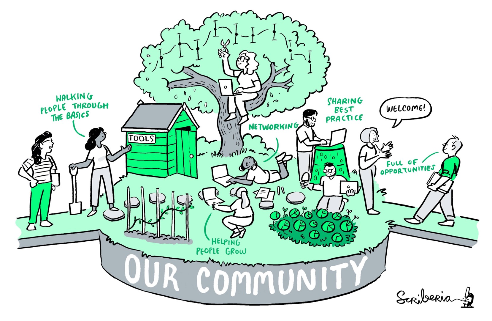
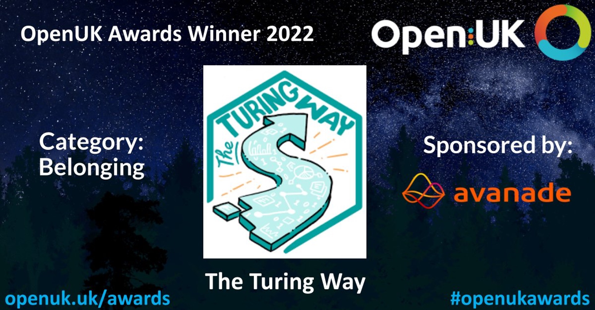
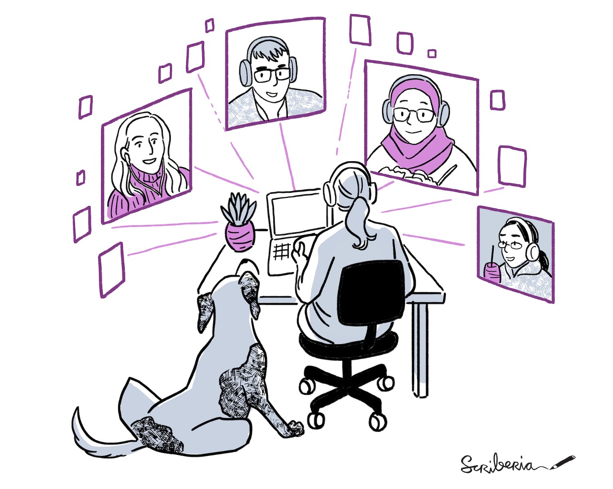

The Turing Way Newsletter: 22 Nov 2022

# Four years of The Turing Way project, highlights from our community and holiday wishes!

Dear *The Turing Way* friends!

As we approach the end of this eventful year, we want to look back at 2022 and express our heartfelt gratitude to each of you!

* ✨ Check out "Community News and Updates" for a few exciting updates from last month, with a preview of what is to come in 2023!
* 🪐 "Opportunities in *The Turing Way* Orbit" has a few job announcements to work at the Turing and *The Turing Way* among other opportunities from our network.
* 🚀 Read "2022: Year in Review" - a summary of what we've been up to this 2022. It sure has been a busy year for our ever-evolving project!

We thank you for being an important part of this community, sharing your valuable feedback, mentoring others and thoughtfully engaging with the others around *The Turing Way*.

We look forward to welcoming you back in 2023! 🌺

--- 

# Community News and Updates

_Illustration by Scriberia showing community as a garden and members as gardeners. Used under a CC-BY 4.0 licence. DOI: [10.5281/zenodo.3332807](https://zenodo.org/record/5706310#.YoS-RmDMK58)._

## Ecosystem Leadership Award to Establish a Practitioners Hub

*The Turing Way* was granted the Ecosystem Leadership Award under the EPSRC Grant EP/X03870X/1 and The Alan Turing Institute to build ***The Turing Way* Practitioners Hub**.
This funding will enable our plans for advancing *The Turing Way*'s impact and expertise in embedding best practices into organisations across the broader data science and AI. 
This will be an active effort to build a bi-directional channel between *The Turing Way* and organisations that benefit from and contribute to the project.
This funding support a Research Project Manager and a Postdoctoral Research Associate, ensuring long-term sustainability strengthened through the Practitioners Hub.

*Read the full [proposal on Zenodo](https://zenodo.org/record/7427274).*

## OpenUK Award Under the 'Belonging' Category

We are so excited to share that *The Turing Way* won an **OpenUK award under the category of Belonging**.
The project was nominated by Malvika Sharan on behalf of the community to recognise the 3+ years of accumulated work in the project, thoughtfully facilitated by our community members.
Although *The Turing Way* book is written around best practices for open, reproducible and ethical data science, the 'process' of community engagement, respectful co-creation and relentless advocacy have always centred on EDIA (Equity, Diversity, Inclusion and Accessibility) principles.
This award is a recognition of those values embedded in the community-led work of *The Turing Way*! 
We thank you to creating a deep sense of belonging for everyone you have helped, supported and recognised in *The Turing Way* and the broader Open Science ecosystem.

*You can read about all the winners on [the OpenUk webpage](https://openuk.uk/openuk-awards-third-edition/).*

### Congratulations SSI Fellows 2023

Massive congratulations to 18 individuals who were awarded the SSI fellowship for the year 2023! 
Special Shout out to UK Fellows: **Georgia Aitkenhead and Aman Goel**; international fellows: **Saranjeet Kaur and Stephen Klusza** and the first cohort of OLS-SSI fellows (hosted by Open Life Science - OLS): **Andrea Sanchez Tapia, Raina Camacho Toro and Melissa Black** -- all of who have worked with us in *The Turing Way*.
Andrea will lead the work of *The Turing Way* localisation team, while closely collaborating with Melissa, who will lead the 'EspañOLS' localisation work in OLS.

*Learn more about the fellows [on the SSI webpage](https://www.software.ac.uk/blog/2022-12-15-announcing-2023-software-sustainability-institute-fellows).*

## Welcoming New Members to the Core Team

*The Turing Way* core (organising) team is constituted of the volunteer community champions and Turing's staff members from the Tools, Practices and Systems (TPS) programme.
We are delighted to have recently welcomed volunteer members: **Danny Garside, Jim Madge and Brigitta Sipöcz** joining our existing member Sarah Gibson as Infrastructure Co-Leads.
We also welcome the TPS staff members: **Bastian Greshake Tzovaras** (TPS Senior Researcher) and **David Sarmiento Pérez** (TPS Research Project Manager) who will bring expertise from their work to the project. 
Thanks to all core team members for maintaining and nurturing *The Turing Way* project and community as a part of the Core team!

*Read details in our [Ways of Working document](https://github.com/alan-turing-institute/the-turing-way/blob/main/ways_of_working.md).*

---

### New Impact Report Highlighting *The Turing Way*

Many participatory projects at the Turing are leading the way for responsible research and innovation in data science.
*The Turing Way* community have always exemplified that, which is highlighted in the 'AI for Science and Government' impact report **Better Together: The people-centred approaches driving forward data ethics**.
The report discusses the various avenues where *The Turing Way* has played a key role.
We thank **Laura Ación, Chelle Gentemann and Chris Erdmann** for their contributions to this article highlighting how they champion *The Turing Way* in their organisations.

*Read the [full impact report](https://www.turing.ac.uk/research/impact-stories/better-together-people-centred-approaches-driving-forward-data-ethics)*

## Project Governance Updates

The third core team meeting was held on 7 December 2022.
Hosted by the Community Manager, Anne Lee Steele, members of the core organising team came together to share updates with each other.
As a part of the project's governance, representatives of **infrastructure maintenance, writers & reviewers, Mentors & Trainers and Translation & Localisation working groups** shared updates from their areas of work. 
During the trial phase, the members of different working groups are addressing issues crucial to the sustainability of the project while formalising their ways of working and identifying what ongoing support could look like for them. 
Each working group currently operates independently of other groups, while reporting their progress during the coworking calls on Monday.
Thanks to the working group representatives for sharing updates from their groups during the Community Share Outs on 18 November. 

*Documentation (in progress) is shared in this [GitHub Discussion](https://github.com/alanim-turing-institute/the-turing-way/discussions/2646).*

---

## Updates from Book Dash November 2022 

![Alt: Screenshot of zoom with people waving at the camera. Attendees are (in the order - left to right, top to bottom) from session 1: Rachael joining from London with a virtual background that says "that could be a chapter in *The Turing Way*", Malvika joining from India, with Turing Way logo as her background, Hari joining from London - with a background illustration of people collaborating, Winny joining from Uganda, she is wearing a green blazer and blue curtain background, Saranjeet joining from India, she is wearing a red Hoodie, with a white wall background, Alden and Mahwish joining from The Alan Turing Institute office in London, Mahwish is wearing a black sweater and Alden is wearing a grey sweater, Esther joining from the Netherlands - she is waving with both hands, Giulia Tomba is joining from somewhere in the UK, she is wearing a beige sweater, Batool joining somewhere from the UK - she is wearing a brown hijab. Patricia has a blurred background, she is wearing a grey sweater and a pair of black framed glasses, A black square with Mahwish Mohammad's name - her camera was off as she was joining from the Alan Turing Institute with the meeting room's camera with Alden. Jafsia has a still photograph as his profile picture. He is wearing a purple shirt and has a curtain in his background. From session 2: Kirstie joins from somewhere in London, with baby Mackenzie. She is wearing a black sweater with a turquoise blue necklace made up of round stones. Anne Steele is waving, joining from London, with Turing Way pathways as her background. Emma Karoune is joining from Southampton, UK. She is wearing a black hijab and over-ear headphones, with a grey sweater. Her background is an illustration of the data management process. Anne Fouilloux is calling from France, wearing a striped black and white jacket with a red scarf, as well as glasses. Alejandro is calling from Colombia, with Turing Way's remote work image behind him. Danny is calling from Washington DC, USA, and wearing a blue shirt and glasses with a dark frame. Aditi is calling from the UK, wearing a red shirt and glasses with a clear frame. Aman is calling from India, wearing glasses with a dark frame, with a checkered shirt. Andrea is calling from California, USA, wearing a bright green scarf and black sweater, with navy over-ear headphones, dark-rimmed glasses, the LGBTQ + Progress flag behind her, as well as two paintings. Melissa Black is joining from Brazil, with over-ear headphones, a black and white tank top, and wearing dark-rimmed glasses. Liz is joining from New York, USA, wearing a brown sweater, wearing earbud headphones. There is a small painting in the background and blinds next to her. Esther is joining from the Netherlands but is not visible on the screen. Her background is white with blue illustrated buildings. A white cat is sitting on a black keyboard, with a hand (presumably Esther’s) between them](images/2022-12-bookdash-3.jpg)

We are delighted to share that the eighth Book Dash was hosted successfully from 14 to 18 November 2022 with more than 30 participants, including our planning committee members, Trainers and Presenters.
This event could not be possible without the support, care and mentorship provided by our Book Dash Planning Committee **Arielle Bennett, Emma Karoune, Esther Plomp and Lena Karvovskaya**, chaired by Anne Lee Steele and Malvika Sharan.

We thank all invited participants (alphabetically): **Aditi Dutta, Alden Conner, Alejandro Coca Castro, Aman Goel, Andrea Sánchez-Tapia, Anne Fouilloux, Arron Lacey, Batool Almarzouq, Elisa Rodenburg, Jennifer Ding, Jim Madge, Johanna Bayer, Liz Hare, Mahwish Mohammad, Melissa Black, Pamela Villar Gonzales, Rachael Stickland, Saranjeet Kaur, Shern Tee and Winny Nekesa Akullo**.
Thanks also go to our presenters and trainers **Andrea Sanchez-Tapia, Anne Lee Steele, Hari Sood, Jennifer Ding, Lena Karovovskaya, Leighann Kimble, Liz Hare, Maxine Mackintosh and Sophia Batchelor**.

Working across **32 Issues and 33 Pull Requests** on GitHub, our participants **updated and published 5 existing and 6 new chapters/subchapters**.
Check out the following new chapters published in *The Turing Way* book: [Data Wrangler](https://book.the-turing-way.org/collaboration/research-infrastructure-roles/data-wrangler.html?highlight=data%20wrangler) subchapter in the Research Infrastructure chapter, [Research Ethics for Social Data](https://book.the-turing-way.org/ethical-research/social-data.html), [Data Curation](https://book.the-turing-way.org/reproducible-research/rdm/rdm-data-curation.html?highlight=curation), [Declarative Virtual Machines with Vagrant](https://book.the-turing-way.org/reproducible-research/renv/renv-virtualmachine.html?highlight=vagrant#declarative-virtual-machines-with-vagrant) in the Virtual Environment chapter, [Research Objects in Action](https://book.the-turing-way.org/communication/research-objects.html) and [Peer review subchapters](https://book.the-turing-way.org/communication/peer-review.html).
In addition, all participants contributed to co-develop 14 new illustrations which will be soon released on Zenodo: [10.5281/zenodo.3332807](https://doi.org/10.5281/zenodo.3332807).

The new version of the book including these chapters has been released online that can be cited as *The Turing Way* Community. (2022). *The Turing Way: A handbook for reproducible, ethical and collaborative research (1.1.0). Zenodo. https://doi.org/10.5281/zenodo.3233853.*

*Learn more about the Book Dash November 2022 edition [in this report](https://hackmd.io/JDcEhSocQ_acoZXfKKyWMQ).*

---

## Community Events and Activities

### Help us plan Fireside Chats for 2023

After successfully concluding the first iteration of the Fireside Chat Series, we are looking forward to designing them for 2023.
We don't want to do it alone. 
We need your feedback based on your experience participating in the 2021-2022 series.
Please take 5 minutes to share your suggestion on speakers, format, tools and topics that you would like to see in the next series.

*Send your feedback by 31 January 2023 via [the Google form](https://forms.gle/N76CbjKqQKNqFXJx5). We encourage you to nominate yourself as speaker/collaborator, we would love to hear from you!*

### Coworking Events in 2023

We have formally closed all the community events for the year 2022, and will officially return on 4 January 2023 and resume community events from 9 January onwards.
Here are some of the events you can attend/co-host in 2023:
* **Coworking calls** for working groups: Mondays at 11:00 am UK time, starting on 9 January.
* **Collaboration Cafés** for all community members: first and third Wednesdays of the month - from 15:00 to 17:00 UK time, starting on 18 January.
* **Office hours** - open to all members, especially a good place to learn about the project and our community: every Friday from 13:00 to 15:00 UK time, starting on 13 January.

*In addition, you can expect several **training workshops, Fireside Chats, conference talks, Annual Book Dash events in May and November, and other ad-hoc events** co-organised by the project team with the community members. 
Bookmark this document for your reference: [bit.ly/turingway](https://hackmd.io/@turingway/demo-intro).*

### Previous Talks, Panels and Articles

* **Sarah Gibson delivered a keynote** on 21 November at the Turing Workshop for Open-Source AI Software for Healthcare at the Alan Turing Institute. [Zenodo link](https://zenodo.org/record/7339751).
* **Alejandro Coca Castro delivered a Keynote** [in Spanish] on 24 November attributing *The Turing Way* at the International Forest Model Network annual conference. [Zenodo link](https://zenodo.org/record/7357951), [video](https://youtu.be/84arINjIB3E?t=14400).
* **Malvika Sharan delivered a keynote** on 17 November at the Genome bioinformatics: resequencing and variant calling - EBI course. [Zenodo link](https://zenodo.org/record/7428708).
* **Melissa Black and Anne Lee Steele delivered a workshop** exploring internationalisation and localisation for Open Science on 1 December at the Global Dynamics in Responsible Research Virtual Symposium co-supported by Batool Almarzouq, hosted by The Einstein Foundation (Einstein Berlin). [Zenodo link](https://zenodo.org/record/7387392).
* **Iman al Hasani delivered a talk** "Enhancing the Open Data Policy in Oman" attributing *The Turing Way* on 6 December at COMEX:Oman's 2nd Big Data & Analytics Meet. [Zenodo link](https://zenodo.org/record/7422279).
* **Batool Almarzouq and Anne Lee Steele delivered a talk** "Internationalisation and Localisation of Open Science through The Turing Way" on 7 December hosted by Durham Riots Club. [Zenodo link](https://zenodo.org/record/7410496).
* **Malvika participated in three panels** over the last months:
  * On 28 October she joined a panel discussion on [Careers in Open Science](https://www.linkedin.com/posts/openlifescience_oils22-collaboration-accessibility-activity-6990392493259333633-3vWg/?originalSubdomain=ch) hosted by the Open Innovation in Life Science conference 2022.
  * On 30 November she joined a panel discussion on [Institutional Support for Open Science](https://www.mcgill.ca/neuro/open-science/4th-annual-neuro-open-science-action-symposium-2022) hosted by Open Science in Action Symposium by the Montreal Neurological Institute-Hospital.
  * On 12 December she joined the Town Hall panel on Community of Practice hosted by the NASA Center for HelioAnalytics Transdisciplinary CoP members. Read a [summary by Ryan McGranaghan](https://ryanmcgranaghan.substack.com/p/a-master-class-in-building-and-understanding?sd=pf).
* **Esther Plomp and Emma Karoune** published an article: "Removing Barriers to Reproducible Research in Archaeology." [Zenodo](https://zenodo.org/record/7320029#.Y48a_UjYEKw.twitter).
* **Jennifer Ding and Anne Lee Steele co-authored an article with Christopher Akiki, Yacine Jernite and Temi Popo**. "Towards Openness Beyond Open Access: User Journeys through 3 Open AI Collaboratives". [OpenReview](https://openreview.net/forum?id=slU-5h8rrCzNeural) and [NeurIPS 2022](https://nips.cc/Conferences/2022/ScheduleMultitrack?event=64511).

*You can find an ongoing record on our [Zenodo Community](https://zenodo.org/communities/the-turing-way/) page.*

---
# Opportunities in *The Turing Way* Orbit

_Illustration by Scriberia showing community as a garden and members as gardeners. Used under a CC-BY 4.0 licence. DOI: [10.5281/zenodo.3332807](https://zenodo.org/record/5706310#.YoS-RmDMK58)._

## Senior Positions Announced to Work in Digital Twins

[Turing’s Research and Innovation Cluster in Digital Twins](https://www.turing.ac.uk/research/harnessing-power-digital-twins/turing-research-and-innovation-cluster-digital-twins/) has received more than £26 million to democratise access to digital twins technology through open and reproducible practices. 
We are hiring 1 [Senior Community Manager (Senior CM)](https://book.the-turing-way.org/collaboration/research-infrastructure-roles/community-manager.html) and 2 [Research Application Managers (RAM)](https://book.the-turing-way.org/collaboration/research-infrastructure-roles/ram.html) to lead on community engagement and accelerate the adoption of open and reproducible digital twin technology. 
These postholders will join the CM and RAM teams respectively, and align their work with *The Turing Way*.
The salary for each position starts at £49,000.
* Apply for the Senior CM position by 15 January 2023: [details on the job portal](https://cezanneondemand.intervieweb.it/turing/jobs/senior-community-manager-turing-research-and-innovation-cluster-in-digital-twins-tricdt-29222/en/).
* Apply for the RAM position by 29 January 2023: [details on the job portal](https://cezanneondemand.intervieweb.it/turing/jobs/research-application-manager-turing-research-and-innovation-cluster-in-digital-twins-29131/en/?295314357). 

*See other job opportunities to [work at The Alan Turing Institute](https://www.turing.ac.uk/opportunities-turing/jobs)*

## Skills Policy Awards 2023/2024

The Alan Turing Institute is offering up to four awards (£41,000 - £65000) to individuals/teams to gain hands-on experience in policy formation and undertake a research project to address data skills challenges. 
Awardees will be paired with mentors, supported to develop their connections among national skills stakeholders, and supported to co-produce policy outputs and briefings. 
Applicants should be part of a UK university or research institute and should plan for the project delivery between February 2023 and March 2024.

*The application deadline is 13 January 2023 -- find more details on [the call announcement page](https://www.turing.ac.uk/skills-policy-awards-20232024).*

### Apply to Become a Mentor

The Skills Team is now accepting applications for up to four Mentors to guide and support recipients of the Skills Policy Awards (SPA) 2023/24 (above). 
Funding of up to £15,000 is available for experienced data science education and policy professionals to aid awardees in delivering a project and policy output benefitting the UK’s data skills policy landscape.

*Read details in the [call for mentors](https://www.turing.ac.uk/call-skills-policy-award-mentors-20232024) and apply before 10 January 2023.*

## OLS-6 Graduations and OLS-7 Application Call

Open Life Science's 6th cohort has reached its last phase.
Over 40 individuals from different parts of the world joined the current cohort to build and advance their projects through open science practices.
You can register for their graduation calls (with a “viewer” ticket) via the [Eventbrite pages](https://www.eventbrite.co.uk/o/open-life-science-31351238135), and watch these live-streamed calls [on YouTube](https://youtube.com/c/openlifesci)!

### Apply to Join OLS-7!

Meanwhile, the call for Open Life Science Cohort 7 is now live! 
Please submit your [application via OpenReview](https://openreview.net/group?id=openlifesci.org/Open_Life_Science/2023/Cohort_7) before the end of the day on January 15, 2023.
The deadline for registering for OpenReview is January 10, as all OpenReview accounts are approved manually.
To learn about the timeline, process and details for the OLS-7, visit [https://openlifesci.org/](https://openlifesci.org/).

*The Turing Way* directly collaborates with OLS and invites you to connect directly with Malvika to discuss your project ideas within or outside the scope of *The Turing Way*.
Email [msharan@turing.ac.uk](mailto:msharan@turing.ac.uk).

## Other opportunities

* Job: Open Life Science: Project management and coordination position
    * ⏰ Apply by 15 January 2023
    * 📍Location: Remote, with a supervisor based in The Netherlands
    * 🔗 [Read Details](https://openlifesci.org/posts/2022/12/19/ECB-PM-job-description/)
* Job: Invest in Open Infrastructure: Business Development & Partnerships Lead
    * ⏰ Apply by 15 January 2023
    * 📍Location: Remote, with a supervisor based in New York
    * 🔗 [Read Details](https://investinopen.org/jobs/#businessdevelopmentpartnershipslead)
* Job: Invest in Open Infrastructure: Research Lead
    * ⏰ Apply by 2 January 2023
    * 📍Location: Remote, with a supervisor based in New York
    * 🔗 [Read Details](https://investinopen.org/jobs/#researchlead)
* Job: Netherlands eScience Center: Workshops and Training Coordinator 
    * ⏰ Apply by 29 January 2023
    * 📍Location: Netherlands
    * 🔗 [Read Details](https://www.esciencecenter.nl/careers/workshops-and-training-coordinator/)
* Job: The Francis Crick Institute: Software Engineer (Research / Machine Learning)
    * ⏰ Apply by 6 February 2023
    * 📍Location: London, UK
    * 🔗 [Read Details](https://www.crick.ac.uk/careers-study/vacancies/2022-12-01-software-engineer-research/machine-learning)
* Job: Research Software Alliance: Community Manager (two positions, part-time)
    * ⏰ Apply by 16 January 2023
    * 📍Location: Africa and Asia
    * 🔗 [Read Details](https://docs.google.com/document/d/1FgRKdLr4wSrUabLluaWb93Q0W70I6MK3qSL8SqxYggk/edit)
* Job: Creative Commons - Open Climate Data Manager
    * ⏰ Apply by 31 January 2023
    * 📍Location: Remote
    * 🔗 [Read Details](https://creativecommons.org/about/team/opportunities/job-opportunity-open-climate-data-manager/)
* Job: University of Florida: Senior Director, Diversity, Equity, and Inclusion
    * ⏰ Apply by 16 January 2023
    * 📍Location: London, UK
    * 🔗 [Read Details](https://hr.uflib.ufl.edu/wordpress/files/2022/12/DEI_PVA.pdf)
* Paid Opportunity: Open Source - GitHub Accelerator Program
    * ⏰ Apply by 31 December 2022
    * 🔗 [Read Details](https://accelerator.github.com/)
* Award nomination: The Open Science Community Amsterdam Awards (OSCAWARDS)
    * ⏰ Apply by 26 January 2023
    * 🔗 [Read Details](https://docs.google.com/forms/d/e/1FAIpQLSfFkLbrug3XChbhIbng1nqZ2FCyfX7bQe5J7Lmz1VfEENwpNQ)
* Paid opportunity: lessons for librarians at UCLA on various open science topics
    * ⏰ Apply by 31 January 2023
    * 🔗 [Read Details](https://www.surveymonkey.com/r/63JTJSQ)
* Paid opportunity: Moderators for FAIRPoints ‘Ask me Anything (AMA)'
    * 🔗 [Read Details](https://docs.google.com/forms/d/e/1FAIpQLSdvVjsMk4_f6e3M_ZXzAUy8JGAIVK6Byocb2I86QiXFJOPjaw/viewform)
* Funding call: Nature Awards: Inclusive Health Research
    * ⏰ Apply by 6 January 2023
    * 🔗 [Read Details](https://www.nature.com/immersive/inclusivehealthresearch/index.html?utm_medium=social&utm_source=facebook&utm_content=ads&utm_campaign=CONR_AWARD_ENGM_GL_CEAM_TAKDA_CF_IHR22)
* Job: University College London: several opportunities
    * 🔗 [Read Details](https://www.ucl.ac.uk/advanced-research-computing/our-people/vacancies)
* Funding call: NASA: several calls
    * ⏰ Various deadlines in 2023
    * 🔗 [Read Details](https://science.nasa.gov/researchers/sara/grant-solicitations)

*For more events, subscribe to the [Open Research Calendar](https://openresearchcalendar.org/).*

---

# 2022: Year in Review!

![Alt: A hand-drawn image by Scriberia artist of a garden. "Thanks for Contributing to *The Turing Way*" is written at the top in scripted text in green and black. The image is drawn in shades of green, grey, and black: in a cartoon-like style. The garden contacts a toolshed in the far corner, with bushes that contain pie charts. There is a pond that contains ones and zeroes, like binary code. The phrase "thanks" is drawn on a flower label, that is stuck into a flower pot that has leafy green roots coming out of the pot.](images/2022-12-thanks-6.jpg)

_Illustration by Scriberia showing community as a garden and members as gardeners. Used under a CC-BY 4.0 licence. DOI: [10.5281/zenodo.3332807](https://zenodo.org/record/5706310#.YoS-RmDMK58)._

As we complete the fourth year of *The Turing Way*, we review the year 2022 month-by-month to highlight some of the important milestones we have achieved in the project together with our community members.

* **January**: We began the year by **formally establishing support and maintenance roles** of the Turing's Tools, Practices and Systems staff members in *The Turing Way* as the project's core team. See the [Ways of Working](https://github.com/alan-turing-institute/the-turing-way/blob/main/ways_of_working.md) document.
* **February**: The first Fireside Chat of 2022 was co-hosted with the Talarify co-founder Anelda Van der Walt on the topic [Gaps and Opportunities for Inclusive Multilingual Data Science](https://www.youtube.com/watch?v=Ydogg2tQljA&list=PLBxcQEfGu3DmBcSmt9GVfo4wN1KP1y2yl&index=3), which among many global initiatives highlighted the hard and important **work led by *The Turing Way* Localisation and Translation team**.
* **March**: We **welcomed Anne Lee Steele** as our new community manager. We collaborated with **Open Post Academics** to host a Fireside Chat on Emergent Roles in Research Infrastructure and Technology as well as invited review and feedback on two training materials developed on *The Turing Way*. Details in [March's newsletter](https://tinyletter.com/TuringWay/letters/introducing-the-next-fireside-chat-book-dash-collaborative-projects-and-our-community-manager).
* **April**: We were **featured in the UK's Goldacre Review**, co-hosted another Fireside Chat with **MetaDocencia** on inclusive conferencing, formally included Translation & Localisation leads to the core team and ran workshops at AI-UK and Collaborations Workshop 2022. Details in [April's newsletter](https://tinyletter.com/TuringWay/letters/new-chapters-sign-up-for-book-dash-the-upcoming-fireside-chat-and-many-other-community-updates). 
* **May**: We hosted the **7th Book Dash**, and piloted local hubs in Amsterdam, Bristol and London; [joined Mastodon](https://fosstodon.org/@turingway); got featured in articles by JISC [profiling our project](https://www.jisc.ac.uk/membership/stories/the-turing-way-forward) and HiddenRef for getting ['Highly Commended' under the 'Practices' category](https://www.emeraldgrouppublishing.com/news-and-press-releases/progress-science-depends-a-team).
* **June**: We hosted the **first formal Core Team meeting**; co-hosted a Fireside Chat sharing different perspectives from working in alignment with *The Turing Way*; released new chapters and celebrated an Outreachy member mentored by Batool Almarzouq in Open Science Saudi Arabia to work on *The Turing Way* Localisation infrastructure. Details in [June's newsletter](https://tinyletter.com/TuringWay/letters/join-our-june-fireside-chat-catch-up-on-community-share-outs-and-other-updates-from-the-turing-way-community).
* **July**: We submitted a community-sourced response to [UNESCO's Global Call on Open Science](https://zenodo.org/record/6841867) and co-hosted a Fireside chat on [Navigating growth and scale to sustain open communities](https://www.youtube.com/watch?v=p0t_K5FNalU&list=PLBxcQEfGu3DmBcSmt9GVfo4wN1KP1y2yl&index=7) with The Carpentries.
* **August**: We dedicated a week to a mid-year review of *The Turing Way* and co-hosted a Fireside chat on Defining [‘open infrastructure’ in different contexts](https://www.youtube.com/watch?v=ZE2NXe74nSc&list=PLBxcQEfGu3DmBcSmt9GVfo4wN1KP1y2yl&index=8) with Code for Science & Society.
* **September**: Launched a new series of office hours to create dedicated space for new members to learn about the project; co-hosted a Fireside Chat with **Open Hardware Makers**, and reported a variety of activities undertaken by community members. Details in [September's newsletter](https://tinyletter.com/TuringWay/letters/end-of-season-updates-from-the-turing-way-community).
* **October**: We were granted the Ecosystem Leadership Award by The Alan Turing Institute to fund *The Turing Way* **Practitioners Hub** proposal to engage organisations across multiple sectors. We also co-hosted the Fireside Chat on Supporting citizen and participatory science communities with AutSPACEs. Details in [November's newsletter](https://tinyletter.com/TuringWay/letters/seasonal-greetings-and-updates-from-the-turing-way-community).
* **November**: The **8th Book Dash event** took place with 19 international members, who together collaborated on 11 chapters, 14 illustrations and various discussion sessions. The project was awarded an **OpenUK 2022 award** under the 'belonging' category - what a fantastic recognition for our community.
* **December**: We concluded the year with **about 50 talks and workshops** delivered by the project team and community members internationally throughout the year. You can see other activities listed [documented during our review week in December](https://hackmd.io/@turingway/maintenance-2022), which will help us plan our priorities and focus for 2023.

---

## Thank you & End of the Year Wishes!

2022 was another massive year of learning, expansion and far-reaching recognition.
Although embedding sustainability and formalising governance were some of our main focuses this year, we witnessed so much more in the community -- as highlighted earlier in the 'non-exhaustive' list of accomplishments!
We are constantly humbled by your inspiring work in *The Turing Way* and excited to have reached new milestones in the project together.

*Thanks to Esther Plomp for designing this beautiful graphic to wish you "Happy holidays" from *The Turing Way* core team!*

We thank you for your genuine support, continued collaborations and sustained engagement with *The Turing Way*.
We hope that you can take a break and enjoy the end of the year.

We wish you a happy new year! See you in 2023.

Malvika, Anne and Kirstie on behalf of *The Turing Way* Project Members. 💜

-----

## Get involved + Connect with us!

You are welcome to join *The Turing Way* community, and learn more about the project.

*   [About the project](https://www.turing.ac.uk/research/research-projects/turing-way-handbook-reproducible-data-science)
*   [_The Turing Way_ book](https://book.the-turing-way.org)
*   [HackMD Intro Page](https://hackmd.io/@turingway/demo-intro)
*   [GitHub repository](https://github.com/alan-turing-institute/the-turing-way)
*   [Slack Workspace](https://join.slack.com/t/theturingway/shared_invite/zt-fn608gvb-h_ZSpoA29cCdUwR~TIqpBw)
*   [Mastodon profile](https://scholar.social/web/@turingway@fosstodon.org)
*   [YouTube Channel](https://www.youtube.com/channel/UCPDxZv5BMzAw0mPobCbMNuA)
*   [Twitter profile](https://twitter.com/turingway)

If you'd like to contribute to the next newsletter, please email Anne Lee Steele at asteele@turing.ac.uk! Feel free to send her a message on Slack, or [book some time in on Anne's calendly](calendly.com/aleesteele/) to say hello.

_Did you miss the last newsletters?_ _Check them out [here](https://tinyletter.com/TuringWay/archive)._
