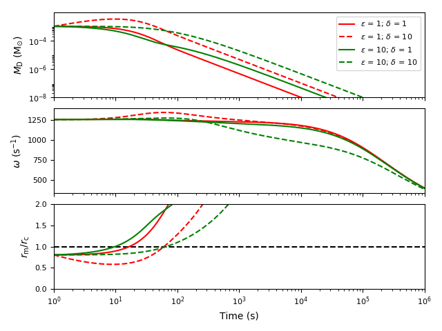
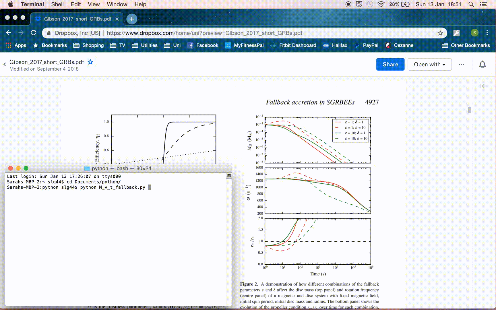
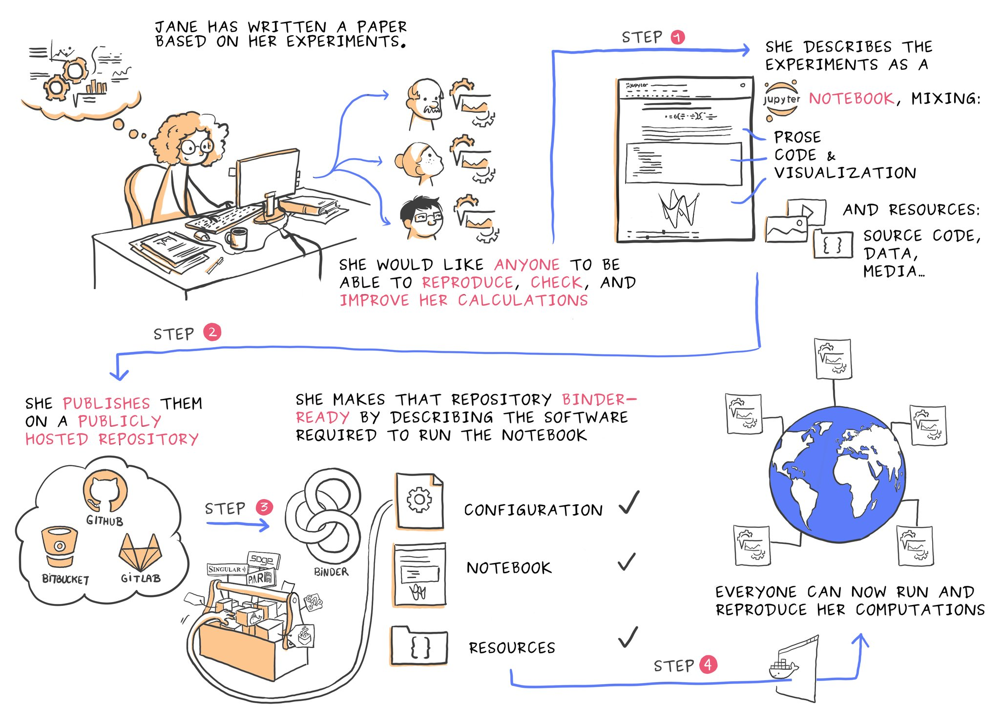
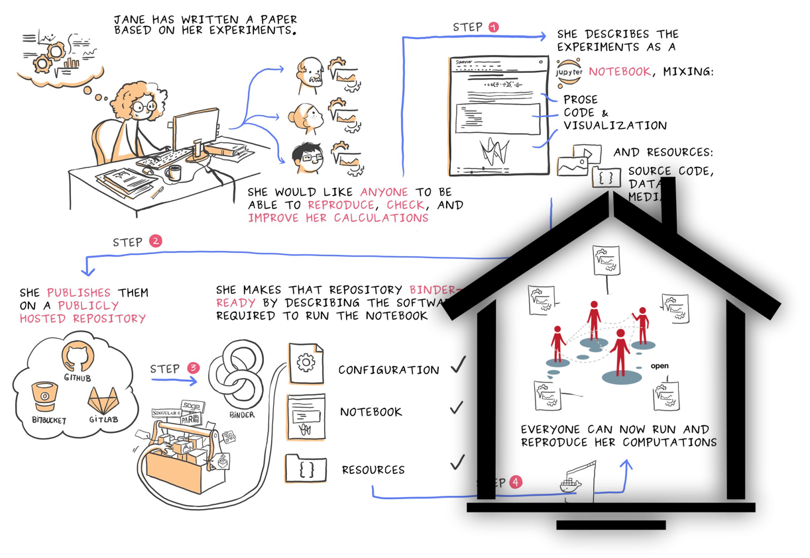

# Reproducible, Reliable, Reusable Analyses with BinderHub on Cloud

Sarah Gibson, _The Alan Turing Institute_

_UKRI Cloud Workshop, 12 February 2019_

You can follow along with this demo at http://bit.ly/sgibson-ukri-demo-2019

## What does "Reproducibility" mean?

* It has a lot of different meanings across research fields
* In this context, to be "reproducible" means the same results (e.g. that are published in a paper) are generated given the same input data pushed through the same analysis pipeline

**An independent person should be able to easily check my (our) work.**

## An Example of Not Being Reproducible
**(AKA: I'm guilty of this too...)**

<html></html>

* Astrophysics PhD, graduated January 2019
* Researched phenomenon known as Gamma-Ray Bursts (not your average supernova...) and the neutron stars that power them

<html></html>

* This is a figure published in [my first journal paper](https://arxiv.org/pdf/1706.04802.pdf)
* It describes the evolution of the spin of a neutron star (middle panel) and the mass of its accretion disc (top panel) as it was being fed by fallback accretion
* The bottom panel is the property we were interested in which is when a derived parameter would cross a specific threshold (the dashed line)

**What my research was about isn't necessarily important.
What is important is whether other scientists in my field could verify my work.**

<html></html>

This is a GIF of my PhD laptop producing the figure which turned out to **not** be reproducible for a number of reasons:
* Was not version controlled
* Computing environment(s) was not documented
* Computing environment no longer exists - the laptop has been returned and wiped :scream:

## Binder to the Rescue!

With a little bit of work, I've managed to reproduce my figure using Binder (https://mybinder.org).

* My code is in a public GitHub repo - now version controlled :ballot_box_with_check:
* The computing environment has been documented in an `environment.yml` file :ballot_box_with_check: _(other config file types are available)_

My PhD repo:
* [github.com/sgibson91/magprop](https://github.com/sgibson91/magprop)
* binder link: http://bit.ly/sgibson-phd-demo - points to a fixed commit for fast(ish) binder loading time

Link to full workflow GIF: [phd_demo.gif](images/phd_demo.gif) :no_entry_sign: [Emergency back-up GIF](images/phd_demo_emerge.gif)

## What is Binder doing?

<html></html>

Courtesy of [Juliette Belin](https://twitter.com/JulietteTaka/status/1082735653929000960)

Read the docs on making your own repo Binder-ready at https://mybinder.readthedocs.io

## Limitations of the public Binder instance

By design, because it [costs the Binder Team about 5000 USD per month to run](https://mybinder.readthedocs.io/en/latest/faq.html#how-much-does-running-mybinder-org-cost), the public Binder instance:
* Only works for **public** repos, cannot host private code or sensitive data
* Large datasets are discouraged
* Computing resources are minimal

## Solution: BinderHub 4 U

<html></html>

* The host institution/organisation/RSE group can **choose** whether to make repos public or private
* This is an on-going project at the Turing Institute

**BinderHub** is an umbrella for:
* Building a docker image from a code repository
  * repo2docker
* Launching an interactive browser displaying that code repository
  * JupyterHub
* Distributing multiple instances of that code repository across the Cloud
  * Kubernetes with Microsoft Azure/Google Cloud/Amazon Web Services

**Some useful links:**
* [Zero-to-JupyterHub](https://zero-to-jupyterhub.readthedocs.io/en/latest/)
* [Zero-to-JupyterHub with Kubernetes](https://zero-to-jupyterhub.readthedocs.io/en/latest/index.html)
* [Step Zero: Kubernetes on Microsoft Azure](https://zero-to-jupyterhub.readthedocs.io/en/latest/microsoft/step-zero-azure.html)
* [repo2docker](https://repo2docker.readthedocs.io/en/latest/?badge=latest)
* [Binder discussions at Jupyter discourse](https://discourse.jupyter.org/c/binder)

## Why tracking Dependencies is Important (demo)

Version updates to software packages could cause fundamental changes to your code that do not raise a fatal error, and so will pass without you realising.

Here's a little demo repo to highlight this: [binder-examples/matplotlib-versions](https://github.com/binder-examples/matplotlib-versions)

Link to full workflow GIF: [ukri_demo.gif](images/ukri_demo.gif) :no_entry_sign: [Emergency back-up GIF](images/ukri_demo_emerge.gif)

Ok, so you may not worry too much about reproducing "style" in this way, **but imagine if this was numerical**.
Or that a suite of interacting libraries are updated and are no longer compatible.

## Thank You!

Thanks to **The Turing Way** team!
* Becky Arnold :speech_balloon: :computer: :book: :eyes:
* Louise Bowler :speech_balloon: :computer: :book: :bulb: :clipboard: :eyes:
* Sarah Gibson :speech_balloon: :computer: :book: :wrench: :eyes: :loudspeaker:
* Patricia Herterich :speech_balloon: :book: :eyes:
* Rosie Higman :speech_balloon: :clipboard: :eyes:
* Anna Krystalli :speech_balloon: :bulb: :clipboard: :eyes:
* Alexander Morley :speech_balloon: :eyes: :warning:️
* Martin O'Reilly :speech_balloon: :wrench:
* Kirstie Whitaker :speech_balloon: :art: :mag: 🤔 :eyes: :warning: :loudspeaker:

**The Turing Way** is a lightly opinionated guide to reproducible data science.
Our goal is to provide all the information that researchers need at the start of their projects to ensure that they are easy to reproduce at the end.

Please visit our repo and help us deliver our dream!

> [github.com/alan-turing-institute/the-turing-way](https://github.com/alan-turing-institute/the-turing-way)

Also, thanks to the **Binder** team for sharing their knowledge!
* Tim Head :speech_balloon: 🤔
* Chris Holdgraf :speech_balloon: 🤔
* Benjamin Ragan-Kelley :speech_balloon: 🤔
* and many others!

### Binder/BinderHub Workshops

* Boost your Research Reproducibility with Binder - Manchester, 1st March
  * Sign up here: http://bit.ly/binder-manchester
* Boost your Research Reproducibility with Binder - Turing Institute London, 12th March
  * Sign up here: http://bit.ly/binder-london
* Build a BinderHub - Sheffield, 18th March
  * Sign up here: http://bit.ly/binderhub-sheffield

### Emoji Contribution Key

| Emoji | Represents |
|:------|:------|
| :speech_balloon: | Answering Questions (on gitter, GitHub, or in person) |
| :computer: | Code |
| :book: | Documentation and specification |
| :art: | Design |
| :bulb: | Examples |
| :clipboard: | Event Organizers |
| :mag: | Funding/Grant Finders |
| 🤔 | Ideas & Planning |
| :eyes: | Reviewed Pull Requests |
| :wrench: | Tools |
| :warning: | Tests |
| :loudspeaker: | Talks |
