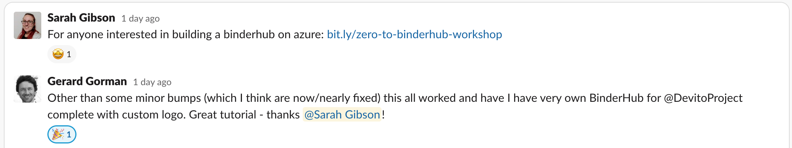
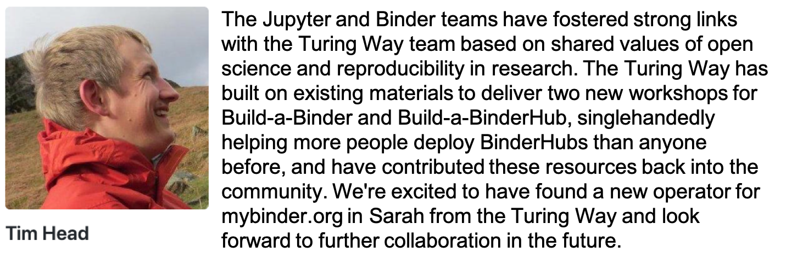

# Impact Statement

Sarah Gibson

# Draft: The Turing Way Impact Statement

Thursday 30th May 2019

## Summary

My role in The Turing Way project was providing technical support for reproducible computational environments and the Champions project by using [Binder](https://mybinder.readthedocs.io/en/latest/) and [BinderHub](https://binderhub.readthedocs.io/en/latest/index.html).
I worked on deploying BinderHub to Microsoft Azure and improving the documentation to make it easier for others to deploy their own BinderHubs to Azure.

I have deployed two BinderHubs to Azure at The Alan Turing Institute.
Hub23 is an internal BinderHub for use amongst the Research Engineering and academic teams and it authenticates users against a white-listed GitHub organisation.
The Turing Way Hub is a specialised Hub deployed on larger virtual machines to provide greater computational resources.
This will support case studies featured in the Turing Way handbook that cannot be run on [mybinder.org](https://mybinder.org) due to computational limitations.
Any lessons I learned during deployment of these Hubs, I fed back to the Jupyter and Binder teams in the form of documentation and discussion.

I have written and presented workshops on using [Binder for research reproducibility](https://bit.ly/zero-to-binder-tutorial) and how to [deploy BinderHub](https://bit.ly/zero-to-binderhub-workshop) as a service for Research Software Engineers and IT Services personnel.
I have also represented The Turing Way and Binder projects by giving talks at the [UKRI Cloud Working Group](https://github.com/alan-turing-institute/the-turing-way/blob/master/conferences/presentations/UKRI_cloud_2019-02-12/UKRI_cloud_demo_2019-02-12.md) conference, participating in the Software Sustainability Institute's Collaborations Workshop, and leading a hack project to [automate BinderHub deployment](https://github.com/alan-turing-institute/binderhub-deploy) at the [Microsoft Reactor Sprint](https://research-software-reactor.github.io/).
The Build-aBinderHub workshop has also been accepted at [RSE Conference 2019](https://rse.ac.uk/conf2019/).

## Impact

My work on BinderHub will introduce an interactive element to The Turing Way handbook which will hopefully elevate the user experience of reproducibility.
Providing an internal BinderHub as a service within The Alan Turing Institute will also make reproducible workflows easier for our researchers to implement.

By being a visible member of the team at a range of research-based events, I have been able to champion reproducibility, The Turing Way and Binder projects throughout the research community and disseminate the lessons I've learned through the workshops I've presented.

Also as a result of my contributions to the Binder project, I was asked to join the team that operates and maintains mybinder.org.

_Add quotes from Chris, other core Binder members._

## Personal Experiences

For me, joining the Turing Way project was a bit of a baptism of fire.
I had never worked in a large, community-driven project before and the technology and skills required for the BinderHub were unlike anything I had used before.
I am proud that I was able to leanr the required skills and tools, deploy multiple BinderHubs and engage in the community over the relatively short course of the project.
My hard work was rewarded by the invitation to join the Binder operator team.

Some of the most positive experiences from The Turing Way were seeing the reputation and interest around the Binder project, and more generally the concept of reproducibility, grow amongst fellow RSEs and researchers.
Working collaboratively on a project (for example, the auto-deployment of BinderHub at Microsoft Reactor Sprint) was a much more exciting and positive experience of research and community than I had during my PhD.
I hope to transfer these aspects into future projects I pursue.
