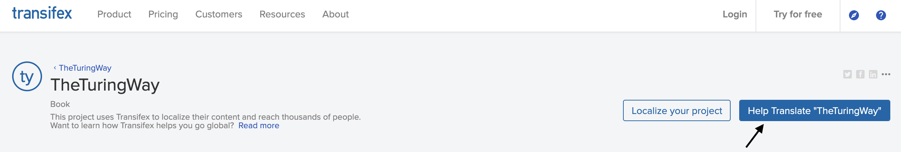
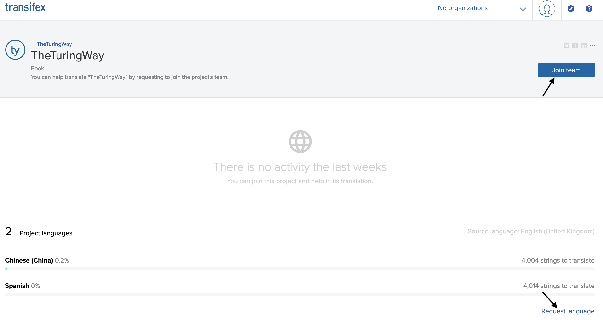
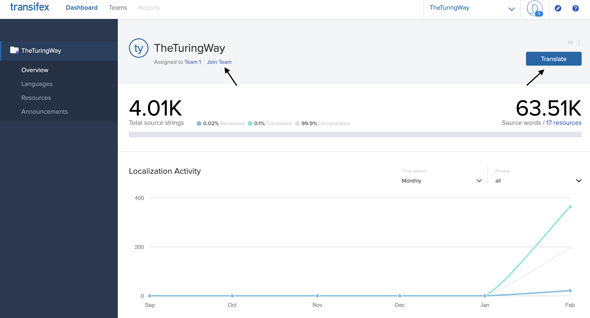
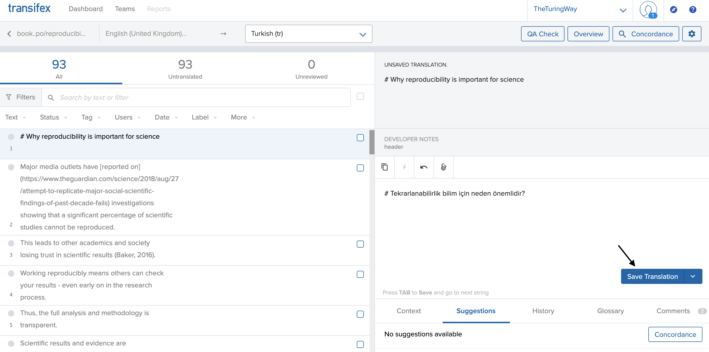
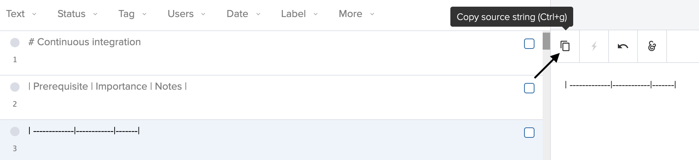

# Translation Guide

This guide will help you contribute to an existing language translation of The Turing Way, start the process of translating a new language, as well as a few hints when translating and some implementation details.

## How to join an existing translation team?

Go to [Transifex](https://www.transifex.com/theturingway/theturingway/) and click "Help Translate TheTuringWay" (button in blue). If you don't already have an account, you'll be asked to sign up for a free account. Once signed in, you can then "Join a team" to contribute to an existing translation or start a new language translation by "Request language" and follow the instructions in the section below.

## How to start a new translation?

If there's not a translation for a language you want to add, you can follow the steps below (note that these steps only need to be carried out once per language).

- To start a new language, within the `the-turing-way` repository,
    - In `book/content/po` directory contains POT and PO files. POT files are generated from the Markdown files and contains the original strings of the book; PO files contain the original string and their translations.
    - add the language's ISO code to:
        - the `LINGUAS` file in `book/content/po` - and make sure to keep a newline character at the end of the file
        - and to the `keep_files` list in `book/website/_config.yml`
    - From within `book/content`, we then need to copy all the POT files to make corresponding PO files with the following bash command,

        `for FILE in *.pot; do echo $FILE; cp $FILE ${FILE%%.*}.<LANG>.po; done`

Once your request of a new language has been accepted by the maintainer, you'll then be able to start contributing your translations!

<!-- TODO explain what the above step does (i.e. adds a template for Transifex to use) -->

<!-- TODO make sure this has been commented out in po4jupyterbook repo - To compile the POs to translated Markdown files, you are required to fill in the header section of the PO files. Please see existing PO files for an example of dummy data. The compilation process will fail if the header information is not filled in. The PO files submitted by Transifex should have these filled in. -->

## Translating on Transifex

After signing in and joining "TheTuringWay" organisation, you will then be able to start contributing translations by clicking the "Translate" button in the Transifex dashboard (shown below). Remember that in order to start contributing for a particular language, you'll need to "Join the team" first.

From there, you'll be offered a list of sections of the book to select and can then add your translation for individual lines of the book and save the translation.

As shown above the lines to translate also include the Markdown syntax (`#`, for example) and its important to keep these when translating to keep the original structure of the book. You can automatically copy this to the translated version, which is useful when dealing Markdown syntax such as tables.

## What happens when the markdown content of the book changes?

When the Markdown files are updated, you will need to update the POT files for the new strings to show up in Transifex.

 - Clone `po4jupyterbook` to the root directory of the project, within `the-turing-way` repository,

    `git clone https://github.com/tonyyzy/po4jupyterbook`
- Then, from within `the-turing-way/book/content` run,

     `../../po4jupyterbook/create.sh`

This will update the POT files to track the modified Markdown files. Since there are timestamps in the POT files, git will always show there is something to commit even all the marterial is the same. To make this CI-able, we can remove the timestamp from the `po4jupyterbook` code. We shall only update the POT files manually when we know for sure there are changes for now.

## Implementation details

The philosophy behind the implementation is to make translation work without impacting the existing build process. Jupyterbook builds by copying the Markdown files to the `_build` directory under `book/website` with some parts added. Jekyll builds by compiling the Markdown files to HTML files in the `_site` directory.

The shell script that handles building of the translations is in [`book/website/scripts/multilingual_make.sh`](book/website/scripts/multilingual_make.sh)

A rundown of steps taken by `multilingual_make.sh`:
- clone `po4jupyterbook` to the root directory of the repository  
- compile the translated markdown files to `book/content/locale`  
- copy and make a config file for Jupyterbook to build the translations  
- for each language in [`book/content/po/LINGUAS`](book/content/po/LINGUAS)  
    - make specific table of content file for this language by adding the language code to the start of the URL  
    - `jupyter-book build` copys Markdown files to the `_build` directory and adds some boilderplate parts  
    - use `find` and `sed` to substitute all the `../figures` to `../../figures` so the figures can be directed corretly  
    - Jekyll build  
    - remove the Markdowns from the `_build` directory so they don't get built by Jekyll again in another language build  
- Restore the table of content file to the original version for the English version build  

### Transient files during the build process

The table of content for (`toc.yml`) contains the book structure and controls the urls of the book. We only need to maintain one version of the file as the table of content for each language is generated during the build process by adding the language code to the urls.

The configuration file for Jupyterbook (`_config.yml`) points to where to find the book content Markdown files. 

### Translation of pictures

We hope that pictures and illustrations can be translated as well. Those pictures can be stored in the same place as the original ones with language code added.

## Commonly asked questions

- When will my translations appear in the book?
    
    Contributed translations will appear in the online book once the `translation` branch will be merged into the `master` branch of `the-turing-way` repository.
    <!-- TODO add more specifics here! -->

TODO: this guide is a work in progress - need to add points about general contributing guidelines such as priority of sections to translate for people willing to translate. 
