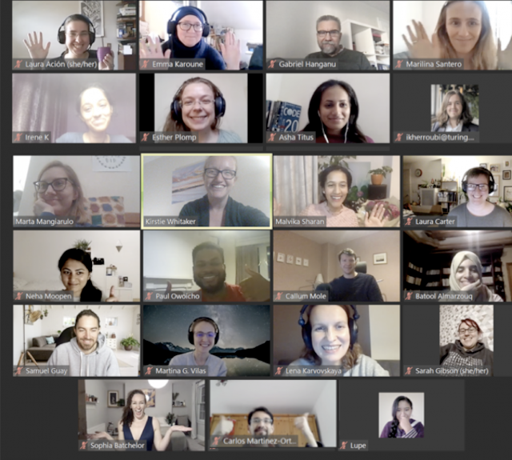

# Book Dash November 2020 Report

The fourth _The Turing Way_ Book Dash was hosted online from 9-13 November 2020 by Malvika Sharan and Kirstie Whitaker.

## Overview

_The Turing Way_ [Book Dash events](https://the-turing-way.netlify.app/community-handbook/bookdash.html) are a less intense version of [Book Sprints](https://en.wikipedia.org/wiki/Book_sprint), where participants collaboratively work on _The Turing Way_ book synchronously to develop new chapters and review/edit existing ones to make them more accessible, comprehensive and up-to-date.
They also contribute to enhancing the project by improving the ways we work in the community and take lead on accomplishing different tasks or subprojects.

In the past, we have organised 1-1.5 day long Book Dash events in person or partially remote.
However, with the COVID-19 pandemic situation this year, we moved November's Book Dash online and designed them with multiple short co-working sessions spread over 5 days for flexible participation by members in different time zones.

## Table of Content

- [Book Dash November 2020 Report](#book-dash-november-2020-report)
  * [Overview](#overview)
  * [Table of Content](#table-of-content)
    + [Date and format of the event](#date-and-format-of-the-event)
    + [Application, Review and Selection process](#application--review-and-selection-process)
    + [The book dash participants and event plan](#the-book-dash-participants-and-event-plan)
  * [Pre-dash drop-in calls: 4 November 2020](#pre-dash-drop-in-calls--4-november-2020)
  * [Book Dash Week: 9-13 November 2020](#book-dash-week--9-13-november-2020)
      - [Highlights of contributions from the event](#highlights-of-contributions-from-the-event)
      - [Participants from the BioHackathon-EU event](#participants-from-the-biohackathon-eu-event)
    + [Informal sessions](#informal-sessions)
    + [Community Share-out](#community-share-out)
  * [Illustrations by Scriberia Artist: Jem Milton](#illustrations-by-scriberia-artist--jem-milton)
  * [Feedback](#feedback)
    + [Pluses](#pluses)
    + [Deltas](#deltas)
  * [What's next?](#what-s-next-)
    + [Attend online Collaboration Cafes and coworking calls](#attend-online-collaboration-cafes-and-coworking-calls)
    + [Contribute new topics or review open pull requests](#contribute-new-topics-or-review-open-pull-requests)
    + [Represent _The Turing Way_ in your community/conference](#represent--the-turing-way--in-your-community-conference)
    + [Join us on social media platforms](#join-us-on-social-media-platforms)

### Date and format of the event

The November edition of Book Dash was hosted from 09-13 November 2020.
This was organised in parallel to Biohackathon-EU 2020 where _The Turing Way_ was selected as one of the [hacking projects](https://www.biohackathon-europe.org/projects.html).
The aim was to ensure that we can engage people interested in contributing specifically to _The Turing Way_ from different parts of the world, who may or may not be attending Biohackathon-EU.

We developed a format which could allow people in different time zones to participate with the same efficiency and equitable support.
This involved creating multiple small development sessions throughout the day, adding dedicated sessions for informal social interactions, developing shared documents with all the information, providing support fund to ensure that everyone can comfortably participate and hosting a pre-event call to communicate these resources to everyone.

### Application, Review and Selection process

As in the past, we invited applications through an open call where interested applicants could state their goals and interest for the Book Dash.
This application was also open for the long term members from the community who may have attended a Book Dash or Collaboration Cafes in the past to join as a helper and mentor for new contributors.

Applicants were asked to think about the collaborative element of the Book Dash and state how they could engage with other participants.
To get a sense of the time zones these applicants came from, we asked them to choose their preferred slots during the day that they can join.
You can see a template of this document [here](https://tinyurl.com/tw-bookdash-template).

We used the rubrics (as explained in the [online chapter](https://the-turing-way.netlify.app/community-handbook/bookdash/bookdash-application.html#reviewing-process)) to score the applications during the review and selection process.

### The book dash participants and event plan

Selected from a pool of applications, 20 candidates including two mentors were invited to attend this online event (see their names in the group picture below).

_Zoom screenshot of our community share-out event on 13 November 2020 at the Book Dash. Our Book Dash participants included Laura Acion (Argentina), Emma Karoune (UK), Marilina Santero (Spain/Argentina), Irene Komal (India), Asha Titus (UK), Ismael Kherroubi Garcia (Spain/UK), Martia Mangiarulo (UK/Italy), Laura Carter (UK), Neha Moopen (The Netherlands), Paul Owoicho (UK/Nigeria), Batool Almarzouq (Saudi Arabia/UK), Samuel Guay (Canada), Martina Vila (Germany), Sarah Gibson (UK), Sophia Batchelor (UK), Carlos Martinez-Oritz (The Netherlands), Lupe Canaviri Maydana (Bolivia) and Sangram Keshari Sahu (India). Several community members joined the share-out call on the last day._

A participation support fund was made available for the participants to purchase small equipment or other resources (such as headphone, webcam, second screen, or software) that could improve the quality of their participation and enhance their overall experience of working with us for the entire week.
They were asked to select at least one development session from the following slots each day (time given in UTC):
- Development session 1: 08:00 - 10:30
- Development session 2: 11:00 - 13:30
- Development session 3: 17:30 - 20:00

A longer break from 13:30 - 17:30 was given to allow people to participate in informal events, self-organised activities, accomplish their day-to-day task outside the Book Dash or take a break as required.

## Pre-dash drop-in calls: 4 November 2020

We hosted 2 pre-dash drop-in calls on 4 November 2020 to ensure that all our participants were familiar with the project, Book Dash and how they can get the most out of their participation ([HackMD notes](https://hackmd.io/@turingway/bookdash-nov2020-drop-in)).
The main aims of this call were to get to know our attendees, connect them with others and address their questions before the Book Dash.

Using a [SMART goal template](https://freespiritpublishingblog.com/wp-content/uploads/2015/08/setting-smart-goals.pdf) (by Danielle R. Schultz [2015]), we also facilitated goal-setting exercise for all the attendees to get them prepared for their participation during the Book Dash week.

Several participants shared their contribution plans and topics they would like to add in _The Turing Way_ that is either missing in the existing chapters or need to be updated.
You can read notes from these calls [here](https://hackmd.io/@turingway/bookdash-nov2020-drop-in).

## Book Dash Week: 9-13 November 2020

Kirstie Whitaker and Malvika Sharan kicked off each of these sessions by welcoming all the participants and sharing an overview of _The Turing Way_, ways of working on the project and resources available for the Book Dash attendees.
You can watch this presentation by Kirstie during one of the sessions on [YouTube](https://www.youtube.com/watch?v=ihWt-jzuHps&list=PLBxcQEfGu3DlXmOGBN8UKzFYITqKrgCwc).
Slides are available on [Zenodo](https://zenodo.org/record/4263451) (The Turing Way Book Dash - November 2020. Zenodo. http://doi.org/10.5281/zenodo.4263451).

Each development session followed the [coworking techniques](https://the-turing-way.netlify.app/community-handbook/coworking/coworking-motivation.html#techniques) that we also use for our [Online Collaboration Cafés](https://the-turing-way.netlify.app/community-handbook/coworking/coworking-collabcafe.html).
To facilitate a shared timer we used the [browser-based cuckoo clock](https://cuckoo.team/tw-bookdash).
A shared HackMD with agenda, resources and information was set up to ensure that all participants can centrally take notes and follow different session.
You can see the template document: https://hackmd.io/@turingway/template-bookdash-nov2020.

#### Highlights of contributions from the event

-  *Contributors to the Guide for Ethical Research*: **Ismael Kherroubi Garcia, Laura Carter and Sophia Batchelor (UK)** were joined by **Irene Komal P. (India), Asha Susan Titus (UK) and Laura Acion (Argentina)** who managed to work on multiple chapters for the Guide for Ethical Research.
    -   Specifically, Ismael, Laura C. and Sophia managed to complete the chapter on [Introduction to Ethics](https://the-turing-way.netlify.app/ethical-research/ethics-intro.html) and drafted several other chapters in the following Pull Requests (PR): [#1394](https://github.com/alan-turing-institute/the-turing-way/pull/1394), [#1498](https://github.com/alan-turing-institute/the-turing-way/pull/1498) and [#1649](https://github.com/alan-turing-institute/the-turing-way/pull/1649). Laura A. contributed to reviewing a few of these PRs.
    -   Irene wrote a chapter on Data Anonymisation, currently being edited in [PR #1579](https://github.com/alan-turing-institute/the-turing-way/pull/1579).
    -   Asha started a chapter on activism ([PR #1582](https://github.com/alan-turing-institute/the-turing-way/pull/1582), which is currently edited by Laura in this PR: [#1675](https://github.com/alan-turing-institute/the-turing-way/pull/1675).
-  *Leadership in Data Science*: **Laura Ación (Argentina) and Lupe Canaviri Maydana (Bolivia)** worked on multiple subchapters on leadership available in the Guide for Collaboration, which is being co-edited by Malvika in this PR: [#1553](https://github.com/alan-turing-institute/the-turing-way/pull/1553).
-  Continuous Integration Services: **Batool Almarzouq (Saudi Arabia) and Brigitta Sipőcz (USA)** together designed a subchapter on GitHub actions that will be added to the Continuous Integration chapter in the Guide for Reproducible Research ([PR #1588](https://github.com/alan-turing-institute/the-turing-way/pull/1588) and [#1558](https://github.com/alan-turing-institute/the-turing-way/pull/1558)).
-  *Translation Process*:
    -  Batool managed to translate the README file in Arabic ([PR #1586](https://github.com/alan-turing-institute/the-turing-way/pull/1586)).
    -  **Samuel Guay (Canada)** started to work on different aspects of translation, set up the Transifex files for the French translation, reviewed the [README-French.md](https://github.com/alan-turing-institute/the-turing-way/blob/main/README-translated/README-French.md) and suggested the hypothes.is for web annotation to merge into the GitHub repository.
    -  **Marilina Santero (Spain)** translated our promotional materials in Spanish, submitted an abstract for PyDay Chile 2020 event to present a talk about _The Turing way_ and after the Book Dash presented the talk. See the slides on Zenodo ([https://zenodo.org/record/4300282](https://zenodo.org/record/4300282))
-  *Book's Accessibility*: **Paul Owoicho (UK), Neha Moopen (The Netherlands) and Emma Karoune (UK)** worked on book’s accessibility aspects that included a chapter on maintaining consistency, a chapter on GitHub for beginners, compiling glossary terms and designing templates to facilitate future contributions.
    - Especially, Paul worked on many of his goals from [Google Season of Doc](https://github.com/alan-turing-institute/the-turing-way/blob/main/communications/GSOD-applications/GSoD-2020-Project-Report.md).
    -  Paul and Neha completed the chapter on [Maintaining Consistency in the book](https://the-turing-way.netlify.app/community-handbook/consistency.html) and developed a series of [templates for new authors](https://the-turing-way.netlify.app/community-handbook/contributing.html).
    -  Emma edited a chapter on [Getting Started with Github](https://the-turing-way.netlify.app/collaboration/github-novice.html) and populated the [Glossary page](https://the-turing-way.netlify.app/afterword/glossary.html) located in the Afterword of the book.
-  *Individual Projects*:
      - Brigitta also participated in several discussions around software development and managing community projects, and opened a few more PRs related to _The Turing Way_ GitHub workflow.
      - **Veronika Cheplygina (The Netherlands)** started a chapter on project workflow and Task Management that will be hosted in the Guide for Project Design ([PR #1442](https://github.com/alan-turing-institute/the-turing-way/pull/1442)).
      - **Carlos Martinez-Ortiz (The Netherlands)** managed community contributions to the chapters in Reproducible Research from his team members from Netherlands eScience Centre that included a chapter on [Code Review](https://the-turing-way.netlify.app/reproducible-research/reviewing.html) and [PR #912](https://github.com/alan-turing-institute/the-turing-way/pull/912)).
      - **Marta Mangiarulo (UK)** worked on a chapter on data visualisation ([PR #1563](https://github.com/alan-turing-institute/the-turing-way/pull/1563)) and pre-registration ([issue #1585](https://github.com/alan-turing-institute/the-turing-way/issues/1585)), and reviewed several chapters to fix typos and bugs.
      - **Sangram Keshari Sahu (India)** worked on creating a case study for reproducibility in bioinformatics ([PR #1587](https://github.com/alan-turing-institute/the-turing-way/issues/1587)).

All the participants were very supportive of each other's work and reviewed PRs beyond their contributions.
Two core contributors **Martina G. Vilas and Sarah Gibson** also participated in the Book Dash to facilitate mentored contributions, especially by supporting participants who were new to the projects.
Additionally, Sarah reviewed several Pull Requests and helped Malvika merge the chapter on [Remote Collaboration](https://the-turing-way.netlify.app/collaboration/remote-collab.html).
Martina onboarded Lupe and Laura by offering mentorship in Spanish and helped Batool integrate [web.hypothes.is](https://web.hypothes.is/) to enable [web-annotation and commenting](https://jupyterbook.org/interactive/comments.html) on _The Turing Way_ content.
On 12 November 2020, Martina also gave a talk at the Brainhack Donostia 2020 on Computational Reproducibility.
Under the title “A How-To Guide Based on The Turing Way”, she shared useful tips and tools for computational reproducibility. Her talk is also available on Zenodo: [http://doi.org/10.5281/zenodo.4269795](http://doi.org/10.5281/zenodo.4269795).

#### Participants from the BioHackathon-EU event

Several participants who were attending BioHackathon-EU joined us for several development sessions and participated in social calls.
Special thanks to **Kim De Ruyck** for writing a subchapter on [Research Data Management Toolkits](https://the-turing-way.netlify.app/reproducible-research/rdm/rdm-toolkits.html), **Albert Hornos and Jose Maria Fernandez** for reviewing several open PRs on the GitHub repository, **Philippe Rocca-Serra** for creating a draft capturing the [interoperability between _The Turing Way_ and FAIR CookBook]([https://github.com/FAIRplus/the-fair-cookbook/blob/dev/docs/content/recipes/introduction/turingway.md](https://github.com/FAIRplus/the-fair-cookbook/blob/dev/docs/content/recipes/introduction/turingway.md)
) and **Wolmar Nyberg Åkerström** for looking into some styling issue of Jupyter Book.

### Informal sessions

The Book Dash events were always meant to enable collaboration and connections among individuals in our community.
Over the entire week of Book Dash, we had allocated free slots for self-organised social events in addition to a few pre-planned sessions.
Participants were also provided with an additional fund to pay for their subsistence expense and treat themselves with their favourite meals or snacks during the Book Dash.
These events were quite delightful are we could chat about our other interests, share interesting resources and find common interests with others.

Particularly, on Day-2 we hosted a themed Coffee discussion with the topic "Science and Open source role models" where attendees shared their personal stories of individuals who inspired them to pursue science or open source practices.
On Day-3 we hosted the "Show and Tell - Family Meal" for people to get to know each other over a meal (breakfast, lunch or dinner based on their time zone).
This was done to mainly emulate how we would have shared meals and enjoyed special treats if the event were to take place in person.

### Community Share-out

On the last day, we hosted only 2 development sessions to document the current status and next steps of the projects started by attendees during the Book Dash.

Each session was followed by a 2-hour long community share-out events that were open for the community members to learn about what our Book Dash attendees had worked on.
Each participant got to demonstrate their work through small presentation and celebrate the collaborative work they got to do together.
You can watch recordings from these share-out sessions in [this YouTube playlist](https://www.youtube.com/watch?v=EZl6vgPzlvg&list=PLBxcQEfGu3DlXmOGBN8UKzFYITqKrgCwc&index=2).
Read more about the contributors in [issue #1584](https://github.com/alan-turing-institute/the-turing-way/issues/1584).

## Illustrations by Scriberia Artist: Jem Milton

Illustration by Scriberia artists had added enormously to the productivity, enthusiasm and outcome of the Book Dash events in the past.
We continued this tradition by inviting Jem Milton this time, who spent 3 days, from 10 to 12 November, interacting with the participants and developing new sets of illustration for _The Turing Way_ community.
Our attendees discussed their ideas with Jem and captured important concepts they were working on during the Book Dash or something that they are interested to work on in the future.

We took this opportunity to co-create images to describe some of the community process and the general concepts used in the project.
The artwork has been shared on Zenodo under CC-BY 4.0 license and will be added in the book going forward.
You are welcome to share, reuse and distribute them by attributing "The Turing Way Community, & Scriberia. (2020, March 3). This image was created by Scriberia for The Turing Way community and is used under a CC-BY licence. Zenodo. http://doi.org/10.5281/zenodo.4323154".

## Feedback

At the end of the event, we asked our participants to share feedback anonymously in the ["Pluses and Deltas" HackMD](https://hackmd.io/@turingway/bookdash-nov2020-feedback-day5).
We greatly appreciate the work that our attendees have accomplished in the project during this short event and thank them for their feedback, a few of which have been highlighted below.

### Pluses

- Just being able to speak with other people interested in building The Turing Way is exciting, and the Book Dash allows for creating these opportunities to connect!
- Working so collaboratively has been amazing! Using collaborative tools and having discussions to move work forward quickly has worked well.
- The Turing Way lives out to their motto of "too easy not to do" and I would add "outstandingly friendly, welcoming, diverse, and inclusive".
- I´ve felt so comfortable during this week. I´ve learned a lot about collaboration, open science and tools. I´m leaving with a lot of ideas to share and new colleagues to work with.
- Being able to collaborate with /enjoy loads of new perspectives and have things move 'quicker'
- Being part of a community [...]. These events are especially important as we are socially distant and increasingly isolated during Covid-19 pandemic.
- I think The Turing Way is an amazing place both in terms of the book providing space for conversations that are REALLY important for data science and are often overlooked, but also in terms of being able to meet new people, understand new perspectives and have that help evolve your knowledge and work!
- Seeing how online collaboration can be utilised so successfully across a range of locations when people may never have the opportunity to meet in public.
- I like how diverse the Turing way community and how welcoming for newcomers regardless of their expertise.
- I pushed myself out of my comfort zone, I was able to talk a bit to people from different field and backgrounds (and I would like to continue that!). I really appreciated the "good first issue" option as it helped familiarise myself with how collaboration through git
- This project gives me hope for science. It gives me hope for the future. And it brings so much joy into my daily life that I feel humbled and honoured to work alongside y'all.
- The structured working blocks really helped me stay productive and focused.
- Felt like a true safe space to work and talk about any _hot_ topic and learn from everyone.
- The group was simply lovely and welcoming, I really got a sense of community. I also liked whenever I/anyone proposed an idea, it was just taken on or facilitated in some way. Nothing is ever shot down.

### Deltas

- The learning curve when it comes to getting across the GitHub is a little steep.
- I think having other people responsible for answering some of the questions will be great and even help to moderate some of the session.
- I like the HackMD, but I found it a bit difficult to navigate as it got bigger and bigger.
- An optional training session on GitHub or a parallel activity just for beginners could be useful.
- Sometimes the Pomodoro doesn't work perfectly with that internal work timing.

## What's next?

Our global community of contributors like these Book Dash attendees have been helping us develop a truly community-led guidebook by including their perspectives and voice into the project.
Without a doubt, this event was successful at bringing together a diverse set of participants not only from across different research topics but also different backgrounds and interests.
Each of them was able to bring their personal strengths and skills into this event and ultimately to the project.

### Attend online Collaboration Cafes and coworking calls

Our [online Collaboration Cafes](https://github.com/alan-turing-institute/the-turing-way/blob/main/project_management/online-collaboration-cafe.md) take place every first and second Wednesdays from 15:00 to 19:00 GMT.
Everyone interested in learning from or developing this project can join us for any duration possible for them.
See details here: [https://hackmd.io/@turingway/collaboration-cafe](https://hackmd.io/@turingway/collaboration-cafe).
Every week we host two 1-hour long co-working calls, on Mondays and Thursdays from 11:00 to 12:00 GMT.
At these calls, you can work on your ongoing contributions to the project or get a quick demo about the project for your onboarding.
See details here: [https://hackmd.io/@turingway/coworking-call](https://hackmd.io/@turingway/coworking-call).

If the current schedule of these calls is not suitable for your time zone, you are welcome to host one in your community/time zone.

### Contribute new topics or review open pull requests

If you want to start to get to know the project or want to return after a long break, you can begin with our [good first issues](https://github.com/alan-turing-institute/the-turing-way/issues?q=is%3Aissue+is%3Aopen+label%3A%22good+first+issue%22).
If you have a new idea that you would like to add to the project as a new section in an existing chapter, or as a whole new chapter, you can start by creating a [new issue](https://github.com/alan-turing-institute/the-turing-way/issues/new/choose).
We also invite you to contribute in any capacity that's most suitable for your interests and availability.
Please help us review one of the several open [Pull Requests](https://github.com/alan-turing-institute/the-turing-way/pulls), join discussions on [these issues](https://github.com/alan-turing-institute/the-turing-way/issues) or get help in exploring resources that currently exist in [the book](https://the-turing-way.netlify.com/).

### Represent _The Turing Way_ in your community/conference

If you are attending an Open Research conference and would like to represent our community, please get in touch with _The Turing Way_ team.
They will be happy to help you connect your work with the project, assist you in drafting an abstract for the event and help you prepare to deliver a short workshop or presentation.

Any community member who has contributed to the project can volunteer to give a short talk or workshop on the relevance, challenges and opportunities of open and reproducible research.
The interested member can request to receive some 1:1 coaching with Kirstie and Malvika, practice their presentation skills (reusing slides or making their own), and influence the engagement of researchers not already involved in the project.

### Join us on social media platforms

You can also sign up for our newsletter that we release every month: https://tinyletter.com/TuringWay/.
You are welcome to [join our Gitter channel](https://gitter.im/alan-turing-institute/the-turing-way) for informal discussions.
We are also on [Twitter as @turingway](https://twitter.com/turingway), follow us for the latest updates.

Have more ideas or questions about the project, the book dash event or something else related to our community?
Please feel free to reach out to the team members (theturingway@gmail.com) or directly contact the community manager Malvika Sharan (by emailing (msharan@turing.ac.uk).
