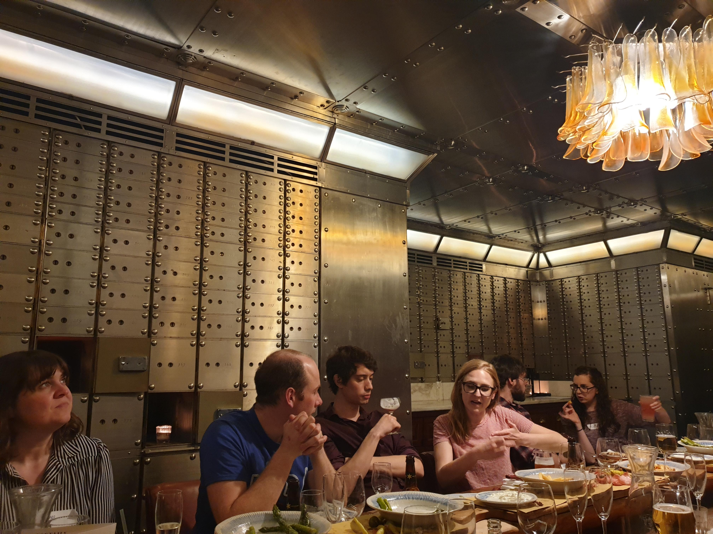
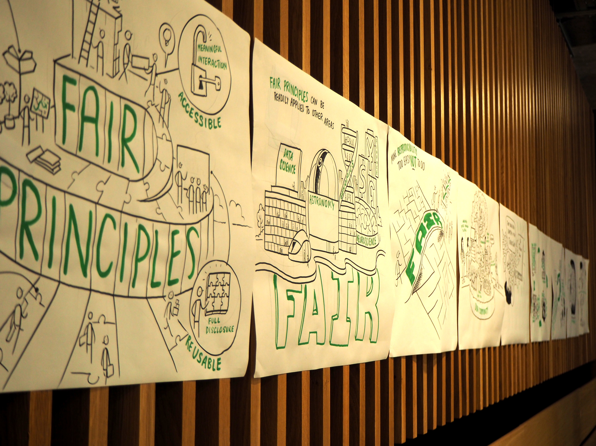
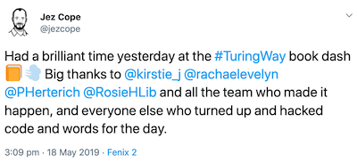
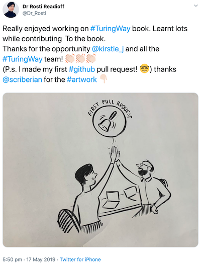

# The Turing Way | Book Dash - Manchester


* Intro to Book Dash MCR slides: https://github.com/alan-turing-institute/the-turing-way/blob/master/workshops/book-dash/IntroBookDashMCR.pdf
* HackMD: http://bit.ly/book-dash-mcr

## The participants


*Back row, left to right: Jez Cope, Will Hulme, Oliver Clark, Jade Pickering, Rosie Higman, Alex Clarke. Middle row, left to right: Clare Liggins, Beth Montague-Hellen, Patricia Herterich, Tania Allard, Kirstie Whitaker, Tarek Allam Jr. Front row, left to right: Matthew Kemp, Greg Kiar, Yo Yehudi, Rosti Readioff, Rachael Ainsworth, Javier Moldon. Photo credit: Jez Cope*

* Rachael Ainsworth [@rainsworth](https://github.com/rainsworth/)
* Tarek Allam Jr [@tallamjr](https://github.com/tallamjr)
* Tania Allard [@trallard](https://github.com/trallard)
* Oliver Clark [@OliJimbo](https://github.com/OliJimbo)
* Alex Clarke [@informationcake](https://github.com/informationcake/)
* Jez Cope [@jezcope](https://github.com/jezcope)
* Joe Fennell [@joe-fennell](https://github.com/joe-fennell)
* Patricia Herterich [@pherterich](https://github.com/pherterich)
* Rosie Higman [@rosiehigman](https://github.com/rosiehigman)
* Will Hulme [@wjchulme](https://github.com/wjchulme)
* Matthew Kemp [Scriberia](http://www.scriberia.co.uk/)
* Greg Kiar [@gkiar](https://github.com/gkiar)
* Clare Liggins [@ClareLiggins](https://github.com/ClareLiggins)
* Javier Moldon [@jmoldon](https://github.com/jmoldon)
* Beth Montague-Hellen [@AlfAWolf140](https://github.com/AlfAWolf140)
* Jade Pickering [@jspickering](http://www.github.com/jspickering)
* Rosti Readioff [@RostiReadioff](https://github.com/RostiReadioff)
* Kirstie Whitaker [@KirstieJane](https://github.com/KirstieJane/)
* Yo Yehudi [@yochannah](http://www.github.com/yochannah)


## Our report

### What did we do?

Our goal for the book dash was to bring together participants enthusiastic about reproducibility to contribute to and improve *The Turing Way* book during a one day collaborative event.
We held a networking event the evening prior to the book dash as a reward and thanks for taking time out to work on the project.
We had an icebreaker for participants to get to know each other and lightning talks where we prompted participants to share unique experiences, expertise or promote any projects that they're working on.
There was a great diversity of lightning talks which were really fun:
* Rachael talked about the women in data meetup group that she organises in Manchester: [HER+Data MCR](https://www.meetup.com/HER-Data-MCR/). :woman_technologist:
* Beth revealed what you can and cannot get away with in roller derby! :women_wrestling:
* Jez spoke about the tradition of Morris dancing and his experience as a Morris dancer. 🕺
* Oli wowed us all with a performance of the *Jabberwocky* poem written by Lewis Carroll. 🐉
* Rosti pitched her [Soapbox Science](http://soapboxscience.org/soapbox-science-2019-stoke-on-trent/) plans taking place in Stoke-on-Trent. 🔬
* Alex described his [Music and Machine Learning projects](https://github.com/informationcake/music-machine-learning), as well as his students' project on using ML to classify Gender of voices (and the complications and biases involved). 🎶
* Greg emphasised that a great way to learn more about a sport is through statistics! 🏀
* Kirstie impressed us with her experiences of dog training. 🐶
* Joe informed us about a bomb detector made from bees. 🐝


*Networking dinner in the Jamie's Italian Vault. Photo credit: Jez Cope*

During the dash, we set out to build upon the [Collaborations Workshop Hackday experience](https://github.com/alan-turing-institute/the-turing-way/blob/master/workshops/collabw19/hackdayreport_20190403.md): we wanted to enhance the first version of *The Turing Way* book and ensure that contributing to the project is as straightforward as possible.
We had a mixture of contributions including curating and editing existing content, expanding existing content and writing entirely new content.
Specifically:
* 38 new [issues and pull requests](https://github.com/alan-turing-institute/the-turing-way/labels/book-dash-mcr)! (13 issues, 25 pull requests tagged with ```book-dash-mcr```)
* Many of the pull requests have been reviewed, approved and published already, and issues closed!
* Proofreading and editing of existing chapters.
* Further information added to existing chapters.
  * Editing Version control chapter to aid understanding for novice users ([Pull request #500](https://github.com/alan-turing-institute/the-turing-way/pull/500))
  * Generalising the version control chapter so that it includes more background rather than just focusing on git
  * Added a Patient and Public Involvement section under the "Open Scholarship" header ([Issue #497](https://github.com/alan-turing-institute/the-turing-way/issues/497), [Pull request #510](https://github.com/alan-turing-institute/the-turing-way/pull/510))
  * Added content on data organisation in spreadsheets to the RDM chapter, ([Issue #481](https://github.com/alan-turing-institute/the-turing-way/issues/481), [Pull request #499](https://github.com/alan-turing-institute/the-turing-way/pull/499))
* New chapters on:
  * Reproducible data analysis pipelines for machine learning ([Issue #483](https://github.com/alan-turing-institute/the-turing-way/issues/483), [Pull request #477](https://github.com/alan-turing-institute/the-turing-way/pull/477), looking for reviewers)
  * Credit for reproducible research ([Pull request #485](https://github.com/alan-turing-institute/the-turing-way/pull/485), looking for reviewers)
  * Code styling for reproducibility ([Issue #124](https://github.com/alan-turing-institute/the-turing-way/issues/124), [Pull request #498](https://github.com/alan-turing-institute/the-turing-way/pull/498))
* Reviewed pull requests.
* Restructuring of the chapter sections.
* A pull request to Jupyter Book: [Adding search button on Jupyter Book](https://github.com/jupyter/jupyter-book/pull/196)
* Improved the ease of contributing to the project through enhanced pull request/issue templates, organisation of the repo, search functionality and continuous integration within the book.
* Acknowledged contributors! :tada:
* Gorgeous graphics! :heart_eyes:


*Art by Matthew Kemp of [Scriberia](http://www.scriberia.co.uk/). Photo credit: Jez Cope*


## What did we learn?

* 2 first pull requests!! :bell: :bell:
* First iterative review experience in a pull request.
* It would be helpful to have a dedicated table for git/GitHub newbies and introduce them to collaborating through GitHub before diving into contributing to lower the barriers - perhaps have them read and feed back to the [Collaborating on GitHub/GitLab chapter](https://the-turing-way.netlify.com/collaborating_github/collaborating_github.html).
* Bring markdown cheat sheets.
* When adding participants as collaborators to the project on GitHub, let them know and make sure they are aware of the email they've received and added functionality that comes with it.
* Add explicit guidance on putting GitHub handles into the intro presentation and trying to make sure this happens in the initial brain storming session to keep track of contributors.


## Feedback

At the end of the event, we asked participants to tell us anonymously something that they liked about the book dash and something they would change in an exercise called Pluses and Deltas which were recorded in [this HackMD](https://hackmd.io/9IIQpagHQoOGlwUnY98xQA).
The main pluses included that the book dash was a really supportive and inclusive environment, was well-organised, that the icebreaker was brilliant, a great mix of people were involved with different expertise and that the participants really enjoyed having the artist in residence from [Scriberia](http://www.scriberia.co.uk/)!
Some aspects of the book dash that the participants would change would be to include a friendlier introduction to Git/GitHub, more guidance on what tasks to take up and more time!

## Impact

Beth Montague-Hellen ([@AlfAWolf140](https://github.com/AlfAWolf140)) wrote a [blog post](https://montaguehellen.wordpress.com/2019/05/20/the-turing-way-and-a-return-to-github/) reflecting on her experience and many participants tweeted using [#TuringWay](https://twitter.com/hashtag/TuringWay)!






