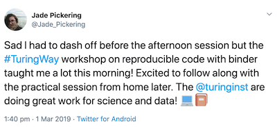
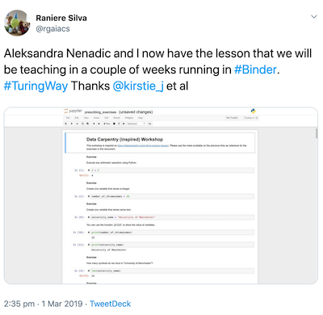
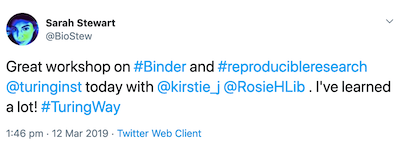
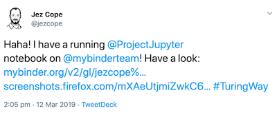
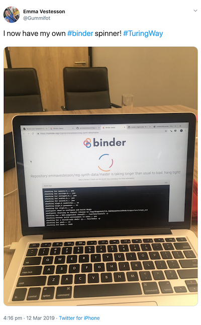
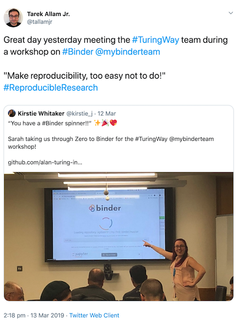

# Feedback report on The Turing Way 'Boost your Research Reproducibility with Binder' workshops in March 2019

The Turing Way team held two 'Boost your Research Reproducibility with Binder' workshops in March 2019.
At the end of each workshop participants were asked to fill in feedback forms rating their understanding and confidence before and after the workshop, what they liked about the workshop, what could be improved and whether they will use Binder in the future.

## Understanding and Confidence
On average participants reported an increase of between 30 and 50% in their understanding and confidence in using Binder, capturing their computational environment and reproducing their research.
The biggest increases (50%) were in understanding what Binder does and in feeling confident in using Binder for their own work.
Participants showed the smallest increase in understanding how to capture a computational environment and feeling confident in sharing their reproducible work.
The latter may be seen as a positive outcome of the workshop, as one of the secondary goals was to demonstrate the many different factors which go into making research reproducible.

## Positive feedback

Most of the positive feedback centres on the friendly atmosphere, helpful instructors and good balance of presentations and hands on activities.
Some selected comments are included below:
* "Good presenters. Enthusiastic. Honest in presenting limitations. Excellent overview of Turing Way."
* "I liked the format (a bit of introduction and background story and then half a day of hands-on coding) as well as the content: well-thought and very relevant. Presenters and helpers were all brilliant and extremely approachable."
* "Good structure. Initial examples were useful and interesting, and very conveniently prepared with clear instructions. Overall, very good attention to detail in making things easy and streamlined for participants."

Participants also tweeted using the [#TuringWay](https://twitter.com/search?q=%23TuringWay) hashtag:

## Areas for improvement

Whilst the vast majority of feedback was positive there were a couple of areas participants identified could be improved:
* Those using R suggested that participants should be warned about some difficulties using R with Binder and in particular the tidyverse package which takes a long time to build
* Some people requested that the demonstrations in the afternoon were slower
* Those who were less familiar with Git terminology and markdown requested that some time was taken to explain these terms and help people get set up.

## Impact

16 out of 22 participants said that they would use Binder in some capacity in the future. 
Most people intended to use Binder to share small snippets of code or for teaching purposes.
