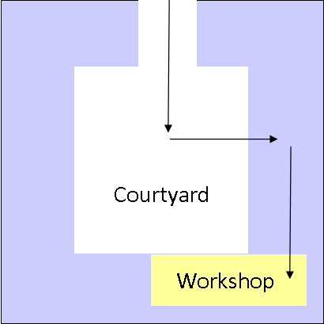

Hi!

We are looking forward to welcoming you to the 'Build a Binderhub' workshop in Sheffield next week! We have a couple of things for you to look at before the workshop and some more information about what is happening on the day:

## Getting ready
We have funds available for travel and childcare support. Please get in touch with theturingway@gmail.com to discuss how we can support you.

Before you arrive please make sure you have the following:
* A [“Free Trial” subscription on Microsoft Azure](https://azure.microsoft.com/en-gb/free/) or an existing Azure account with an active subscription you would like to use
* A [DockerHub account](https://hub.docker.com/) (free sign up)

If you have time beforehand you may want to look at the installation requirements [here](https://github.com/alan-turing-institute/the-turing-way/blob/SG/binderhub-workshop/workshops/build-a-binderhub/workshop-presentations/zero-to-binderhub.md#installation-requirements-) so that you can install the tools needed beforehand. This is not essential but it will save time on the day!

## On the day
There is now an updated [agenda](https://github.com/alan-turing-institute/the-turing-way/blob/main/workshops/build-a-binderhub/agenda.md) available and please note that we will begin registration at 9.30am and will formally close at 4pm so that those with caring responsibilities can get home!

We are dedicated to an inclusive and supportive event. Please read the code of conduct before you come along: *[The Turing Way Code of Conduct](https://github.com/alan-turing-institute/the-turing-way/blob/main/CODE_OF_CONDUCT.md)*. We encourage you to tweet and share your thoughts using #TuringWay, if you would not like to be included in any photographs we will have stickers you can use on your name badge to let us know!

## Travelling to the University of Sheffield
There is general advice on travelling to the University of Sheffield on [their website](https://www.sheffield.ac.uk/visitors/mapsandtravel). The workshop will be held in the [Regent Court building](https://www.sheffield.ac.uk/ssid/maps/regent-court). To get to the workshop room enter Regent Court's courtyard via the entrance on the north side of the building, then follow this map to the room the workshp is being held in:

If you have any questions ahead of the event please drop us an email at theturingway@gmail.com.

We look forward to seeing you in Sheffield!

The Turing Way team
