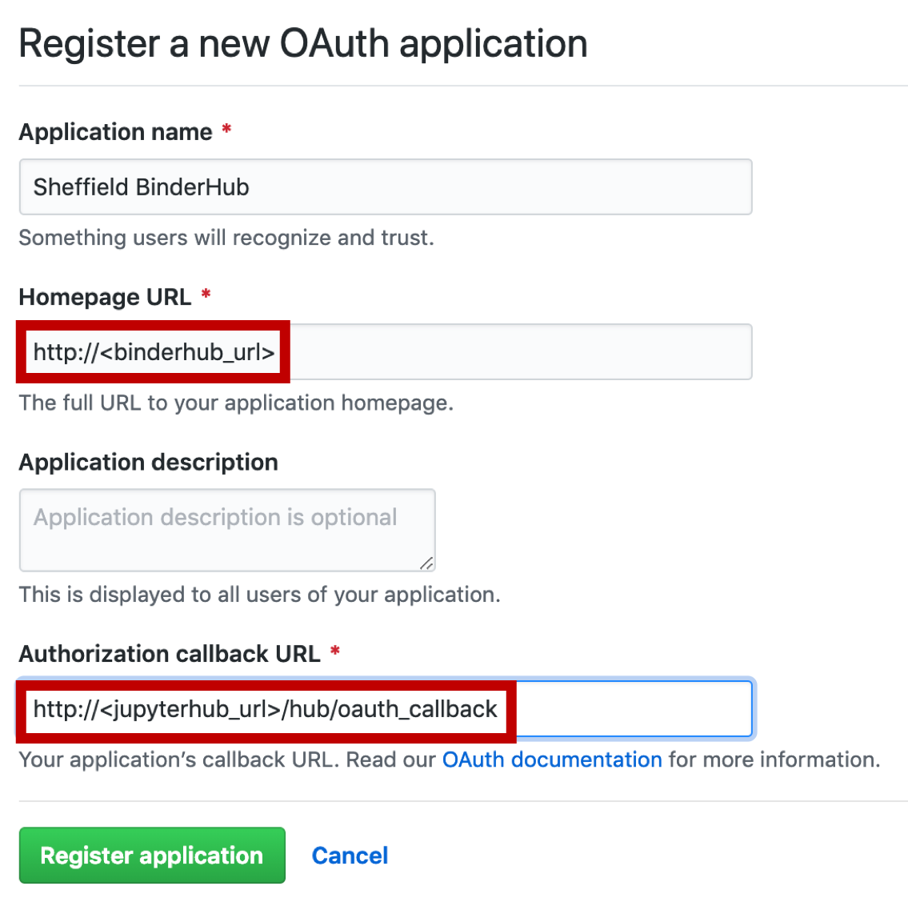

# Zero to BinderHub! <a name="title"></a>

Sarah Gibson, _The Alan Turing Institute_

[**The Turing Way**](https://github.com/alan-turing-institute/the-turing-way) - making reproducible data science _too easy not to do_!

These steps will walk you through deploying a BinderHub on Microsoft Azure.
It will be publicly available like [mybinder.org](https://mybinder.org).
To follow along with these instructions, go to this link: [**bit.ly/sg-zero-to-binderhub**](http://bit.ly/sg-zero-to-binderhub)

**BinderHub Documentation:**
* [Step Zero: Setting up a Kubernetes Cluster](https://zero-to-jupyterhub.readthedocs.io/en/latest/create-k8s-cluster.html)
* [Setup JupyterHub](https://zero-to-jupyterhub.readthedocs.io/en/latest/#setup-jupyterhub)
* [Setup BinderHub](https://binderhub.readthedocs.io/en/latest/setup-registry.html#set-up-the-container-registry)

## Cloud Resource Requirements <a name="cloudresoures"></a>

This workshop assumes you have a "Free Trial" subscription with [Microsoft Azure](https://azure.microsoft.com/en-gb/).
It's quick to set one up and you get £150 free credit for the first 30 days as well as access to some _always free_ services.

> BinderHub is Cloud-neutral.
> We are using Azure as an example.

## Container Registry <a name="containerreg"></a>

These instructions will link the BinderHub to a [DockerHub](https://hub.docker.com/) Container Registry, and so you will need a DockerHub account as well.

> BinderHub also works with Google Container Registry and custom registries.
> We are using DockerHub as an example.

## Installation Requirements <a name="installation"></a>

This workshop will use a terminal (as opposed to Azure's [Cloud Shell](https://azure.microsoft.com/en-gb/features/cloud-shell/) interface) and so we require some command line interfaces.

* **Azure CLI:** Installation guidelines found [here](https://docs.microsoft.com/en-us/cli/azure/install-azure-cli?view=azure-cli-latest)
* **Kubernetes CLI (`kubectl`):** Installation guidelines found [here](https://kubernetes.io/docs/tasks/tools/install-kubectl/#install-with-homebrew-on-macos)
* **Helm (Kubernetes package manager):** Installation guidelines found [here](https://helm.sh/docs/using_helm/#installing-helm)

We used Homebrew on MacOS to install these:
```bash
brew install azure-cli
brew install kubernetes-cli
brew install kubernetes-helm
```

## Deploying a Kubernetes cluster on Azure <a name="k8s"></a>

Adapted from [Step Zero: Kubernetes on Microsoft Azure Container Service (AKS)](https://zero-to-jupyterhub.readthedocs.io/en/latest/microsoft/step-zero-azure.html).

A short (and by no means exhaustive) [glossary](#glossary) of Kubernetes terms is given at the end of this workshop, should you require further explanation.

### 1. Login to Azure <a name="aks-step1"></a>

```bash
az login
```

This command will open a browser window for you to log in to your Azure account.
You can safely close this window after logging in.

### 2. Activate your Subscription <a name="aks-step2"></a>

To see a list of Azure subscriptions you have available to you, you can run the following command.
```bash
az account list --refresh --output table
```
This prints your subscriptions to the terminal in a human-readable format.

You should only see a "Free Trial" subscription (unless you have used Azure before and have others).
Let's activate this with the following command.
```bash
az account set -s "Free Trial"
```
**N.B.:** If you wish to use a different subscription, replace the text in quotes with the name of your chosen subscription.

### 3. Create a Resource Group <a name="aks-step3"></a>

Resource Groups are how the Azure environment manages services that are related to each other (further details in [this blog post](http://www.onlinetech.com/resources/references/how-to-use-azure-resource-groups-a-simple-explanation)).
We will create a resource group in a specific data location and create computational resources _within_ this group.

```bash
az group create --name=shf_test_hub \
    --location="West Europe" \
    --output table
```
* `--name` specifies the name of your resource group and should be something that uniquely identifies this hub.
* `--location` specifies the location of the data centre where your resource will exist.
  A list of data centre locations can be found [here](https://docs.microsoft.com/en-us/azure/aks/container-service-quotas#region-availability).
  We have chosen West Europe for resource availability.
* `--output table` specifies the output should be in human-readable format as opposed to JSON, which is the default output.

### 4. Choose a Cluster Name <a name="aks-step4"></a>

Somewhere on your machine (e.g. `~/Desktop`), create a folder in which to store files relating to the compute cluster we are about to build.
This folder should have the same name as the cluster and should be descriptive and short.

```bash
mkdir shfhubcluster
cd shfhubcluster
```

> **Discussion topic:** As a team of RSEs managing a BinderHub, where would be the best place for folders such as this to live?

### 5. Create an SSH key <a name="aks-step5"></a>

Create an SSH key to secure your cluster (further details in [this blog post](https://jumpcloud.com/blog/what-are-ssh-keys-b/)). **Keep these files safe.**

```bash
ssh-keygen -f ssh-key-shfhubcluster
```
When prompted for a password, you can choose to leave this blank.
Some text will be printed to the terminal which you don't need to do anything with.

### 6. Create an Azure Container Service (AKS) Cluster <a name="aks-step6"></a>

This command will request a Kubernetes cluster within the resource group we created.
It will request one `Standard_D2s_v3` virtual machine which a Kubernetes cluster installed.
For information on other types of virtual machines available, [see here](https://azure.microsoft.com/en-gb/pricing/details/virtual-machines/series/).

**N.B.:** If you are _not_ using a Free Trial subscription, try setting `--node-count` to **3** instead.

```bash
az aks create --name shfhubcluster \
    --resource-group shf_test_hub \
    --ssh-key-value ssh-key-shfhubcluster.pub \
    --node-count 1 \
    --node-vm-size Standard_D2s_v3 \
    --output table
```
* `--name` is the cluster name we defined in [Step 4: Choose a Cluster Name](#aks-step4).
* `--resource-group` is the resource group we created in [Step 3: Create a Resource Group](#aks-step3).
* `--ssh-key-value` is the ssh public key we created in [Step 5: Create an SSH key](#aks-step5).
* `--node-count` is the number of desired nodes in the Kubernetes cluster.
* `--node-vm-size` is the size of the nodes you wish to use, which varies based on the use-case of the cluster and how much RAM/CPU each user will need.

**N.B.:** The default version of Kubernetes will be installed, you can use the `--kubernetes-version` flag to install a different version.

**This step may take a few minutes to execute.**

### 7. Get credentials from Azure for `kubectl` <a name="aks-step7"></a>

This step automatically updates your Kubernetes client configuration file to be configured with the cluster we've just deployed.

```bash
az aks get-credentials --name shfhubcluster \
    --resource-group shf_test_hub \
    --output table
```
* `--name` is the cluster name defined in [Step 4: Choose a Cluster Name](#aks-step4).
* `--resource-group` is the resource group created in [Step 3: Create a Resource Group](#aks-step3).

### 8. Check the Cluster is Fully Functional <a name="aks-step8"></a>

```bash
kubectl get node
```

The output of this command should list one node (unless you changed `--node-count` in [Step 6: Create an Azure Container Service (AKS) Cluster](#aks-step6)) with a `STATUS` of `READY`.
The `VERSION` field reports which version of Kubernetes is installed.

Example output:
```bash
NAME                       STATUS   ROLES   AGE   VERSION
aks-nodepool1-97000712-0   Ready    agent   19m   v1.9.11
```

## Setting up Helm <a name="helm"></a>

Adapted from [Zero-to-JupyterHub: Setting up and Securing Helm](https://zero-to-jupyterhub.readthedocs.io/en/latest/setup-helm.html).

Helm is the package manager for Kubernetes and is used for: installing, upgrading and managing applications on a Kubernetes cluster.
Helm packages are called _charts_.

Helm has two parts: a client (`helm`) and a server (`tiller`).
Tiller runs inside your Kubernetes cluster as a pod in the `kube-system` namespace.
Tiller manages _releases_ (installations) and _revisions_ (versions) of charts deployed on the cluster.
When you run a `helm` command, the local Helm client sends instructions to `tiller` in the cluster which in turn makes the requested changes.

> **Did you know?:** Kubernetes is Greek for "captain" or "helmsman". Get ready for the nautical theme!

### 1. Setup a `ServiceAccount` for `tiller` <a name="helm-step1"></a>

When you (a human) accesses your Kubernetes cluster, you are authenticated as a particular **User Account**.
Processes in containers running in _pods_ are authenticated as a particular **Service Account**.
More details [here](https://kubernetes.io/docs/tasks/configure-pod-container/configure-service-account/).

```bash
kubectl --namespace kube-system create serviceaccount tiller
```

### 2. Give the `ServiceAccount` full permissions to manage the cluster <a name="helm-step2"></a>

This step enables Role Based Access Control (RBAC) so Kubernetes can secure which pods/users can perform what kind of actions on the cluster.
If RBAC is disabled, **all pods are given `root` equivalent permission on all the Kubernetes nodes and the cluster itself.**
This can leave the cluster vulnerable to attacks.

```bash
kubectl create clusterrolebinding tiller --clusterrole cluster-admin --serviceaccount=kube-system:tiller
```

### 3. Initialise `helm` and `tiller` <a name="helm-step3"></a>

This step will create a `tiller` deployment in the `kube-system` namespace and set-up your local `helm` client.
This is the command that connects your remote Kubernetes cluster to the commands you execute in your local terminal.

```bash
helm init --service-account tiller --wait
```

### 4. Secure Helm <a name="helm-step4"></a>

Secure `tiller` from access inside the cluster.

`tiller`s port is exposed in the cluster without authentication and if you probe this port _directly_ (i.e. by bypassing `helm`) then `tiller`s permissions can be exploited.
This step forces `tiller` to listen to commands from `localhost` (i.e. `helm`) _only_ so that e.g. other pods inside the cluster cannot ask `tiller` to install a new chart granting them arbitrary, elevated RBAC privileges and exploit them.
More details [here](https://engineering.bitnami.com/articles/helm-security.html).

```bash
kubectl patch deployment tiller-deploy \
    --namespace=kube-system \
    --type=json \
    --patch='[{
        "op": "add",
        "path": "/spec/template/spec/containers/0/command",
        "value": ["/tiller", "--listen=localhost:44134"]
    }]'
```

### 5. Verify the installation <a name="helm-step5"></a>

To verify the correct versions have been installed properly, run the following command.

```bash
helm version
```

You must have at least version 2.11.0 and the client (`helm`) and server (`tiller`) versions must match.

Example output:
```bash
Client: &version.Version{SemVer:"v2.12.3", GitCommit:"eecf22f77df5f65c823aacd2dbd30ae6c65f186e", GitTreeState:"clean"}
Server: &version.Version{SemVer:"v2.12.3", GitCommit:"eecf22f77df5f65c823aacd2dbd30ae6c65f186e", GitTreeState:"clean"}
```

## Setup BinderHub <a name="binderhub"></a>

Adapted from [Zero-to-BinderHub: Setup BinderHub](https://binderhub.readthedocs.io/en/latest/setup-binderhub.html).

### 1. Preparing to Install <a name="bh-step1"></a>

Before we install a BinderHub, we need to configure several pieces of information and save them in `yaml` files.

Create a folder named after your BinderHub.
```bash
mkdir shf_test_hub
cd shf_test_hub
```

We created this folder at the same level as the cluster folder we created in [Step 4: Choose a Cluster Name](#aks-step4) (i.e. in `~/Desktop`).

> **Discussion topic:** Where is a sensible place to keep _this_ folder?

Create two random tokens:
```bash
openssl rand -hex 32
openssl rand -hex 32
```
**N.B.:** The command is run **twice** as we need two different tokens.

### 2. Create a `secret.yaml` file <a name="bh-step2"></a>
 
Create a `secret.yaml` file containing the following config and save it in the folder we created in [Step 1: Preparing to Install](#bh-step1).
```yaml
jupyterhub:
  hub:
    services:
      binder:
        apiToken: "<output of FIRST 'openssl rand -hex 32' command>"
  proxy:
    secretToken: "<output of SECOND 'openssl rand -hex 32' command>"
```

To connect to DockerHub, add the following lines.
```yaml
registry:
  username: <docker-id>
  password: <password>
```
**N.B.:** `registry` is on the same level as `jupyterhub`.

> **Discussion topic:** Is it possible to encrypt this information?

Click [here](#secret) for a complete example `secret.yaml` file.

### 3. Create a `config.yaml` file <a name="bh-step3"></a>

Create a `config.yaml` file with the following information and save it in the folder we created in [Step 1: Preparing to Install](#bh-step1).

```yaml
config:
  BinderHub:
    use_registry: true
    image_prefix: <docker-id>/sheff-binder-
```
**N.B.:**
  * If your Docker account is part of an organisation where you would like to store images instead, change the value of `image_prefix` to `<docker-id|organisation-name>/<prefix>-`
  * The `<prefix>` can be any string since it will be preppended to image names.
  It is recommended to be something short and descriptive, such as `binder-dev-` (for development) or `binder-prod-` (for the final product).

### 4. Install BinderHub <a name="bh-step4"></a>

First, pull the latest Helm chart for BinderHub.
```bash
helm repo add jupyterhub https://jupyterhub.github.io/helm-chart
helm repo update
```

Next, install the required Helm chart using the config files we created in Steps [2: Create a `secret.yaml` file](#bh-step2) and [3: Create a `config.yaml` file](#bh-step3).
```bash
helm install jupyterhub/binderhub --version=0.2.0-3b53fce \
    --name=shfhub \
    --namespace=shfhub \
    -f secret.yaml -f config.yaml
```
* `--version` refers to the version of the BinderHub Helm Chart.
  Available versions can be found [here](https://jupyterhub.github.io/helm-chart/#development-releases-binderhub).
  We have used the version released on March 3rd 2019.
* `--name` and `--namespace` may be different, but it's recommended they be the same to avoid confusion.
  It should be something short and descriptive.

This step will deploy both a JupyterHub and a BinderHub but they are not yet configured to communicate with one another.
You may need to wait a few moments before moving on as the resources may take a while to be set up.

### 5. Connect JupyterHub and BinderHub <a name="bh-step5"></a>

Print the IP address of the JupyterHub that was just deployed by running the following command.
It will be listed in the `EXTERNAL-IP` field.
```bash
kubectl --namespace=shfhub get svc proxy-public
```

Copy this IP address and add the following line to `config.yaml`.
```yaml
hub_url: http://<IP address in EXTERNAL-IP field from above>
```
**N.B.:** `hub_url` is at the same level as `use_registry` and `image_prefix` in [Step 3: Create a `config.yaml` file](#bh-step3).
Click [here](#config) for a complete example `config.yaml` file.

Now upgrade the Helm chart to deploy the change.
```bash
helm upgrade shfhub jupyterhub/binderhub \
    --version=0.2.0-3b53fce \
    -f secret.yaml -f config.yaml
```
**N.B.:** `--version` must be the same as in [Step 4: Install BinderHub](#bh-step4).

### 6. Try out your BinderHub deployment!

Find the IP address of your BinderHub under the `EXTERNAL-IP` field.
```bash
kubectl --namespace=shfhub get svc binder
```

Copy the IP address into your browser and your BinderHub should be waiting.

If you've been successful, a page identical to [mybinder.org](https://mybinder.org) should appear.
Type the following URL into the GitHub repo box and launch it: **https://github.com/binder-examples/requirements**. You can even sign in to your Docker account to see when the image has been pushed to the registry.

## Authenticating Users with GitHub <a name="auth"></a>

Adapted from [Enabling Authentication](https://binderhub.readthedocs.io/en/latest/authentication.html) and [Authentication](https://zero-to-jupyterhub.readthedocs.io/en/stable/authentication.html#github).

The default is for BinderHub to run without authentication and, for each launch, it creates a temporary user and starts a server for that user.

You can enable authentication for BinderHub by using JupyterHub as an oauth provider by editing `config.yaml`.

### 1. Editing `config.yaml` <a name="auth-step1"></a>

First add `auth_enabled: true` under the `config: BinderHub:` key.
Then add the following as a top level key.

**N.B.:** In the following, `binderhub_url` is the IP address you visit to reach your Binder launch page (i.e. the output of [Step 6: Try out your BinderHub deployment!](#bh-step6)) and `jupyterhub_url` is the IP address listed under `config: BinderHub: hub_url:` and the top of `config.yaml`.

```yaml
jupyterhub:
  cull:
    # don't cull authenticated users
    users: False

  hub:
    services:
      binder:
        oauth_redirect_uri": "http://<binderhub_url>/oauth_callback"
        oauth_client_id: "binder-oauth-client-test"
    extraConfig:
      hub_extra: |
        c.JupyterHub.redirect_to_server = False

      binder: |
        from kubespawner import KubeSpawner

        class BinderSpawner(KubeSpawner):
          def start(self):
            if 'image' in self.user_options:
              # binder service sets the image spec via user options
              self.image = self.user_options['image']
            return super().start()
        c.JupyterHub.spawner_class = BinderSpawner

  singleuser:
    # to make notebook servers aware of hub
    cmd: jupyterhub-singleuser

  auth:
    type: github
    github:
      clientId: "<Your GitHub Client ID>"
      clientSecret: "<Your GitHub Client Secret>"
      callbackUrl: "http://<jupyterhub_url>/hub/oauth_callback"
```

**N.B.:** We will generate `clientId` and `clientSecret` in the next step.

### 2. Create an OAuth App on GitHub <a name="auth-step2"></a>

Go to GitHub, click your profile picture (in the top right corner) and select "Settings" from the drop down menu.
At the bottom of the list on the left, select "Developer settings", then click "New OAuth App".

Fill in the form using your `binderhub_url` and `jupyter_url` from [Step 1: Editing `config.yaml`](#auth-step1) (see image below) and click "Register Application".
The URL entered into the "Authorization callback URL" field **must** match your `auth: github: callbackUrl:` in your `config.yaml`.

<html></html>

Once your App is registered, a Client ID and Client Secret will be generated.
Copy these into the `clientId` and `clientSecret` fields, as strings, respectively.

### 3. Update your BinderHub <a name="auth-step3"></a>

To apply the config changes, we need to upgrade the deployed Helm chart using the same command as in [Step 5: Connect JupyterHub and BinderHub](#bh-step5).
```bash
helm upgrade shfhub jupyterhub/binderhub \
    --version=0.2.0-3b53fce \
    -f secret.yaml -f config.yaml
```

Now reload your Binder page, you should see a sign in button and will be asked for your GitHub sign in information!

## Tearing Down your BinderHub Deployment

Adapted from [Tearing Everything Down](https://zero-to-jupyterhub.readthedocs.io/en/latest/turn-off.html).

When you're no longer using your BinderHub, you should destroy it to avoid paying extra costs for it!
This involves deleting the Helm release and all of the computing resources in Azure.

### 1. Delete the Helm release <a name="td-step1"></a>

First we delete the Helm release that installed the JupyterHub and BinderHub and any resources that it created.
```bash
helm delete shfhub --purge
```
**N.B.:** `shfhub` is the release name we defined in [Step 4: Install BinderHub](#bh-step4).

### 2. Delete the Kubernetes Namespace <a name="td-step2"></a>

Next we delete the Kubernetes namespace the hub was installed in.
This will delete any disks that were created to store user's data and any IP addresses.
```bash
kubectl delete namespace shfhub
```

### 3. Delete your Resource Group <a name="td-step3"></a>

You can list your active resource groups using the following command.
```bash
az group list --output table
```

You can then delete the group for your BinderHub.
```bash
az group delete --name shf_test_hub
```
**N.B.:**
  * Be careful to select the correct resource group as this step will irreversibly delete all the resources in that group!
  * `shf_test_hub` is the `name`/`namespace` we created in [Step 3: Create a Resource Group](#aks-step3).

You can use the [Azure Portal](https://azure.microsoft.com/en-gb/features/azure-portal/) to double check all of your resources have been deleted.
It may take a few minutes to clear up, but nothing relating to your BinderHub should remain after this step.

### 4. GitHub OAuth App <a name="td-step4"></a>

If you enabled GitHub authentication on your BinderHub, don't forget to delete the OAuth Application in "Developer Settings" as well.

## Example config files <a name="exampleconfigs"></a>

### `secret.yaml` <a name="secret"></a>

```yaml
jupyterhub:
  hub:
    services:
      binder:
        apiToken: "<output of FIRST 'openssl rand -hex 32' command>"
  proxy:
    secretToken: "<output of SECOND 'openssl rand -hex 32' command>"

registry:
  username: <docker-id>
  password: <password>
```

### `config.yaml` <a name="config"></a>

```yaml
config:
  BinderHub:
    use_registry: true
    image_prefix: <docker-id|organisation-name>/<prefix>-
    hub_url: http://<EXTERNAL-IP from Step 5>
```

## Glossary of Kubernetes terms <a name="glossary"></a>

* **Cluster**: a group of computing machines (real or virtual) to deploy apps or containers into
* **Deployment**: instructions to Kubernetes on how to update instances of a deployed application
* **Nodes**: Workers that run the applications
* **Pod**: a Kubernetes abstraction representing a group of one or more application containers and some shared resources
* **Service**: an abstraction defining a set of Pods and how they can be accessed; a Service is defined using YAML (or JSON) and allows applications to receive traffic/be exposed outside of the Cluster
