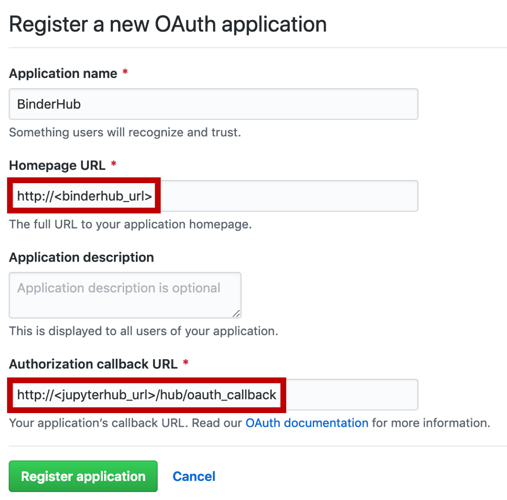

# Zero to BinderHub!

Sarah Gibson, _The Alan Turing Institute_

[**The Turing Way**](https://github.com/alan-turing-institute/the-turing-way) - making reproducible data science _too easy not to do_!

Link to this page: [**bit.ly/zero-to-binderhub-workshop**](http://bit.ly/zero-to-binderhub-workshop)

The following workshop will walk you through deploying a BinderHub onto a Microsoft Azure Kubernetes Service.
It will be a publicly available service like [mybinder.org](https://mybinder.org).

Throughout the workshop, you will see some emojis.
The :vertical_traffic_light: emoji indicates a TODO step and you should use a green or red post-it to indicate to the instructor if you've completed the TODO (green) or are having problems (red).
The :question: emoji indicates a point where the instructor will pause to take questions.
They are placed either at the end of a section to allow everyone to move on together, or after a step that may need more explanation.

## :warning: Before You Start :warning:

You will need the following resources to be able to participate in this workshop:

* A Docker Hub account - sign up here: https://hub.docker.com/signup

**And either:**

* A Microsoft Azure Free Trial subscription - sign up here: https://azure.microsoft.com/en-gb/free/

**Or:**

* A Microsoft Azure Pass - You will have been given instructions on how to acquire one of these by the instructor before the workshop.

**Important:** If possible, please **do not** create an Azure account with a ".ac.uk" domain or an address affiliated with an organisation.
This may cause issues during deployment.

To complete the extra curricular steps, you will also need a GitHub account.

## Table of Contents

* [General Information](#general-information)
  * [What is BinderHub?](#what-is-binderhub)
  * [Why build your own BinderHub?](#why-build-your-own-binderhub)
  * [What does BinderHub require?](#what-does-binderhub-require)
* [Computational Requirements](#computational-requirements)
  * [Cloud Resource Requirements](#cloud-resource-requirements)
  * [Container Registry](#container-registry)
  * [A Note on Secret Files](#a-note-on-secret-files)
* [Building a BinderHub](#building-a-binderhub)
  * [Setup Local Files](#setup-local-files)
  * [Deploying a Kubernetes Cluster on Azure](#deploying-a-kubernetes-cluster-on-azure)
  * [Setting up Helm](#setting-up-helm)
  * [Setup BinderHub](#setup-binderhub)
  * [Debugging your BinderHub](#debugging-your-binderhub)
* [Extra Curricular Steps](#extra-curricular-steps)
  * [Changing the logo on your Binder page](#changing-the-logo-on-your-binder-page)
  * [Authenticating Users with GitHub](#authenticating-users-with-github)
* [Tearing Down your BinderHub Deployment](#tearing-down-your-binderhub-deployment)
* [Example config files](#example-config-files)
  * [`secret.yaml`](#secretyaml)
  * [`config.yaml`](#configyaml)
* [Glossary of Kubernetes terms](#glossary-of-kubernetes-terms)
* [Reference Documentation](#reference-documentation)

---

## General Information

### What is BinderHub?

BinderHub is a Cloud-based, open source technology that can host multiple instances of a Git repository and its computing environment.
This allows code to be instantly runnable and reproducible by anyone anywhere in the world at the click of a link.
The public Binder service is hosted at [mybinder.org](https://mybinder.org).

### Why build your own BinderHub?

Since Binder and BinderHub are open source projects maintained by volunteers, they ask that users of mybinder.org stay within certain limitations in order to keep running costs as low as possible while still providing a usable service.

By deploying your own BinderHub, you can provide a service to your users that is much more customised to their needs.
The most desirable benefit of this is allowing your users access to private repositories and handling sensitive data.
But customisations could also include authentication, greater computational resources per user, bespoke package stacks or persistent user storage.

### What does BinderHub require?

The Binder team's overview of the BinderHub architecture can be found [here](https://binderhub.readthedocs.io/en/latest/overview.html).

* A [Kubernetes](https://kubernetes.io/) cluster - This is an automated system for deploying, scaling and maintaining containerised applications. Kubernetes can be used on any kind of server, Cloud-based or otherwise.

* The BinderHub [Helm Chart](https://helm.sh/docs/developing_charts/) - Helm is a package manager for deploying, maintaining and upgrading applications on a Kubernetes service. It is a collection of install instructions for a set of Kubernetes resources. The BinderHub Helm Chart contains a set of tools required by the Binder service.

  * [`repo2docker`](https://repo2docker.readthedocs.io/en/latest/) - This is a tool that builds a Docker container out of a Git repository based on a configuration file which describes the software dependencies.

  * [JupyterHub](https://jupyterhub.readthedocs.io/en/stable/) - This is a tool for serving Jupyter Notebooks for multiple users and automatically spawns, manages and proxies the server instances.

  * The [Binder](https://mybinder.readthedocs.io/en/latest/) Load Balancer - This coordinates the launches of Binder instances and parses various jobs to `repo2docker` and the JupyterHub.

* A container registry, we will use [DockerHub](https://hub.docker.com/) -  A container registry is a storage and management server (usually Cloud-based) for containerised environments. The BinderHub will need to push (or "save") containers it has built to a registry, and pull (or "download") containers in order to run them from the JupyterHub.

---

## Computational Requirements

### Cloud Resource Requirements

This workshop assumes you have an account with [Microsoft Azure](https://azure.microsoft.com/en-gb/).

Either a **Free Trial** subscription:
It's quick to set one up and you get £150 free credit for the first 30 days as well as access to some _always free_ services.
You will be asked to provide a credit card.
This is only for identity verification, **you will not be charged**.
When your free trial expires, your resources will automatically be frozen and then deleted after a month if you don't reactivate your subscription.

Or an **Azure Pass**:
You will have been given instructions on how to acquire one of these by the instructor before the workshop.

**NOTE:** Please do not sign up with a ".ac.uk" domain or organisation affiliated address as you may encounter some issues with Service Principal permissions when we deploy the Kubernetes cluster.

> BinderHub is Cloud-neutral.
> We are using Azure as an example.

### Container Registry

These instructions will link the BinderHub to a [DockerHub](https://hub.docker.com/) Container Registry, and so you will need a DockerHub account as well.
This will be where BinderHub stores the images it builds.

> BinderHub also works with Google Container Registry, Azure Container Registry and custom registries.
> We are using DockerHub as an example.

### A Note on Secret Files

Building a BinderHub requires a few pieces of sensitive information, such as access tokens and passwords.
In this workshop, we will be saving this information to disk which is not ideal.

The ideal scenario would be to store this information in an [Azure Key Vault](https://azure.microsoft.com/en-gb/services/key-vault/) such that the secrets could be programmatically added to the relevant files and then locally deleted as necessary.
However, this falls out of the scope of a BinderHub workshop.

You can access Key Vault Quickstarts and Tutorials [here](https://docs.microsoft.com/en-gb/azure/key-vault/).

---

## Building a BinderHub

This workshop will use the Cloud Shell in Azure Portal as it already has all of the tools we need preinstalled.

* Login to the Portal here: https://portal.azure.com/
* Open the Cloud Shell from the top of the dashboard:


The first time you open the Cloud Shell, you will be asked to create some persistent storage.
This allows you to save and retrieve scripts, templates and configuration files.
Accept any prompts you see.

:vertical_traffic_light: :vertical_traffic_light: :vertical_traffic_light: :vertical_traffic_light: :vertical_traffic_light:

### Setup Local Files

We're going to download some template YAML files and a shell script that will automatically populate them with information using [`sed`](http://www.grymoire.com/Unix/Sed.html).
This will make the BinderHub setup less intensive.

Make a folder to store this files and change into it.

```
mkdir testhub
cd testhub
```

:vertical_traffic_light: :vertical_traffic_light: :vertical_traffic_light: :vertical_traffic_light: :vertical_traffic_light:

Run the following three commands to download the `setup.sh` script and the `config-template.yaml` and `secret-template.yaml` files.

```
wget -O setup.sh http://bit.ly/config-setup-script
wget -O config-template.yaml http://bit.ly/config-template
wget -O secret-template.yaml http://bit.ly/secret-template
```

:vertical_traffic_light: :vertical_traffic_light: :vertical_traffic_light: :vertical_traffic_light: :vertical_traffic_light:

Make the shell script executable will the following command.

```
chmod 700 setup.sh
```

:vertical_traffic_light: :vertical_traffic_light: :vertical_traffic_light: :vertical_traffic_light: :vertical_traffic_light:

Now make a secrets folder inside `testhub` where we will save secrets.

```
mkdir secrets
```

:vertical_traffic_light: :vertical_traffic_light: :vertical_traffic_light: :vertical_traffic_light: :vertical_traffic_light:

**NOTE:** If you are using version control, it is strongly recommended that you add the `secrets` folder to a `.gitignore` file to ensure secret information is not made public.
Do this **before** adding any secrets to the folder!

### Deploying a Kubernetes cluster on Azure

Adapted from [Step Zero: Kubernetes on Microsoft Azure Container Service (AKS)](https://zero-to-jupyterhub.readthedocs.io/en/latest/microsoft/step-zero-azure.html).

A short (and by no means exhaustive) [glossary](#glossary-of-kubernetes-terms) of Kubernetes terms is given at the end of this workshop, should you require further explanation.

**NOTE:** You shouldn't need to login to Azure when using the Cloud Shell as it reads your login from the Portal.

#### 1. Activate your Subscription

To see a list of Azure subscriptions you have available to you, you can run the following command.
```
az account list --refresh --output table
```
This prints your subscriptions to the terminal in a human-readable format.
Now let's set our working subscription.

**If you are using a Free Trial suscription:**
```
az account set -s "Free Trial"
```

**If you are using an Azure Pass:**
```
az account set -s "Azure Pass - Sponsorship"
```

:vertical_traffic_light: :vertical_traffic_light: :vertical_traffic_light: :vertical_traffic_light: :vertical_traffic_light:

**NOTE:** If your subscription name has no whitespace, the quotation marks are not required.

#### 2. Create a Resource Group

Resource Groups are how the Azure environment labels services that are related to each other (further details in [this blog post](http://www.onlinetech.com/resources/references/how-to-use-azure-resource-groups-a-simple-explanation)).
We will create a resource group in a specific region and create computational resources _within_ this group.

```
az group create --name testhub \
    --location westeurope \
    --output table
```
* `--name` specifies the name of your resource group and should be something that uniquely identifies this hub.
* `--location` specifies the _region_ of the data centres where your resource will exist.
  A list of data centre regions and locations can be found [here](https://docs.microsoft.com/en-us/azure/aks/container-service-quotas#region-availability).
  We have chosen West Europe for resource availability.
* `--output table` specifies the output should be in human-readable ASCII table format as opposed to JSON, which is the default output.

:vertical_traffic_light: :vertical_traffic_light: :vertical_traffic_light: :vertical_traffic_light: :vertical_traffic_light:

#### 3. Create an Azure Kubernetes Service (AKS) Cluster

This command will request a Kubernetes cluster within the resource group we created.
It will request one `Standard_D2s_v3` virtual machine which a Kubernetes cluster installed.
[Information on other types of virtual machines is available](https://azure.microsoft.com/en-gb/pricing/details/virtual-machines/series/).

**NOTES:**
* `--name` (`hubcluster` in this example) cannot exceed 63 characters and can only contain letters, numbers, or hyphens (`-`).
* If you are _not_ using a Free Trial subscription, try setting `--node-count` to **3** instead.

```
az aks create --name hubcluster \
    --resource-group testhub \
    --no-ssh-key \
    --node-count 1 \
    --node-vm-size Standard_D2s_v3 \
    --output table
```
* `--name` is the name of the cluster.
* `--resource-group` is the resource group we created in [Step 3: Create a Resource Group](#3-create-a-resource-group).
* `--node-count` is the number of desired nodes in the Kubernetes cluster.
* `--node-vm-size` is the size of the nodes you wish to use, which varies based on the use-case of the cluster and how much RAM/CPU each user will need.

**NOTE:** The default version of Kubernetes will be installed, you can use the `--kubernetes-version` flag to install a different version.

**This step may take some time to execute!**

:vertical_traffic_light: :vertical_traffic_light: :vertical_traffic_light: :vertical_traffic_light: :vertical_traffic_light:

**WARNING:** If this step fails due to insufficient permissions on the directory, this is likely because you're using a ".ac.uk" email to login to Azure and your institution has limited your ability to create Service Principals.
For the sake of this workshop, you should have created your account with a different email address.
Otherwise, you could ask your IT Services to provide you with a Service Principal.

Once this command has completed, some extra resource groups will have been created which is normal behaviour.
You can inspect them in the [Azure Portal](https://portal.azure.com/).
The `testhub` group will contain the Kubernetes service, whereas a new resource group called `MC_testhub_hubcluster_westeurope` containing the cluster resources (virtual machines, etc.) will have appeared.

There will also be a `NetworkWatcherRG` group which will be empty.
This group is created under the assumption that the Kubernetes service will be extended in the future, which unlikely to be the case when deploying BinderHub.
This group can be deleted.

#### 4. Get credentials from Azure for `kubectl`

This step automatically updates your local Kubernetes client configuration file to be configured with the remote cluster we've just deployed, and allowing `kubectl` to be "logged-in" to the cluster.

```
az aks get-credentials --name hubcluster --resource-group testhub
```
* `--name` is the cluster name defined in [Step 4: Create an Azure Container Service (AKS) Cluster](#4-create-an-azure-container-service-aks-cluster).
* `--resource-group` is the resource group created in [Step 3: Create a Resource Group](#3-create-a-resource-group).

#### 5. Check the Cluster is Fully Functional

```
kubectl get nodes
```

The output of this command should list one node (unless you changed `--node-count` in [Step 4: Create an Azure Container Service (AKS) Cluster](#4-create-an-azure-container-service-aks-cluster)) with a `STATUS` of `READY`.
The `VERSION` field reports which version of Kubernetes is installed.

Example output:
```
NAME                       STATUS   ROLES   AGE   VERSION
aks-nodepool1-97000712-0   Ready    agent   19m   v1.9.11
```

:vertical_traffic_light: :vertical_traffic_light: :vertical_traffic_light: :vertical_traffic_light: :vertical_traffic_light:

:question: :question: :question: :question: :question:

### Setting up Helm

Adapted from [Zero-to-JupyterHub: Setting up and Securing Helm](https://zero-to-jupyterhub.readthedocs.io/en/latest/setup-helm.html).

Helm is the package manager for Kubernetes and is used for: installing, upgrading and managing applications on a Kubernetes cluster.
Helm packages are called _charts_.

Helm has two parts: a client (`helm`) and a server (`tiller`).
Tiller runs inside your Kubernetes cluster as a pod in the `kube-system` namespace.
Tiller manages _releases_ (installations) and _revisions_ (versions) of charts deployed on the cluster.
When you run a `helm` command, the local Helm client sends instructions to `tiller` in the cluster which in turn makes the requested changes.

> **Did you know?:** Kubernetes is Greek for "captain" or "helmsman".
> In case you haven't noticed the nautical theme!

#### 1. Setup a `ServiceAccount` for `tiller`

When you (a human) accesses your Kubernetes cluster, you are authenticated as a particular **User Account**.
Processes in containers running in _pods_ are authenticated as a particular **Service Account**.
[More details](https://kubernetes.io/docs/tasks/configure-pod-container/configure-service-account/).

```
kubectl create serviceaccount tiller --namespace kube-system
```

:vertical_traffic_light: :vertical_traffic_light: :vertical_traffic_light: :vertical_traffic_light: :vertical_traffic_light:

#### 2. Give the `ServiceAccount` full permissions to manage the cluster

This step enables Role Based Access Control (RBAC) so Kubernetes can secure which pods/users can perform what kind of actions on the cluster.
If RBAC is disabled, **all pods are given `root` equivalent permission on all the Kubernetes nodes and the cluster itself.**
This can leave the cluster vulnerable to attacks.
See [Project Jupyter's docs](https://zero-to-jupyterhub.readthedocs.io/en/latest/security.html#use-role-based-access-control-rbac) for more details.

```
kubectl create clusterrolebinding tiller --clusterrole cluster-admin --serviceaccount=kube-system:tiller
```

:vertical_traffic_light: :vertical_traffic_light: :vertical_traffic_light: :vertical_traffic_light: :vertical_traffic_light:

:question: :question: :question: :question: :question:

#### 3. Initialise `helm` and `tiller`

This step will create a `tiller` deployment in the `kube-system` namespace and set-up your local `helm` client.
This is the command that connects your remote Kubernetes cluster to the commands you execute in your local terminal and only needs to be run once per Kubernetes cluster.

```
helm init --service-account tiller --wait
```

:vertical_traffic_light: :vertical_traffic_light: :vertical_traffic_light: :vertical_traffic_light: :vertical_traffic_light:

#### 4. Secure Helm

Secure `tiller` from access inside the cluster.

`tiller`s port is exposed in the cluster without authentication and if you probe this port _directly_ (i.e. by bypassing `helm`) then `tiller`s permissions can be exploited.
This step forces `tiller` to listen to commands from `localhost` (i.e. `helm`) _only_ so that e.g. other pods inside the cluster cannot ask `tiller` to install a new chart. For example, this could give other pods arbitrary, elevated privileges to exploit.
[More details](https://engineering.bitnami.com/articles/helm-security.html).

```
kubectl patch deployment tiller-deploy \
    --namespace=kube-system \
    --type=json \
    --patch='[{
        "op": "add",
        "path": "/spec/template/spec/containers/0/command",
        "value": ["/tiller", "--listen=localhost:44134"]
    }]'
```

:vertical_traffic_light: :vertical_traffic_light: :vertical_traffic_light: :vertical_traffic_light: :vertical_traffic_light:

:question: :question: :question: :question: :question:

#### 5. Verify the installation

To verify the correct versions have been installed properly, run the following command.

```
helm version
```

You must have at least version 2.11.0 and the client (`helm`) and server (`tiller`) versions must match.
It may take a few moments for the client to appear - keep trying.

Example output:
```
Client: &version.Version{SemVer:"v2.12.3", GitCommit:"eecf22f77df5f65c823aacd2dbd30ae6c65f186e", GitTreeState:"clean"}
Server: &version.Version{SemVer:"v2.12.3", GitCommit:"eecf22f77df5f65c823aacd2dbd30ae6c65f186e", GitTreeState:"clean"}
```

If the versions do not match, run:
```
helm init --upgrade
```

:vertical_traffic_light: :vertical_traffic_light: :vertical_traffic_light: :vertical_traffic_light: :vertical_traffic_light:

:question: :question: :question: :question: :question:

### Setup BinderHub

Adapted from [Zero-to-BinderHub: Setup BinderHub](https://binderhub.readthedocs.io/en/latest/setup-binderhub.html).

#### 1. Preparing to Install

Before we install a BinderHub, we need to configure several pieces of information and save them in YAML files.

Create two random tokens:
```
openssl rand -hex 32 > secrets/apiToken.txt
openssl rand -hex 32 > secrets/secretToken.txt
```

:vertical_traffic_light: :vertical_traffic_light: :vertical_traffic_light: :vertical_traffic_light: :vertical_traffic_light:

#### 2. Run `setup.sh`

Now run `setup.sh`.
This will populate `secret-template.yaml` and `config-template.yaml` with the appropriate information and save them to the `secrets` folder.

You will be asked to provide your DockerHub login credentials in order to connect your DockerHub account to the BinderHub.
You must provide your Docker **username**, not your email address associated with the account.

```
./setup.sh
```

:vertical_traffic_light: :vertical_traffic_light: :vertical_traffic_light: :vertical_traffic_light: :vertical_traffic_light:

#### 3. Install BinderHub

First, pull the latest Helm chart for BinderHub.

```
helm repo add jupyterhub https://jupyterhub.github.io/helm-chart
helm repo update
```

:vertical_traffic_light: :vertical_traffic_light: :vertical_traffic_light: :vertical_traffic_light: :vertical_traffic_light:

Next, install the required Helm chart using the config files we created in [Step 2: Run `setup.sh`](#2-run-setupsh).

```
helm install jupyterhub/binderhub \
    --version=0.2.0-f565958 \
    --name=binderhub \
    --namespace=binderhub \
    -f secrets/secret.yaml \
    -f secrets/config.yaml
```
* `--version` refers to the version of the BinderHub Helm Chart.
  Available versions can be found [here](https://jupyterhub.github.io/helm-chart/#development-releases-binderhub).
  We have used the version released on 11 August 2019.
* `--name` and `--namespace` may be different, but it's recommended they be the same to avoid confusion.
  It should be something short and descriptive.

This step will deploy both a JupyterHub and a BinderHub but they are not yet configured to communicate with one another.
You may need to wait a few moments before moving on as the resources may take a while to be set up.

:vertical_traffic_light: :vertical_traffic_light: :vertical_traffic_light: :vertical_traffic_light: :vertical_traffic_light:

#### 4. Connect JupyterHub and BinderHub

Print the IP address of the JupyterHub that was just deployed by running the following command.
It will be listed in the `EXTERNAL-IP` field.

```
kubectl get svc proxy-public --namespace=binderhub
```

:vertical_traffic_light: :vertical_traffic_light: :vertical_traffic_light: :vertical_traffic_light: :vertical_traffic_light:

Now do the following steps:

1) On [line 5 of `setup.sh`](https://github.com/alan-turing-institute/the-turing-way/blob/master/workshops/build-a-binderhub/binderhub_resources/setup.sh#L5), copy the IP address from the last command into the `jupyter_ip` variable and uncomment the line (remove the `#` from the beginning).
2) Again in `setup.sh`, move the line reading `#  -e "s/<jupyter-ip>/${jupyter_ip}/" \` ([Line 27](https://github.com/alan-turing-institute/the-turing-way/blob/master/workshops/build-a-binderhub/binderhub_resources/setup.sh#L27)) above the line `config-template.yaml > secrets/config.yaml` and uncomment it by removing the `#` from the start.
3) Uncomment [line 8 of `config-template.yaml`](https://github.com/alan-turing-institute/the-turing-way/blob/master/workshops/build-a-binderhub/binderhub_resources/config-template.yaml#L8) by removing the `#` from the beginning.

:vertical_traffic_light: :vertical_traffic_light: :vertical_traffic_light: :vertical_traffic_light: :vertical_traffic_light:

Rerun `setup.sh`.

```
./setup.sh
```

:vertical_traffic_light: :vertical_traffic_light: :vertical_traffic_light: :vertical_traffic_light: :vertical_traffic_light:

Now upgrade the Helm chart to deploy the change.

```
helm upgrade binderhub jupyterhub/binderhub \
    --version=0.2.0-f565958 \
    -f secrets/secret.yaml \
    -f secrets/config.yaml
```

:vertical_traffic_light: :vertical_traffic_light: :vertical_traffic_light: :vertical_traffic_light: :vertical_traffic_light:

#### 5. Try out your BinderHub deployment!

Find the IP address of your BinderHub under the `EXTERNAL-IP` field.

```
kubectl get svc binder --namespace=binderhub
```

**NOTE:** THIS IS A _DIFFERENT_ COMMAND TO THE LAST ONE!

Copy the IP address into your browser and your BinderHub should be waiting.

:vertical_traffic_light: :vertical_traffic_light: :vertical_traffic_light: :vertical_traffic_light: :vertical_traffic_light:

If you've been successful, a page identical to [mybinder.org](https://mybinder.org) should appear.
Type the following URL into the GitHub repo box and launch it: [**https://github.com/binder-examples/requirements**](https://github.com/binder-examples/requirements).
You can even sign in to your Docker account to see when the image has been pushed to the registry.

While trying to launch a repository, you may come across an `Internal Server Error`.
In the case of this workshop, this is most likely due to the Kubernetes cluster only having a single node.
For a stable cluster, it is recommended to deploy on at least three nodes, however this is not permitted on a Free Trial subscription.

Another reason the `Internal Server Error` may appear is that you've tried to launch a repository immediately after a `helm upgrade`.
It can take some time after an upgrade for the JupyterHub to reset it's internal state.
Always check that all pods have `RUNNING` status using `kubectl get pods -n binderhub` before trying to launch a repo.

:question: :question: :question: :question: :question:

### Debugging your BinderHub

If something is not working correctly with your BinderHub, the quickest way to find the problem is to access the JupyterHub logs.
Executing the following commands will print the JupyterHub logs to your terminal.

```
# Lists all active pods. Find the one beginning with "hub-"
kubectl get pods --namespace binderhub
# Where <random-str> matches the output from the last step
kubectl logs hub-<random-str> --namespace binderhub
```

You can also access information about individual pods with the following command.

```
kubectl describe pod <POD-NAME> --namespace binderhub
```

---

## Extra Curricular Steps

### Changing the logo on your Binder page

One fun way to make your BinderHub your own is to change the logo that appears on the Binder launch page.
This is achieved by customising or extending the `html` template the website is built from.
See the [BinderHub customisation documentation](https://binderhub.readthedocs.io/en/latest/customizing.html#template-customization) for more details.

You will need an image file.
[Unsplash](https://unsplash.com/) is a good source of free images for the purposes of this workshop.
For your production BinderHub, you would probably create your own logo!

#### 1. Fork the following repo

I have created a template repo to make this easier - linked below.
Fork it to your own GitHub account.

[**github.com/alan-turing-institute/binderhub-custom-files**](https://github.com/alan-turing-institute/binderhub-custom-files)

**NOTE:** The repo hosting your `html` pages **must** be public.

#### 2. Upload your image file

Upload your chosen image file to the `static` folder on your fork.
Any image file type will suffice.

#### 3. Update `page.html` in `templates`

In the `templates` folder, edit `page.html` to contain the name of your image file by replacing `<custom-logo-file>`.
(You do not need to include the `static/` prefix.)

#### 4. Update `config.yaml`

Add the following to your `config.yaml` file.
Remember to replace `<your-github-username>` in the repo URL with your GitHub username!

```
config:
  BinderHub:
    template_path: /etc/binderhub/custom/templates
    extra_static_path: /etc/binderhub/custom/static
    extra_static_url_prefix: /extra_static/
    template_variables:
        EXTRA_STATIC_URL_PREFIX: "/extra_static/"

initContainers:
  - name: git-clone-templates
    image: alpine/git
    args:
      - clone
      - --single-branch
      - --branch=master
      - --depth=1
      - --
      - https://github.com/<your-github-username>/binderhub-custom-files
      - /etc/binderhub/custom
    securityContext:
      runAsUser: 0
    volumeMounts:
      - name: custom-templates
        mountPath: /etc/binderhub/custom
extraVolumes:
  - name: custom-templates
    emptyDir: {}
extraVolumeMounts:
  - name: custom-templates
    mountPath: /etc/binderhub/custom
```

**NOTE:** If you committed the image file and the change to `page.html` to a branch other than `master`, then you either need to merge your changes into `master` or change the `--branch` argument in the above snippet to match the name of your branch.

#### 5. Upgrade your BinderHub and visit the Binder page!

To deploy the changes, upgrade the helm chart.

```
helm upgrade binderhub jupyterhub/binderhub \
    --version=0.2.0-f565958 \
    -f secrets/secret.yaml \
    -f secrets/config.yaml
```

Visit your Binder page to see your new logo!
To get the IP address of the Binder page, run the following command.

```
kubectl get svc binder --namespace=binderhub
```

### Authenticating Users with GitHub

Adapted from [Enabling Authentication](https://binderhub.readthedocs.io/en/latest/authentication.html) and [Authentication](https://zero-to-jupyterhub.readthedocs.io/en/stable/authentication.html#github).

The default is for BinderHub to run without authentication and, for each launch, it creates a temporary user and starts a server for that user.

You can enable authentication for BinderHub by using JupyterHub as an OAuth provider by editing `config.yaml`.

You should update `config-template.yaml` and `setup.sh` accordingly to handle the new information.

#### 1. Editing `config.yaml`

First add `auth_enabled: true` under the `config.BinderHub` key.
Then add the following as an unindented level key.

**NOTE:** In the following, `binderhub_url` is the IP address you visit to reach your Binder launch page (i.e. the output of [Step 5: Try out your BinderHub deployment!](#5-try-out-your-binderhub-deployment)) and `jupyterhub_url` is the IP address listed under `config.BinderHub.hub_url` and the top of `config.yaml`.

```yaml
jupyterhub:
  cull:
    # don't cull authenticated users
    users: False

  custom:
    binderauth_enabled: true

  hub:
    redirectToServer: false
    services:
      binder:
        oauth_redirect_uri": "http://<binderhub_url>/oauth_callback"
        oauth_client_id: "binder-oauth-client-test"

  singleuser:
    # to make notebook servers aware of hub
    cmd: jupyterhub-singleuser

  auth:
    type: github
    github:
      clientId: "<Your GitHub Client ID>"
      clientSecret: "<Your GitHub Client Secret>"
      callbackUrl: "http://<jupyterhub_url>/hub/oauth_callback"
```

**NOTE:** We will generate `clientId` and `clientSecret` in the next step.

#### 2. Create an OAuth App on GitHub

Go to GitHub, click your profile picture (in the top right corner) and select "Settings" from the drop down menu.
At the bottom of the list on the left, select "Developer settings", then click "New OAuth App".

Fill in the form using your `binderhub_url` and `jupyter_url` from [Step 1: Editing `config.yaml`](#1-editing-configyaml) (see image below) and click "Register Application".
The URL entered into the "Authorization callback URL" field **must** match your `auth.github.callbackUrl` in your `config.yaml`.



Once your App is registered, a Client ID and Client Secret will be generated.
Copy these into the `clientId` and `clientSecret` fields in `config.yaml`, as strings, respectively.

#### 3. Update your BinderHub

To apply the config changes, we need to upgrade the deployed Helm chart using the same command as in [Step 4: Connect JupyterHub and BinderHub](#4-connect-jupyterhub-and-binderhub).

```
helm upgrade binderhub jupyterhub/binderhub \
    --version=0.2.0-f565958 \
    -f secrets/secret.yaml \
    -f secrets/config.yaml
```

Now reload your Binder page, you should see a sign in button and will be asked for your GitHub sign in information!

---

## Tearing Down your BinderHub Deployment

Adapted from [Tearing Everything Down](https://zero-to-jupyterhub.readthedocs.io/en/latest/turn-off.html).

When you're no longer using your BinderHub, you should destroy it to avoid paying extra costs for it!
This involves deleting the Helm release and all of the computing resources in Azure.

#### 1. Delete the Helm release

First we delete the Helm release that installed the JupyterHub and BinderHub and any resources that it created.

```
helm delete binderhub --purge
```
**NOTE:** `binderhub` is the release name we defined in [Step 3: Install BinderHub](#3-install-binderhub).

#### 2. Delete the Kubernetes Namespace

Next we delete the Kubernetes namespace the hub was installed in.
This will delete any disks that were created to store user's data and any IP addresses.

```
kubectl delete namespace binderhub
```

#### 3. Delete your Resource Group

You can list your active resource groups using the following command.

```
az group list --output table
```

You can then delete the group for your BinderHub.

```
az group delete --name testhub --no-wait
```
**NOTE:**
  * Be careful to select the correct resource group as this step will irreversibly delete all the resources in that group!
  * `testhub` is the `name`/`namespace` we created in [Step 3: Create a Resource Group](#3-create-a-resource-group).

You can use the [Azure Portal](https://azure.microsoft.com/en-gb/features/azure-portal/) to double check all of your resources have been deleted.
It may take a few minutes to clear up, but nothing relating to your BinderHub should remain after this step.

You should also delete the `NetworkWatcherRG` group if you did not do so earlier.

```
az group delete --name NetworkWatcherRG --no-wait
```

#### 4. GitHub OAuth App

If you enabled GitHub authentication on your BinderHub, don't forget to delete the OAuth Application in "Developer Settings" as well.

---

## Example config files

### `secret.yaml`

```yaml
jupyterhub:
  hub:
    services:
      binder:
        apiToken: "<output of FIRST 'openssl rand -hex 32' command>"
  proxy:
    secretToken: "<output of SECOND 'openssl rand -hex 32' command>"

registry:
  username: <docker-id>
  password: <password>
```

**NOTE:** `<docker-id>` must be your DockerHub username, **not** your email address.

### `config.yaml`

```yaml
config:
  BinderHub:
    use_registry: true
    image_prefix: <docker-id OR organisation-name>/<prefix>-
    hub_url: http://<EXTERNAL-IP from Step 5>
```

**NOTE:**
  * If your Docker account is part of an organisation where you would like to store images instead, change the value of `image_prefix` to `<docker-organisation-name>/<prefix>-`
  * The `<prefix>` can be any string since it will be prepended to image names.
  It is recommended to be something short and descriptive, such as `binder-dev-` (for development) or `binder-prod-` (for the final product).

---

## Glossary of Kubernetes terms

* **Cluster**: a group of computing machines (real or virtual) to deploy apps or containers into
* **Deployment**: instructions to Kubernetes on how to update instances of a deployed application
* **Nodes**: Workers that run the applications
* **Pod**: a Kubernetes abstraction representing a group of one or more application containers and some shared resources
* **Service**: an abstraction defining a set of Pods and how they can be accessed; a Service is defined using YAML (or JSON) and allows applications to receive traffic/be exposed outside of the Cluster

---

## Reference Documentation

* [Step Zero: Setting up a Kubernetes Cluster](https://zero-to-jupyterhub.readthedocs.io/en/latest/create-k8s-cluster.html)
* [Step Zero: Setting up an Autoscaling Kubernetes Cluster](https://zero-to-jupyterhub.readthedocs.io/en/latest/microsoft/step-zero-azure-autoscale.html)
* [Setup JupyterHub](https://zero-to-jupyterhub.readthedocs.io/en/latest/#setup-jupyterhub)
* [Setup BinderHub](https://binderhub.readthedocs.io/en/latest/setup-registry.html#set-up-the-container-registry)
